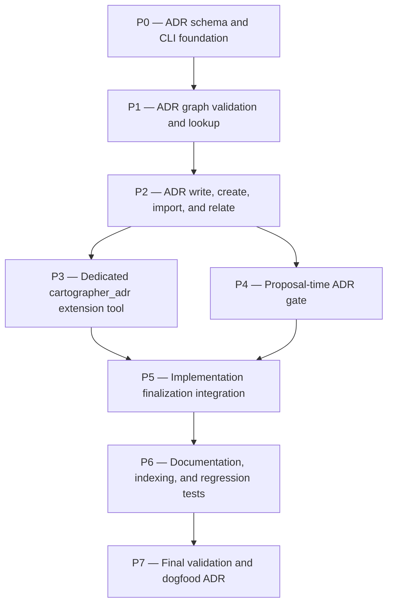

# adr-feature Plan

## Source Artifacts

- `.plan/adr-feature/proposal.md`
- `.plan/adr-feature/map.nodes.jsonl`
- `.plan/adr-feature/map.edges.jsonl`
- `.plan/adr-feature/facts.nodes.jsonl`
- `.plan/adr-feature/facts.edges.jsonl`
- `.plan/_index/project-graph.sqlite`
- `.plan/_index/project-graph-manifest.json`

## Retrieval Plan Used

- `cartographer_index ensure` — refreshed the shared project index after the ADR proposal artifacts were added.
- `cartographer_jsonl validate-topic --topic adr-feature` — verified proposal/map/fact graph syntax before planning.
- `cartographer_index search` for `cartographer_jsonl`, `validate-topic`, and `ADR` — confirmed current extension entry points, JSONL validation hooks, and existing out-of-scope ADR wording.
- Targeted reads of `extensions/cartographer-tools.ts`, `skills/plan/scripts/manage_jsonl.ts`, `skills/plan/scripts/validate_planning_graph.py`, `README.md`, `package.json`, and existing tests — confirmed tool registration patterns, validation behavior, test commands, and documentation surfaces.
- `cartographer_index repo-map/context` for ADR-related terms — attempted compact code/plans retrieval; oversized outputs were represented by Clean Context receipts under `/tmp/pi-cartographer-runs/` and replaced by targeted reads/searches.

## Planning Assumptions

### Confirmed facts

- ADRs should capture a single decision and rationale, while a collection of ADRs forms a decision log [F001].
- Classic ADR templates emphasize compact title/status/context/decision/consequences records [F002].
- ADR logs should be append-only; superseded decisions should be represented by a new ADR and a link rather than by rewriting old accepted records [F003].
- Searchable ADR metadata should include status, options/tradeoffs, decision outcome, confidence, domains, and keywords where useful [F004].
- Numbered ADR filenames are a common convention and fit chronological repo docs [F005].
- ADRs should remain pithy standalone records and avoid becoming stale design guides [F006].
- Existing Cartographer docs explicitly treat final ADR generation into repo docs as future work, so this feature intentionally updates that boundary [F007].
- Cartographer already has validation receipts/context packs and JSONL validators that can ground generated ADRs without raw chat context [F008], [F009].
- The ADR directory should prefer an existing ADR/decisions convention and fall back to `docs/adr/` [F010].
- Workflow-generated ADRs should be gated by proposal-level `adr_required: true` and summarized to the user before planning/implementation [F011].
- ADR-worthy directed choices need alternatives research or explicit user-provided rationale before an ADR is generated [F012].
- Legacy ADR imports may omit validation receipts only when explicitly marked as legacy [F013].
- ADR management should be exposed through a dedicated `cartographer_adr` tool, while `cartographer_jsonl` remains a low-level JSONL utility reused internally [F014].

### Decisions made for this plan

- Implement ADR behavior in a new stdlib Python helper, `skills/plan/scripts/adr_records.py`, and expose it through a dedicated shaped Pi tool named `cartographer_adr`.
- Keep ADR Markdown and graph JSONL as repo artifacts under the selected ADR directory; tests must create mock repositories under temporary directories, not mutate the real repo's docs or `.plan/` artifacts.
- Keep `cartographer_jsonl` focused on existing plan/fact/map JSONL operations; do not make it the primary ADR user interface.
- Provide standalone/manual ADR creation first-class alongside workflow-generated and legacy-import modes.
- Make ADR graph currentness deterministic from graph edges, especially `supersedes`, rather than from mutating old Markdown bodies.
- Dogfood the new tool at the end of implementation by generating an ADR for this feature only after deterministic validation passes, unless the user overrides before execution.

## Phase Dependency Graph

## Phase Summary

| Order | Phase ID | Phase | Depends On | Unlocks | Exit Criteria |
|---:|---|---|---|---|---|
| 0 | P0 | ADR schema and CLI foundation | none | P1 | `adr_records.py` can discover/select ADR directories, allocate IDs, render/parse ADR Markdown, and pass focused helper tests. |
| 1 | P1 | ADR graph validation and lookup | P0 | P2 | ADR node/edge JSONL validation, currentness derivation, `list/query/show`, and legacy validation rules pass in temporary mock repos. |
| 2 | P2 | ADR write, create, import, and relate | P1 | P3, P4 | ADR `evaluate`, standalone/manual creation, workflow draft/write, legacy import, and relationship updates work without a `.plan` topic unless requested. |
| 3 | P3 | Dedicated `cartographer_adr` extension tool | P2 | P5 | Pi extension exposes shaped `cartographer_adr` actions while `cartographer_jsonl` remains a low-level utility. |
| 4 | P4 | Proposal-time ADR gate | P2 | P5 | Proposal skill records and communicates `adr_required`, prompts for alternatives/rationale, and keeps user override before planning. |
| 5 | P5 | Implementation finalization integration | P3, P4 | P6 | Implement skill finalization runs/skips ADR generation based on `adr_required`, validation evidence, and user override rules. |
| 6 | P6 | Documentation, indexing, and regression tests | P5 | P7 | README, skill docs, helper CLI reference, and tests document/use workflow-generated, standalone, and legacy ADR modes. |
| 7 | P7 | Final validation and dogfood ADR | P6 | none | Full checks pass, planning artifacts validate, and the completed feature creates/validates a real ADR or an explicit user-approved skip receipt. |

## Phases

### Phase P0 — ADR schema and CLI foundation

- **Status:** complete
- **Depends on:** none
- **Unlocks:** P1
- **Primary references:** `artifact:adr-template`, `artifact:adr-generator`, `file:skills/plan/scripts/validation_runner.py`, `file:package.json`, [F001], [F002], [F004], [F005], [F006]

#### Objective

Create the ADR helper foundation: data structures, Markdown/front matter rendering and parsing, ADR directory discovery, slugging, and number allocation.

#### Scope

- Add `skills/plan/scripts/adr_records.py` as a stdlib-only CLI/helper.
- Define ADR node, edge, front matter, and body-section contracts in code constants or dataclasses.
- Implement directory discovery for `docs/adr/`, `docs/decisions/`, `doc/adr/`, `doc/decisions/`, `adr/`, and `decisions/`, with `docs/adr/` fallback and ambiguity reporting [F010].
- Implement stable ADR number allocation from existing `NNNN-*.md` files and/or graph nodes.
- Implement slug generation, YAML-ish front matter rendering/parsing without adding a PyYAML dependency, and required section rendering for status, decision, context, considered options, rationale, consequences, usage, and validation.
- Add focused unit tests in a new `tests/test_adr_records.py` using `tempfile`/mock roots only.
- Add `adr_records.py` to `package.json` `check:scripts` py_compile coverage.

#### Checklist

- [x] **P0.T1** Create `skills/plan/scripts/adr_records.py` with CLI argument parsing, JSON receipts, and no third-party runtime dependencies.
- [x] **P0.T2** Implement ADR directory discovery, ambiguity detection, fallback creation, slug generation, and next-number allocation.
- [x] **P0.T3** Implement ADR Markdown render/parse helpers with required front matter fields and body sections from the proposal.
- [x] **P0.T4** Add temporary-repo unit tests for discovery, fallback, ambiguity, slugging, numbering, and Markdown round-tripping.
- [x] **P0.T5** Add the new script to `package.json` `check:scripts` and verify script syntax checks cover it.

#### Validation

- [x] **P0.V1** Run `python -m py_compile skills/plan/scripts/adr_records.py` and expect success.
- [x] **P0.V2** Run `python -m unittest discover tests -p "test_adr_records.py"` and expect P0 helper tests to pass.
- [x] **P0.V3** Run `npm run check:scripts` and expect script parsing/type checks to pass.

#### Exit Criteria

ADR records can be rendered, parsed, numbered, and placed in a selected ADR directory in a mock repository without touching the real project docs.

#### Risks and Mitigations

- **Risk:** A hand-written front matter parser becomes too permissive or too complex. **Mitigation:** Support only the simple scalar/list fields the ADR tool writes, and fail loudly on unsupported shapes.
- **Risk:** Directory discovery chooses the wrong folder. **Mitigation:** Return an ambiguity error when multiple existing conventions are present and require user/tool input before writing.
- **Risk:** Number allocation races in parallel runs. **Mitigation:** Document single-writer behavior for the initial version and validate graph/file consistency before final write.

#### Notes for Execution Agent

Do not expose the Pi extension tool yet. Keep this phase focused on reusable Python helpers and tests.

### Phase P1 — ADR graph validation and lookup

- **Status:** complete
- **Depends on:** P0
- **Unlocks:** P2
- **Primary references:** `artifact:docs-adr-graph`, `file:skills/plan/scripts/manage_jsonl.ts`, `file:skills/plan/scripts/validate_planning_graph.py`, `file:tests/test_validate_planning_graph.py`, `file:tests/manage_jsonl.test.ts`, [F003], [F009], [F013], [F014]

#### Objective

Add deterministic ADR graph validation and current-decision lookup before writing user-facing create/import flows.

#### Scope

- Implement loading and saving of `<adr-dir>/_graph/adr.nodes.jsonl` and `<adr-dir>/_graph/adr.edges.jsonl`.
- Validate node fields: `id`, `type`, `adr_id`, `title`, `path`, `status`, `decision_date`, `domains`, `keywords`, `summary`, source mode metadata, and currentness.
- Validate edge fields and taxonomy: `supersedes`, `related_to`, `precursor_to`, `depends_on`, `child_of`, and `conflicts_with`.
- Enforce graph consistency: endpoints exist, ADR file paths exist, file number/`adr_id`/node ID agree, acyclic constraints hold, superseding records are newer, and superseded records are non-current.
- Allow legacy imports without validation receipts only with `legacy_import: true` or `status: accepted-legacy` plus import notes [F013].
- Implement `validate`, `list`, `query`, and `show` CLI actions returning compact JSON summaries, not raw graph dumps.

#### Checklist

- [x] **P1.T1** Implement ADR graph read/write helpers and deterministic validation error reporting in `adr_records.py`.
- [x] **P1.T2** Implement currentness derivation from `supersedes` edges and warnings for `depends_on` targets that are no longer current.
- [x] **P1.T3** Implement `list`, `query`, and `show` actions with current-first output and optional superseded inclusion.
- [x] **P1.T4** Add tests for missing endpoints, path mismatch, invalid edge types, cycles, supersession currentness, stale dependencies, and private-reference rejection.
- [x] **P1.T5** Add tests for legacy ADR validation without receipts only when explicitly marked legacy.

#### Validation

- [x] **P1.V1** Run `python -m unittest discover tests -p "test_adr_records.py"` and expect graph validation/currentness tests to pass.
- [x] **P1.V2** Run a mock `adr_records.py validate --root <tmp-root> --json` command and confirm it reports compact counts/errors without raw JSONL dumps.
- [x] **P1.V3** Run `npm run check:scripts` and expect no script syntax/type regressions.

#### Exit Criteria

ADR graph files can be validated and queried deterministically, with current decisions derived from relationships rather than stale Markdown edits.

#### Risks and Mitigations

- **Risk:** Validation overlaps awkwardly with `manage_jsonl.ts`. **Mitigation:** Keep ADR semantics in `adr_records.py`; reuse JSONL patterns but do not push ADR UX into `cartographer_jsonl` [F014].
- **Risk:** Relationship validation rejects legitimate historical imports. **Mitigation:** Support a clear legacy mode while keeping generated accepted ADRs strict.

#### Notes for Execution Agent

Treat `cartographer_jsonl` as a reference for JSONL hygiene, not as the user-facing ADR implementation surface.

### Phase P2 — ADR write, create, import, and relate

- **Status:** complete
- **Depends on:** P1
- **Unlocks:** P3, P4
- **Primary references:** `artifact:adr-generator`, `artifact:docs-adr`, `artifact:docs-adr-graph`, `file:skills/plan/scripts/validation_runner.py`, [F006], [F010], [F011], [F012], [F013], [F014]

#### Objective

Make ADR creation and management work from both workflow-generated inputs and direct user-provided inputs.

#### Scope

- Implement `evaluate` to inspect proposal/request inputs, recommend `adr_required`, report ADR intent, and identify when alternatives research or user-provided rationale is required [F011], [F012].
- Implement `draft --topic <topic>` from `.plan/<topic>/proposal.md`, facts, receipts, context packs, and commit metadata when available.
- Implement standalone/manual `create` with no `.plan` topic required; require explicit decision, context, considered options or user rationale, domains/keywords, and source metadata [F014].
- Implement `write` to allocate the next ADR number, render Markdown, upsert graph node/edges, and validate the result before reporting success.
- Implement `relate` to add/update relationship edges with guardrails for `supersedes` and `conflicts_with` confirmation.
- Implement `import` for existing Markdown ADRs and legacy records, including `accepted-legacy`/`legacy_import` handling [F013].
- Ensure generated accepted ADRs require validation receipt/topic evidence unless created in standalone/manual or legacy mode.

#### Checklist

- [x] **P2.T1** Implement `evaluate` using proposal/request inputs to recommend `adr_required`, summarize ADR intent, and flag missing alternatives or rationale.
- [x] **P2.T2** Implement `draft --topic` using proposal metadata and safe workflow artifacts; refuse accepted workflow ADRs without validation evidence unless the mode is manual or legacy.
- [x] **P2.T3** Implement standalone `create` with required context/decision/options-or-rationale fields and `source: manual` metadata.
- [x] **P2.T4** Implement `write` with atomic-ish file/graph updates, post-write validation, and compact success receipts.
- [x] **P2.T5** Implement `relate` and `import` actions with relationship validation and legacy markers.
- [x] **P2.T6** Add integration tests that generate ADR Markdown and graph JSONL in temporary repositories for evaluate, workflow, standalone, legacy, and current-decision query/show modes.

#### Validation

- [x] **P2.V1** Run `python -m unittest discover tests -p "test_adr_records.py"` and expect evaluate/workflow/standalone/import/relate tests to pass.
- [x] **P2.V2** Run a manual smoke command sequence in a temporary repo with concrete standalone fields: `evaluate`, create two manual ADRs using `--title`, `--decision`, `--context`, repeated `--option`, `--rationale`, `--domain`, and `--keyword`, then run `list`, `query "auth"`, `show ADR-0001`, `relate --from adr:0002 --to adr:0001 --type related_to`, and `validate`; expect current-first compact output and no raw graph dump.
- [x] **P2.V3** Run `python skills/plan/scripts/adr_records.py evaluate --root <tmp-root> --topic <tmp-topic> --json` against a mock proposal and confirm it reports `adr_required` plus alternatives/rationale status.
- [x] **P2.V4** Run `npm run test:py` and expect all Python tests to pass.

#### Exit Criteria

A user can evaluate ADR need, create, inspect, relate, and validate ADRs in a mock repo without running the full Cartographer workflow, and workflow-generated drafts can be produced from topic artifacts when validation evidence exists.

#### Risks and Mitigations

- **Risk:** Standalone ADR creation skips options/rationale. **Mitigation:** Enforce considered-options or explicit rationale in CLI validation [F012].
- **Risk:** Partial writes leave Markdown and graph out of sync. **Mitigation:** Write to temporary files where practical and run post-write validation before returning success.
- **Risk:** Workflow draft reads too much `.plan/` detail into ADR bodies. **Mitigation:** Generate concise summaries and stable IDs only; do not include raw plan transcripts or brittle line-level implementation references [F006].

#### Notes for Execution Agent

Use temp directories for all tests and smoke commands. Do not create real `docs/adr/` files until the final dogfood phase.

### Phase P3 — Dedicated `cartographer_adr` extension tool

- **Status:** complete
- **Depends on:** P2
- **Unlocks:** P5
- **Primary references:** `file:extensions/cartographer-tools.ts`, `file:tests/cartographer_tools.test.ts`, `file:package.json`, [F014]

#### Objective

Expose ADR management as an always-available Pi extension tool with shaped outputs and clear prompt guidance.

#### Scope

- Add an `adrScript` path in `extensions/cartographer-tools.ts` pointing to `skills/plan/scripts/adr_records.py`.
- Add `CartographerAdrParams` and register `cartographer_adr` with actions: `evaluate`, `draft`, `create`, `write`, `list`, `query`, `show`, `relate`, `import`, and `validate`.
- Model parameters for root, topic, adrDir, title, decision, context, options, rationale, domains, keywords, status, relationship edges, includeSuperseded, outputPath, raw, and maxOutputChars.
- Ensure extension outputs follow `shapeToolOutput`, with oversized detail saved to `/tmp/pi-cartographer-runs/` by default.
- Add prompt guidelines explaining workflow-generated, standalone/manual, and legacy-import modes; emphasize that `cartographer_jsonl` remains low-level.
- Add TypeScript tests for output shaping/tool metadata if feasible without invoking Pi; rely on typecheck and script checks for registration syntax.

#### Checklist

- [x] **P3.T1** Add `CartographerAdrParams`, `adrScript`, and `cartographer_adr` registration to `extensions/cartographer-tools.ts`.
- [x] **P3.T2** Map extension params to safe CLI arguments without shell interpolation; reject missing required fields per action.
- [x] **P3.T3** Add prompt guidelines that make standalone/manual ADR creation available without `.plan` topics and keep raw/private references out.
- [x] **P3.T4** Add/adjust tests for shaped ADR output receipts and extension syntax where practical.
- [x] **P3.T5** Confirm `cartographer_jsonl` documentation/guidelines remain low-level and do not absorb ADR domain behavior.

#### Validation

- [x] **P3.V1** Run `node --experimental-strip-types --check extensions/cartographer-tools.ts` and expect success.
- [x] **P3.V2** Run `npm run typecheck` and expect TypeScript types to pass.
- [x] **P3.V3** Run `npm run test:ts` and expect Vitest tests to pass.
- [x] **P3.V4** Run a direct CLI smoke for `adr_records.py list --root <tmp-root> --json` to validate the extension target exists and returns shaped-friendly JSON.

#### Exit Criteria

Pi users can call `cartographer_adr` directly for ADR creation and lookup, and extension output remains bounded under the Clean Context Contract.

#### Risks and Mitigations

- **Risk:** Adding another tool increases tool-surface complexity. **Mitigation:** Keep actions domain-specific and document the split from `cartographer_jsonl` clearly [F014].
- **Risk:** Parameter schema becomes too large. **Mitigation:** Use optional fields with action-level validation and avoid modeling every ADR field as mandatory tool-level schema.

#### Notes for Execution Agent

Do not call shell through string concatenation. Follow the existing `runCommand("python", [script, ...args])` extension pattern.

### Phase P4 — Proposal-time ADR gate

- **Status:** complete
- **Depends on:** P2
- **Unlocks:** P5
- **Primary references:** `file:skills/proposal/SKILL.md`, `file:skills/plan/SKILL.md`, `file:README.md`, [F011], [F012], [F014]

#### Objective

Teach the proposal workflow to detect ADR-worthy work, record `adr_required`, and ask the user for alternatives/rationale when necessary before planning begins.

#### Scope

- Update `skills/proposal/SKILL.md` to evaluate ADR worthiness during proposal creation, using the `adr_records.py evaluate` contract and the `cartographer_adr evaluate` tool once exposed.
- Add proposal metadata expectations such as `adr_required`, `adr_reason`, `adr_options_status`, and `adr_tool_mode` where appropriate.
- Add guidance that the user-facing proposal summary must state whether Cartographer intends to generate an ADR at the end and why [F011].
- Add prompting guidance for directed architecture choices with missing alternatives/rationale, e.g. "add Auth0" [F012].
- Update `skills/plan/SKILL.md` so planning reads and preserves `adr_required` instead of treating docs ADR generation as future work.
- Add documentation tests or workflow-doc assertions that ADR gating guidance exists and stale out-of-scope wording has been removed/replaced.

#### Checklist

- [x] **P4.T1** Update proposal skill outputs/procedure to include ADR requirement evaluation, metadata, and the `evaluate` helper/tool contract.
- [x] **P4.T2** Add prompt/ask-user guidance for ADR-worthy directed choices lacking alternatives or explicit rationale.
- [x] **P4.T3** Update plan skill guidance so plans carry `adr_required` into implementation handoff when present.
- [x] **P4.T4** Add workflow documentation tests checking `adr_required`, alternatives/rationale prompt guidance, and absence of stale "ADR generation is out of scope" wording.
- [x] **P4.T5** Ensure proposal summaries are instructed to expose ADR intent to users before implementation starts.

#### Validation

- [x] **P4.V1** Run `rg -n "adr_required|ADR-worthy|alternatives|rationale|cartographer_adr" skills/proposal/SKILL.md skills/plan/SKILL.md README.md` and confirm required guidance is present.
- [x] **P4.V2** Run `python -m unittest discover tests -p "test_workflow_docs.py"` and expect workflow doc assertions to pass.
- [x] **P4.V3** Run `npm run check:scripts` to ensure no extension/script syntax regressions from adjacent edits.

#### Exit Criteria

Future proposals can mark ADR intent before planning, and users get a chance to change that intent or supply alternatives/rationale before implementation begins.

#### Risks and Mitigations

- **Risk:** Proposal skill becomes too verbose. **Mitigation:** Keep ADR gate as a concise checklist and metadata requirement rather than a long ADR tutorial.
- **Risk:** The agent over-prompts for non-architectural changes. **Mitigation:** Gate prompts on durable architectural significance and allow `adr_required: false` for routine changes.

#### Notes for Execution Agent

This phase changes workflow instructions and tests, not the extension tool. Avoid implementing unrelated proposal features.

### Phase P5 — Implementation finalization integration

- **Status:** complete
- **Depends on:** P3, P4
- **Unlocks:** P6
- **Primary references:** `file:skills/implement/SKILL.md`, `file:skills/plan/scripts/validation_runner.py`, `artifact:adr-generator`, [F008], [F011], [F014]

#### Objective

Integrate ADR generation/skipping into the implement workflow after deterministic validation passes.

#### Scope

- Update `skills/implement/SKILL.md` finalization to inspect accepted proposal/plan ADR metadata.
- If `adr_required: true`, run or instruct execution to run `cartographer_adr draft/write/validate` after final deterministic validation and before final handoff.
- If `adr_required: false`, write or request an `adr-not-required` receipt with reason rather than silently skipping.
- Preserve user override: if the user changes ADR intent before planning/implementation, implementation follows the accepted current metadata.
- Ensure workflow-generated ADRs include stable topic, commit, and validation receipt metadata, while avoiding raw/private paths and brittle line-level references.
- Add tests or doc assertions that implementation guidance references `cartographer_adr` and no longer treats ADR generation as future work.

#### Checklist

- [x] **P5.T1** Update implement skill finalization procedure for `adr_required: true`, `adr_required: false`, and missing/ambiguous ADR metadata.
- [x] **P5.T2** Define the workflow-generated ADR evidence contract: topic ID, validation receipt IDs, commit IDs when available, and no raw/private references.
- [x] **P5.T3** Add `adr-not-required` receipt shape/guidance for accepted skips.
- [x] **P5.T4** Add or update tests checking implement docs contain ADR finalization guidance and no stale out-of-scope ADR wording.
- [x] **P5.T5** Verify `cartographer_adr draft/write/validate` commands are described with shaped output and clear stop rules.

#### Validation

- [x] **P5.V1** Run `rg -n "adr_required|adr-not-required|cartographer_adr|validation receipt" skills/implement/SKILL.md README.md` and confirm finalization guidance is present.
- [x] **P5.V2** Run `python -m unittest discover tests -p "test_workflow_docs.py"` and expect updated workflow doc tests to pass.
- [x] **P5.V3** Run `npm run check:scripts` and expect no script/extension syntax regressions.

#### Exit Criteria

Implementation handoff produces an ADR when required, produces an explicit skip receipt when not required, and does neither before validation evidence exists.

#### Risks and Mitigations

- **Risk:** Implement flow tries to generate ADRs too early. **Mitigation:** Place ADR generation after final deterministic validation and before final handoff only.
- **Risk:** Skip receipts become noisy. **Mitigation:** Require short reasons only when an accepted proposal/plan had `adr_required: false` or missing metadata for an ADR-worthy feature.

#### Notes for Execution Agent

Do not make subagents mandatory for ADR finalization. Keep the parent/implement workflow in control and use deterministic validation first.

### Phase P6 — Documentation, indexing, and regression tests

- **Status:** pending
- **Depends on:** P5
- **Unlocks:** P7
- **Primary references:** `file:README.md`, `file:skills/index-project/SKILL.md`, `file:skills/index-project/scripts/index_project.py`, `file:tests/test_index_project.py`, `file:tests/test_workflow_docs.py`, [F004], [F010], [F014]

#### Objective

Document the ADR feature end to end and ensure ADR Markdown is searchable through ordinary project retrieval while graph lookup remains available through `cartographer_adr`.

#### Scope

- Update README resource tables and helper CLI reference with `cartographer_adr`.
- Add README guidance for workflow-generated, standalone/manual, and legacy-import ADR modes.
- Document ADR directory discovery and fallback behavior.
- Document selected ADR folder structure and graph files.
- Replace the current limitation that ADR/doc generation outside `.plan` is out of scope with the new feature contract [F007].
- Ensure `cartographer_index` can retrieve ADR Markdown because it is `.md` under repo docs; add an indexer regression test using a temporary mock repo with `docs/adr/0001-*.md`.
- Decide explicitly not to add global `.jsonl` scanning for arbitrary repo files unless a targeted ADR graph indexing need is proven; `cartographer_adr query/show` can read graph JSONL directly [F014].

#### Checklist

- [ ] **P6.T1** Update README resource table, quick start/helper CLI reference, written artifacts, retrieval, limitations, and development notes for ADR support.
- [ ] **P6.T2** Update `skills/index-project/SKILL.md` to clarify ADR Markdown retrieval and ADR graph lookup via `cartographer_adr`.
- [ ] **P6.T3** Add indexer tests proving `docs/adr/*.md` is indexed/retrievable in a temporary mock repo.
- [ ] **P6.T4** Add workflow doc tests that stale ADR out-of-scope wording is removed from README/proposal/plan/implement skills.
- [ ] **P6.T5** Run targeted and full regression checks and fix documentation drift.

#### Validation

- [ ] **P6.V1** Run `python -m unittest discover tests -p "test_index_project.py"` and expect ADR Markdown indexing regression tests to pass.
- [ ] **P6.V2** Run `python -m unittest discover tests -p "test_workflow_docs.py"` and expect ADR documentation tests to pass.
- [ ] **P6.V3** Run `npm run test:py` and expect all Python tests to pass.
- [ ] **P6.V4** Run `npm run test:ts` and expect all TypeScript tests to pass.

#### Exit Criteria

Users can discover the ADR feature from README/skills, ADR Markdown is searchable through the index, and the dedicated ADR graph/query path is documented.

#### Risks and Mitigations

- **Risk:** README over-explains ADR theory. **Mitigation:** Keep theory short and point to tool commands, modes, validation, and safety rules.
- **Risk:** Indexer changes accidentally index unwanted JSONL files. **Mitigation:** Prefer testing/documenting Markdown retrieval and `cartographer_adr` graph lookup instead of broad `.jsonl` inclusion.

#### Notes for Execution Agent

Respect the project rule that tests must use temporary mock projects. Do not point indexer tests that create docs/ADR fixtures at the real repository.

### Phase P7 — Final validation and dogfood ADR

- **Status:** pending
- **Depends on:** P6
- **Unlocks:** none
- **Primary references:** `file:README.md`, `file:package.json`, `file:skills/implement/SKILL.md`, `artifact:docs-adr`, `artifact:docs-adr-graph`, [F008], [F011], [F014]

#### Objective

Run the full quality gate, validate planning artifacts, and dogfood the new ADR feature for this ADR feature itself after validation passes.

#### Scope

- Run full project validation.
- Validate `.plan/adr-feature` JSONL and planning graph artifacts.
- Use `cartographer_adr` to create or draft/write an ADR for this feature if the user has not overridden the plan's `adr_required` assumption.
- Validate the generated ADR Markdown and graph files.
- Re-run targeted checks affected by the dogfood ADR write, especially indexer/ADR validation if a real `docs/adr/` directory is created.
- Prepare final handoff with changed files, validation receipts, ADR path, and any residual risks.

#### Checklist

- [ ] **P7.T1** Run full deterministic validation before creating any real repository ADR.
- [ ] **P7.T2** Create a workflow-generated ADR for the completed ADR feature with `cartographer_adr`, or write an explicit user-approved skip receipt if ADR generation is declined.
- [ ] **P7.T3** Validate generated ADR Markdown and `<adr-dir>/_graph/adr.nodes.jsonl` / `adr.edges.jsonl` with `cartographer_adr validate`.
- [ ] **P7.T4** Re-run affected targeted tests and final graph validations after ADR artifacts are written.
- [ ] **P7.T5** Produce final handoff citing the ADR path or skip receipt and all validation commands.

#### Validation

- [ ] **P7.V1** Run `npm run check` and expect the full project gate to pass.
- [ ] **P7.V2** Run `cartographer_jsonl validate-topic --topic adr-feature` and expect no errors.
- [ ] **P7.V3** Run `python skills/plan/scripts/validate_planning_graph.py --topic adr-feature --json` and expect no errors.
- [ ] **P7.V4** Run `python skills/plan/scripts/adr_records.py validate --root "$PWD" --json` or the equivalent `cartographer_adr validate` action and expect ADR docs/graph consistency to pass after dogfooding.
- [ ] **P7.V5** Run `git diff --check` and expect no whitespace errors.

#### Exit Criteria

The repository passes full validation, this plan's artifacts validate, and the ADR feature is proven by either a real validated ADR artifact or an explicit user-approved skip receipt.

#### Risks and Mitigations

- **Risk:** Dogfood ADR generation changes docs after full validation. **Mitigation:** Run full validation first, create ADR, then run targeted ADR/index checks and `git diff --check` again.
- **Risk:** Self-generated ADR creates circular uncertainty. **Mitigation:** Use the completed implementation and validation receipts as evidence; if the user declines, record a skip receipt.

#### Notes for Execution Agent

Stop for user review before P7.T2 if the implementation session has not already confirmed `adr_required: true` for this feature.

## Cross-Phase Validation

- [ ] **P.ALL.V1** Run `npm run check` after P7 and expect all script checks, type checks, lint/format checks, Python tests, and TypeScript tests to pass.
- [ ] **P.ALL.V2** Run `cartographer_jsonl validate-topic --topic adr-feature` after plan artifacts are created and again after implementation updates receipts; expect no errors.
- [ ] **P.ALL.V3** Run `python skills/plan/scripts/validate_planning_graph.py --topic adr-feature --json`; expect no graph errors and only acceptable warnings for pending phases.
- [ ] **P.ALL.V4** Run `python skills/plan/scripts/adr_records.py validate --root "$PWD" --json` or `cartographer_adr validate` once ADR support exists; expect selected ADR directory and graph consistency.
- [ ] **P.ALL.V5** Run `git diff --check` before each phase commit and final handoff.

## Open Questions

None. The proposal resolved directory selection, `adr_required` gating, alternatives/rationale prompting, legacy imports, and the dedicated `cartographer_adr` tool model.

## Handoff Guidance

- Execute phases in order. Do not start P1 before P0 helper primitives are tested, and do not expose `cartographer_adr` before standalone CLI behavior is validated.
- Keep tests isolated in temporary directories; never arrange tests against the real repository docs or `.plan/` artifacts when they create ADR folders, graph files, indexes, or generated caches.
- Use deterministic validation before semantic review. If a reviewer/auditor subagent times out but all deterministic checks pass, record the timeout/fallback decision and continue only if residual risks are understood.
- Keep outputs within the Clean Context Contract. Large ADR validation or query results should be saved as receipts under `/tmp/pi-cartographer-runs/`, not pasted into chat or committed artifacts.
- Treat `cartographer_adr` as the user-facing ADR interface and `cartographer_jsonl` as a low-level support utility only.
- Stop and ask the user before writing the real dogfood ADR in P7 if the current implementation session has not already accepted `adr_required: true` for this feature.
