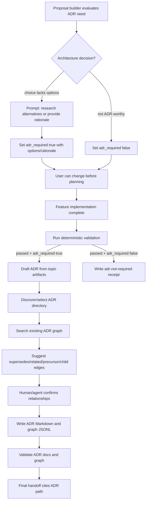

# adr-feature Proposal

## Description

Add a Cartographer feature that turns a completed, validated feature into a durable Architecture Decision Record (ADR) in the repository documentation tree. The output should be easy for a future LLM or developer to find with ordinary project search, should explain what was decided and why without requiring `.plan/` or chat context, and should maintain a lightweight JSONL graph of ADR relationships such as `supersedes`, `related_to`, `precursor_to`, and `child_of`.

The target directory is selected by repository convention: search for an existing ADR or decisions folder first, and if none exists, create `docs/adr/` [F010]. A default layout is:

```text
docs/adr/
  README.md
  0001-use-auth0-for-authentication.md
  0002-use-postgres-for-primary-storage.md
  _graph/
    adr.nodes.jsonl
    adr.edges.jsonl
```

The feature should remain minimal and Cartographer-native: a dedicated `cartographer_adr` tool, small generator/validator, skill integration, searchable Markdown, and JSONL graph artifacts. ADR creation, lookup, and relationship management should also be available directly to the user outside the proposal/plan/implement workflow [F014]. It should not introduce a heavyweight architecture registry, external service, embeddings dependency, or always-on workflow runtime.

## Problem Statement

Cartographer currently produces rich proposal, plan, facts, map, receipt, and context-pack artifacts under `.plan/<topic>/`, but those artifacts are workflow state. They are optimized for building and validating work, not for a future person asking, "What auth system did we pick, and why?" Current docs explicitly leave final concise ADR generation into repo docs as future work [F007].

That leaves four practical gaps:

| Gap | Consequence |
|---|---|
| Decisions remain buried in `.plan/` artifacts and commit history | A future LLM may find many implementation details before it finds the durable decision. |
| No stable current-decision view | Superseded decisions can look equally authoritative unless the relationship is explicit. |
| No standard ADR metadata | Search for terms like `auth`, `identity`, `database`, or `payments` depends on incidental wording. |
| No relationship graph | Decisions that supersede, refine, depend on, or merely relate to each other are hard to reason about chronologically. |

ADR practice addresses this by recording one decision and rationale per concise record [F001], commonly using a title/status/context/decision/consequences structure [F002]. Good ADRs should be pithy, factual, and standalone rather than design guides [F006]. Cartographer should automate that final durable record when implementation is validated, while preserving the artifact-first philosophy introduced by workflow optimization [F008].

## Goals

1. **Evaluate ADR need during proposal creation.** The proposal builder should set `adr_required: true|false`, explain the intent in the user-facing summary, and allow the user to change it before planning and implementation begin [F011].
2. **Prompt for alternatives or rationale when needed.** If the request embeds an architectural choice, such as "add Auth0," and no alternatives or rationale were considered, the proposal builder should ask whether to research alternatives or use the user's provided reason [F012].
3. **Generate durable ADR Markdown after validated completion when required.** Once a Cartographer feature with `adr_required: true` has passed deterministic validation, create a committed ADR under the selected repo docs folder [F011].
4. **Make ADRs easy to retrieve by intent.** A query like "what auth system do we use?" should hit the current ADR through title, front matter, summary, keywords, and body text.
5. **Keep ADRs standalone.** Each ADR must include what changed, why, when, how it affects future work, and consequences without requiring raw chat, line-level source links, or `.plan/` context [F006].
6. **Use stable chronological naming.** Default to ascending numbered files, e.g. `docs/adr/0007-use-auth0-for-authentication.md`, with date/status in metadata, matching common ADR/MADR conventions [F005].
7. **Maintain an ADR graph in JSONL.** Store ADR nodes and typed relationship edges under the selected ADR folder's `_graph/` directory so tools can answer currentness and relationship questions deterministically.
8. **Represent supersession safely.** Do not rewrite old accepted ADR bodies when a decision changes; create a new ADR and a `supersedes` edge so the graph can derive current status [F003].
9. **Validate graph and Markdown consistency.** Ensure ADR files, front matter, and graph records agree before the workflow reports success, with an explicit legacy import path for old ADRs [F013].
10. **Expose standalone ADR management.** Provide a dedicated `cartographer_adr` tool for direct create, lookup, show, relate, validate, and import operations when ADRs happen outside Cartographer workflows [F014].
11. **Integrate with existing Cartographer workflows.** Extend proposal evaluation, `implement` finalization, and project indexing rather than adding a separate orchestration layer [F008], [F009], [F011].

## Non-Goals

- Do not replace `.plan/<topic>/` proposal/plan artifacts. ADRs are the final durable decision summary, not the implementation database.
- Do not generate ADRs from unvalidated work as `accepted`. Draft/proposed ADRs may be supported later, but accepted ADRs require validation evidence.
- Do not index or cite raw/private evidence; ADRs should cite only sanitized facts, validation receipts, topic names, and commit identifiers where useful.
- Do not create a heavyweight architecture portal, database service, web UI, vector index, or mandatory subagent workflow.
- Do not mutate old accepted ADR bodies merely to mark them stale. Currentness should be derived from graph edges and optional generated indexes [F003].
- Do not force every tiny change to create an ADR. The workflow should generate one only when the accepted proposal/plan carries `adr_required: true`, or record an explicit `adr-not-required` receipt with a short reason [F011].
- Do not require validation receipts for imported legacy ADRs when they pass schema checks and are clearly marked as legacy records [F013].
- Do not make users enter the full proposal/plan/implement workflow for direct ADR creation or lookup; standalone ADR work should be available through `cartographer_adr` [F014].
- Do not put ADR domain behavior primarily under `cartographer_jsonl`; keep that tool as a low-level JSONL utility that ADR code may reuse internally [F014].

## Background

External ADR guidance is consistent on the core shape: an ADR records a single decision and rationale, and a collection of ADRs forms a decision log [F001]. The classic Nygard-style template uses title, status, context, decision, and consequences [F002]. MADR and Microsoft guidance both use chronologically ordered or numbered Markdown files with date/status metadata [F005]. Microsoft also emphasizes append-only logs: when a decision changes, write a new ADR that supersedes the old one and link the two [F003].

Cartographer already has the ingredients to do this cleanly:

- topic-scoped proposal/plan/fact/map artifacts;
- receipts and context packs summarizing validation and implementation state [F008];
- JSONL validation utilities and graph validators [F009];
- a project index that can make committed Markdown searchable;
- extension output shaping to keep tool output concise.

The missing piece is a proposal-time ADR gate, a finalization step, and a standalone ADR tool: the proposal should decide whether the work is ADR-worthy and tell the user before planning begins, implementation finalization should distill validated `adr_required` work into a stable decision record and small ADR graph, and users should still be able to create or look up ADRs directly when decisions happen outside the Cartographer workflow [F011], [F014].

## Proposed Design

### 1. Proposal-time ADR requirement evaluation

The proposal workflow should evaluate ADR need before planning begins and persist that decision in proposal metadata, for example:

```yaml
adr_required: true
adr_reason: "Adds a hosted identity provider and establishes the project's authentication architecture."
adr_options_status: researched
```

Rules:

- Set `adr_required: true` for architecturally significant work that establishes, replaces, or materially constrains a durable project decision.
- Set `adr_required: false` for routine implementation, localized refactors, tests, docs-only changes, or changes whose rationale is already covered by an existing current ADR.
- Include the ADR intent in the proposal summary shown to the user: either "I intend to generate an ADR at the end" or "I do not intend to generate an ADR," with the reason [F011].
- Let the user change `adr_required` before the plan and implementation workflows begin [F011].
- If the user asks for a specific architectural choice, such as "add Auth0," and the proposal has no considered options or rationale, prompt the user to choose between researching alternatives and providing the reason for the chosen option [F012].
- Do not invent alternatives or rationale solely to satisfy ADR structure; either research them or record the user's reason.

This keeps ADR generation intentional rather than automatic, while preserving the ADR requirement that decisions include options considered or an explicit reason for a directed choice.

### 2. ADR file location and naming

Directory selection:

1. Search for an existing ADR or decisions directory, preferring explicit project conventions such as `docs/adr/`, `docs/decisions/`, `doc/adr/`, `doc/decisions/`, `adr/`, or `decisions/`.
2. If one clear convention exists, write ADR Markdown there and place graph files under that directory's `_graph/` child.
3. If multiple plausible conventions exist, ask the user before writing.
4. If none exists, create `docs/adr/` [F010].

Default filename:

```text
NNNN-slug.md
```

Examples:

```text
docs/adr/0001-use-auth0-for-authentication.md
docs/adr/0002-store-workflow-receipts-as-jsonl.md
```

Rationale:

- `NNNN` keeps chronological sort stable and matches common ADR/MADR practice [F005].
- Date belongs in front matter and body so filename churn is avoided if a draft date changes.
- The directory is plain Markdown, so normal repository search and Cartographer's index can retrieve it.

### 3. ADR Markdown contract

Each generated ADR should include YAML front matter plus a compact body.

```markdown
---
adr_id: ADR-0007
title: Use Auth0 for Authentication
status: accepted
decision_date: 2026-06-08
generated_from_topic: auth-system
adr_required_source: proposal
legacy_import: false
source_commits:
  - abc1234
validation_receipts:
  - receipt:final:validation:2026-06-08T18:10:00Z
domains:
  - authentication
  - identity
keywords:
  - auth
  - auth0
  - oauth
  - login
decision_kind: feature-architecture
supersedes: []
related: [ADR-0002]
precursors: [ADR-0001]
children: []
confidence: high
---

# ADR-0007: Use Auth0 for Authentication

## Status

Accepted on 2026-06-08.

## Decision

This project uses Auth0 as the hosted identity provider for user authentication.

## Context

The feature needed hosted login, OAuth/OIDC support, user lifecycle management, and a maintainable path for future authorization work.

## Considered Options

- Auth0
- Self-hosted authentication
- Firebase Authentication

## Why This Decision

Auth0 met the project requirements with the lowest implementation and operations burden.

## Consequences

- Runtime code depends on Auth0 tenant configuration.
- Future authorization decisions should treat this ADR as a precursor.
- If the provider changes, write a new ADR that supersedes this one.

## How to Use This Decision

When adding login, session, or identity features, integrate with Auth0/OIDC rather than introducing a separate authentication system.

## Validation

Implemented and validated by the `auth-system` Cartographer topic. Final deterministic validation passed before this ADR was accepted.
```

Required body sections:

1. `Status`
2. `Decision`
3. `Context`
4. `Considered Options`
5. `Why This Decision`
6. `Consequences`
7. `How to Use This Decision`
8. `Validation`

The ADR should avoid brittle references such as source-code line numbers or detailed `.plan/` file paths. It may include stable topic IDs, receipt IDs, sanitized fact IDs, and commit hashes. This keeps the record standalone and less prone to decay [F006].

### 4. ADR graph contract

Create two JSONL files under the selected ADR directory:

```text
<adr-dir>/_graph/adr.nodes.jsonl
<adr-dir>/_graph/adr.edges.jsonl
```

Node shape:

```json
{
  "id": "adr:0007",
  "type": "adr",
  "adr_id": "ADR-0007",
  "title": "Use Auth0 for Authentication",
  "path": "docs/adr/0007-use-auth0-for-authentication.md",
  "status": "accepted",
  "decision_date": "2026-06-08",
  "domains": ["authentication", "identity"],
  "keywords": ["auth", "auth0", "oauth", "login"],
  "summary": "Use Auth0 as the hosted identity provider for user authentication.",
  "generated_from_topic": "auth-system",
  "adr_required_source": "proposal",
  "legacy_import": false,
  "source_commits": ["abc1234"],
  "current": true
}
```

Edge shape:

```json
{
  "from": "adr:0012",
  "to": "adr:0007",
  "type": "supersedes",
  "reason": "ADR-0012 replaces Auth0 with internal OIDC after enterprise SSO requirements changed.",
  "evidence": ["docs/adr/0012-use-internal-oidc.md"]
}
```

Initial edge taxonomy:

| Edge type | Direction | Meaning | Validation rule |
|---|---|---|---|
| `supersedes` | new ADR -> old ADR | New decision replaces old decision. | Must target an older ADR; no cycles; old ADR is not current. |
| `related_to` | either direction | Decisions are relevant together but neither depends on the other. | No lifecycle implication; duplicate inverse edges are optional but discouraged. |
| `precursor_to` | earlier ADR -> later ADR | Earlier decision enabled or materially shaped later decision. | Source date/number should be earlier than target. |
| `depends_on` | later ADR -> earlier ADR | Later decision relies on earlier decision remaining true. | Target should not be superseded without warning. |
| `child_of` | narrower ADR -> broader ADR | Narrow decision refines or specializes a broader parent decision. | Parent must exist and should not create cycles. |
| `conflicts_with` | candidate/new ADR -> existing ADR | Decisions cannot both be current as written. | Accepted ADRs with conflicts require either `supersedes` or explicit reviewer approval. |

The graph should derive currentness from edges. An old ADR file can remain `status: accepted` as the status at the time it was written, while the graph marks it non-current because a later ADR supersedes it [F003].

### 5. Tool model and generation workflow

Add a dedicated user-facing ADR tool, backed by a small helper script:

```text
skills/plan/scripts/adr_records.py
cartographer_adr
```

`cartographer_adr` should be available for ADR creation, lookup, relationship management, validation, and imports even when the user is not running a Cartographer proposal/plan/implement workflow [F014]. `cartographer_jsonl` should remain a low-level JSONL utility that the ADR tool may reuse internally; it should not become the primary ADR UX because ADR operations also involve Markdown rendering, directory discovery, numbering, relationship semantics, and current-decision lookup [F014].

Actions:

| Action | Purpose |
|---|---|
| `evaluate` | Inspect proposal inputs, mark `adr_required`, summarize the intent, and prompt for alternatives or user rationale when a directed architecture choice lacks options [F011], [F012]. |
| `draft` | Build an ADR draft from `.plan/<topic>/proposal.md`, plan, facts, receipts, context packs, and final commit metadata only when `adr_required: true`, or from standalone user-provided context. |
| `create` | Create a standalone/manual ADR with no `.plan` topic required; require context, decision, considered options or explicit rationale, and relationships where known [F014]. |
| `write` | Discover/select the ADR directory, allocate the next ADR number, write Markdown, and upsert graph node/edges [F010]. |
| `list` / `query` | Return compact current ADR summaries, current-first by default, for direct lookup and search/debugging. |
| `show` | Display one ADR's Markdown summary, metadata, and graph relationships without dumping raw graph files. |
| `relate` | Add or update graph edges after human review. |
| `import` | Import existing/legacy ADR Markdown into the graph, allowing legacy records without receipts when explicitly marked [F013]. |
| `validate` | Validate front matter, Markdown sections, graph consistency, relation semantics, legacy-import flags, and path existence. |

The tool should support three ADR sources:

1. **Workflow-generated ADRs:** created from validated `adr_required: true` Cartographer work and include topic, commit, and validation receipt metadata.
2. **Standalone/manual ADRs:** created directly by the user through `cartographer_adr create`, require no `.plan` topic, and use `source: manual` metadata plus explicit context/options/rationale.
3. **Legacy imports:** imported from existing repository ADR files, may omit receipts, and must carry `legacy_import: true` or `status: accepted-legacy` [F013].

Finalization flow:



### 6. Relationship detection

The generator should combine deterministic heuristics with an optional semantic review:

- Query existing ADR nodes by overlapping `domains`, `keywords`, title tokens, and `decision_kind`.
- Treat same domain + incompatible decision as a `supersedes` candidate.
- Treat same domain + compatible/coexisting decision as `related_to`.
- Treat explicit prerequisite wording from the new ADR as `depends_on` or `precursor_to`.
- Treat a narrow decision under a broader existing architecture area as `child_of`.
- Require explicit confirmation before writing `supersedes` or `conflicts_with` edges.

This keeps the graph useful without pretending edge semantics can be inferred perfectly.

### 7. Search and retrieval behavior

To make a future query like "what auth system do we use?" work reliably:

- front matter must include domain and keyword synonyms (`auth`, `authentication`, `identity`, `login`, provider names);
- the first body paragraph under `Decision` must state the answer plainly;
- `<adr-dir>/README.md` should explain the ADR directory and point to the graph;
- `cartographer_index` should index ADR Markdown as normal docs/code content;
- `cartographer_adr list/query` should return current ADRs first and hide superseded records unless requested.

If `.jsonl` files under the selected ADR directory's `_graph/` folder are not included by the default indexer, the ADR helper can read them directly and expose compact summaries. This avoids broad raw graph dumps while preserving deterministic relationship data.

### 8. Validation

ADR validation should check:

- every Markdown ADR has required front matter fields;
- every Markdown ADR has required body sections;
- `adr_id`, filename number, graph node ID, and graph node path agree;
- graph node paths exist;
- graph edge endpoints exist;
- `supersedes`, `precursor_to`, `depends_on`, and `child_of` relationships are acyclic where applicable;
- superseding ADRs are newer than superseded ADRs;
- generated accepted ADRs require validation evidence from completed Cartographer work;
- imported legacy ADRs may omit validation receipts only when marked with `status: accepted-legacy` or `legacy_import: true` and an import note [F013];
- no raw/private `.plan/_private/**` references appear in ADR Markdown or graph JSONL;
- generated output stays concise and avoids stale line-level source references.

This can reuse existing JSONL validation conventions and tests [F009].

## Implementation Strategy

Recommended phases for a future plan:

1. **Schema and examples**
   - Add docs for ADR Markdown/front matter, `adr_required` proposal metadata, legacy-import markers, and JSONL graph schema.
   - Add example fixtures under tests, not real generated repo ADRs unless the proposal is accepted.
2. **Proposal workflow gate**
   - Update the proposal builder to evaluate `adr_required`, summarize the decision to the user, and prompt for alternatives or user-provided rationale when a directed architecture choice lacks considered options [F011], [F012].
3. **Generator script**
   - Implement `adr_records.py` with `evaluate`, `draft`, `write`, `validate`, and `list` actions.
   - Implement ADR directory discovery with existing-convention preference and `docs/adr/` fallback [F010].
   - Use temporary directories in tests, following project test-artifact rules.
4. **Graph validator**
   - Add deterministic validation for ADR node/edge files, currentness derivation, and legacy-import handling.
   - Expose validation through `cartographer_adr validate`; reuse `cartographer_jsonl` internally where useful, but keep ADR validation user-facing through the ADR tool [F014].
5. **Indexer/search integration**
   - Ensure selected ADR Markdown files are retrievable by `cartographer_index`.
   - Add compact `cartographer_adr list/query/show` output from Markdown and graph files.
6. **Workflow integration**
   - Update `skills/implement/SKILL.md` to generate ADRs after final validation only when `adr_required: true`, or write an `adr-not-required` receipt otherwise.
   - Update proposal/plan skill docs so ADRs are described as final durable docs, no longer future work.
7. **Extension and README**
   - Expose a dedicated shaped `cartographer_adr` Pi tool for create, draft, list/query, show, relate, import, and validate actions [F014].
   - Document workflow-generated, standalone/manual, and legacy-import ADR modes; directory layout; proposal-time ADR decisions; and validation commands in README.

## Test Strategy

- Unit-test proposal-time `adr_required` evaluation and summary text.
- Unit-test prompting behavior for directed architecture choices with missing alternatives/rationale.
- Unit-test ADR directory discovery, multiple-convention ambiguity, fallback creation, filename allocation, and slug generation.
- Unit-test ADR Markdown parsing and front matter validation.
- Unit-test graph validation for missing endpoints, cycles, stale paths, wrong dates, and invalid edge types.
- Unit-test `supersedes` currentness derivation.
- Unit-test legacy ADR import validation without receipts when marked `accepted-legacy` or `legacy_import: true`.
- Unit-test standalone/manual `cartographer_adr create` without a `.plan` topic.
- Unit-test `list/query/show` returning current ADRs first and optionally including superseded ADRs without dumping raw graph files.
- Unit-test private path rejection for `.plan/_private/**` references.
- Integration-test generation from a mock `.plan/<topic>/` directory with receipts and context packs under `/tmp`, not the real repository `.plan/`.
- Run `npm run check`, `cartographer_jsonl validate-topic --topic adr-feature`, and planning graph validation once plan artifacts exist.

## Risks and Mitigations

| Risk | Mitigation |
|---|---|
| ADR spam for trivial changes | Gate generation on proposal-level `adr_required: true`; otherwise write an `adr-not-required` receipt with reason. |
| User-requested architecture choices lack alternatives | Prompt during proposal creation to research alternatives or capture the user's reason before planning [F012]. |
| Generated ADRs copy too much plan detail | Enforce required compact sections and body-size guidance. |
| Old ADRs appear current after supersession | Derive currentness from `supersedes` edges and make list/query current-first by default. |
| Relationship inference is wrong | Treat inferred relationships as suggestions and require confirmation for supersedes/conflict edges. |
| Stale source references accumulate | Disallow line-level code references by default; keep stable topic/commit/receipt IDs only. |
| JSONL graph drifts from Markdown | Validate every ADR file against graph nodes/edges before success. |
| Legacy ADRs lack receipts | Allow only explicit legacy markers and import notes, then keep normal generated ADR validation strict [F013]. |

## Acceptance Criteria

- Proposal creation evaluates `adr_required`, records the result, and tells the user whether an ADR will be generated before planning begins.
- Proposal creation prompts for alternatives research or user-provided rationale when a directed architecture choice appears ADR-worthy but lacks considered options.
- A validated feature with `adr_required: true` can produce a committed ADR Markdown file under the selected ADR directory.
- If no ADR/decisions directory exists, the generator falls back to `docs/adr/`; if multiple plausible directories exist, it asks before writing.
- Generated ADRs include searchable front matter and standalone what/why/when/how body content.
- Generated ADRs avoid raw/private paths and stale line-level references.
- `<adr-dir>/_graph/adr.nodes.jsonl` and `<adr-dir>/_graph/adr.edges.jsonl` are created/updated with valid ADR nodes and relationship edges.
- `supersedes`, `related_to`, `precursor_to`, and `child_of` relationships validate deterministically.
- Imported legacy ADRs can validate without receipts only when explicitly marked as legacy.
- `cartographer_adr` is available for standalone create, list/query, show, relate, validate, and import operations outside the full Cartographer workflow.
- Standalone/manual ADR creation requires no `.plan` topic but does require explicit context, decision, considered options or rationale, and metadata sufficient for search.
- Search/list output can answer current-decision questions such as "what auth system do we use?" from ADR artifacts.
- Implement workflow documentation says when ADR generation is required, optional, or explicitly skipped.
- Tests cover proposal gating, directory discovery, standalone ADR creation, generator, validator, graph currentness, legacy imports, and private-reference rejection.

## Resolved Decisions

1. **ADR directory selection:** Search for an existing ADR or decisions folder first; if none exists, use `docs/adr/` [F010].
2. **ADR generation gate:** Generate ADRs only when the proposal marks `adr_required: true`; the proposal summary must tell the user the intended ADR outcome before planning and implementation begin [F011].
3. **Alternatives/rationale prompt:** If the proposal generator detects an ADR-worthy directed choice and no alternatives were considered, prompt the user to research alternatives or provide the reason for the choice [F012].
4. **Legacy imports:** Allow imported legacy ADRs without validation receipts when they pass schema validation and are clearly marked as legacy records [F013].
5. **Dedicated ADR tool:** Expose ADR creation, lookup, relationship management, validation, and import through a dedicated `cartographer_adr` tool. Keep `cartographer_jsonl` as a lower-level JSONL utility ADR tooling may reuse internally [F014].

## Remaining Open Questions

None.
