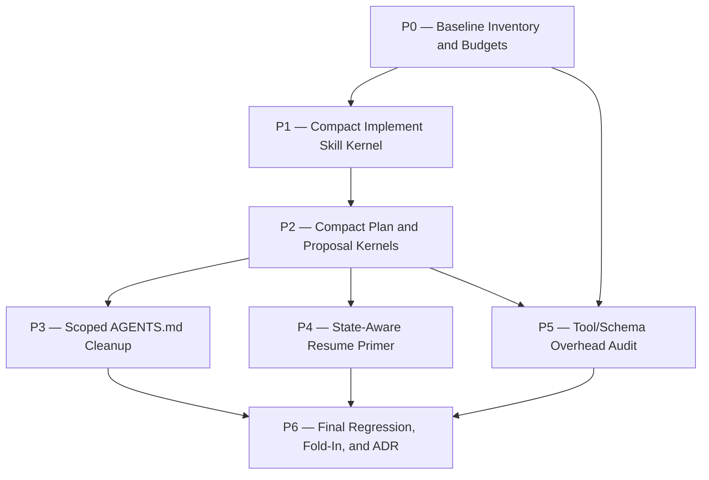

# context-bloat-audit Plan

## Source Artifacts

- `.plan/context-bloat-audit/proposal.md`
- `.plan/context-bloat-audit/requirements.md`
- `.plan/context-bloat-audit/requirements.nodes.jsonl`
- `.plan/context-bloat-audit/requirements.edges.jsonl`
- `.plan/context-bloat-audit/design.md`
- `.plan/context-bloat-audit/design.nodes.jsonl`
- `.plan/context-bloat-audit/design.edges.jsonl`
- `.plan/context-bloat-audit/facts.nodes.jsonl`
- `.plan/context-bloat-audit/facts.edges.jsonl`
- `.plan/context-bloat-audit/evidence/context-size-audit.md`
- `.plan/context-bloat-audit/evidence/workflow-session-analysis.md`
- `.plan/context-bloat-audit/evidence/plan-drafter-outline.md`

## Planning Assumptions

- Proposal, requirements, and design are approved.
- The DOX framework has already been removed; this plan targets scoped `AGENTS.md` instruction files, not DOX framework/index mechanics [F010].
- The accepted design is a hybrid phased migration: inventory first, compact skill kernels, scoped `AGENTS.md` cleanup, state-aware resume primer, measured tool/schema audit, and final regression/ADR.
- Tests and validation must not mutate the repository's real `.plan/` during arrange/setup; fixture tests must use temporary mock projects.
- Tool/schema changes are measurement-gated. Low-risk schema/snippet reductions may happen in this plan; deferred discovery or active-tool profiles require measurement evidence and may become follow-up/ADR work if too broad.
- ADR finalization is required after implementation validates durable architecture choices.

## Phase Dependency Graph

## Phase Summary

| Order | Phase ID | Phase | Depends On | Unlocks | Exit Criteria |
| ----: | -------- | ----- | ---------- | ------- | ------------- |
| 0 | P0 | Baseline Inventory and Budgets | none | P1, P5 | Inventory script/report exists, budgets encoded, fixture tests pass |
| 1 | P1 | Compact Implement Skill Kernel | P0 | P2 | `implement` kernel meets budget, references are reachable, dry-run validates wrapper sequence |
| 2 | P2 | Compact Plan and Proposal Kernels | P1 | P3, P4, P5 | `plan` and `proposal` kernels meet budgets and workflow gates still work |
| 3 | P3 | Scoped AGENTS.md Cleanup | P2 | P6 | Root/child instruction files are budgeted, lint-clean or exceptions documented |
| 4 | P4 | State-Aware Resume Primer | P2 | P6 | Resume primer generated from state/receipts/context packs within fixed budget |
| 5 | P5 | Tool/Schema Overhead Audit | P0, P2 | P6 | Phase tool inventory exists and low-risk reductions preserve guardrails |
| 6 | P6 | Final Regression, Fold-In, and ADR | P3, P4, P5 | implementation approval | Final checks pass, requirements folded/skip recorded, ADR drafted/recorded |

## Phases

### Phase P0 — Baseline Inventory and Budgets

- **Status:** complete
- **Depends on:** none
- **Unlocks:** P1, P5
- **Primary references:** `DES-CBA-001`, `REQ-CBA-001`, `SCN-CBA-001`, `SCN-CBA-002`, `F001`, `F002`, `F003`, `F008`, `F010`, `skills/plan/scripts/`, `AGENTS.md`, `skills/AGENTS.md`

#### Objective

Create a repeatable, bounded context inventory so every later context-reduction change can be measured against explicit budgets.

#### Scope

- Add `skills/plan/scripts/context_inventory.*` or an equivalent wrapper/script entry point.
- Report character counts and approximate token counts for:
  - root `AGENTS.md`
  - child `AGENTS.md` files, including `skills/AGENTS.md`
  - active skill descriptions/trigger metadata
  - high-use `SKILL.md` files: `implement`, `plan`, `proposal`
  - reference files under high-use skill directories
  - compaction summaries/session-analysis evidence when an authorized session path is provided
  - state-resume/context-pack payloads when a topic is provided
  - active Cartographer tool/schema/prompt-snippet estimates where feasible
- Encode initial budgets from design and support before/after delta output for changed files.

#### Checklist

- [x] **P0.T1** Add a non-interactive inventory script with `--help`, `--json`, bounded output, and safe defaults.
- [x] **P0.T2** Add support for mock project roots and optional topic/session inputs without reading raw private transcript contents by default.
- [x] **P0.T3** Include active skill descriptions/trigger metadata in inventory output.
- [x] **P0.T4** Encode initial budgets for root `AGENTS.md`, child `AGENTS.md`, high-use skill kernels, reference depth/files, resume primer, and tool/schema estimates.
- [x] **P0.T5** Add before/after delta reporting for changed tracked files.
- [x] **P0.T6** Document the inventory command in the relevant skill/reference location.

#### Validation

- [x] **P0.V1** Run focused inventory unit tests such as `python -m unittest tests.test_context_inventory`; expected result: fixture `tests/fixtures/context_inventory/mock_project` reports sorted top-bloat sources, active skill descriptions, and budget pass/fail output covering `REQ-CBA-001`, `SCN-CBA-001`, and `SCN-CBA-002`.
- [x] **P0.V2** Run the inventory command against the real checkout in read-only mode; expected result: bounded report includes `AGENTS.md`, `skills/AGENTS.md`, active skill descriptions, `skills/implement/SKILL.md`, `skills/plan/SKILL.md`, and `skills/proposal/SKILL.md`.
- [x] **P0.V3** Run `npm run check:scripts`; expected result: script syntax checks pass.

#### Testing Strategy Trace

- **Design refs:** `DES-CBA-001`, `TEST-CBA-001`
- **Requirements/scenarios:** `REQ-CBA-001`, `SCN-CBA-001`, `SCN-CBA-002`
- **Layers:** unit, static
- **Concrete artifacts:** new inventory script, mock project fixtures, budget report JSON
- **E2E contribution:** no; supports later E2E baseline

#### Exit Criteria

- Inventory and budget reporting are implemented, tested, and documented.
- P0 validation receipts show fixture and real-checkout inventory output is bounded and useful.

#### Risks and Mitigations

- **Risk:** Tool/schema estimates are hard to compute exactly. **Mitigation:** report best-effort estimates and mark unsupported providers as `unknown` with follow-up notes.

#### Notes for Execution Agent

Use temporary directories for tests. Do not point fixture setup at the repository's real `.plan/`.

### Phase P1 — Compact Implement Skill Kernel

- **Status:** complete
- **Depends on:** P0
- **Unlocks:** P2
- **Primary references:** `DES-CBA-002`, `DES-CBA-006`, `REQ-CBA-002`, `REQ-CBA-006`, `SCN-CBA-003`, `SCN-CBA-004`, `SCN-CBA-011`, `skills/implement/SKILL.md`, `skills/implement/references/`

#### Objective

Reduce `skills/implement/SKILL.md` to a compact, resume-safe kernel while preserving all critical workflow behavior through references, tooling, or explicit retained rules.

#### Scope

- Split low-frequency implementation details into one-level `skills/implement/references/*.md` files.
- Keep the kernel focused on activation, hard safety/privacy rules, implementation loop, wrapper sequence, status transitions, validation/auditor gates, stop conditions, and reference pointers.
- Create a rule relocation ledger for moved, tool-owned, and duplicate-deleted rules.

#### Checklist

- [x] **P1.T1** Inventory and categorize current `skills/implement/SKILL.md` sections into kernel, reference, tooling-owned, or duplicate-delete buckets.
- [x] **P1.T2** Create one-level implement reference files for validation/auditor gates, fallback handling, finalization/ADR, compaction/resume, and commit/checkpoint guidance as needed.
- [x] **P1.T3** Rewrite `skills/implement/SKILL.md` kernel to the approved budget target.
- [x] **P1.T4** Add/update a relocation ledger documenting every removed or moved rule.
- [x] **P1.T5** Update local skill documentation only where stable behavior changed.

#### Validation

- [x] **P1.V1** Run context inventory; expected result: `skills/implement/SKILL.md` is <= 8k chars or has a documented exception.
- [x] **P1.V2** Run reference-link/skill-language checks; expected result: all referenced implement files exist one level deep and hard safety rules remain reachable.
- [x] **P1.V3** Run a representative implement workflow dry-run on a temporary/mock topic; expected result: agent can identify wrapper sequence, validation gates, human gates, and stop conditions without reading legacy full skill text.
- [x] **P1.V4** Run `npm run check:scripts` and targeted tests for any touched scripts.

#### Testing Strategy Trace

- **Design refs:** `DES-CBA-002`, `DES-CBA-006`, `TEST-CBA-001`
- **Requirements/scenarios:** `REQ-CBA-002`, `REQ-CBA-006`, `SCN-CBA-003`, `SCN-CBA-004`, `SCN-CBA-011`
- **Layers:** static, integration, manual-assisted dry-run
- **Concrete artifacts:** implement kernel, `skills/implement/references/*.md`, relocation ledger, dry-run notes/receipt
- **E2E contribution:** partial; validates implement activation/resume behavior

#### Exit Criteria

- `implement` kernel is compact and references are reachable.
- Dry-run evidence shows required wrapper sequence and gates are preserved.

#### Risks and Mitigations

- **Risk:** Rule loss during split. **Mitigation:** relocation ledger and auditor review before phase approval.

#### Notes for Execution Agent

Do not optimize by deleting safety rules unless they are duplicated or enforced by deterministic tooling and the new home is recorded.

### Phase P2 — Compact Plan and Proposal Skill Kernels

- **Status:** complete
- **Depends on:** P1
- **Unlocks:** P3, P4, P5
- **Primary references:** `DES-CBA-002`, `DES-CBA-006`, `REQ-CBA-002`, `REQ-CBA-006`, `SCN-CBA-004`, `SCN-CBA-011`, `skills/plan/SKILL.md`, `skills/proposal/SKILL.md`

#### Objective

Apply the compact-kernel/reference split to `plan` and `proposal` after validating the implement split pattern.

#### Scope

- Split schemas, examples, delegation prompts, fallback recipes, and lifecycle details into one-level references.
- Preserve proposal and planning gates for requirements/design approval, validation receipts, auditor PASS, ADR metadata, fact support, and private evidence safety.
- Extend relocation ledger.

#### Checklist

- [x] **P2.T1** Categorize `skills/plan/SKILL.md` and `skills/proposal/SKILL.md` into kernel/reference/tool-owned/delete buckets.
- [x] **P2.T2** Create `skills/plan/references/*.md` and `skills/proposal/references/*.md` as needed.
- [x] **P2.T3** Rewrite plan/proposal kernels to budget targets.
- [x] **P2.T4** Update relocation ledger for all moved/deleted rules.
- [x] **P2.T5** Preserve or update trigger descriptions only if routing remains precise.

#### Validation

- [x] **P2.V1** Run context inventory; expected result: `plan` <= 10k chars and `proposal` <= 10k chars or documented exceptions.
- [x] **P2.V2** Run reference-link/skill-language checks; expected result: references are one level deep and required gates remain reachable.
- [x] **P2.V3** Run representative proposal and plan workflow dry-runs on temporary/mock topics; expected result: requirements/design gates, human approvals, validation receipts, fact support, and graph discipline are preserved.
- [x] **P2.V4** Run `npm run check:scripts` and targeted tests.

#### Testing Strategy Trace

- **Design refs:** `DES-CBA-002`, `DES-CBA-006`, `TEST-CBA-001`
- **Requirements/scenarios:** `REQ-CBA-002`, `REQ-CBA-006`, `SCN-CBA-004`, `SCN-CBA-011`
- **Layers:** static, integration, manual-assisted dry-run
- **Concrete artifacts:** plan/proposal kernels, references, relocation ledger, dry-run notes/receipts
- **E2E contribution:** partial; validates proposal/plan workflow preservation

#### Exit Criteria

- Plan/proposal kernels meet budgets and workflow dry-runs preserve gates.

#### Risks and Mitigations

- **Risk:** Proposal/plan skills lose graph/fact validation specificity. **Mitigation:** keep exact wrapper sequence in kernels and move schemas/prompts to named references.

#### Notes for Execution Agent

Avoid changing lifecycle semantics during prose splitting; any semantic change needs explicit design/ADR handling.

### Phase P3 — Scoped AGENTS.md Cleanup

- **Status:** complete
- **Depends on:** P2
- **Unlocks:** P6
- **Primary references:** `DES-CBA-003`, `REQ-CBA-003`, `SCN-CBA-005`, `SCN-CBA-006`, `F008`, `F010`, `AGENTS.md`, `skills/AGENTS.md`

#### Objective

Clean up root and child `AGENTS.md` files as scoped instruction files, not DOX framework artifacts. P3 runs after P2 to preserve the design's one-context-source-at-a-time migration discipline: first prove the skill relocation pattern, then clean up scoped instruction files with final skill-rule ownership boundaries visible.

#### Scope

- Keep root `AGENTS.md` project-wide.
- Keep `skills/AGENTS.md` skill-specific and compact.
- Resolve markdown line-length/readability warnings or document exceptions.
- Remove duplicate or stale rules and record ownership boundaries.

#### Checklist

- [x] **P3.T1** Audit root `AGENTS.md` for project-wide-only instructions.
- [x] **P3.T2** Audit `skills/AGENTS.md` for skill-specific instructions, duplicate rules, line-length warnings, and budget fit.
- [x] **P3.T3** Record parent/child instruction ownership boundaries in the appropriate file(s) without reintroducing DOX framework mechanics.
- [x] **P3.T4** Update inventory budgets and relocation ledger for instruction-file changes.

#### Validation

- [x] **P3.V1** Run context inventory; expected result: before/after size deltas for root and child `AGENTS.md` files are reported.
- [x] **P3.V2** Run markdown/prettier checks relevant to touched Markdown; expected result: line-length/readability warnings resolved or exceptions recorded.
- [x] **P3.V3** Review scoped-instruction behavior; expected result: non-skills work avoids skill-specific rules while `skills/` work receives `skills/AGENTS.md`.

#### Testing Strategy Trace

- **Design refs:** `DES-CBA-003`, `TEST-CBA-001`
- **Requirements/scenarios:** `REQ-CBA-003`, `SCN-CBA-005`, `SCN-CBA-006`
- **Layers:** static, manual review
- **Concrete artifacts:** `AGENTS.md`, `skills/AGENTS.md`, inventory report, ownership notes
- **E2E contribution:** no

#### Exit Criteria

- Scoped instruction files are compact, lint-clean or justified, and ownership is clear.

#### Risks and Mitigations

- **Risk:** Historical DOX wording returns. **Mitigation:** validation/search checks for stale DOX framework references in current requirements/design/docs.

#### Notes for Execution Agent

The user explicitly said DOX is removed; do not add DOX framework/index tasks.

### Phase P4 — State-Aware Resume Primer

- **Status:** complete
- **Depends on:** P2
- **Unlocks:** P6
- **Primary references:** `DES-CBA-004`, `REQ-CBA-004`, `SCN-CBA-007`, `SCN-CBA-008`, `skills/plan/scripts/cartographer_state.ts`, `extensions/cartographer-tools.ts`

#### Objective

Generate compact implementation resume primers from Cartographer state, receipts, and context packs, reducing reliance on historical compaction narrative or full skill reinjection.

#### Scope

- Add or extend state/transition tooling to emit a compact resume primer.
- Include topic, lifecycle/phase, next action, working set, validation receipts, blockers, and critical rules/reference pointers.
- Enforce fixed target sizes and truncation/reference metadata.
- Avoid copying raw transcript contents into durable artifacts.

#### Checklist

- [x] **P4.T1** Design and implement resume-primer output in state/transition tooling or extension wrapper.
- [x] **P4.T2** Add budget enforcement and truncation/reference metadata.
- [x] **P4.T3** Integrate primer references with compact `implement` kernel guidance.
- [x] **P4.T4** Document command/tool usage for agents.

#### Validation

- [x] **P4.V1** Run resume-primer unit tests with mock `.cartographer` state, receipts, and context packs in temporary projects; expected result: primer contains required fields within budget.
- [x] **P4.V2** Run repeated-compaction fixture such as `python -m unittest tests.test_context_resume_primer`; expected result: fixture `tests/fixtures/context_resume/repeated_compaction.json` keeps summaries within fixed budget or externalizes detail, covering `REQ-CBA-004` and `SCN-CBA-008`.
- [x] **P4.V3** Run manual-assisted E2E resume smoke validation on a temporary/mock topic and write validation artifact/manual evidence `.plan/context-bloat-audit/evidence/resume-smoke.md`; expected result: agent identifies next wrapper action and required reference while avoiding legacy full skill text, covering `REQ-CBA-004` and `SCN-CBA-007`.

#### Testing Strategy Trace

- **Design refs:** `DES-CBA-004`, `TEST-CBA-001`
- **Requirements/scenarios:** `REQ-CBA-004`, `SCN-CBA-007`, `SCN-CBA-008`
- **Layers:** unit, integration, manual-assisted E2E
- **Concrete artifacts:** resume-primer command/tool output, mock state/context pack fixtures, smoke evidence
- **E2E contribution:** yes; this is the required manual-assisted E2E validation candidate

#### Exit Criteria

- Resume primer is implemented, budgeted, tested, and integrated with compact implement guidance.

#### Risks and Mitigations

- **Risk:** Primer omits a blocker. **Mitigation:** include blockers, latest validation receipts, next action, and context-pack IDs by default.

#### Notes for Execution Agent

Keep raw session/transcript text out of `.plan/` artifacts.

### Phase P5 — Tool/Schema Overhead Audit and Low-Risk Reductions

- **Status:** in-progress
- **Depends on:** P0, P2
- **Unlocks:** P6
- **Primary references:** `DES-CBA-005`, `REQ-CBA-005`, `SCN-CBA-009`, `SCN-CBA-010`, `extensions/cartographer-tools.ts`, `F007`

#### Objective

Measure active tool/schema overhead by workflow phase and apply only low-risk reductions that preserve Cartographer guardrails.

#### Scope

- Inventory active tool count and estimated schema/snippet cost for proposal/design/planning and implementation workflows.
- Shorten prompt snippets/descriptions where safe.
- Record whether phase-scoped active-tool profiles, consolidation, or deferred discovery should be implemented now or deferred.
- Preserve mutation, validation, audit, state, and transition guardrails.

#### Checklist

- [ ] **P5.T1** Extend inventory to report tool/schema/prompt-snippet estimates by workflow phase.
- [ ] **P5.T2** Identify redundant or overlong tool descriptions/snippets in Cartographer extension tooling.
- [ ] **P5.T3** Apply low-risk schema/snippet reductions that do not remove guardrails.
- [ ] **P5.T4** Record measurement-based recommendation for active-tool profiles/deferred discovery: implement, defer, or reject.

#### Validation

- [ ] **P5.V1** Run tool inventory report and write artifact `.plan/context-bloat-audit/evidence/tool-inventory.json`; expected result: proposal/design phase and implementation phase overhead are separately reported, covering `REQ-CBA-005`, `SCN-CBA-009`, and `SCN-CBA-010`.
- [ ] **P5.V2** Run targeted TypeScript checks for extension/tool changes; expected result: `extensions/cartographer-tools.ts` syntax/type checks pass.
- [ ] **P5.V3** Run guardrail reachability review; expected result: validation, mutation, audit, state, and transition wrappers remain visible/reachable.

#### Testing Strategy Trace

- **Design refs:** `DES-CBA-005`, `TEST-CBA-001`
- **Requirements/scenarios:** `REQ-CBA-005`, `SCN-CBA-009`, `SCN-CBA-010`
- **Layers:** static, integration, manual review
- **Concrete artifacts:** tool inventory report, extension diffs, recommendation note
- **E2E contribution:** no

#### Exit Criteria

- Tool/schema overhead is measured and low-risk reductions are validated or explicitly deferred.

#### Risks and Mitigations

- **Risk:** Tool/schema reduction hides guardrails. **Mitigation:** no active-tool/deferred-discovery change without explicit guardrail reachability evidence and ADR/design follow-up if needed.

#### Notes for Execution Agent

Do not remove or hide Cartographer wrapper tools solely for token savings without a validated replacement path.

### Phase P6 — Final Regression, Fold-In, and ADR

- **Status:** pending
- **Depends on:** P3, P4, P5
- **Unlocks:** implementation-ready-for-human-review
- **Primary references:** `DES-CBA-006`, `TEST-CBA-001`, `REQ-CBA-006`, `SCN-CBA-012`, all prior phase receipts

#### Objective

Verify the full context-reduction migration, fold durable requirements/docs, and record the required ADR.

#### Scope

- Run final inventory and compare against P0 baseline.
- Validate all requirement/scenario coverage.
- Fold accepted requirement/design deltas into durable docs or record approved fold skip.
- Draft/write ADR for validated hybrid architecture, skill packaging conventions, resume behavior, and any tool-loading outcome.
- Run final auditor and implementation readiness gates.

#### Checklist

- [ ] **P6.T1** Run final inventory and produce before/after comparison against P0.
- [ ] **P6.T2** Verify relocation ledger completeness for moved/deleted/tool-owned rules.
- [ ] **P6.T3** Fold accepted deltas into `docs/requirements.md` and relevant instruction/skill docs, or record approved fold skip.
- [ ] **P6.T4** Use `cartographer_adr` to draft/write the required ADR after validation evidence is available.
- [ ] **P6.T5** Prepare final auditor handoff with receipts, context packs, residual risks, and E2E/manual evidence.

#### Validation

- [ ] **P6.V1** Run `node --experimental-strip-types skills/plan/scripts/manage_jsonl.ts validate-topic --root "$PWD" --topic context-bloat-audit --json`; expected result: no errors.
- [ ] **P6.V2** Run focused tests/checks from prior phases plus `npm run check:scripts`, `npm run typecheck`, lint/format checks, and targeted unit tests; expected result: all pass or documented non-blocking exceptions.
- [ ] **P6.V3** Run aggregate `npm run check` if runtime/environment allows and save manual evidence `.plan/context-bloat-audit/evidence/final-check.md`; otherwise record explicit scoped-check rationale and residual risk in that evidence file.
- [ ] **P6.V4** Auditor review confirms behavior preservation, budget results, relocation ledger completeness, requirement/scenario coverage, ADR readiness, and no raw transcript leakage.

#### Testing Strategy Trace

- **Design refs:** `DES-CBA-006`, `TEST-CBA-001`
- **Requirements/scenarios:** all `REQ-CBA-*`, all `SCN-CBA-*`, especially `SCN-CBA-012`
- **Layers:** static, unit, integration, manual-assisted E2E, final regression
- **Concrete artifacts:** final inventory report, relocation ledger, requirements-fold receipt, ADR, validation receipts
- **E2E contribution:** yes; confirms complete workflow behavior

#### Exit Criteria

- Final validation and auditor PASS are recorded.
- ADR is created or an approved ADR deferral/override is recorded.
- Requirements fold or fold-skip receipt exists.
- Topic is ready for implementation completion review.

#### Risks and Mitigations

- **Risk:** Full `npm run check` is too expensive or environment-sensitive. **Mitigation:** run targeted checks and record explicit rationale/residual risk if aggregate check cannot run.

#### Notes for Execution Agent

Do not mark implementation complete until ADR handling and requirements fold handling are resolved.

## Cross-Phase Validation

- Every phase must run or cite `manage_jsonl.ts validate-topic` after modifying topic graph artifacts.
- Every phase that changes skills or scoped instructions must run context inventory before and after the change.
- Every skill split must update the relocation ledger and pass reference-link checks.
- Every phase that changes scripts or extension code must run `npm run check:scripts` and targeted tests/checks.
- The manual-assisted E2E smoke from P4/P6 must produce a validation receipt or explicit manual evidence note.

## Requirement and Scenario Coverage Matrix

| ID | Covered by phase(s) | Validation |
|---|---|---|
| `REQ-CBA-001` | P0 | `P0.V1`, `P0.V2` inventory unit/fixture validation |
| `SCN-CBA-001` | P0 | `P0.V1` sorted top-bloat inventory fixture |
| `SCN-CBA-002` | P0 | `P0.V1`, `P0.V2` before/after delta fixture |
| `REQ-CBA-002` | P1, P2 | `P1.V1`, `P1.V2`, `P2.V1`, `P2.V2` skill budget/reference checks |
| `SCN-CBA-003` | P1 | `P1.V3` implement kernel resume dry-run |
| `SCN-CBA-004` | P1, P2 | `P1.V2`, `P2.V2` named reference reachability checks |
| `REQ-CBA-003` | P3 | `P3.V1`, `P3.V2`, `P3.V3` AGENTS.md size/lint/locality review |
| `SCN-CBA-005` | P3 | `P3.V3` root-only context review |
| `SCN-CBA-006` | P3 | `P3.V2` `skills/AGENTS.md` lint/size check |
| `REQ-CBA-004` | P4 | `P4.V1`, `P4.V2`, `P4.V3` resume-primer unit/smoke tests |
| `SCN-CBA-007` | P4 | `P4.V3` state/context-pack E2E resume smoke |
| `SCN-CBA-008` | P4 | `P4.V2` repeated-compaction budget fixture |
| `REQ-CBA-005` | P5 | `P5.V1`, `P5.V3` tool/schema inventory and guardrail review |
| `SCN-CBA-009` | P5 | `P5.V1` proposal/design phase tool inventory |
| `SCN-CBA-010` | P5 | `P5.V1` implementation phase tool inventory |
| `REQ-CBA-006` | P1, P2, P6 | `P1.V3`, `P2.V3`, `P6.V4` relocation ledger, phased receipts, auditor PASS |
| `SCN-CBA-011` | P1, P2 | `P1.V3`, `P2.V3` workflow dry-runs after skill split |
| `SCN-CBA-012` | P4, P6 | `P4.V1`, `P6.V4` tooling-owned rule guardrail tests |

## Open Questions

- Exact inventory script filename and interface may be finalized in P0; design allows a script or equivalent wrapper mode.
- Exact numeric budgets beyond approved initial targets may be refined after P0 baseline, but regressions require documented exceptions.
- Active-tool profiles/deferred discovery are not automatically in scope; P5 measurements decide whether to implement, defer, or require follow-up design/ADR.

## Handoff Guidance

- Start implementation at P0 with inventory and budgets; do not split skill files before measurement exists.
- Use a single parent writer and wrapper-first Cartographer mutation discipline.
- Keep raw session/transcript content out of durable docs and receipts.
- Preserve all human gates: phase approvals are required before advancing during implementation if the implement workflow requests them.
- Conventional commits should be created per coherent phase after validation.
