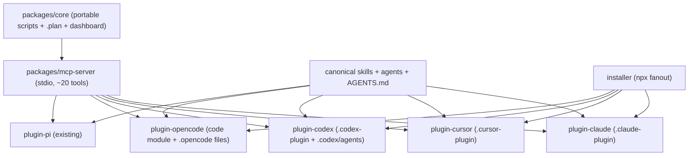

# cross-agent-port Proposal

## Description

Pi Cartographer is today a single [pi](https://pi.dev) package: a thin pi-specific
extension (`extensions/cartographer-tools.ts`) that registers ~20 `cartographer_*`
tools over a minimal `PiApi.registerTool` surface and shells out to portable
Python/TypeScript CLI scripts, plus pi-format skills (`skills/*/SKILL.md`), pi
subagents (`.pi/agents/*.md`), a `.plan/` artifact model, and a React dashboard.

This proposal defines the work to make Cartographer a **cross-agent product** that
runs on four coding agents — **opencode**, **OpenAI Codex CLI**, **Claude Code**, and
**Cursor** — and decides the **repository architecture** for doing so: whether to
restructure into a **monorepo with a shared core package plus individual per-agent
plugin projects**. It is backed by seven research briefs under
`.plan/cross-agent-port/evidence/`.

## Problem Statement

Cartographer's planning/implementation capability is valuable independent of pi, but
it is currently only consumable from pi. Teams that use opencode, Codex, Claude Code,
or Cursor cannot adopt it without reimplementing the integration. The capability
itself is already agent-agnostic (it lives in CLI scripts [F008]); only the
**integration and packaging layer** is pi-specific. We need a way to expose the same
tools, skills, subagents, and project memory to four agents whose extension models
differ — while keeping a single source of truth so the core does not fork four ways.

A secondary, structural problem follows from the first: the current single-package
layout couples the pi adapter, the portable core, and pi-only packaging in one tree.
If we add three more agent targets without restructuring, the core risks being
copied or entangled per agent. We must decide the repository architecture **before**
building the adapters.

## Goals

- Run Cartographer's core workflow (proposal → plan → implement, with deterministic
  receipts and `.plan/` artifacts) on opencode, Codex CLI, Claude Code, and Cursor.
- Keep **one shared source of truth** for the core capability so the four targets do
  not diverge.
- Expose the ~20 `cartographer_*` tools through a single mechanism reused by every
  agent rather than four hand-written adapters [F001].
- Package Cartographer as a **native plugin per agent** where supported, plus a
  non-plugin install path, with minimal per-agent custom work [F004].
- Preserve the read-only specialist-subagent model as faithfully as each agent allows,
  and document where it degrades [F003].
- Decide and record the repository architecture (monorepo with shared core +
  per-agent plugin projects vs. alternatives) as an ADR.

## Non-Goals

- Rewriting Cartographer's core logic, `.plan/` schema, or the dashboard. Porting
  replaces the integration layer, not the engine [F008].
- Achieving a single universal install artifact that works on every agent. Two
  structural facts make that impossible (Codex doesn't bundle subagents [F006];
  opencode plugins are code modules, not bundles [F005]); we target "one canonical
  component set → multiple packaging outputs".
- Enforcing hard per-agent tool isolation on Cursor beyond what `readonly` + hooks
  allow [F003].
- Building a hosted/remote MCP service. Local **stdio** MCP is sufficient [F001].
- Dropping or regressing the existing first-class pi integration.

## Background

The four target agents converge on a small set of extension surfaces, with important
differences (all citations resolve to briefs in `evidence/`):

- **Tools.** All four support **MCP tools over stdio**, so one stdio MCP server is the
  lowest-common-denominator way to expose the ~20 tools; only each agent's MCP config
  path/format differs (three JSON variants + Codex TOML) [F001]. opencode can also
  register tools natively in-process, but MCP is the universal path.
- **Skills.** `SKILL.md` is an open standard read by all four (Cursor since 2.4); only
  the discovery directory differs [F002].
- **Subagents.** Claude Code and opencode support declarative per-agent tool
  allowlists; Codex approximates via per-agent MCP scope + sandbox; **Cursor cannot
  restrict subagent tools declaratively** — subagents inherit all MCP tools and the
  only control is `readonly` [F003]. This is the hardest-to-port surface.
- **Project memory.** `AGENTS.md` is native for Codex, opencode, and Cursor; Claude
  Code reads `CLAUDE.md` first and treats `AGENTS.md` as a fallback, so it needs a
  bridge [F007].
- **Packaging.** Claude Code (`.claude-plugin`), Cursor (`.cursor-plugin`), and Codex
  (`.codex-plugin`) all use declarative plugin-directory + `marketplace.json` bundles,
  and **Codex deliberately reads Claude's `.claude-plugin/marketplace.json` and sets
  `CLAUDE_PLUGIN_ROOT`** [F004]. **opencode is the outlier**: its plugin is a JS/TS
  code module, not a bundle, so skills/subagents/commands ship as separate
  `.opencode/` files [F005]. Codex plugins additionally have **no `agents/` slot**, so
  subagents install adjacent to the plugin [F006].
- **Distribution fallback.** An `npx` config-fanout installer that writes each agent's
  distinct config is an established pattern (add-mcp, mcpx-cli, ruler) [F009].

Critically, Cartographer's capability already lives in portable CLI scripts (Python
stdlib + `node --experimental-strip-types`); the pi layer is just a thin adapter that
shells out [F008]. This is what makes a shared-core architecture natural.

## Viability

Highly viable, and most of the risk is packaging rather than capability.

- **Has it been done?** Yes — cross-agent tool exposure via MCP and config-fanout
  installers are established patterns with real precedents [F001][F009], and `SKILL.md`
  portability across these agents is already documented [F002].
- **How hard per agent?** Claude Code is a full single-plugin port with no lost
  functionality; Cursor is a declarative bundle that loses only declarative subagent
  tool isolation (emulated via `readonly` + a `beforeMCPExecution` hook) [F003][F004];
  Codex is mostly one plugin but ships subagents separately and needs a
  `workspace-write` sandbox note [F006]; opencode needs the most packaging work because
  its plugin is code-only and skills/agents/commands are separate files [F005].
- **What enables it cheaply?** The thin-adapter design [F008] means the per-agent cost
  is an MCP wrapper + manifest + file fan-out, not a reimplementation. Building the
  Claude Code plugin first as the canonical bundle lets Cursor and Codex manifests be
  derived with thin deltas because they mirror `.claude-plugin` [F004].

The chief residual risks are Cursor's tool-restriction gap [F003] and the Cursor
~40–80 active-tool MCP cap (keep to one lean server). Both are documented with
mitigations in the evidence.

## ADR Metadata
- `adr_required`: true
- `adr_reason`: Monorepo with shared core + per-agent plugin projects and a single stdio MCP server are durable cross-cutting architecture decisions.
- `adr_options_status`: present
- `adr_tool_mode`: evaluate-then-generate
## Design

The work splits into a repository-architecture decision (the question the user asked
to settle) and the porting mechanics that follow from it.

### Repository architecture decision: monorepo with shared core + per-agent plugins

**Recommendation: YES — adopt a monorepo with one shared core package and individual
per-agent plugin packages.** Rationale and alternatives below; this is the ADR's
decision.

The candidate structure:

```
pi-cartographer/                      (monorepo root; pnpm/npm workspaces)
├── packages/
│   ├── core/                         shared core: portable Python + TS CLI scripts,
│   │                                 .plan schema, validation, dashboard
│   ├── mcp-server/                   one stdio MCP server wrapping core (~20 tools) [F001]
│   ├── plugin-claude/                .claude-plugin bundle (canonical) [F004]
│   ├── plugin-cursor/                .cursor-plugin bundle [F004]
│   ├── plugin-codex/                 .codex-plugin bundle + adjacent .codex/agents [F006]
│   ├── plugin-opencode/             npm code-module plugin + .opencode file set [F005]
│   ├── plugin-pi/                    existing pi extension/skills (preserved)
│   └── installer/                    npx config-fanout installer [F009]
├── skills/                           canonical SKILL.md set (consumed by all) [F002]
├── agents/                           canonical subagent definitions (per-agent emit) [F003]
└── AGENTS.md                         canonical project memory (+ CLAUDE.md bridge) [F007]
```



**Why a monorepo with shared core (recommended).**
- The core is already agent-agnostic [F008]; a single `packages/core` prevents the
  four-way fork the current single-package layout risks, and the MCP server reuses it
  once for all agents [F001].
- The plugin targets are genuinely separate deliverables with different formats and
  lifecycles [F004][F005][F006]; separate packages let each version, test, and publish
  independently while sharing core via a workspace dependency.
- Canonical `skills/`, `agents/`, and `AGENTS.md` give "author once, emit per agent",
  matching the `SKILL.md` portability and per-agent emit reality [F002][F003][F007].
- One CI surface can validate the core and fan out per-agent packaging checks.

**Alternatives considered (for the ADR):**
1. **Status quo — single pi package, copy logic per agent.** Rejected: guarantees the
   four-way core fork the thin-adapter design specifically avoids [F008]; highest
   long-term maintenance.
2. **Polyrepo — one repo per agent plugin + a published core dependency.** Viable, and
   the cleanest publishing isolation, but adds cross-repo version coordination overhead
   and fragments the shared `skills/agents/AGENTS.md` source of truth that all targets
   consume [F002]. Reasonable future split if plugins diverge sharply; unnecessary now.
3. **Single package, multiple entrypoints (no workspaces).** Simpler than a monorepo
   but couples unrelated plugin dependency trees (e.g. Cursor/Claude JSON tooling vs.
   opencode's Bun/`@opencode-ai/plugin` vs. Codex TOML) into one `package.json`;
   poor isolation as targets grow.

The monorepo balances shared-core integrity with per-target independence, which is
exactly the shape the research implies.

### Step 1: Extract and harden `packages/core`

- Move the portable scripts (`skills/*/scripts/*.py`, `*.ts`) into `packages/core`
  with a stable CLI contract and JSON output. Confirm every `cartographer_*` capability
  has a clean agent-agnostic entrypoint (largely true today [F008]).
- Keep `.plan/` schema, validation, and dashboard here. No logic rewrite (Non-Goal).
- Purpose/outcome: a single dependency every adapter consumes. Risk: hidden pi
  coupling in the current adapter — audit `extensions/cartographer-tools.ts` for any
  logic that must move into core vs. stay as adapter glue.

### Step 2: Build `packages/mcp-server` (single stdio MCP server)

- TypeScript MCP SDK (`@modelcontextprotocol/sdk`), stdio transport; one MCP tool per
  `cartographer_*` verb; handler validates args (Zod) and shells out to `core` scripts,
  returning shaped text — mirroring today's adapter [F001][F008].
- Chosen over a Python server because Node is already a hard dependency and
  distribution converges on npm/npx [F001][F009].
- Purpose/outcome: the universal capability surface all four agents consume. Risk:
  Cursor's ~40–80 active-tool cap → keep one lean server [F003].

### Step 3: Canonical skills, subagents, and memory

- Normalize the 5 `SKILL.md` files to the portable frontmatter subset and place under
  canonical `skills/` for per-agent emit [F002].
- Translate the 6 `.pi/agents/*.md` into canonical `agents/` definitions; emit
  per-agent with the strongest available tool restriction (Claude/opencode allowlists;
  Codex MCP-scope+sandbox; Cursor `readonly` + hook) [F003].
- Make `AGENTS.md` canonical; the installer writes the `CLAUDE.md` bridge (real copy +
  CI lint on Windows/WSL) [F007].

### Step 4: Per-agent plugin packages

- **`plugin-claude` (canonical, build first):** `.claude-plugin/plugin.json` +
  `.mcp.json` + `skills/` + `agents/` (declarative `tools:` restriction) + `commands/`
  + `hooks/` + `bin/cartographer-dashboard`. Zero lost functionality [F004].
- **`plugin-cursor`:** `.cursor-plugin/plugin.json` + `mcp.json` + `skills/` +
  `agents/` (`readonly`) + `commands/` + `rules/` + `hooks.json` (the
  `beforeMCPExecution` gate that emulates per-agent tool isolation) [F003][F004].
- **`plugin-codex`:** `.codex-plugin/plugin.json` + `.mcp.json` + `skills/` (incl.
  workflow entry-point skills) + `hooks/`; ship `.codex/agents/*.toml` adjacently;
  document `sandbox_mode = "workspace-write"`; reuse the Claude `marketplace.json`
  [F004][F006].
- **`plugin-opencode`:** npm code-module plugin (native `tool:` map + event hooks) plus
  the installer placing `.opencode/skills/`, `.opencode/agents/` (with `tools:`
  allowlists), `.opencode/commands/` [F005].
- Purpose/outcome: native one-step install per agent. Risk: opencode split delivery is
  the most work [F005]; Codex public publishing is "coming soon" (use workspace/repo
  marketplaces now).

### Step 5: `packages/installer` (npx config-fanout) and memory bridge

- Detect installed agents and idempotently write each MCP config (JSON ×3 + TOML),
  copy the canonical skills/agents/commands into each agent's dirs, and create
  `AGENTS.md` + the `CLAUDE.md` bridge [F007][F009].
- Purpose/outcome: a non-plugin install path and the delivery mechanism for opencode's
  files, Codex's separate `.codex/agents/`, and repo memory (which no plugin slot owns)
  [F005][F006][F007]. Risk: per-agent skill-dir paths change; verify at write time.

### Step 6: Validation, ADR, and rollout

- Per-agent smoke tests (tool call, skill load, subagent delegate, memory load).
- Generate the ADR recording the monorepo + shared-core + single-MCP-server decision
  with the alternatives above (`cartographer_adr` after validation).
- Preserve `plugin-pi` so the existing pi integration does not regress (Non-Goal).

| Agent | Single plugin? | Lost functionality | Relative effort |
|---|---|---|---|
| Claude Code | Yes, full [F004] | None | Low |
| Cursor | Yes (declarative) [F004] | Declarative subagent tool isolation [F003] | Low–Med |
| Codex | Mostly [F006] | Bundled subagents | Medium |
| opencode | No — split delivery [F005] | Single-artifact install only | Highest |
