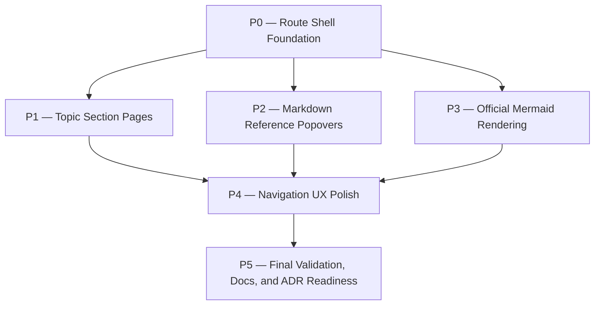

# dashboard-improvements Plan

## Source Artifacts

- `.plan/dashboard-improvements/proposal.md` — accepted proposal for route-owned dashboard navigation, themed Markdown evidence popovers, and complete Mermaid rendering.
- `.plan/dashboard-improvements/requirements.md` — topic-local requirements delta for navigation, active state, topic sections, reference popovers, Mermaid, safety, and validation.
- `.plan/dashboard-improvements/requirements.nodes.jsonl` / `.plan/dashboard-improvements/requirements.edges.jsonl` — machine-readable requirement, scenario, acceptance-check, and fold-target graph.
- `.plan/dashboard-improvements/design.md` — accepted design decisions for route-owned IA, browser-history state boundary, ReferencePopoverLink, official Mermaid renderer, and validation gates.
- `.plan/dashboard-improvements/design.nodes.jsonl` / `.plan/dashboard-improvements/design.edges.jsonl` — machine-readable design decisions, alternatives, components, risks, and traceability.
- `.plan/dashboard-improvements/map.nodes.jsonl` / `.plan/dashboard-improvements/map.edges.jsonl` — curated map of dashboard shell, routes, topic workspace, Markdown renderer, document viewer, graph explorer, theme tokens, tests, ADR-0005, and Mermaid dependency candidate.
- `.plan/dashboard-improvements/facts.nodes.jsonl` / `.plan/dashboard-improvements/facts.edges.jsonl` — source-backed facts [F001]–[F015].
- `.plan/dashboard-improvements/context-packs.jsonl` — proposal and requirements/design context packs.
- `.plan/dashboard-improvements/receipts.jsonl` — proposal approval, validation, auditor PASS, requirements/design validation, and transition receipts.
- `.plan/_index/project-graph.sqlite` and `.plan/_index/project-graph-manifest.json` — refreshed shared project index.

## Planning Assumptions

### Confirmed facts

- The dashboard shell currently stores `selectedTopicId` and `activeSection` in React state and scrolls `dashboard-section-*` anchors instead of routing primary sections [F001].
- Topic workspace content currently lives behind local tabs for proposal, plan, facts, evidence, receipts, health, and graph [F002].
- Markdown reference links currently use native `title` descriptions in `MarkdownPreview` [F003].
- The existing dashboard already has TanStack routes for `/` and `/topics/$topic`, router scroll restoration, and read-only shared API/model contracts [F005] [F012].
- TanStack Router supports typed route params/search navigation suitable for browser-history-backed pages [F006].
- `react-markdown` supports custom anchor/render components, so the current renderer can likely be retained unless Mermaid integration proves otherwise [F007].
- Existing Radix/Tailwind tooltip and popover theme tokens can support the desired themed reference hover/focus UI [F008] [F009].
- Mermaid's official registry covers many diagram families, and the official renderer exposes initialization/render APIs; security settings affect feature support [F013] [F014] [F015].
- ADR-0005 constrains dashboard changes to TanStack Start routes/server helpers and read-only TanStack DB/TanStack Query projections [F011].

### Accepted requirements and design decisions

- Route-owned pages are required for primary dashboard/topic navigation [REQ-DASH-NAV] [REQ-DASH-TOPIC-SECTIONS].
- Route params/search must own route-visible content state rather than component-only section/tab state [REQ-DASH-STATE].
- Markdown reference links must use themed hover/focus popovers instead of native title tooltips [REQ-MD-REF-POPOVER].
- Mermaid code fences must render through the official Mermaid renderer with support for all current diagram types/features [REQ-MD-MERMAID].
- Navigation, popovers, and Mermaid rendering must preserve read-only and private-safe behavior [REQ-DASH-SAFETY].
- Regression coverage must include routes/history, popovers, Mermaid corpus, safety, type checks, and build checks [REQ-DASH-VALIDATION].
- Accepted design nodes: `DD-ROUTE-IA`, `DD-ROUTE-STATE`, `DD-MD-REF-POPOVER`, `DD-MERMAID-OFFICIAL`, and `DD-VALIDATION-GATES`.

### Implementation assumptions

- The existing `DashboardShell`, `DashboardReviewWorkflow`, `TopicWorkspace`, `DocumentViewer`, `GraphExplorer`, and Markdown helpers should be reused/refactored rather than rewritten wholesale.
- Start with route/page ownership, then migrate secondary graph/document state to search/hash only where design marks it as content navigation.
- Prefer retaining `react-markdown`; swap Markdown libraries only if complete Mermaid support or safer integration cannot be met through the existing custom component path.
- Add the official `mermaid` package if it is not already declared, and keep dependency/lockfile changes isolated to the Mermaid phase.
- Tests that create planning artifacts must continue using temp/mock fixture roots.
- `adr_required: true` is carried forward. Implementation finalization must run `cartographer_adr` to create or explicitly skip the follow-up ADR covering route-owned navigation and Mermaid renderer/security choices.
- Requirement deltas must fold into `docs/requirements.md` after accepted implementation, or an approved requirements-fold-skip receipt must explain why folding is deferred.

### Retrieval probes used

1. Package/build probes: `package.json`, `dashboard:build`, `dashboard:check`, `test:browser`, `test:ts`, `lint:ts`, `typecheck`, and `check`.
2. Route probes: `dashboard/src/routes/__root.tsx`, `dashboard/src/routes/index.tsx`, `dashboard/src/routes/topics/$topic.tsx`, and `dashboard/src/router.tsx`.
3. Shell/workflow probes: `dashboard/src/App.tsx`, `dashboard/src/features/review-workflow.tsx`, and `dashboard/src/lib/dashboard-db.ts`.
4. Markdown/document probes: `dashboard/src/lib/markdown.tsx`, `dashboard/src/features/document-viewer.tsx`, `dashboard/src/lib/reference-resolver.ts`, and `dashboard/src/components/ui/tooltip.tsx`.
5. Graph/style probes: `dashboard/src/features/graph-explorer.tsx` and `dashboard/src/styles/globals.css`.
6. Test probes: `tests/dashboard/client-shell.test.tsx`, `tests/dashboard/topic-pages.test.tsx`, `tests/dashboard/markdown-viewer.test.tsx`, `tests/dashboard/graph-explorer.test.tsx`, and privacy/API dashboard tests.
7. Rationale probes: `.plan/dashboard-improvements/proposal.md`, requirements/design artifacts, and ADR-0005.

## Phase Dependency Graph

## Phase Summary

| Order | Phase ID | Phase | Depends On | Unlocks | Exit Criteria |
| ----: | -------- | ----- | ---------- | ------- | ------------- |
| 0 | P0 | Route Shell Foundation | none | P1, P2, P3 | Primary dashboard nav is route-owned, shared route descriptors exist, `/` and `/topics` surfaces render without scroll state. |
| 1 | P1 | Topic Section Pages | P0 | P4 | Topic proposal/plan/requirements/design/facts/evidence/receipts/health/graph pages are addressable and refresh-safe. |
| 2 | P2 | Markdown Reference Popovers | P0 | P4 | Markdown references use themed hover/focus popovers, preserve safe href/data attributes, and no longer rely on native reference titles. |
| 3 | P3 | Official Mermaid Rendering | P0 | P4 | Mermaid fences render through official Mermaid with feature-compatible security handling and registry representative tests. |
| 4 | P4 | Navigation UX Polish | P1, P2, P3 | P5 | Active route styling, breadcrumbs/labels, keyboard focus, responsive nav, loading/error states, and safety affordances are polished. |
| 5 | P5 | Final Validation, Docs, and ADR Readiness | P4 | implementation handoff complete | Full validation passes, requirements fold/skip is recorded, docs are updated, and ADR follow-through is ready. |

## Phases

### Phase P0 — Route Shell Foundation

- **Status:** complete
- **Depends on:** none
- **Unlocks:** P1, P2, P3
- **Primary references:** `file:dashboard/src/App.tsx`, `symbol:dashboard/src/App.tsx#DashboardShell:62`, `file:dashboard/src/routes/__root.tsx`, `file:dashboard/src/routes/index.tsx`, `file:dashboard/src/router.tsx`, `file:tests/dashboard/client-shell.test.tsx`, `REQ-DASH-NAV`, `REQ-DASH-STATE`, `DD-ROUTE-IA`, `DD-ROUTE-STATE`, `CMP-ROUTES`, `CMP-SHELL`, [F001], [F005], [F006], [F011], [F012]

#### Objective

Convert the dashboard shell from state-driven section scrolling to route-owned primary navigation while preserving the read-only Start/TanStack DB architecture.

#### Scope

- Define route/navigation descriptors for overview, topic index, topic default, and topic child pages.
- Move shared dashboard chrome toward a persistent route-aware shell that renders page content through routes/children instead of one giant review workflow.
- Replace sidebar section buttons and `scrollIntoView` behavior for primary navigation with TanStack `Link`/route matches.
- Preserve live status, read-only badge, skip link, focus classes, responsive layout, and collection-backed data hooks.
- Create or update tests for direct `/` and `/topics` navigation plus active nav derivation from route state.

#### Checklist

- [x] **P0.T1** Define shared route and nav descriptors for overview, topics, topic default, documents, facts, evidence, receipts, health, and graph.
- [x] **P0.T2** Refactor `DashboardShell` so primary active navigation derives from TanStack route matches instead of `activeSection` React state.
- [x] **P0.T3** Remove primary-navigation `scrollIntoView` behavior while preserving router scroll restoration for normal page navigation.
- [x] **P0.T4** Add a `/topics` page or equivalent route-owned topic index surface that reuses the existing topic list panel.
- [x] **P0.T5** Update shell/browser tests to verify direct routes, active nav state, and no dependence on the old section-scroll buttons.

#### Validation

- [x] **P0.V1** Run `npm run typecheck`; expect route and shell refactors to typecheck.
- [x] **P0.V2** Run `npm run test:browser -- tests/dashboard/client-shell.test.tsx`; expect direct route and active-nav behavior to pass.
- [x] **P0.V3** Run `npx vitest run tests/dashboard/topic-pages.test.tsx`; expect overview/topics panels to still render from reusable components.

#### Exit Criteria

- Primary dashboard navigation is route-owned for overview/topics surfaces.
- Active navigation no longer depends on `activeSection` or section anchor scrolling.
- Existing shell safety/accessibility affordances remain visible.

#### Risks and Mitigations

- **Risk:** shell refactor duplicates route metadata. **Mitigation:** centralize nav descriptors and reuse them in shell tests.
- **Risk:** Start route changes break SSR/browser tests. **Mitigation:** keep P0 focused on route shell only before splitting topic sections.

#### Notes for Execution Agent

Keep this phase small enough to review independently. Do not start Mermaid or popover work before the route shell is stable.

### Phase P1 — Topic Section Pages

- **Status:** complete
- **Depends on:** P0
- **Unlocks:** P4
- **Primary references:** `file:dashboard/src/features/review-workflow.tsx`, `symbol:dashboard/src/features/review-workflow.tsx#TopicWorkspace:132`, `file:dashboard/src/features/document-viewer.tsx`, `file:dashboard/src/features/graph-explorer.tsx`, `file:dashboard/src/lib/dashboard-db.ts`, `file:dashboard/src/lib/api.ts`, `file:dashboard/src/shared/models.ts`, `file:tests/dashboard/topic-pages.test.tsx`, `file:tests/dashboard/graph-explorer.test.tsx`, `REQ-DASH-TOPIC-SECTIONS`, `REQ-DASH-STATE`, `REQ-DASH-SAFETY`, `DD-ROUTE-IA`, `DD-ROUTE-STATE`, [F002], [F004], [F005], [F006], [F012]

#### Objective

Replace the local topic workspace tab model with addressable topic section pages while preserving reusable panels and read-only data contracts.

#### Scope

- Extract reusable topic page frame/context from `TopicWorkspace` so each page can render one major review surface.
- Add topic document routes for proposal, requirements, design, plan, and missing-document states.
- Add topic fact/source, evidence, receipts, health, and graph pages backed by existing artifacts and collection hooks.
- Ensure `/topics/$topic` has deterministic default behavior and missing-topic/missing-artifact states.
- Keep document preview/source mode local unless implementation explicitly marks it as route-visible content navigation.
- Keep graph filter/search/selected-node URL ownership as a deferred secondary step unless needed for route tests.

#### Checklist

- [x] **P1.T1** Extract topic page frame/context helpers from `TopicWorkspace` without changing artifact loading semantics.
- [x] **P1.T2** Add `/topics/$topic/documents/$kind` route handling proposal, requirements, design, plan, missing documents, and safe document viewer behavior.
- [x] **P1.T3** Add `/topics/$topic/facts`, `/evidence`, `/receipts`, and `/health` pages reusing existing record/health panels.
- [x] **P1.T4** Add `/topics/$topic/graph` page reusing `GraphExplorer` and preserving static fallback behavior.
- [x] **P1.T5** Update topic links, topic list actions, and document/reference route targets so they navigate through browser history.

#### Validation

- [x] **P1.V1** Run `npx vitest run tests/dashboard/topic-pages.test.tsx tests/dashboard/graph-explorer.test.tsx`; expect routed topic surfaces and graph integration to pass.
- [x] **P1.V2** Run `npm run test:browser -- tests/dashboard/client-shell.test.tsx`; expect deep links, refresh-safe topic pages, and active route state to pass.
- [x] **P1.V3** Run `npx vitest run tests/dashboard/privacy-regressions.test.tsx`; expect route params and document routes to preserve safety checks.

#### Exit Criteria

- Every major topic review surface has a direct route and sensible empty/missing state.
- Refreshing a topic section route restores the same topic and surface.
- Topic navigation no longer requires scrolling through overview or unrelated topic panels.

#### Risks and Mitigations

- **Risk:** many route files duplicate panel boilerplate. **Mitigation:** use shared `TopicPageFrame` and route descriptors.
- **Risk:** missing-artifact behavior regresses. **Mitigation:** keep `DocumentViewer` empty/blocked states and add route tests.

#### Notes for Execution Agent

Preserve existing data contracts in `dashboard/src/shared/models.ts` and `dashboard/src/lib/api.ts`; do not invent new server endpoints unless a route cannot be backed by current topic artifacts.

### Phase P2 — Markdown Reference Popovers

- **Status:** complete
- **Depends on:** P0
- **Unlocks:** P4
- **Primary references:** `file:dashboard/src/lib/markdown.tsx`, `symbol:dashboard/src/lib/markdown.tsx#MarkdownPreview:200`, `file:dashboard/src/lib/reference-resolver.ts`, `file:dashboard/src/features/document-viewer.tsx`, `file:dashboard/src/components/ui/tooltip.tsx`, `file:dashboard/src/styles/globals.css`, `file:tests/dashboard/markdown-viewer.test.tsx`, `REQ-MD-REF-POPOVER`, `REQ-DASH-SAFETY`, `DD-MD-REF-POPOVER`, `CMP-REFERENCE-POPOVER`, [F003], [F007], [F008], [F009], [F010]

#### Objective

Replace native reference `title` tooltips with themed, keyboard-accessible Markdown reference popovers while preserving safe links and existing resolver behavior.

#### Scope

- Introduce a `ReferencePopoverLink` component or equivalent inside the Markdown anchor override path.
- Apply the popover only to Cartographer reference links; ordinary local/external/mail links keep existing safe behavior.
- Preserve `href`, `target`, `rel`, `data-reference`, `data-reference-status`, and `data-reference-kind` attributes.
- Remove native reference-description `title` attributes from rendered reference anchors.
- Show resolved/missing reference context: label, status, source label, safe path/href, and missing-reference message.
- Use existing themed Tooltip/popover primitives first; add a new Hover Card/Popover dependency only if tests prove existing primitives cannot satisfy hover/focus content requirements.

#### Checklist

- [x] **P2.T1** Add `ReferencePopoverLink` and route reference-specific anchor rendering through it.
- [x] **P2.T2** Remove native `title` reference descriptions while preserving data attributes and safe href behavior.
- [x] **P2.T3** Add themed popover content for resolved, missing, external, and local-file reference states.
- [x] **P2.T4** Verify keyboard focus, hover behavior, portal/clipping behavior, and screen-reader text.
- [x] **P2.T5** Update Markdown/document tests for resolved/missing references, blocked paths, ordinary links, and no native reference titles.

#### Validation

- [x] **P2.V1** Run `npx vitest run tests/dashboard/markdown-viewer.test.tsx`; expect popover/reference rendering tests to pass.
- [x] **P2.V2** Run `npx vitest run tests/dashboard/privacy-regressions.test.tsx`; expect reference safety regressions to remain blocked.
- [x] **P2.V3** Run `npm run typecheck`; expect Markdown component and popover types to pass.

#### Exit Criteria

- Reference descriptions are themed popovers, not browser-native title tooltips.
- Keyboard and hover users can inspect reference context.
- Reference hrefs and safety boundaries remain unchanged.

#### Risks and Mitigations

- **Risk:** popover content clips inside Markdown preview containment. **Mitigation:** use portal-backed primitives and test inside `DocumentViewer`.
- **Risk:** removing `title` reduces accessible text. **Mitigation:** preserve screen-reader context and focus-open behavior.

#### Notes for Execution Agent

Do not broaden Markdown link permissions while adding popovers.

### Phase P3 — Official Mermaid Rendering

- **Status:** pending
- **Depends on:** P0
- **Unlocks:** P4
- **Primary references:** `file:dashboard/src/lib/markdown.tsx`, `file:dashboard/src/features/document-viewer.tsx`, `file:dashboard/src/styles/globals.css`, `file:tests/dashboard/markdown-viewer.test.tsx`, `dependency:npm:mermaid`, `package.json`, `REQ-MD-MERMAID`, `REQ-DASH-SAFETY`, `DD-MERMAID-OFFICIAL`, `CMP-MERMAID-DIAGRAM`, `CMP-TEST-CORPUS`, `RISK-MERMAID-SECURITY`, [F013], [F014], [F015]

#### Objective

Render Mermaid code fences correctly through the official Mermaid renderer with support for all current Mermaid diagram types and features while preserving dashboard safety.

#### Scope

- Add/declare the official `mermaid` dependency and lockfile update if not already present.
- Add a lazy/client-safe `MermaidDiagram` component for `language-mermaid` code fences.
- Configure Mermaid initialization, theme variables, responsive SVG output, and per-diagram loading/error states.
- Keep Shiki/plain rendering for non-Mermaid code fences and SSR fallback.
- Define and implement feature-compatible security/isolation behavior for Mermaid links, HTML labels, and other documented features without allowing arbitrary dashboard mutation.
- Add representative Mermaid corpus tests for current diagram families: C4, flowchart, ER, git graph, gantt, info, pie, quadrant, xy chart, requirement, sequence, class, state, journey, timeline, mindmap, kanban, sankey, packet, radar, block, architecture, and treemap.

#### Checklist

- [ ] **P3.T1** Add the official `mermaid` package and any required type/import configuration.
- [ ] **P3.T2** Implement `MermaidDiagram` with lazy import, stable unique render IDs, theme configuration, loading state, and error fallback.
- [ ] **P3.T3** Route `language-mermaid` fences from `MarkdownPreview` to `MermaidDiagram` while preserving existing Shiki behavior for other code fences.
- [ ] **P3.T4** Implement the selected Mermaid security/isolation policy and safe link behavior.
- [ ] **P3.T5** Add a representative Mermaid diagram corpus and tests for valid rendering plus invalid-diagram fallback.

#### Validation

- [ ] **P3.V1** Run `npx vitest run tests/dashboard/markdown-viewer.test.tsx`; expect Mermaid and existing Markdown tests to pass.
- [ ] **P3.V2** Run `npx vitest run tests/dashboard/mermaid-renderer.test.tsx`; expect representative Mermaid registry corpus coverage to pass if this new test file is created.
- [ ] **P3.V3** Run `npm run dashboard:build`; expect the Start build to handle lazy Mermaid rendering without server-side Mermaid failures.
- [ ] **P3.V4** Run `npx vitest run tests/dashboard/privacy-regressions.test.tsx`; expect Mermaid content to preserve safety constraints.

#### Exit Criteria

- Mermaid fences render with official Mermaid rather than a subset parser.
- Representative current Mermaid diagram families are covered by tests.
- Invalid Mermaid source has a clear per-diagram error state and does not break document rendering.
- Mermaid security/feature behavior is explicit and tested.

#### Risks and Mitigations

- **Risk:** Mermaid increases bundle weight or SSR failures. **Mitigation:** lazy import on the client and keep SSR fallback.
- **Risk:** Mermaid feature support conflicts with safety. **Mitigation:** isolate Mermaid rendering and test links/HTML labels/safety behavior explicitly.
- **Risk:** Mermaid registry changes over time. **Mitigation:** document the corpus and make updates intentional when upgrading Mermaid.

#### Notes for Execution Agent

Use current Mermaid docs during implementation. Do not implement a hand-written Mermaid parser or flowchart-only shortcut.

### Phase P4 — Navigation UX Polish

- **Status:** pending
- **Depends on:** P1, P2, P3
- **Unlocks:** P5
- **Primary references:** `file:dashboard/src/App.tsx`, `file:dashboard/src/features/review-workflow.tsx`, `file:dashboard/src/features/document-viewer.tsx`, `file:dashboard/src/features/graph-explorer.tsx`, `file:dashboard/src/styles/globals.css`, `file:tests/dashboard/client-shell.test.tsx`, `REQ-DASH-VALIDATION`, `REQ-DASH-SAFETY`, `DD-VALIDATION-GATES`, `CMP-SHELL`, `CMP-REFERENCE-POPOVER`, `CMP-MERMAID-DIAGRAM`, [F009], [F010], [F011]

#### Objective

Polish the now-routed dashboard so navigation feels coherent, accessible, responsive, and safe after the functional route/Markdown/Mermaid phases land.

#### Scope

- Add/adjust page headings, breadcrumbs or page labels, active route indicators, and selected topic context.
- Verify keyboard order, focus rings, skip link behavior, popover focus behavior, responsive sidebar/topic navigation, graph static fallback, and reduced-motion behavior.
- Improve loading, API failure, missing-artifact, Mermaid error, and blocked-path states.
- Ensure route pages retain the dark tactile dashboard theme and readable Markdown/code surfaces.
- Avoid adding write affordances or dashboard mutation controls.

#### Checklist

- [ ] **P4.T1** Add route-aware headings, breadcrumbs/page labels, and active nav indicators across overview, topics, topic pages, and graph.
- [ ] **P4.T2** Verify and adjust keyboard focus order, skip link target, popover focus behavior, and responsive nav layout.
- [ ] **P4.T3** Improve loading/error/missing-artifact/Mermaid-error/blocked-path states with consistent cards and badges.
- [ ] **P4.T4** Review Markdown/code/diagram visual styling for dark/light tokens, overflow, and responsive behavior.
- [ ] **P4.T5** Update client-shell and topic-page tests to assert route-visible UX rather than old tab/scroll behavior.

#### Validation

- [ ] **P4.V1** Run `npm run test:browser -- tests/dashboard/client-shell.test.tsx`; expect keyboard, route active state, and responsive shell assertions to pass.
- [ ] **P4.V2** Run `npx vitest run tests/dashboard/topic-pages.test.tsx tests/dashboard/graph-explorer.test.tsx`; expect page labels, graph fallback, and topic panels to pass.
- [ ] **P4.V3** Run `npx vitest run tests/dashboard/markdown-viewer.test.tsx`; expect popover/Mermaid visual state assertions to pass.

#### Exit Criteria

- Routed dashboard pages are discoverable, visually coherent, keyboard-accessible, and responsive.
- Error/missing/blocked states remain clear and read-only.
- Tests reflect the new route-owned UX.

#### Risks and Mitigations

- **Risk:** polish expands scope into unrelated redesign. **Mitigation:** limit changes to navigation clarity, accessibility, responsive behavior, and surfaces touched by previous phases.
- **Risk:** route UX tests are brittle. **Mitigation:** assert stable data attributes and user-visible labels rather than internal component structure.

#### Notes for Execution Agent

Do not defer safety messaging or focus behavior; these are part of the user-friendly navigation requirement.

### Phase P5 — Final Validation, Docs, and ADR Readiness

- **Status:** pending
- **Depends on:** P4
- **Unlocks:** implementation handoff complete
- **Primary references:** `package.json`, `file:tests/dashboard/client-shell.test.tsx`, `file:tests/dashboard/markdown-viewer.test.tsx`, `file:tests/dashboard/topic-pages.test.tsx`, `file:tests/dashboard/graph-explorer.test.tsx`, `doc:docs/adr/0005-use-tanstack-start-and-tanstack-db-for-the-cartographer-dashboard.md`, `docs/requirements.md#REQ-DASH-NAV`, `docs/requirements.md#REQ-DASH-STATE`, `docs/requirements.md#REQ-DASH-TOPIC-SECTIONS`, `docs/requirements.md#REQ-MD-REF-POPOVER`, `docs/requirements.md#REQ-MD-MERMAID`, `docs/requirements.md#REQ-DASH-SAFETY`, `docs/requirements.md#REQ-DASH-VALIDATION`, `REQ-DASH-VALIDATION`, `DD-VALIDATION-GATES`, [F010], [F011], [F013], [F015]

#### Objective

Run final validation, update documentation/requirements traces, and prepare ADR follow-through for accepted implementation.

#### Scope

- Run focused and full validation commands after all code phases complete.
- Update dashboard usage/development docs if route shapes, Mermaid support, or test commands changed.
- Fold accepted topic-local requirements into `docs/requirements.md` using deterministic requirements tooling, or record an approved fold-skip receipt.
- Prepare a follow-up ADR or explicit ADR skip rationale for route-owned dashboard navigation, Mermaid renderer/security choices, and relationship to ADR-0005.
- Verify no raw private input references, unsafe file paths, or write paths were introduced.

#### Checklist

- [ ] **P5.T1** Run and record focused route, topic page, Markdown popover, Mermaid corpus, graph, and privacy tests.
- [ ] **P5.T2** Run and record typecheck, lint, dashboard build, dashboard check, and full project check as appropriate for the changed files.
- [ ] **P5.T3** Update README/dashboard docs or skill docs if route/deep-link/Mermaid behavior changes user-facing usage.
- [ ] **P5.T4** Fold accepted requirements into `docs/requirements.md` or record an approved requirements-fold-skip receipt.
- [ ] **P5.T5** Prepare ADR content or explicit ADR skip rationale covering route-owned navigation and Mermaid security/renderer decisions.

#### Validation

- [ ] **P5.V1** Run `npm run typecheck`; expect no TypeScript errors.
- [ ] **P5.V2** Run `npm run lint:ts`; expect dashboard/source/test linting to pass.
- [ ] **P5.V3** Run `npm run dashboard:build`; expect Start dashboard production build to pass.
- [ ] **P5.V4** Run `npm run test:browser -- tests/dashboard/client-shell.test.tsx`; expect browser shell route behavior to pass.
- [ ] **P5.V5** Run `npx vitest run tests/dashboard/topic-pages.test.tsx tests/dashboard/markdown-viewer.test.tsx tests/dashboard/graph-explorer.test.tsx tests/dashboard/privacy-regressions.test.tsx`; expect routed pages, popovers, Mermaid, graph, and safety tests to pass.
- [ ] **P5.V6** Run `npm run check`; expect full repository validation to pass before final implementation handoff.

#### Exit Criteria

- Focused and full validations pass or have explicit approved fallback receipts.
- Requirements fold or fold-skip is recorded.
- ADR generation inputs are ready for implementation finalization.
- The dashboard remains read-only, private-safe, and aligned with ADR-0005.

#### Risks and Mitigations

- **Risk:** full `npm run check` is slow or exposes unrelated failures. **Mitigation:** run focused checks first, then record any unrelated pre-existing failures separately.
- **Risk:** requirements fold conflicts with existing durable requirements. **Mitigation:** use deterministic requirements tooling and stop for review on duplicate IDs or fold errors.
- **Risk:** ADR is forgotten after implementation. **Mitigation:** preserve `adr_required: true` in handoff guidance and finalization checks.

#### Notes for Execution Agent

This phase is not complete until validation evidence, requirement fold/skip, and ADR follow-through are ready for final implementation review.

## Cross-Phase Validation

- Validate topic JSONL after plan generation: `node --experimental-strip-types skills/plan/scripts/manage_jsonl.ts validate-topic --root "$PWD" --topic dashboard-improvements --json`.
- Validate planning graph after plan generation: `python skills/plan/scripts/validate_planning_graph.py --root "$PWD" --topic dashboard-improvements --json`.
- During implementation, each phase should run its own listed validation before phase audit.
- Final implementation should run `npm run check` unless a narrower, approved fallback receipt documents why full validation cannot run.
- Final implementation must run requirements fold or record an approved fold-skip receipt.
- Final implementation must run `cartographer_adr` for the required dashboard navigation/Mermaid ADR, or record an explicit approved ADR skip rationale.

## Open Questions

None blocking for implementation planning. The design already selects route-owned pages and official Mermaid rendering. Implementation may still make bounded engineering choices about exact topic default route behavior, Tooltip versus Hover Card primitive, graph search-param granularity, and Mermaid isolation details as long as requirements remain satisfied.

## Handoff Guidance

- Execute phases in dependency order. P2 and P3 may proceed after P0 independently of P1 if a single parent writer can avoid file conflicts, but P4 must wait for P1–P3.
- Preserve requirements/design IDs in commits, tests, receipts, and phase audit notes.
- Do not introduce write endpoints or artifact mutation UI.
- Do not weaken path safety, Markdown link safety, or raw private-input blocking while adding routes, popovers, or Mermaid.
- Use official docs for TanStack Router/Start and Mermaid during implementation; avoid relying on stale API assumptions.
- If Mermaid security behavior cannot support all current features safely, stop and ask for a scoped product/security decision before narrowing support.
- Keep `package-lock.json` changes limited to intentional dependency updates, notably Mermaid or an explicitly chosen popover primitive.
- Implementation finalization must handle `adr_required: true` and requirement folding before marking the topic implemented.
