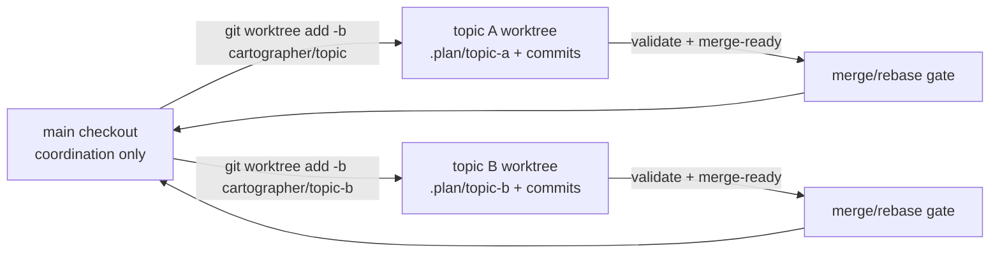

# git-worktrees Proposal

## Description

Add an optional Cartographer **worktree mode** so each feature topic can run the full proposal → plan → implement workflow in its own long-lived Git worktree and topic branch. The main checkout remains the coordination/integration branch, while topic worktrees carry their own `.plan/<topic>` rationale artifacts, phase commits, validation receipts, and source changes until they are ready to merge back to main [F007] [F008] [F011].

## Problem Statement

Cartographer currently assumes a single active checkout for most workflow guidance. That is safe for one topic, but it blocks or complicates parallel feature work: agents must avoid concurrent writes to the same worktree, users must switch/stash branches between topics, and generated `.plan/_index` caches can be confused with durable topic artifacts if the branch model is unclear [F005] [F010]. The project needs an explicit operating model and lightweight automation for multiple topic branches to proceed at once without violating Cartographer's single-writer safety rules.

## Goals

- Define a clear **one topic → one branch → one worktree** convention for long-lived Cartographer feature work [F001] [F003].
- Let multiple topic worktrees be planned and implemented concurrently while preserving one writer per worktree [F005] [F011].
- Add deterministic preflight/status/merge-readiness checks that make Git branch, worktree path, base commit, dirty state, and ignored cache state visible before worker handoff and before merge [F002] [F009] [F010].
- Keep `.plan/<topic>` proposal/plan/map/fact/receipt artifacts commit-worthy on the topic branch while regenerating ignored `.plan/_index` caches independently in each worktree [F008] [F010].
- Update README and Cartographer skill guidance so proposal, plan, implement, pathfinder, and auditor handoffs all understand worktree mode.

## Non-Goals

- Do not auto-merge topic branches into main without explicit user approval.
- Do not replace pi-subagents' temporary `worktree: true` isolation for parallel child tasks; this proposal addresses durable Cartographer topic branches, while subagent worktrees remain useful for short-lived isolated fanout [F006].
- Do not share or commit generated `.plan/_index` SQLite/cache artifacts across worktrees [F010].
- Do not require every Cartographer workflow to use worktrees; single-topic/single-checkout workflows should keep working.
- Do not build a full project-management dashboard for all worktrees in this proposal.

## Background

Git worktrees are a direct fit for this request. `git worktree add` creates a linked working tree that shares repository storage but has separate per-worktree files such as `HEAD` and the index [F001]. Git also exposes `git worktree list` state for paths, commits, branches, and locked/prunable annotations [F002], and official Git documentation describes multiple working trees as a way to have more than one branch checked out at a time [F004]. Because Git treats a branch already checked out elsewhere as a special case, the durable Cartographer model should require a unique branch for each topic worktree [F003].

The same safety principle already appears in pi-subagents guidance: async does not make parallel writes safe, and writers should not modify the same active worktree unless they are deliberately isolated [F005]. pi-subagents can create temporary worktrees for parallel tasks with `worktree: true` [F006], but Cartographer topics need longer-lived branches that persist proposal, plan, receipt, and phase-commit history until review/merge.

Cartographer already has most of the necessary workflow pieces. It produces proposal, plan, and implementation artifacts [F007], treats topic `.plan/<topic>` files as commit-worthy rationale [F008], and the implement skill already checks git status, records branch/SHA, avoids unrelated changes, and commits completed phases [F009]. The main gap is making the branch/worktree boundary first-class across docs, skills, helper scripts, and validation.

## Viability

This is viable with moderate implementation effort and low dependency risk. Git provides the required worktree primitives [F001] [F002] [F004], and Cartographer's existing git safety gates can be extended rather than replaced [F009]. The lowest-risk path is to start with documented conventions plus a small standard-library Python helper that shells out to Git for create/status/merge-readiness checks, then optionally wrap that helper in `cartographer-tools.ts` if tool access is valuable [F010].

The hard parts are operational rather than technical: preventing duplicate topic branches, keeping generated indexes out of commits, handling merge conflicts when concurrent topics touch the same source files, and ensuring workers never edit the wrong checkout. These risks are manageable through deterministic preflight checks, explicit stop rules, and final merge-readiness receipts.

## ADR Metadata

- `adr_required`: true
- `adr_reason`: This is a cross-cutting workflow/branching policy that affects proposal, plan, implementation, subagent handoffs, validation receipts, and merge/finalization behavior.
- `adr_options_status`: proposed-options-in-design
- `adr_tool_mode`: evaluate-only
- `adr_evaluation_summary`: `cartographer_adr evaluate` recommended generating an ADR at the end of validated work.

## Design

### Define the Worktree Operating Model

Establish a project-wide convention: the main checkout is for coordination and integration, and each active feature topic gets a unique branch and linked worktree.



| Concern | Proposed convention | Rationale |
|---|---|---|
| Branch name | `cartographer/<topic>` or project-configured prefix | Unique topic branches avoid duplicate checkout conflicts [F003]. |
| Worktree path | Sibling directory such as `../<repo>-worktrees/<topic>` | Keeps linked worktrees out of the source tree and indexing scope. |
| Durable artifacts | Commit `.plan/<topic>/...` on the topic branch | Topic rationale should merge with the code it explains [F008]. |
| Generated artifacts | Regenerate `.plan/_index` per worktree; never commit it | Index caches are ignored and checkout-local [F010]. |
| Writers | One active writer per topic worktree | Preserves subagent and Cartographer single-writer safety [F005]. |
| Integration | User-approved merge/rebase back to main after validation | Avoids silent cross-topic conflict resolution. |

Example operator flow:

```bash
# From the main checkout, after choosing topic slug "offline-search"
git worktree add -b cartographer/offline-search ../pi-cartographer-worktrees/offline-search main
cd ../pi-cartographer-worktrees/offline-search

# Run Cartographer normally inside the topic checkout
/skill:proposal offline search
/skill:plan offline search
/skill:implement offline search

# Before integration
git fetch --all --prune
git rebase main
npm run check
# merge to main only after user review/approval
```

### Add a Deterministic Worktree Helper

Add `skills/plan/scripts/worktree_workflow.py` as a small standard-library helper, with tests in temporary Git repositories:

- `status --json`: parse `git worktree list --porcelain`, report worktree path, branch, commit, dirty state, topic artifact presence, and whether `.plan/_index` is ignored.
- `create --topic <topic> --base <branch> [--path <path>] [--branch <branch>] --json`: validate the topic slug, require a clean source checkout, reject existing checked-out branches, create a sibling worktree, and print next-step commands.
- `merge-ready --topic <topic> --base <branch> --json`: verify clean worktree state, topic branch ancestry/ahead status, absence of staged `.plan/_index`/`.plan/_private`, completed plan/receipts when present, and declared validation commands.
- `cleanup --topic <topic> --json`: remove or prune a worktree only after explicit confirmation that the topic branch was merged or intentionally abandoned.

Keep the helper CLI-first at first. If later needed, add a `cartographer_worktree` extension wrapper in `extensions/cartographer-tools.ts`; the current proposal should not force every agent to depend on a new tool before the CLI behavior is proven.

### Update Cartographer Skills and Agent Handoffs

Update these workflow files from the curated map:

- `skills/proposal/SKILL.md`: when a user asks for parallel/topic worktree mode, run or recommend worktree creation before initializing `.plan/<topic>` artifacts. If already inside a topic worktree, record branch/path/base commit in `context-packs.jsonl`.
- `skills/plan/SKILL.md`: include worktree assumptions in `## Planning Assumptions`, add merge-readiness validation items where appropriate, and preserve branch/path metadata in plan graph nodes.
- `skills/implement/SKILL.md`: extend the repository safety preflight to detect worktree mode, require a non-main topic branch unless the user explicitly opts out, record branch/SHA/worktree path in receipts, pass the topic worktree path to `cartographer-pathfinder`, and require `merge-ready` before final response.
- `.pi/agents/cartographer-pathfinder.md`: ensure worker handoffs include topic branch, worktree path, and stop rules forbidding edits outside the active worktree.
- `.pi/agents/cartographer-auditor.md`: ask auditors to inspect deterministic validation and merge-readiness receipts before approving final topic completion.
- `README.md`: add a user-facing "Parallel topic worktrees" section with create/status/implement/merge/cleanup examples.

### Preserve Artifact Boundaries Per Worktree

In worktree mode, each topic branch owns only its topic artifacts and code changes:

- Commit: `.plan/<topic>/proposal.md`, map/fact JSONL, `plan.md`, plan graph JSONL, receipts/context packs when useful, source/docs/tests changed by the topic.
- Do not commit: `.plan/_index/`, `.plan/_private/`, temporary run logs, local worktree directories, or generated caches [F010].
- On merge conflicts, prefer ordinary Git conflict resolution plus rerunning `cartographer_index ensure` in the merged checkout; do not try to merge SQLite index files.

### Validate with Temporary Repositories and Existing Quality Gates

Testing should follow the project rule that tests never mutate the real repository `.plan/` directory. Use `tempfile`/temporary Git repositories for helper tests and synthetic `.plan/<topic>` layouts.

Proposed validation coverage:

- Python tests for `worktree_workflow.py create/status/merge-ready/cleanup` in temp repos.
- Docs tests in `tests/test_workflow_docs.py` asserting proposal, plan, implement, and README guidance mention worktree mode and single-writer constraints.
- Extension tests only if a `cartographer_worktree` tool wrapper is added.
- Final project gate: `npm run check` from `package.json`.

### Oracle Check Notes

The recommended scope is not docs-only: documentation alone would leave agents without deterministic branch/path/dirty-state evidence. It also should not start with a large dashboard/tooling surface. The best first increment is docs + skill preflights + a small helper CLI, with an optional extension wrapper deferred until the CLI contract is stable.
