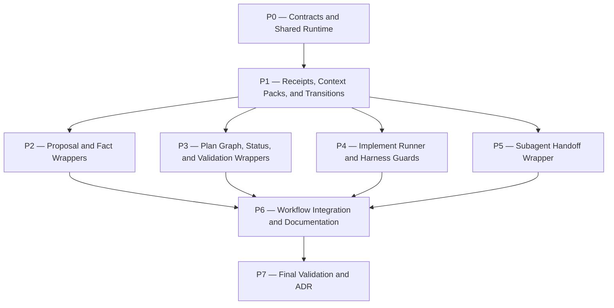

# harness-implement-loop Plan

## Source Artifacts

- Proposal: `.plan/harness-implement-loop/proposal.md`
- Context pack: `.plan/harness-implement-loop/context-packs.jsonl` (`context:harness-implement-loop:proposal`)
- Map graph: `.plan/harness-implement-loop/map.nodes.jsonl`, `.plan/harness-implement-loop/map.edges.jsonl`
- Fact graph: `.plan/harness-implement-loop/facts.nodes.jsonl`, `.plan/harness-implement-loop/facts.edges.jsonl`
- Evidence: `.plan/harness-implement-loop/evidence/tanstack-dashboard-session-analysis.md`
- Receipts: `.plan/harness-implement-loop/receipts.jsonl`
- Primary implementation files expected to change:
  - `extensions/cartographer-tools.ts`
  - `skills/plan/scripts/cartographer_state.ts`
  - new helper scripts under `skills/plan/scripts/`
  - tests under `tests/`
  - `skills/proposal/SKILL.md`, `skills/plan/SKILL.md`, `skills/implement/SKILL.md`
  - `README.md`, `AGENTS.md`
  - possibly `docs/adr/`

## Planning Assumptions

- The proposal has explicit user approval recorded in `receipt:harness-implement-loop:proposal-approved:2026-06-11T04:00:00Z`.
- `.plan/<topic>/plan.md`, plan JSONL, receipts, and context packs remain authoritative; `.cartographer/` remains execution/resume state only [F005][F015].
- The core architecture principle is that skills describe workflow intent and UX, while deterministic tools/scripts own state transitions, artifact writes, validation gates, subagent handoffs, and finalization checks [F018].
- Existing low-level primitives should be reused rather than replaced: `cartographer_state`, `cartographer_index`, `cartographer_jsonl`, `cartographer_validation`, `cartographer_evidence`, and `cartographer_adr` [F007][F018].
- Human approval remains in the loop but becomes explicit and receipted through `cartographer_transition approve`, with deterministic approver identity resolution [F029][F030].
- The first implementation should enforce deterministic control planes and gates, not fully automate code edits or autonomous commits [F015].
- ADR finalization is required because this changes cross-cutting workflow architecture and amends the practical enforcement model of ADR-0004.

## Phase Dependency Graph

## Phase Summary

| Order | Phase ID | Phase | Depends On | Unlocks | Exit Criteria |
| ----: | -------- | ----- | ---------- | ------- | ------------- |
| 0 | P0 | Contracts and Shared Runtime | none | P1 | Shared types/helpers for lifecycle states, approver resolution, atomic artifact updates, and test fixtures exist. |
| 1 | P1 | Receipts, Context Packs, and Transitions | P0 | P2, P3, P4, P5 | Generic receipts, context packs, and lifecycle transition gates are deterministic, validated, and tested. |
| 2 | P2 | Proposal and Fact Wrappers | P1 | P6 | Proposal init/finalize, fact/source/support wrappers, and ADR metadata sync work under temp roots. |
| 3 | P3 | Plan Graph, Status, and Validation Wrappers | P1 | P6 | Plan graph generation/finalize, status sync, and validation-item completion are atomic and tested. |
| 4 | P4 | Implement Runner and Harness Guards | P1 | P6 | Implementation start/step/record/compact/finalize gates enforce state, working set, pending-phase guard, and compaction/resume. |
| 5 | P5 | Subagent Handoff Wrapper | P1 | P6 | Auditor/compass handoffs produce deterministic PASS/FAIL/decision captures, receipts, retries, and dependency evaluation evidence. |
| 6 | P6 | Workflow Integration and Documentation | P2, P3, P4, P5 | P7 | Skills/docs route users through wrappers and tests assert wrapper-first, human-approved lifecycle behavior. |
| 7 | P7 | Final Validation and ADR | P6 | none | Full checks pass, proposal/plan graph validate, auditor PASS exists, and ADR records the deterministic workflow enforcement decision. |

## Phases

### Phase P0 — Contracts and Shared Runtime

- **Status:** complete
- **Depends on:** none
- **Unlocks:** P1
- **Primary references:** `file:extensions/cartographer-tools.ts`, `file:skills/plan/scripts/cartographer_state.ts`, `file:tests/cartographer_state.test.ts`, [F007], [F018], [F028], [F029], [F030], [C001]

#### Objective

Create shared contracts and helper utilities for deterministic workflow wrappers before adding user-facing tools.

#### Scope

- Define lifecycle state and transition types for proposal, plan, implementation, phase, and final implementation gates.
- Define shared receipt/context-pack/approval metadata helpers.
- Define approver identity resolution from explicit CLI/tool input, `.cartographer/config.toml`, `git config user.name`, then system username [F030].
- Add temp-root fixtures that include `.plan`, `.cartographer`, receipts, context packs, and minimal plan/proposal artifacts.

#### Checklist

- [x] **P0.T1** Add shared TypeScript types/constants for lifecycle states, transition gates, gate prerequisites, receipt kinds, and approval metadata.
- [x] **P0.T2** Add a small approver resolver that reads optional gitignored `.cartographer/config.toml`, falls back to `git config user.name`, then system username, and rejects secret-like values.
- [x] **P0.T3** Add atomic JSON/JSONL update helpers or reuse existing helpers consistently for wrapper scripts.
- [x] **P0.T4** Add temp-root fixture builders for proposal, plan, implementation, and approval-gate scenarios.
- [x] **P0.T5** Ensure `.cartographer/config.toml` is gitignored without ignoring `.cartographer/<topic>/state.json` or `journal.jsonl`.

#### Validation

- [x] **P0.V1** Run targeted TS tests for approver resolution and transition contract validation.
- [x] **P0.V2** Run `npm run check:scripts`; expected result is all scripts parse.
- [x] **P0.V3** Verify tests create `.plan/` and `.cartographer/` only under temp roots, not repository artifacts [C001].

#### Exit Criteria

Shared contracts are available to all wrapper scripts and tests can build realistic temporary Cartographer projects.

#### Risks and Mitigations

- **Risk:** Shared contracts become another source of truth. **Mitigation:** represent lifecycle gates and metadata only; keep `.plan` and existing JSONL artifacts authoritative [F005][F015].

#### Notes for Execution Agent

Keep this phase boring. Avoid implementing all wrappers here; focus on common types and fixtures that prevent divergent behavior later.

### Phase P1 — Receipts, Context Packs, and Transitions

- **Status:** pending
- **Depends on:** P0
- **Unlocks:** P2, P3, P4, P5
- **Primary references:** `file:extensions/cartographer-tools.ts`, `file:skills/plan/scripts/validation_runner.py`, `file:skills/plan/scripts/manage_jsonl.ts`, [F022], [F025], [F028], [F029], [F030]

#### Objective

Implement the foundational deterministic gate artifacts: generic receipts, context packs, and lifecycle transitions.

#### Scope

- Add `cartographer_receipt append` for non-validation receipts.
- Add `cartographer_context_pack create/update` for bounded context-pack records.
- Add `cartographer_transition status/request-approval/approve/reject/advance`.
- Register wrappers in `extensions/cartographer-tools.ts`.

#### Checklist

- [ ] **P1.T1** Implement schema-checked `cartographer_receipt append` for fallback, timeout, audit, compass, phase, output-capture, approval, rejection, transition, no-op, legacy-bypass, and residual-risk receipts [F025].
- [ ] **P1.T2** Implement `cartographer_context_pack create/update` using bounded summaries, verified artifact paths, receipt IDs, phase/gate metadata, and Clean Context output shaping [F022].
- [ ] **P1.T3** Implement `cartographer_transition status` to report lifecycle state, blocking prerequisites, missing receipts/context packs, pending human approvals, and next allowed commands [F028].
- [ ] **P1.T4** Implement `cartographer_transition request-approval` to verify deterministic prerequisites, write/update context pack, append ready-for-human-review receipt, and stop [F029].
- [ ] **P1.T5** Implement `cartographer_transition approve/reject` with deterministic approver resolution, auditable approval/rejection receipts, lifecycle advancement/blocking, and residual-risk capture [F029][F030].
- [ ] **P1.T6** Implement `cartographer_transition advance` for machine-only transitions whose deterministic prerequisites are satisfied and no human approval is required.
- [ ] **P1.T7** Register `cartographer_receipt`, `cartographer_context_pack`, and `cartographer_transition` extension tools with compact output and next-action guidance.

#### Validation

- [ ] **P1.V1** Run wrapper tests proving transition gates block without required receipts/context packs and advance after `approve`.
- [ ] **P1.V2** Run receipt schema tests for each new receipt kind.
- [ ] **P1.V3** Run context-pack tests for bounded output, valid artifact refs, missing-artifact failures, and no raw private paths.
- [ ] **P1.V4** Run `npm run check:scripts`.

#### Exit Criteria

Lifecycle transitions, approval receipts, context packs, and generic receipts are deterministic and available to later wrappers.

#### Risks and Mitigations

- **Risk:** Human approval becomes performative and bypasses validation. **Mitigation:** `approve` only unlocks gates after deterministic prerequisites and audit evidence exist [F029].

#### Notes for Execution Agent

Use `transition` receipts to make human decisions durable. Do not store secrets or auth claims; `approved_by` is a local label only.

### Phase P2 — Proposal and Fact Wrappers

- **Status:** pending
- **Depends on:** P1
- **Unlocks:** P6
- **Primary references:** `file:skills/proposal/SKILL.md`, `file:skills/plan/scripts/manage_jsonl.ts`, `file:skills/plan/scripts/private_artifacts.py`, [F019], [F020], [F023], [F027]

#### Objective

Move proposal initialization, fact/source/support graph writes, ADR metadata sync, and proposal finalization from prose-only instructions into deterministic tools.

#### Scope

- Add `cartographer_proposal init/finalize/adr-sync`.
- Add `cartographer_fact add-source/add-fact/support-fact` or equivalent subcommands.
- Integrate finalization with `cartographer_transition request-approval --gate proposal`.

#### Checklist

- [ ] **P2.T1** Implement `cartographer_proposal init` to create/reconcile proposal skeleton, map/fact JSONL files, evidence dir, and safe metadata without truncating useful existing artifacts [F019].
- [ ] **P2.T2** Implement `cartographer_fact add-source`, `add-fact`, and `support-fact` with stable IDs, valid JSONL, supported_by enforcement, and duplicate-safe upserts [F020].
- [ ] **P2.T3** Implement `cartographer_proposal adr-sync` so proposal ADR metadata matches `cartographer_adr evaluate` output or includes an explicit override rationale [F027].
- [ ] **P2.T4** Implement `cartographer_proposal finalize` to run validate-topic, fact citation summary, sanitized evidence checks, context-pack creation, deterministic auditor handoff, and proposal transition request [F023].
- [ ] **P2.T5** Register proposal/fact wrappers in the extension.

#### Validation

- [ ] **P2.V1** Run proposal init tests for new topic, existing topic, and no-truncation behavior.
- [ ] **P2.V2** Run fact wrapper tests for source-backed facts, missing supported_by failure, duplicate IDs, and invalid references.
- [ ] **P2.V3** Run proposal finalize tests proving acceptance blocks until validation, context pack, auditor PASS, and human approval are present.
- [ ] **P2.V4** Run `npm run check:scripts`.

#### Exit Criteria

Proposal artifacts can be initialized, validated, finalized, and routed to human approval through deterministic commands.

#### Risks and Mitigations

- **Risk:** Proposal wrapper becomes too prescriptive for creative design. **Mitigation:** keep prose drafting human/model-assisted, but gate artifact creation/finalization deterministically.

#### Notes for Execution Agent

Do not remove the ability to edit proposal prose. The wrapper should enforce structure and lifecycle, not generate all design content.

### Phase P3 — Plan Graph, Status, and Validation Wrappers

- **Status:** pending
- **Depends on:** P1
- **Unlocks:** P6
- **Primary references:** `file:skills/plan/SKILL.md`, `file:skills/plan/scripts/validate_planning_graph.py`, `file:skills/plan/scripts/manage_jsonl.ts`, [F021], [F023], [F024], [F026]

#### Objective

Make plan graph generation, plan finalization, phase status updates, and validation-item completion atomic and receipt-backed.

#### Scope

- Add `cartographer_plan generate-graph/finalize`.
- Add `cartographer_plan_status set`.
- Add `cartographer_validation complete-item` or an equivalent wrapper that complements command validation receipts.

#### Checklist

- [ ] **P3.T1** Implement `cartographer_plan generate-graph` to parse `plan.md` phases/tasks/validations/dependencies/references into `plan.nodes.jsonl` and `plan.edges.jsonl` [F024].
- [ ] **P3.T2** Implement `cartographer_plan finalize` to run graph generation/reconciliation, `validate-topic`, `validate_planning_graph.py`, context-pack creation, deterministic auditor handoff, and `cartographer_transition request-approval --gate plan` [F023].
- [ ] **P3.T3** Implement `cartographer_plan_status set` to atomically update `plan.md` and `plan.nodes.jsonl` phase/task status and roll back on validation failure [F021].
- [ ] **P3.T4** Implement `cartographer_validation complete-item` to verify a matching passed receipt before marking validation items complete [F026].
- [ ] **P3.T5** Register plan/status/validation-completion wrappers in the extension.

#### Validation

- [ ] **P3.V1** Run graph-generation tests from Markdown fixtures with dependencies, task IDs, validation IDs, and citations.
- [ ] **P3.V2** Run status-sync tests proving Markdown and JSONL remain aligned after success and are unchanged after failure.
- [ ] **P3.V3** Run validation-completion tests for passed receipt, missing receipt, failed receipt, and wrong validation ID.
- [ ] **P3.V4** Run plan finalize tests proving human approval is required before implementation can start.
- [ ] **P3.V5** Run `npm run check:scripts`.

#### Exit Criteria

Plan artifacts can be generated, finalized, approved, and later updated without hand-authored status drift.

#### Risks and Mitigations

- **Risk:** Markdown parser misses unusual plan wording. **Mitigation:** constrain plan format in docs/tests and fail with actionable errors rather than guessing.

#### Notes for Execution Agent

Plan graph generation should be deterministic and conservative. If parsing is ambiguous, stop and ask for correction instead of inventing IDs.

### Phase P4 — Implement Runner and Harness Guards

- **Status:** pending
- **Depends on:** P1
- **Unlocks:** P6
- **Primary references:** `file:skills/implement/SKILL.md`, `file:skills/plan/scripts/cartographer_state.ts`, `file:extensions/cartographer-tools.ts`, [F001], [F002], [F003], [F004], [F007], [F013]

#### Objective

Implement the wrapper that makes the single-writer implementation loop enforceable and phase-gated.

#### Scope

- Add `cartographer_implement start/step/record/compact/finalize`.
- Enforce mandatory state init/validation, working set, next action, validation refs, compact/resume, and final pending-phase guard.
- Add Pi extension guardrails for wrapper-first routing and safe edit/finalization checks where feasible.

#### Checklist

- [ ] **P4.T1** Implement `cartographer_implement start` to require plan approval, initialize/validate state, set current pointer, select first executable phase, set next_action/working_set, and move lifecycle to implementation/phase in-progress [F001][F002][F007].
- [ ] **P4.T2** Implement `cartographer_implement step` to reload artifacts, report one next action, and refuse work without singular next_action and working_set.
- [ ] **P4.T3** Implement `cartographer_implement record` to record validation refs and update state after command receipts.
- [ ] **P4.T4** Implement `cartographer_implement compact` to call `compact-generate`, validate state, render `state-resume`, and bridge Pi compaction metadata without treating transcript compaction as validation evidence [F003].
- [ ] **P4.T5** Implement `cartographer_implement finalize` to block if phases remain pending, run full validation/topic/graph checks, require final audit/ADR handling, and request final human approval [F004][F013].
- [ ] **P4.T6** Add extension guardrails that route implement prompts to wrapper-first guidance and warn/block unsafe edits when active wrapper state is missing or working_set excludes paths.

#### Validation

- [ ] **P4.V1** Run temp-root implement start tests proving `.cartographer/<topic>/state.json` is created and validated.
- [ ] **P4.V2** Run compact/resume tests proving Cartographer compaction is separate from Pi transcript compaction.
- [ ] **P4.V3** Run finalize tests proving pending phases block success and completed phases with receipts/context/audit can request final approval.
- [ ] **P4.V4** Run guardrail tests for missing state and working-set path exclusions.
- [ ] **P4.V5** Run `npm run check:scripts`.

#### Exit Criteria

Implementation cannot start, advance, compact, or finalize without deterministic state/artifact gates.

#### Risks and Mitigations

- **Risk:** Hooks cannot block all final text drift. **Mitigation:** require explicit `cartographer_implement finalize` receipt and add session-analysis regression checks for missing finalization calls.

#### Notes for Execution Agent

Do not automate broad edits. The wrapper controls gates; the parent/current agent still performs scoped inspection and edits.

### Phase P5 — Subagent Handoff Wrapper

- **Status:** pending
- **Depends on:** P1
- **Unlocks:** P6
- **Primary references:** `.pi/agents/cartographer-auditor.md`, `.pi/agents/cartographer-compass.md`, `.pi/agents/cartographer-archivist.md`, `.pi/agents/cartographer-redactor.md`, `file:extensions/cartographer-tools.ts`, [F014], [F016], [F017]

#### Objective

Make Cartographer specialist calls deterministic enough for gates, while explicitly evaluating whether the generic subagents dependency is adequate.

#### Scope

- Add `cartographer_handoff` for auditor, compass, archivist, redactor, and approved fallback roles.
- Standardize inputs, output schemas, report capture, retries, fallback receipts, and semantic outcome classification.
- Record reliability metrics for the underlying subagents plugin.

#### Checklist

- [ ] **P5.T1** Implement `cartographer_handoff auditor` requiring context pack, validation receipt IDs, artifact summaries, acceptance criteria, and report path; output exact PASS/FAIL schema [F014][F016].
- [ ] **P5.T2** Implement `cartographer_handoff compass` with structured decision output: within_scope, requires_plan_change, requires_user_decision, recommended_next_action.
- [ ] **P5.T3** Implement retry/output-capture handling that treats missing/empty output as harness failure, not semantic FAIL [F016].
- [ ] **P5.T4** Implement fallback receipt recording for timeout, usage limit, output schema mismatch, report path missing, and approved substitute reviewer/oracle.
- [ ] **P5.T5** Record reliability metrics and decision criteria for whether to keep, patch, or replace the generic subagents dependency [F017].
- [ ] **P5.T6** Register handoff wrapper in the extension and update agent/skill docs to route gates through it.

#### Validation

- [ ] **P5.V1** Run handoff wrapper tests for successful auditor PASS capture, semantic FAIL capture, empty output retry, timeout fallback, and report path creation.
- [ ] **P5.V2** Run compass wrapper tests for structured decisions and scope-change blocking.
- [ ] **P5.V3** Run dependency evaluation tests/fixtures proving metrics are recorded and follow-up recommendation is generated.
- [ ] **P5.V4** Run `npm run check:scripts`.

#### Exit Criteria

Auditor/compass gates are no longer ad hoc subagent prompts; they produce deterministic reports and receipts or explicit harness-failure/fallback records.

#### Risks and Mitigations

- **Risk:** The generic subagents plugin remains flaky under a wrapper. **Mitigation:** define objective failure metrics and promote a later SDK-native runner only with evidence [F017].

#### Notes for Execution Agent

Do not silently substitute reviewer/oracle for auditor. Record attempted tool, failure mode, substitute, outcome, and residual risk.

### Phase P6 — Workflow Integration and Documentation

- **Status:** pending
- **Depends on:** P2, P3, P4, P5
- **Unlocks:** P7
- **Primary references:** `file:README.md`, `file:AGENTS.md`, `file:skills/proposal/SKILL.md`, `file:skills/plan/SKILL.md`, `file:skills/implement/SKILL.md`, `file:tests/test_workflow_docs.py`, [F018], [F028], [F029]

#### Objective

Update user-facing skills and docs so skills route through deterministic wrappers and lifecycle approvals instead of prose-only mutation steps.

#### Scope

- Rewrite proposal/plan/implement skill procedures to call wrappers for all artifact/state transitions.
- Document full lifecycle and human approval commands.
- Update README and AGENTS with wrapper-first rules.
- Add docs tests that forbid misleading prose-only instructions for deterministic gates.

#### Checklist

- [ ] **P6.T1** Update `skills/proposal/SKILL.md` so proposal init/fact append/finalize/ADR sync use wrapper commands, not manual JSONL writes by default.
- [ ] **P6.T2** Update `skills/plan/SKILL.md` so plan graph generation/finalize/status/validation completion use wrapper commands.
- [ ] **P6.T3** Update `skills/implement/SKILL.md` so implementation starts, advances, compacts, gates, and finalizes through `cartographer_implement` and `cartographer_transition`.
- [ ] **P6.T4** Update README and AGENTS with the full lifecycle, human approval commands, config file behavior, and deterministic tool responsibilities.
- [ ] **P6.T5** Update docs tests to assert wrapper-first routing, no prose-only status/checkoff/finalization claims, and human approval gate documentation.
- [ ] **P6.T6** Update package/tool references and examples for all new wrappers.

#### Validation

- [ ] **P6.V1** Run `python -m unittest discover tests -p 'test_workflow_docs.py'`.
- [ ] **P6.V2** Run `npm run format:prettier:check`.
- [ ] **P6.V3** Search skills/docs for remaining instructions that tell agents to manually append receipts, manually sync plan status, or manually cross lifecycle gates without wrapper commands.
- [ ] **P6.V4** Run `npm run check:scripts`.

#### Exit Criteria

All Cartographer skills describe intent/UX and route deterministic mutations through wrappers.

#### Risks and Mitigations

- **Risk:** Docs become too tool-heavy for users. **Mitigation:** expose simple high-level commands and keep detailed low-level commands in reference sections.

#### Notes for Execution Agent

Be explicit: users approve gates; tools enforce prerequisites; agents do not improvise transitions.

### Phase P7 — Final Validation and ADR

- **Status:** pending
- **Depends on:** P6
- **Unlocks:** none
- **Primary references:** `file:package.json`, `file:docs/adr/0004-use-single-writer-cartographer-implementation-state.md`, `file:docs/adr/0002-require-auditable-cartographer-subagent-handoffs.md`, [F005], [F014], [F017], [F028]

#### Objective

Validate the complete workflow hardening implementation and record the architecture decision.

#### Scope

- Run full project validation.
- Validate this topic's plan/proposal artifacts.
- Run final auditor gate through the new or best-available deterministic handoff path.
- Create or update ADR documenting deterministic workflow enforcement, lifecycle transitions, human approval receipts, and subagent dependency evaluation.

#### Checklist

- [ ] **P7.T1** Run full project validation and fix any failures.
- [ ] **P7.T2** Run topic validation and planning graph validation for `harness-implement-loop`.
- [ ] **P7.T3** Run final semantic audit through `cartographer_handoff auditor` if available, otherwise record an explicit fallback receipt.
- [ ] **P7.T4** Create an ADR with `cartographer_adr` covering deterministic workflow wrappers, lifecycle gates, human approval receipts, and subagent dependency evaluation.
- [ ] **P7.T5** Request final human approval with `cartographer_transition request-approval --gate implementation` and record approval with `cartographer_transition approve --gate implementation` when the human approves.

#### Validation

- [ ] **P7.V1** Run `npm run check`; expect pass.
- [ ] **P7.V2** Run `node --experimental-strip-types skills/plan/scripts/manage_jsonl.ts validate-topic --root "$PWD" --topic harness-implement-loop --json`; expect pass.
- [ ] **P7.V3** Run `python skills/plan/scripts/validate_planning_graph.py --root "$PWD" --topic harness-implement-loop --json`; expect pass.
- [ ] **P7.V4** Run `python skills/plan/scripts/adr_records.py validate --root "$PWD" --json`; expect pass.

#### Exit Criteria

The project enforces proposal, plan, implementation, phase, and final implementation lifecycle transitions through deterministic tools with explicit human approval gates.

#### Risks and Mitigations

- **Risk:** Final validation relies on wrappers that are themselves newly created. **Mitigation:** keep fallback CLI validation paths and parent-owned receipts until wrappers are proven.

#### Notes for Execution Agent

Do not skip ADR handling. This work changes durable workflow architecture.

## Cross-Phase Validation

- `npm run check:scripts`
- `npm run test:ts -- tests/cartographer_state.test.ts tests/cartographer_tools.test.ts`
- New wrapper-specific tests, expected names such as `tests/cartographer_transition.test.ts`, `tests/cartographer_workflow_tools.test.ts`, `tests/cartographer_implement.test.ts`, and `tests/cartographer_handoff.test.ts`.
- `python -m unittest discover tests -p 'test_workflow_docs.py'`
- `npm run check`
- `node --experimental-strip-types skills/plan/scripts/manage_jsonl.ts validate-topic --root "$PWD" --topic harness-implement-loop --json`
- `python skills/plan/scripts/validate_planning_graph.py --root "$PWD" --topic harness-implement-loop --json`
- `python skills/plan/scripts/adr_records.py validate --root "$PWD" --json`

## Open Questions

None. The user resolved the planning questions on 2026-06-11.

## Resolved Decisions

- Public command names should include shell-friendly hyphenated CLI aliases in addition to underscored Pi extension tool names, e.g. `cartographer-transition` alongside `cartographer_transition`.
- `cartographer_transition approve` should require explicit `--approved-by` in CI/non-interactive mode, while local interactive use may still use deterministic defaults from `.cartographer/config.toml`, `git config user.name`, then system username.
- Edit guardrails should use hybrid enforcement in the first release: hard-block missing active state, missing selected phase, and explicitly forbidden paths; warn for ambiguous paths outside `working_set.write_allowed` until the wrapper matures.
- Subagent dependency strategy should remain evidence-based: first evaluate whether `cartographer_handoff` makes the current subagents plugin reliable; if not, evaluate other subagent extensions and build a Cartographer-native runner only if no available extension satisfies Cartographer's requirements.

## Handoff Guidance

- Execute phases in dependency order and stop at every human approval gate.
- Use the parent/current agent as the writer; do not delegate implementation to `cartographer-pathfinder` by default.
- Keep generated test artifacts under temp roots.
- Use deterministic wrappers for state/artifact mutations as soon as each wrapper exists; until then, use existing low-level tools and record fallback/manual receipts.
- After each phase, validate, create/update context pack, run auditor/handoff gate, request human approval, and only then advance.
- Finalization must create an ADR because the approved proposal marks this work architecture-significant.
