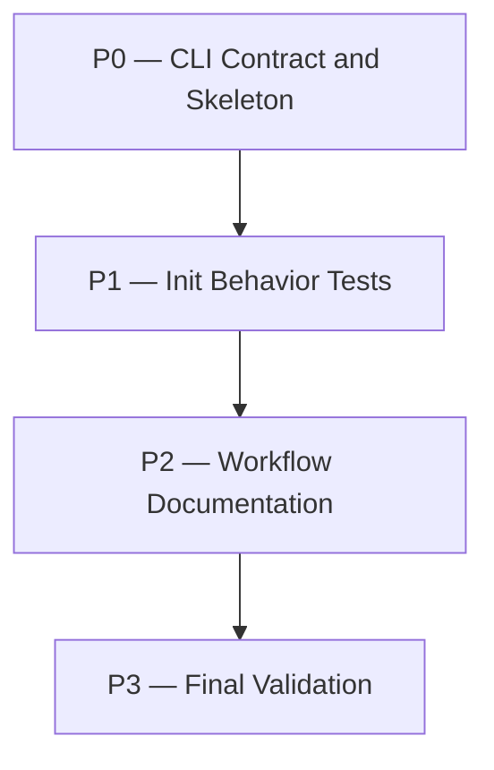

# initial-requirements Plan

## Source Artifacts

- Proposal: `.plan/initial-requirements/proposal.md`
- OpenSpec research evidence: `.plan/initial-requirements/evidence/openspec-init-analysis.md`
- Cartographer/OpenSpec delta evidence: `.plan/initial-requirements/evidence/cartographer-openspec-delta.md`
- Map graph: `.plan/initial-requirements/map.nodes.jsonl`, `.plan/initial-requirements/map.edges.jsonl`
- Fact graph: `.plan/initial-requirements/facts.nodes.jsonl`, `.plan/initial-requirements/facts.edges.jsonl`
- Shared index: `.plan/_index/project-graph.sqlite`, `.plan/_index/project-graph-manifest.json`
- Primary implementation references: `file:skills/plan/scripts/requirements_records.py`, `file:tests/test_requirements_records.py`, `file:README.md`, `file:skills/plan/SKILL.md`, `file:package.json`

## Planning Assumptions

### Confirmed facts

- Cartographer's durable requirements docs are currently populated by folding accepted topic-local deltas into `docs/requirements.md` or split durable requirements files [F001].
- `requirements_records.py` currently exposes `fold` and `validate-fold`, but no standalone requirements initialization command [F002].
- The fold helper already contains the durable requirements header text used when fold creates a missing requirements file [F003].
- Existing requirements record tests use temp roots and cover fold, split-domain output, validate-fold receipts, and duplicate durable IDs [F004].
- OpenSpec has a user-facing `openspec init` command before proposing changes [F005], but code analysis shows it initializes the OpenSpec home, spec/change/archive containers, config, and AI integrations rather than every durable spec document [F006].
- The relevant Cartographer delta is a focused, safe, idempotent bootstrap for `docs/requirements.md`, not a broad OpenSpec-style project initializer [F007].

### ADR intent

- `adr_required`: false
- `adr_reason`: No new ADR expected. This plan implements the existing ADR-0007 requirements workflow by adding a bootstrap/init helper for durable requirements docs. Re-evaluate only if implementation changes durable requirements semantics or introduces a new workflow boundary.
- `adr_options_status`: not-applicable
- `adr_tool_mode`: evaluate-only

### Implementation assumptions

- The init command should initialize a durable project-level requirements document and should not require `--topic`.
- Tests must use temp/mock roots and must not create or mutate the repository's real `docs/requirements.md`.
- The MVP should not add `--force`, split-domain initialization, OpenSpec import/export, generated tool integrations, schema/template resolver work, or a broad `cartographer init` command [F007].

## Phase Dependency Graph

## Phase Summary

| Order | Phase ID | Phase | Depends On | Unlocks | Exit Criteria |
| ----: | -------- | ----- | ---------- | ------- | ------------- |
| 0 | P0 | CLI Contract and Skeleton | none | P1 | `requirements_records.py init` exists, is idempotent, and creates the durable requirements container document in temp/manual checks. |
| 1 | P1 | Init Behavior Tests | P0 | P2 | Temp-root tests prove creation, idempotency, preservation, JSON output, and fold compatibility. |
| 2 | P2 | Workflow Documentation | P1 | P3 | README and planning guidance document the focused init command without implying OpenSpec-style project scaffolding. |
| 3 | P3 | Final Validation | P2 | none | Targeted tests, script checks, topic validation, planning graph validation, and semantic review pass. |

## Phases

### Phase P0 — CLI Contract and Skeleton

- **Status:** complete
- **Depends on:** none
- **Unlocks:** P1
- **Primary references:** `file:skills/plan/scripts/requirements_records.py`, `file:package.json`, [F002], [F003], [F006], [F007]

#### Objective

Add the focused durable requirements initialization command without changing fold semantics or introducing OpenSpec-style project scaffolding.

#### Scope

- Add an `init` subcommand to `skills/plan/scripts/requirements_records.py`.
- Ensure `init` accepts `--root` and `--json` but does not require `--topic`.
- Create `docs/requirements.md` only when absent, creating the parent `docs/` directory when needed.
- Share the durable skeleton with existing fold behavior so fold-created and init-created files stay consistent.
- Improve the skeleton to preserve Cartographer wording and include OpenSpec-informed `## Purpose` and `## Requirements` sections [F006].
- Return stable JSON fields such as `ok`, `path`, `created`, and `message` or `reason`.
- Preserve existing files by default; do not add `--force` in this phase.

#### Checklist

- [x] **P0.T1** Refactor the durable requirements header/skeleton helper so both `init` and `fold` use the same content when creating a missing durable file.
- [x] **P0.T2** Add `requirements_records.py init` with `--root` and `--json`, intentionally not requiring `--topic`.
- [x] **P0.T3** Implement idempotent no-overwrite behavior for existing `docs/requirements.md`.
- [x] **P0.T4** Return structured output with stable repo-relative `path`, `created`, `ok`, and message/reason fields.
- [x] **P0.T5** Run a manual smoke check against a temporary root, not the real repository docs.

#### Validation

- [x] **P0.V1** Run `python -m py_compile skills/plan/scripts/requirements_records.py` and confirm syntax passes.
- [x] **P0.V2** Run `tmp=$(mktemp -d) && python skills/plan/scripts/requirements_records.py init --root "$tmp" --json && test -f "$tmp/docs/requirements.md"` and confirm it creates the durable requirements document in the temp root.

#### Exit Criteria

- The init command exists and can create a durable requirements container document in a temp root.
- Existing fold and validate-fold command signatures remain available.
- No real `docs/requirements.md` is created or mutated during phase validation.

#### Risks and Mitigations

- **Risk:** The init command accidentally requires a topic because the current CLI parser assumes topic for all subcommands. **Mitigation:** Give `init` a separate parser path or make `--topic` required only for `fold` and `validate-fold`.
- **Risk:** Updating the shared skeleton changes fold output unexpectedly. **Mitigation:** Align tests in P1 with the intended shared skeleton and verify fold compatibility.
- **Risk:** Scope expands toward OpenSpec project initialization. **Mitigation:** Keep P0 limited to `docs/requirements.md` and explicitly avoid config/tool/archive scaffolding [F007].

#### Notes for Execution Agent

Use `mktemp` or `tempfile` for all smoke checks. Do not run the init command against `$PWD` unless the user explicitly asks to create a real durable requirements doc in this repository.

### Phase P1 — Init Behavior Tests

- **Status:** pending
- **Depends on:** P0
- **Unlocks:** P2
- **Primary references:** `file:tests/test_requirements_records.py`, `file:skills/plan/scripts/requirements_records.py`, [F004]

#### Objective

Add temp-root regression coverage for the new initialization lifecycle and prove it remains compatible with existing fold behavior.

#### Scope

- Update the test helper if needed so `init` can run without `--topic` while existing fold tests still pass with `--topic demo`.
- Test creation when `docs/` does not exist.
- Test structured JSON output for both created and already-existing cases.
- Test idempotency and exact preservation of existing `docs/requirements.md` content.
- Test that `fold` can append or replace requirement blocks after the file was initialized first.

#### Checklist

- [ ] **P1.T1** Add a temp-root test for `init` creating `docs/requirements.md` and its missing parent directory.
- [ ] **P1.T2** Add assertions for the initialized skeleton, including top heading and `## Purpose` / `## Requirements` sections.
- [ ] **P1.T3** Add tests for idempotent no-op behavior and exact preservation of existing content.
- [ ] **P1.T4** Add tests for stable JSON output fields in created and existing cases.
- [ ] **P1.T5** Add or update a fold compatibility test that folds a requirement into an init-created durable document.

#### Validation

- [ ] **P1.V1** Run `python -m unittest discover tests -p 'test_requirements_records.py'` and confirm all requirements record tests pass.
- [ ] **P1.V2** Run `npm run check:scripts` and confirm Python/TypeScript helper syntax checks pass.

#### Exit Criteria

- Tests cover the new init command without touching real repository docs.
- Existing fold, rename, split-domain, validate-fold, skip receipt, and duplicate durable ID behavior still passes.
- Test names and assertions make the no-overwrite contract clear.

#### Risks and Mitigations

- **Risk:** Test helper changes break existing fold tests. **Mitigation:** Keep separate helpers for topic-required and topicless commands if simpler.
- **Risk:** Skeleton assertions become brittle. **Mitigation:** Assert stable headings and essential wording rather than full file content unless full content is deliberately part of the contract.

#### Notes for Execution Agent

The project instructions require tests to use temp/mock roots. Do not point tests at `$PWD` if they create `docs/requirements.md` or `.plan/` artifacts.

### Phase P2 — Workflow Documentation

- **Status:** pending
- **Depends on:** P1
- **Unlocks:** P3
- **Primary references:** `file:README.md`, `file:skills/plan/SKILL.md`, `file:skills/implement/SKILL.md`, [F001], [F005], [F006], [F007]

#### Objective

Document the durable requirements bootstrap path and set correct expectations about what it does and does not initialize.

#### Scope

- Add README guidance near the existing durable requirements/fold lifecycle.
- Update planning guidance so future plans know when to initialize the durable requirements container document.
- Clarify that init creates an empty/structured durable requirements container and does not invent product requirements.
- Clarify that this is Cartographer-native and not OpenSpec import/export or full OpenSpec project initialization.
- Update implement guidance only if it prevents ambiguity around fold/archive finalization.

#### Checklist

- [ ] **P2.T1** Add a README snippet showing `python skills/plan/scripts/requirements_records.py init --root "$PWD" --json`.
- [ ] **P2.T2** Document that init is idempotent and preserves existing `docs/requirements.md`.
- [ ] **P2.T3** Update `skills/plan/SKILL.md` to mention initialization when planning durable requirements/fold work.
- [ ] **P2.T4** Decide whether `skills/implement/SKILL.md` needs a short note; update it only if useful.
- [ ] **P2.T5** Add or update workflow documentation tests if there are existing assertions for durable requirements/fold guidance.

#### Validation

- [ ] **P2.V1** Run `python -m unittest discover tests -p 'test_workflow_docs.py'` and confirm workflow documentation tests pass.
- [ ] **P2.V2** Run `rg -n "requirements_records.py init|docs/requirements.md|durable requirements|OpenSpec" README.md skills/plan/SKILL.md skills/implement/SKILL.md` and confirm the intended guidance is discoverable.
- [ ] **P2.V3** Run `npm run format:prettier:check -- README.md skills/plan/SKILL.md skills/implement/SKILL.md .plan/initial-requirements/plan.md` and confirm formatting passes.

#### Exit Criteria

- Users can discover how to initialize the durable requirements document.
- Docs explicitly distinguish Cartographer's focused init from OpenSpec's broader project init [F006][F007].
- Docs continue to preserve the small-change scope gate and fold lifecycle [F001].

#### Risks and Mitigations

- **Risk:** Docs imply every project must run requirements init before small changes. **Mitigation:** Keep language optional and tied to durable requirements workflows.
- **Risk:** Docs overemphasize OpenSpec. **Mitigation:** Mention OpenSpec only as context; describe the command as Cartographer-native.

#### Notes for Execution Agent

Prefer concise docs. Do not add long OpenSpec analysis to README; keep detailed research in `.plan/initial-requirements/evidence/`.

### Phase P3 — Final Validation

- **Status:** pending
- **Depends on:** P2
- **Unlocks:** none
- **Primary references:** `file:package.json`, `file:skills/plan/scripts/requirements_records.py`, `file:tests/test_requirements_records.py`, `file:README.md`, `file:skills/plan/SKILL.md`, [F004], [F007]

#### Objective

Run broad validation, validate the planning topic artifacts, obtain semantic review, and confirm ADR handling remains correct.

#### Scope

- Run targeted and broad project checks after code/tests/docs changes.
- Validate `.plan/initial-requirements` topic artifacts and planning graph.
- Confirm no OpenSpec dependency/import/export or broad project initialization behavior was added.
- Confirm no real `docs/requirements.md` was created or mutated by tests unless explicitly requested by the user.
- Preserve `adr_required: false`; record an ADR-not-required receipt only if finalization tooling requires it.

#### Checklist

- [ ] **P3.T1** Run targeted requirements record tests and script checks after all implementation/doc changes.
- [ ] **P3.T2** Run full project validation or the broadest practical project check.
- [ ] **P3.T3** Validate topic JSONL and planning graph artifacts for `initial-requirements`.
- [ ] **P3.T4** Confirm no hard OpenSpec runtime dependency, import/export command, generated tool integration, or broad `cartographer init` behavior was introduced.
- [ ] **P3.T5** Obtain final read-only semantic review from `cartographer-auditor` or an approved fallback.

#### Validation

- [ ] **P3.V1** Run `python -m unittest discover tests -p 'test_requirements_records.py'` and confirm it passes.
- [ ] **P3.V2** Run `npm run check:scripts` and confirm it passes.
- [ ] **P3.V3** Run `npm run check` and confirm it passes, or record an approved narrower validation set if unrelated failures appear.
- [ ] **P3.V4** Run `node --experimental-strip-types skills/plan/scripts/manage_jsonl.ts validate-topic --root "$PWD" --topic initial-requirements --json` and confirm it passes.
- [ ] **P3.V5** Run `python skills/plan/scripts/validate_planning_graph.py --root "$PWD" --topic initial-requirements --json` and confirm it passes.
- [ ] **P3.V6** Run `rg -n "openspec|OpenSpec" package.json requirements-dev.txt pyproject.toml skills/plan/scripts/requirements_records.py` and confirm any matches are documentation/comments only and no runtime dependency is added.

#### Exit Criteria

- All deterministic validation is green or any residual risk is explicitly approved.
- Final semantic review passes.
- The plan/proposal evidence remains consistent with implemented behavior.
- ADR handling is honored: no new ADR is required unless implementation expands beyond the approved scope.

#### Risks and Mitigations

- **Risk:** Full `npm run check` exposes unrelated failures. **Mitigation:** Record compact evidence and stop for user direction if fixing unrelated failures would broaden scope.
- **Risk:** The final implementation accidentally creates real durable requirements docs in this repository during tests. **Mitigation:** Verify `git status --short` and test roots; do not stage unintended `docs/requirements.md` unless user requested it.
- **Risk:** OpenSpec references in docs are mistaken for a dependency. **Mitigation:** Validate dependency manifests and implementation code separately from proposal/evidence references.

#### Notes for Execution Agent

Because `adr_required` is false, do not write a new ADR unless the implementation changes the durable workflow architecture beyond this plan. Existing ADR-0007 remains the governing architectural decision.

## Cross-Phase Validation

- **XV1** After writing the plan, run `node --experimental-strip-types skills/plan/scripts/manage_jsonl.ts validate-topic --root "$PWD" --topic initial-requirements --json`.
- **XV2** After writing the plan, run `python skills/plan/scripts/validate_planning_graph.py --root "$PWD" --topic initial-requirements --json`.
- **XV3** Before implementation finalization, run `npm run check` or record an approved narrower validation set if unrelated failures block the full check.
- **XV4** Before implementation finalization, confirm all tests that create requirements docs use temp/mock roots and do not mutate the repository's real `docs/requirements.md`.

## Open Questions

None. The OpenSpec research resolved the main scope question: this plan should add a focused durable requirements document bootstrap and should not clone OpenSpec's full project initialization model.

## Handoff Guidance

- Execute phases in order: P0, P1, P2, P3.
- Keep all tests and smoke checks that create `docs/requirements.md` inside temp/mock roots unless the user explicitly asks to initialize this repository's real durable requirements document.
- Use `cartographer-auditor` as the final semantic gate after deterministic validation receipts pass.
- Carry forward ADR metadata: `adr_required: false`. Re-evaluate with `cartographer_adr` only if implementation expands into a new workflow boundary, config system, generated tool integration, OpenSpec import/export, or broad project initialization.
- Do not read or cite raw `.plan/_private/**`; this topic currently uses only public/source-backed evidence.
