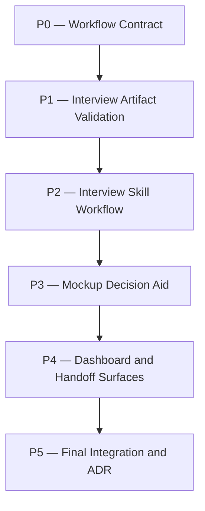

# interview-process Plan

## Source Artifacts

- `.plan/_index/project-graph.sqlite`
- `.plan/_index/project-graph-manifest.json`
- `.plan/interview-process/proposal.md`
- `.plan/interview-process/requirements.md`
- `.plan/interview-process/requirements.nodes.jsonl`
- `.plan/interview-process/requirements.edges.jsonl`
- `.plan/interview-process/design.md`
- `.plan/interview-process/design.nodes.jsonl`
- `.plan/interview-process/design.edges.jsonl`
- `.plan/interview-process/map.nodes.jsonl`
- `.plan/interview-process/map.edges.jsonl`
- `.plan/interview-process/facts.nodes.jsonl`
- `.plan/interview-process/facts.edges.jsonl`
- `.plan/interview-process/context-packs.jsonl`

## Planning Assumptions

Confirmed facts:

- The accepted proposal requires a bounded interview/spec-refinement phase after proposal acceptance and after relevant research has been exhausted, before requirements/design planning proceeds [F001] [F002].
- Requirements define post-research entry, one-question decision-tree behavior, durable interview records, pause/resume/re-entry during requirements authoring, approval checkpoint, and optional UI mockups (`REQ-INT-001` through `REQ-INT-005`).
- Design accepts a hybrid interview artifact model: `interview.md`, `interview.nodes.jsonl`, and `interview.edges.jsonl` preserve the interview trail while accepted decisions are copied or cited into requirements/design graphs (`DES-DEC-002`).
- Design accepts preview-first mockup aids using generated single-file HTML with optional headless screenshot/TUI display, while deferring dashboard integration until repeated use justifies it (`DES-DEC-004`).
- The repository already has validation and UI-related infrastructure including `skills/plan/scripts/manage_jsonl.ts`, `skills/plan/scripts/validate_planning_graph.py`, `extensions/cartographer-tools.ts`, dashboard artifact readers, and Playwright/browser dependencies [F004] [F005].

Assumptions:

- The first implementation should be Cartographer-native and skill/tooling focused, not a persistent mockup editor.
- Interview artifacts should be first-class topic artifacts in validation and dashboard/read-only summaries, but requirements/design artifacts remain authoritative for planning and implementation.
- `adr_required: true` is preserved from the proposal. Implementation finalization must run `cartographer_adr` or explicitly record an approved ADR deferral because this changes the durable workflow lifecycle.

## Phase Dependency Graph

## Phase Summary

| Order | Phase ID | Phase | Depends On | Unlocks | Exit Criteria |
| ----: | -------- | ----- | ---------- | ------- | ------------- |
| 1 | P0 | Workflow Contract | none | P1 | Workflow docs and tests describe proposal → research → interview → requirements/design → plan. |
| 2 | P1 | Interview Artifact Validation | P0 | P2 | `interview.*` artifacts are validated, summarized, and regression-tested. |
| 3 | P2 | Interview Skill Workflow | P1 | P3 | A dedicated interview skill can guide the post-research one-question loop and write/consume topic artifacts. |
| 4 | P3 | Mockup Decision Aid | P2 | P4 | Optional preview-first mockup guidance/helper path exists and is tested without requiring a persistent editor. |
| 5 | P4 | Dashboard and Handoff Surfaces | P3 | P5 | Read-only artifact surfaces and specialist prompts include interview artifacts where useful. |
| 6 | P5 | Final Integration and ADR | P4 | none | Full checks pass, requirement deltas are fold-ready, and ADR handling is completed or explicitly deferred. |

## Phases

### Phase P0 — Workflow Contract

- **Status:** complete
- **Depends on:** none
- **Unlocks:** P1
- **Primary references:** `README.md:157`, `skills/proposal/SKILL.md:255`, `skills/plan/SKILL.md:51`, `skills/implement/SKILL.md:35`, `tests/test_workflow_docs.py:167`, `REQ-INT-001`, `REQ-INT-004`, `DES-DEC-001`

#### Objective

Document the new lifecycle position and contract: proposal acceptance and research exhaustion precede interview; interview precedes requirements/design; requirements authoring may re-enter interview for unresolved user-owned decisions.

#### Scope

- Update user-facing workflow docs and relevant skill docs.
- Keep proposal documents non-design-focused.
- Preserve the current requirements/design split and add the interview gate without bypassing existing approval and validation gates.

#### Checklist

- [x] **P0.T1** Update `README.md` quick-start and artifact lifecycle sections to include `proposal → research → interview → requirements delta → design → plan → implement` for scoped changes.
- [x] **P0.T2** Update `skills/proposal/SKILL.md` Next Artifacts guidance so scoped proposals point to research-exhausted interview before requirements/design when behavioral ambiguity remains.
- [x] **P0.T3** Update `skills/plan/SKILL.md` and `skills/implement/SKILL.md` to treat interview artifacts as optional but authoritative clarification inputs alongside requirements/design artifacts.
- [x] **P0.T4** Extend `tests/test_workflow_docs.py` to assert the research-exhausted interview lifecycle, re-entry behavior, and interview artifact names are documented.

#### Validation

- [x] **P0.V1** Run `python -m unittest discover -s tests -p 'test_workflow_docs.py'`; expected result: workflow documentation tests pass.
- [x] **P0.V2** Run `rg -n "research → interview|interview.nodes.jsonl|re-enter" README.md skills tests`; expected result: intended documentation/test references are present.

#### Exit Criteria

- Documentation consistently states that the interview happens after relevant research is exhausted.
- Requirements-authoring re-entry is documented.
- Tests cover the new workflow language.

#### Risks and Mitigations

- **Risk:** The new lifecycle conflicts with the existing proposal/design split. **Mitigation:** keep the proposal non-design-focused and route interview outputs into requirements/design artifacts.
- **Risk:** Documentation says interview is mandatory for every change. **Mitigation:** describe interview as required for scoped/core workflow ambiguity, optional/lightweight otherwise.

#### Notes for Execution Agent

Do not implement validation or UI behavior in this phase. Keep this phase limited to the workflow contract and tests.

### Phase P1 — Interview Artifact Validation

- **Status:** complete
- **Depends on:** P0
- **Unlocks:** P2
- **Primary references:** `skills/plan/scripts/manage_jsonl.ts:701`, `skills/plan/scripts/validate_planning_graph.py:695`, `dashboard/src/server/artifact-reader.ts:211`, `tests/manage_jsonl.test.ts:238`, `tests/test_validate_planning_graph.py:185`, `REQ-INT-003`, `DES-DEC-002`

#### Objective

Make interview artifacts durable and mechanically checkable: `interview.md`, `interview.nodes.jsonl`, and `interview.edges.jsonl` become recognized topic-local artifacts with validation rules and read-only summaries.

#### Scope

- Add schema/validation support for interview node and edge records.
- Include record categories for candidate question, researched answer, recommendation, user answer, accepted decision, deferred choice, unresolved blocker, and dependency edge.
- Validate no direct `.plan/_private/**` references and ensure cited facts/requirements/design IDs resolve.

#### Checklist

- [x] **P1.T1** Extend `skills/plan/scripts/manage_jsonl.ts` topic validation to read and validate optional `interview.nodes.jsonl` and `interview.edges.jsonl`.
- [x] **P1.T2** Extend `skills/plan/scripts/validate_planning_graph.py` to validate interview-to-requirement/design references when interview artifacts are present.
- [x] **P1.T3** Add read-only artifact summary support for interview nodes/edges in `extensions/cartographer-tools.ts` and dashboard/server artifact readers if they enumerate topic artifact types.
- [x] **P1.T4** Add unit tests covering valid interview artifacts, unresolved references, invalid edge types, and private-path rejection.

#### Validation

- [x] **P1.V1** Run `node --experimental-strip-types skills/plan/scripts/manage_jsonl.ts validate-topic --root "$PWD" --topic interview-process --json`; expected result: topic validation passes with interview artifacts absent or present.
- [x] **P1.V2** Run `python -m unittest tests.test_validate_planning_graph`; expected result: planning graph validation tests pass.
- [x] **P1.V3** Run `npm run test:ts -- tests/manage_jsonl.test.ts`; expected result: TypeScript JSONL validation tests pass.

#### Exit Criteria

- Optional interview artifacts can exist without breaking existing topics.
- Invalid interview references and private paths fail deterministic validation.
- Read-only summaries can expose interview artifacts without mutation authority.

#### Risks and Mitigations

- **Risk:** Optional interview artifacts become required for all topics. **Mitigation:** validation treats them as optional unless referenced by requirements/design artifacts.
- **Risk:** Python and TypeScript validators diverge. **Mitigation:** add parallel fixtures and cross-check failure messages.

#### Notes for Execution Agent

Prefer narrow validation types and explicit edge enums. Do not broaden JSONL validation so much that malformed interview records silently pass.

### Phase P2 — Interview Skill Workflow

- **Status:** complete
- **Depends on:** P1
- **Unlocks:** P3
- **Primary references:** `skills/proposal/SKILL.md:382`, `skills/plan/SKILL.md:409`, `.pi/agents/cartographer-drafter.md`, `.pi/agents/cartographer-compass.md`, `REQ-INT-001`, `REQ-INT-002`, `REQ-INT-003`, `REQ-INT-004`, `DES-DEC-001`, `DES-DEC-002`, `DES-DEC-003`, `[F001]`, `[F002]`

#### Objective

Create the operational interview workflow that an agent can invoke after research exhaustion to resolve user-owned decisions one question at a time and persist the results.

#### Scope

- Add a dedicated `skills/interview/SKILL.md` or equivalent workflow entrypoint.
- Define research-exhaustion preflight, one-question prompt format, recommended answer/rationale, dependency tracking, pause/resume/re-entry, and approval summary.
- Define parent-owned artifact mutation rules and subagent usage boundaries.

#### Checklist

- [x] **P2.T1** Create `skills/interview/SKILL.md` with trigger conditions, artifacts, procedure, pitfalls, and verification checklist.
- [x] **P2.T2** Specify `interview.md`, `interview.nodes.jsonl`, and `interview.edges.jsonl` record shapes with examples for researched answers, recommendations, user answers, decisions, dependencies, deferrals, and blockers.
- [x] **P2.T3** Update specialist prompts or handoff guidance so drafter/compass/auditor can consume interview artifact summaries without mutating them.
- [x] **P2.T4** Add documentation tests that assert the interview skill includes research exhaustion, one-question behavior, recommended answers, pause/resume/re-entry, and approval summary.

#### Validation

- [x] **P2.V1** Run `python -m unittest tests.test_workflow_docs`; expected result: interview workflow docs are covered.
- [x] **P2.V2** Run `node --experimental-strip-types skills/plan/scripts/manage_jsonl.ts validate-topic --root "$PWD" --topic interview-process --json`; expected result: topic validation passes after example artifact references are updated.

#### Exit Criteria

- The interview workflow is discoverable as a skill and grounded in the accepted requirements/design.
- The skill tells agents not to ask questions that code, docs, prior art, or best practices can answer.
- Outputs are ready to feed requirements/design artifacts.

#### Risks and Mitigations

- **Risk:** The skill over-prescribes conversational wording. **Mitigation:** specify required fields and behavior, not a rigid script.
- **Risk:** Agents ask too many questions. **Mitigation:** require one-question-at-a-time and explicit stop/summary rules.

#### Notes for Execution Agent

Use the `grill-me` and Superpowers references through existing fact citations, not by embedding large external text in the skill.

### Phase P3 — Mockup Decision Aid

- **Status:** pending
- **Depends on:** P2
- **Unlocks:** P4
- **Primary references:** `package.json:92`, `docs/adr/0003-use-local-dashboard-stack-for-cartographer-planning-ui.md:1`, `/var/home/linuxbrew/.linuxbrew/lib/node_modules/@earendil-works/pi-coding-agent/docs/tui.md:89`, `REQ-INT-005`, `DES-DEC-004`, `[F004]`, `[F005]`

#### Objective

Add a lightweight, optional mockup/wireframe decision-aid path for UI-affecting interview questions without building a persistent editor.

#### Scope

- Document and, if practical, add a helper script for generated single-file HTML previews and optional screenshot capture.
- Keep generated preview artifacts topic-local or temporary and safe to review.
- Define fallback behavior for non-TUI or terminals without inline image support.

#### Checklist

- [ ] **P3.T1** Extend `skills/interview/SKILL.md` with criteria for when a UI mockup is warranted versus when structured text options are enough.
- [ ] **P3.T2** Add a minimal helper path, such as `skills/interview/scripts/mockup_preview.ts` or documented `preview_export`/Playwright usage, for rendering single-file HTML and optional screenshots.
- [ ] **P3.T3** Document safe storage and cleanup for mockup artifacts, avoiding `.plan/_private/**` and avoiding committed throwaway screenshots unless intentionally cited.
- [ ] **P3.T4** Add tests or script checks for any new helper code, and add documentation tests for mockup-mode guidance.

#### Validation

- [ ] **P3.V1** Run `npm run check:scripts`; expected result: any new helper script passes syntax checks.
- [ ] **P3.V2** Run `npm run test:ts -- tests/manage_jsonl.test.ts`; expected result: artifact validation tests still pass.
- [ ] **P3.V3** If a browser screenshot helper is added, run its focused test or `npm run test:browser -- <focused-test>`; expected result: headless rendering works or is explicitly documented as manual fallback.

#### Exit Criteria

- Interview authors have a clear optional mockup path for UI ambiguity.
- The feature does not require dashboard integration or a persistent editor.
- Non-visual fallback remains available.

#### Risks and Mitigations

- **Risk:** Mockup support bloats scope. **Mitigation:** keep helpers optional and single-file/static in v1.
- **Risk:** Browser tooling is unavailable in some environments. **Mitigation:** document browser-open/manual fallback and avoid making screenshots mandatory.

#### Notes for Execution Agent

If helper implementation becomes larger than expected, stop after documenting the mockup workflow and record the helper as a follow-up rather than blocking the core interview lifecycle.

### Phase P4 — Dashboard and Handoff Surfaces

- **Status:** pending
- **Depends on:** P3
- **Unlocks:** P5
- **Primary references:** `dashboard/src/server/artifact-reader.ts:211`, `README.md:245`, `extensions/cartographer-tools.ts:1`, `.pi/agents/cartographer-auditor.md`, `.pi/agents/cartographer-drafter.md`, `REQ-INT-003`, `REQ-INT-004`, `DES-DEC-002`

#### Objective

Expose interview artifacts through existing read-only planning surfaces and ensure specialist handoffs account for them.

#### Scope

- Dashboard/read-only artifact readers should list and summarize interview artifacts when present.
- Cartographer artifact summaries should include interview artifacts in a bounded way.
- Specialist prompts should know how to use interview summaries during proposal/requirements/design/plan validation.

#### Checklist

- [ ] **P4.T1** Update dashboard artifact readers and fixtures to include `interview.md`, `interview.nodes.jsonl`, and `interview.edges.jsonl` when present.
- [ ] **P4.T2** Update Cartographer artifact helper summaries in `extensions/cartographer-tools.ts` or backing scripts to include interview nodes/edges where supported.
- [ ] **P4.T3** Update `.pi/agents/cartographer-drafter.md`, `.pi/agents/cartographer-compass.md`, and `.pi/agents/cartographer-auditor.md` to consume interview summaries read-only.
- [ ] **P4.T4** Add tests for dashboard/artifact-reader behavior and specialist prompt coverage.

#### Validation

- [ ] **P4.V1** Run `npm run test:browser -- tests/dashboard/client-shell.test.tsx` and `npm run test:ts -- tests/manage_jsonl.test.ts`; expected result: dashboard browser smoke and relevant TypeScript tests pass.
- [ ] **P4.V2** Run `python -m unittest tests.test_workflow_docs`; expected result: specialist prompt/documentation assertions pass.
- [ ] **P4.V3** Run `npm run dashboard:check` if dashboard reader/client behavior changed; expected result: dashboard build and browser smoke pass.

#### Exit Criteria

- Read-only surfaces show interview context without raw transcript overload.
- Specialist prompts use interview summaries in the same least-privilege style as requirements/design summaries.

#### Risks and Mitigations

- **Risk:** Dashboard support turns into a full interview UI. **Mitigation:** only list/view artifacts; defer interactive dashboard authoring.
- **Risk:** Handoff prompts grow too large. **Mitigation:** reference summaries and artifact paths, not raw interview transcripts.

#### Notes for Execution Agent

Keep the dashboard read-only. Do not add write endpoints for interview artifacts in this phase.

### Phase P5 — Final Integration and ADR

- **Status:** pending
- **Depends on:** P4
- **Unlocks:** none
- **Primary references:** `package.json:103`, `skills/plan/scripts/requirements_records.py:1`, `docs/adr/0007-split-cartographer-proposal-design-and-requirements-workflow.md:1`, `REQ-INT-001`, `REQ-INT-005`, `DES-DEC-001`, `DES-DEC-004`

#### Objective

Run full integration validation, prepare requirement folding, and complete ADR handling for the new workflow lifecycle.

#### Scope

- Execute full repository checks after all implementation phases.
- Ensure accepted requirements are fold-ready for `docs/requirements.md`.
- Generate or explicitly defer an ADR because the proposal marked `adr_required: true`.

#### Checklist

- [ ] **P5.T1** Run full quality and workflow checks, correcting failures caused by interview lifecycle changes.
- [ ] **P5.T2** Run or plan `python skills/plan/scripts/requirements_records.py init --root "$PWD" --json` if `docs/requirements.md` is absent, then fold accepted requirement deltas during implementation finalization.
- [ ] **P5.T3** Run `cartographer_adr evaluate/create` or equivalent ADR workflow after deterministic validation, capturing the durable decision around the interview phase and artifact model.
- [ ] **P5.T4** Update final receipts/context packs and ensure implementation handoff mentions ADR and requirements-fold expectations.

#### Validation

- [ ] **P5.V1** Run `npm run check`; expected result: full repository validation passes.
- [ ] **P5.V2** Run `node --experimental-strip-types skills/plan/scripts/manage_jsonl.ts validate-topic --root "$PWD" --topic interview-process --json`; expected result: topic validation passes.
- [ ] **P5.V3** Run `python skills/plan/scripts/validate_planning_graph.py --root "$PWD" --topic interview-process --json`; expected result: planning graph validation passes.
- [ ] **P5.V4** Verify ADR handling: accepted ADR exists or an approved deferral receipt cites the validation receipts and rationale.

#### Exit Criteria

- Full checks pass.
- Requirements fold and ADR obligations are explicit and ready for implementation finalization.
- Plan artifacts are validated and auditor-approved.

#### Risks and Mitigations

- **Risk:** Full `npm run check` is expensive or blocked by unrelated failures. **Mitigation:** capture focused receipts first, then record any unrelated failure with evidence before requesting direction.
- **Risk:** ADR creation happens before implementation evidence is stable. **Mitigation:** evaluate during planning, but create/finalize ADR after implementation validation unless project policy requires earlier acceptance.

#### Notes for Execution Agent

Do not skip ADR handling: the proposal explicitly set `adr_required: true` for durable lifecycle changes.

## Cross-Phase Validation

- Run `node --experimental-strip-types skills/plan/scripts/manage_jsonl.ts validate-topic --root "$PWD" --topic interview-process --json` after any graph artifact change.
- Run `python skills/plan/scripts/validate_planning_graph.py --root "$PWD" --topic interview-process --json` after `plan.md`, `plan.nodes.jsonl`, or `plan.edges.jsonl` changes.
- Run focused tests for changed surfaces before full checks:
  - `python -m unittest discover -s tests -p 'test_workflow_docs.py'`
  - `python -m unittest tests.test_validate_planning_graph`
  - `npm run test:ts -- tests/manage_jsonl.test.ts`
  - `npm run dashboard:check` when dashboard/client behavior changes
- Run `npm run check` before implementation finalization.

## Open Questions

None. The plan carries the accepted design choices forward: post-research interview gate, hybrid interview artifacts, bounded approval checkpoint, and optional preview-first mockup aid.

## Handoff Guidance

Implementation should execute phases in order. Stop and ask for review if validation requires making interview artifacts mandatory for all topics, if mockup helper implementation grows into a persistent editor, or if dashboard write behavior is proposed.

Use parent-owned deterministic validation receipts before auditor handoffs. Keep child agents read-only for review roles. Implementation finalization must handle `adr_required: true` by running `cartographer_adr` after validation or recording an explicit approved ADR deferral. Requirement deltas should remain fold-ready for `docs/requirements.md` and should produce a `requirements-fold` or approved `requirements-fold-skip` receipt during implementation finalization.
