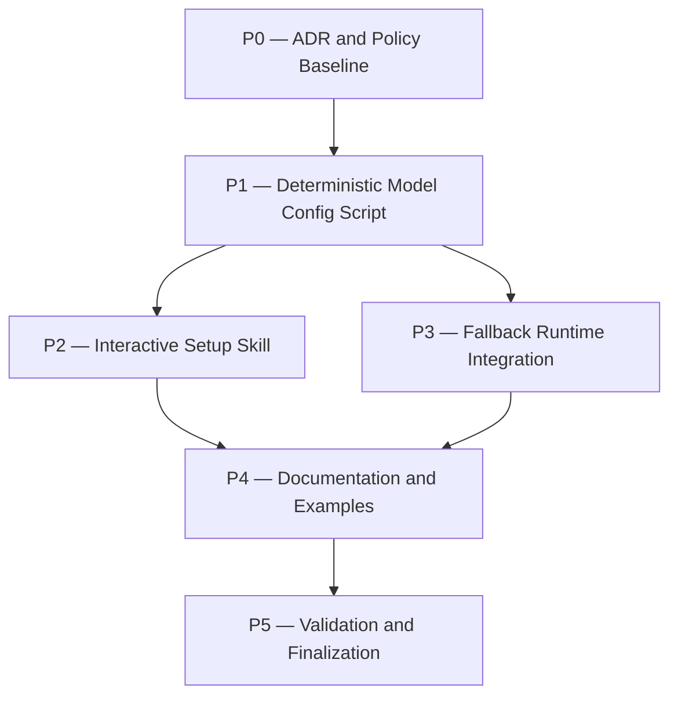

# model-optimization Plan

## Source Artifacts

- `.plan/model-optimization/proposal.md`
- `.plan/model-optimization/requirements.md`
- `.plan/model-optimization/requirements.nodes.jsonl`
- `.plan/model-optimization/requirements.edges.jsonl`
- `.plan/model-optimization/design.md`
- `.plan/model-optimization/design.nodes.jsonl`
- `.plan/model-optimization/design.edges.jsonl`
- `.plan/model-optimization/map.nodes.jsonl`
- `.plan/model-optimization/map.edges.jsonl`
- `.plan/model-optimization/facts.nodes.jsonl`
- `.plan/model-optimization/facts.edges.jsonl`
- `.plan/_index/project-graph.sqlite`
- `.plan/_index/project-graph-manifest.json`

## Planning Assumptions

- Requirements gate is approved and design gate is approved by the user.
- ADR is required because this changes durable Cartographer workflow policy for model routing, reasoning levels, fallback behavior, and cost controls.
- The main implementation should preserve parent/current-agent single-writer behavior and deterministic Cartographer workflow wrappers.
- Runtime fallback wraps Cartographer-controlled workflow/handoff calls; it does not change Pi's active parent model mid-response.
- User settings (`~/.pi/agent/settings.json`) are the canonical config surface for subscription/model preferences.
- No phase may write to the repository's real `.plan/` directory during tests except the actual plan/topic artifacts managed by this workflow; tests must use temp/mock projects.

## Phase Dependency Graph

## Phase Summary

| Order | Phase ID | Phase | Depends On | Unlocks | Exit Criteria |
| ----: | -------- | ----- | ---------- | ------- | ------------- |
| 0 | P0 | ADR and Policy Baseline | none | P1 | ADR drafted/accepted for routing/fallback policy and durable policy references identified |
| 1 | P1 | Deterministic Model Config Script | P0 | P2, P3 | Script validates JSON Schema, available models, thinking/modality/fallbacks, and atomically writes settings in temp tests |
| 2 | P2 | Interactive Setup Skill | P1 | P4 | Skill invokes deterministic script, presents provider menu/recommendations/orchestrator guidance, and supports preview/confirm flow |
| 3 | P3 | Fallback Runtime Integration | P1 | P4 | Cartographer-controlled fallback wrapper classifies errors, records receipts, gates cross-provider fallback, and retries bounded chains |
| 4 | P4 | Documentation and Examples | P2, P3 | P5 | README/skill docs explain setup workflow, routing matrix, no-xhigh policy, fallback behavior, and config examples |
| 5 | P5 | Validation and Finalization | P4 | implementation-ready | End-to-end checks pass, requirements/design coverage verified, ADR handling complete, plan implementation ready |

## Phases

### Phase P0 — ADR and Policy Baseline

- **Status:** complete
- **Depends on:** none
- **Unlocks:** P1
- **Primary references:** `.plan/model-optimization/proposal.md`, `.plan/model-optimization/design.md`, `docs/adr/0002-require-auditable-cartographer-subagent-handoffs.md`, `docs/adr/0004-use-single-writer-cartographer-implementation-state.md`, `docs/adr/0006-use-deterministic-cartographer-workflow-wrappers-for-lifecycle-gates.md`, `[REQ-01]`, `[REQ-17]`, `D001`, `D003`, `D004`, `D005`

#### Objective

Create the durable architecture decision record for Cartographer model routing, reasoning escalation, user-scope settings, interactive setup workflow, deterministic settings writer, and fallback behavior before code changes depend on that policy.

#### Scope

- Use `cartographer_adr` to draft/write an ADR for the accepted proposal/design.
- Preserve existing ADR constraints: parent single-writer, deterministic workflow wrappers, auditable subagent handoffs.
- Decide whether the ADR is standalone or references the topic artifacts as validation evidence.
- Do not implement code in this phase.

#### Checklist

- [x] **P0.T1** Run ADR evaluation/draft for `.plan/model-optimization` using accepted proposal, requirements, and design artifacts.
- [x] **P0.T2** Write the ADR under `docs/adr/` with accepted status, citing sanitized topic artifacts/receipt IDs rather than raw logs.
- [x] **P0.T3** Record ADR sync metadata for the topic with `cartographer_proposal adr-sync` or `cartographer_adr` workflow support.

#### Validation

- [x] **P0.V1** Run `cartographer_adr validate` or equivalent ADR validation command and expect success.
- [x] **P0.V2** Run `node --experimental-strip-types skills/plan/scripts/manage_jsonl.ts validate-topic --root "$PWD" --topic model-optimization --json` and expect 0 errors/warnings.

#### Exit Criteria

- ADR exists, validates, and captures D001-D005 plus C007/C008 policy.
- Topic ADR metadata points to the accepted ADR or records why ADR write is deferred.

#### Risks and Mitigations

- **Risk:** ADR duplicates plan details instead of durable policy. **Mitigation:** Keep ADR focused on decisions/consequences and cite topic artifacts for detail.

#### Notes for Execution Agent

Use Cartographer ADR tooling, not manual ad-hoc ADR edits, unless wrapper support is unavailable and a fallback receipt records the substitute workflow.

### Phase P1 — Deterministic Model Config Script

- **Status:** complete
- **Depends on:** P0
- **Unlocks:** P2, P3
- **Primary references:** `.plan/model-optimization/design.md#component-c008-deterministic-settings-writer`, `[REQ-11]`, `[REQ-15]`, `[REQ-17]`, `C008`, `extensions/cartographer-tools.ts`, `skills/plan/scripts/cartographer_workflow.ts`, `package.json`

#### Objective

Implement a deterministic script that owns reading, validating, previewing, and atomically writing Cartographer model-routing settings in `~/.pi/agent/settings.json`.

#### Scope

- Add a script, likely under `skills/plan/scripts/` or a new model-config skill script, for settings validation/apply.
- Define JSON Schema for Cartographer model config:
  - `cartographer.parentFallbackModels`
  - `cartographer.parentFallbackAllowCrossProvider`
  - Cartographer-relevant `subagents.agentOverrides` entries with `model`, `thinking`, `fallbackModels`.
- Programmatically validate proposed model IDs against available Pi model metadata or a deterministic model-list input.
- Validate thinking levels against model capabilities where available.
- Validate modality constraints, especially Spark text-only/no-image usage.
- Detect roles with no fallback and emit warnings.
- Detect subscription/free final fallback candidates such as `opencode/big-pickle` when present.
- Preserve unrelated settings and atomically write with temp file + rename only after explicit write mode.

#### Checklist

- [x] **P1.T1** Design script command interface for validate/preview/apply modes using structured JSON input/output.
- [x] **P1.T2** Implement JSON Schema validation for settings payloads and role overrides.
- [x] **P1.T3** Implement available-model validation using deterministic input from Pi model metadata or a model list adapter.
- [x] **P1.T4** Implement warning generation for missing fallbacks and recommended final fallback candidates.
- [x] **P1.T5** Implement atomic settings write that preserves unrelated user settings and only overwrites existing values with explicit force/approval.
- [x] **P1.T6** Add temp/mock filesystem tests for missing settings file, partial settings, malformed JSON, unknown model IDs, invalid thinking levels, and no-fallback warnings.

#### Validation

- [x] **P1.V1** Run `npm run test:py` and expect pass if implemented in Python, or targeted TS tests if implemented in TypeScript.
- [x] **P1.V2** Run `npm run check:scripts` and expect pass.
- [x] **P1.V3** Run targeted script tests against temp directories only; verify no test writes to real `~/.pi/agent/settings.json` or real `.plan/`.

#### Exit Criteria

- Deterministic script validates and previews settings without writing by default.
- Apply mode writes atomically only after explicit caller confirmation/flag.
- Tests cover missing/partial/invalid config and warning paths.

#### Risks and Mitigations

- **Risk:** Script accidentally mutates the user's real settings in tests. **Mitigation:** Require explicit settings path/root in tests and use temp directories.
- **Risk:** Available-model validation is unavailable in non-interactive contexts. **Mitigation:** Accept a deterministic model-list JSON input and have the skill/tool supply it when available.

#### Notes for Execution Agent

Do not directly edit `~/.pi/agent/settings.json` during implementation. All write behavior must be tested against temp/mock settings paths.

### Phase P2 — Interactive Setup Skill

- **Status:** complete
- **Depends on:** P1
- **Unlocks:** P4
- **Primary references:** `.plan/model-optimization/design.md#component-c007-config-setup-workflow-skill`, `[REQ-17]`, `skills/*/SKILL.md`, `README.md`, `C007`, `C008`

#### Objective

Add a Cartographer setup skill/workflow invoked by the main agent when model-routing config is missing or partial.

#### Scope

- Add a new skill, e.g. `skills/model-config/SKILL.md`, or extend an existing Cartographer skill with explicit setup instructions.
- The skill must guide the main agent to:
  - detect missing/partial config;
  - inspect available providers/models;
  - ask the user which providers Cartographer may use;
  - recommend role-specific models by cost, speed, thinking, context, modality, and safety;
  - recommend a main orchestrator model/thinking level;
  - warn when no fallback is configured;
  - suggest subscription/free final fallbacks such as `opencode/big-pickle` when available;
  - preview settings;
  - call the deterministic writer script for validation/apply.
- The skill must not instruct LLMs to free-form edit user settings.

#### Checklist

- [x] **P2.T1** Create or update skill documentation for the interactive config setup workflow.
- [x] **P2.T2** Define provider menu logic and recommendation criteria for each Cartographer role.
- [x] **P2.T3** Define main orchestrator recommendation behavior (`gpt-5.5 medium` when Codex selected; otherwise best available reasoning/tool model with cost caveats).
- [x] **P2.T4** Define no-fallback warnings and final fallback recommendation behavior.
- [x] **P2.T5** Document how the skill calls the deterministic settings writer script for preview/apply.
- [x] **P2.T6** Add tests or documentation checks ensuring the skill mentions provider menu, role recommendations, orchestrator recommendation, no-fallback warnings, deterministic writer, JSON Schema validation, model validation, and confirmation gate.

#### Validation

- [x] **P2.V1** Run `npm run check:scripts` and expect pass.
- [x] **P2.V2** Run targeted tests/documentation checks for the setup skill content and deterministic writer integration.

#### Exit Criteria

- Main agent has a clear skill to invoke when config is missing or partial.
- Skill explains user choices and delegates all writes to deterministic script.

#### Risks and Mitigations

- **Risk:** Setup UX asks too many questions. **Mitigation:** Use provider-first menu, then recommended defaults with concise explanations.
- **Risk:** Recommendations overfit Codex. **Mitigation:** Build recommendation criteria around model metadata and provider cost/speed classes, with Codex-specific examples only when available.

#### Notes for Execution Agent

Use `ask_user_question` for actual interactive provider choices when implementing/invoking the skill. Do not ask questions that can be answered from model metadata.

### Phase P3 — Fallback Runtime Integration

- **Status:** complete
- **Depends on:** P1
- **Unlocks:** P4
- **Primary references:** `.plan/model-optimization/design.md#decision-d003-workflow-fallback-wrapper`, `.plan/model-optimization/design.md#decision-d004-cross-provider-approval-gate`, `[REQ-12]`, `[REQ-13]`, `[REQ-14]`, `[REQ-16]`, `extensions/cartographer-tools.ts`, `skills/plan/scripts/cartographer_workflow.ts`, `C002`, `C003`, `C004`, `C005`

#### Objective

Implement fallback behavior for Cartographer-controlled model/handoff workflow steps using the deterministic config from P1.

#### Scope

- Add failure classification for `usage_limit_reached`, HTTP 429, model unavailable, and transient provider errors.
- Parse Codex reset headers when present.
- Select next fallback model from `cartographer.parentFallbackModels` or subagent `fallbackModels` as applicable.
- Record deterministic fallback receipts with `failure_mode`, `from_model`, `to_model`, reset metadata, phase, and approval status.
- Gate cross-provider fallback through interactive approval or explicit pre-approval config/flag.
- Bound retries by chain length.
- Clarify that this wraps Cartographer-controlled calls; it does not change Pi's active parent model mid-response.

#### Checklist

- [x] **P3.T1** Implement or extend a failure classifier utility with tests for Codex 429/usage-limit payloads and unavailable model errors.
- [x] **P3.T2** Implement fallback chain selection using validated config from P1.
- [x] **P3.T3** Implement cross-provider detection and approval/pre-approval handling.
- [x] **P3.T4** Integrate fallback receipt writing through existing `cartographer_handoff fallback`/workflow receipt helpers where possible.
- [x] **P3.T5** Add retry wrapper to Cartographer-owned handoff/workflow paths without changing generic Pi runtime behavior.
- [x] **P3.T6** Add tests for within-provider retry, cross-provider approval, decline behavior, exhausted chain behavior, and receipt schema.

#### Validation

- [x] **P3.V1** Run `npm run test:ts` or targeted TS tests for fallback runtime utilities.
- [x] **P3.V2** Run `npm run check:scripts` and expect pass.
- [x] **P3.V3** Run simulated fallback tests with mock provider errors and verify deterministic receipts.

#### Exit Criteria

- Usage-limit fallback succeeds for same-provider fallback.
- Cross-provider fallback requires approval unless pre-approved.
- Receipt trail is complete and validation-friendly.

#### Risks and Mitigations

- **Risk:** Retrying mutating operations causes duplicate writes. **Mitigation:** Limit fallback wrapper to model calls/subagent handoffs before canonical writes, or make retry idempotency explicit.
- **Risk:** Generic Pi runtime errors are not catchable from Cartographer. **Mitigation:** Scope implementation to Cartographer-owned calls and document limitations.

#### Notes for Execution Agent

Be conservative: never retry a step that may have already performed canonical mutations unless the mutation is idempotent or the parent can verify no write occurred.

### Phase P4 — Documentation and Examples

- **Status:** complete
- **Depends on:** P2, P3
- **Unlocks:** P5
- **Primary references:** `README.md`, `docs/requirements.md`, `.plan/model-optimization/design.md`, `.plan/model-optimization/requirements.md`, `[REQ-02]`, `[REQ-11]`, `[REQ-17]`, `D001`, `D002`, `D005`

#### Objective

Document the model optimization policy, setup workflow, routing matrix, fallback behavior, and troubleshooting guidance for end users.

#### Scope

- Update README or a focused docs section with:
  - setup skill invocation;
  - user settings config example;
  - role-based routing matrix;
  - no `xhigh` default policy;
  - cross-provider cost guard;
  - no-fallback warnings;
  - final fallback suggestion for free/subscription models like `opencode/big-pickle` when available;
  - limitations of parent session fallback.
- Update durable requirements docs if the project folds requirement deltas at implementation finalization.
- Ensure docs do not instruct free-form manual JSON edits as the primary path; they may show examples.

#### Checklist

- [x] **P4.T1** Update README or docs with the model setup workflow and routing/fallback policy.
- [x] **P4.T2** Add a safe example `~/.pi/agent/settings.json` snippet that clearly says the setup workflow/script should apply it.
- [x] **P4.T3** Document no-xhigh defaults and escalation approval policy.
- [x] **P4.T4** Document fallback behavior, reset-time awareness, and cross-provider approval.
- [x] **P4.T5** Document redactor fallback caveats and privacy/safety tradeoffs.

#### Validation

- [x] **P4.V1** Run `npm run format:prettier:check` or targeted markdown formatting check if available.
- [x] **P4.V2** Run targeted grep checks confirming docs mention setup workflow, deterministic writer, JSON Schema validation, available-model validation, no-fallback warning, and no-xhigh default.

#### Exit Criteria

- End users can discover and understand setup/fallback behavior without reading plan artifacts.
- Docs reflect accepted design and requirements.

#### Risks and Mitigations

- **Risk:** Docs imply automatic mutation of user settings. **Mitigation:** State preview/confirmation and deterministic writer behavior clearly.

#### Notes for Execution Agent

Keep docs concise and user-facing; leave deep implementation details in the ADR/design references.

### Phase P5 — Validation and Finalization

- **Status:** pending
- **Depends on:** P4
- **Unlocks:** implementation-ready
- **Primary references:** `package.json`, `skills/plan/scripts/validate_planning_graph.py`, `.plan/model-optimization/requirements.nodes.jsonl`, `.plan/model-optimization/design.nodes.jsonl`, `[REQ-01]` through `[REQ-17]`

#### Objective

Run full validation, verify requirements/design/ADR coverage, and prepare the topic for implementation finalization.

#### Scope

- Run deterministic project checks appropriate to changed files.
- Verify no `xhigh` defaults are introduced.
- Verify all requirements REQ-01 through REQ-17 are implemented or explicitly deferred.
- Verify ADR requirement is satisfied.
- Verify fallback/setup tests use temp/mock files only.
- Create/update context packs and final implementation/audit receipts during implementation finalization.

#### Checklist

- [ ] **P5.T1** Run targeted test suites for the deterministic settings writer, setup skill checks, and fallback runtime wrapper.
- [ ] **P5.T2** Run `npm run check:scripts`.
- [ ] **P5.T3** Run `npm run typecheck` if TS files changed.
- [ ] **P5.T4** Run `npm run lint:ts` if TS files changed.
- [ ] **P5.T5** Run `npm run test:py` / `npm run test:ts` as appropriate to touched languages.
- [ ] **P5.T6** Run final `node --experimental-strip-types skills/plan/scripts/manage_jsonl.ts validate-topic --root "$PWD" --topic model-optimization --json`.
- [ ] **P5.T7** Run final `python skills/plan/scripts/validate_planning_graph.py --root "$PWD" --topic model-optimization --json`.
- [ ] **P5.T8** Run required live smoke test using a cheap/free model path, preferably `opencode/big-pickle` if available, validating at least one real model selection path and one fallback/error handling path.
- [ ] **P5.T9** Run final auditor gate and capture PASS receipt.

#### Validation

- [ ] **P5.V1** All deterministic validation commands selected above pass or have explicit documented fallback receipts.
- [ ] **P5.V2** Required cheap/free live smoke test passed and has a validation receipt, or the user explicitly approved a paid/live alternative or blocked validation.
- [ ] **P5.V3** `cartographer-auditor` PASS or approved fallback reviewer receipt exists.
- [ ] **P5.V4** `cartographer_adr` metadata confirms ADR-required topic is handled.

#### Exit Criteria

- Implementation is validated and ready for merge/review.
- Requirements/design deltas are folded or an approved fold-skip receipt exists.
- ADR is accepted or explicitly deferred with approval.

#### Risks and Mitigations

- **Risk:** Full `npm run check` is expensive/slow. **Mitigation:** Run targeted commands during phases and full check only if feasible before finalization.

#### Notes for Execution Agent

Use parent-owned validation receipts. Do not let child agents fabricate canonical validation evidence.

## Testing Strategy

Testing must prove three behaviors without touching real user settings or burning live subscription quota by default: configuration is written correctly, Cartographer reads the config for orchestrated calls, and subagents/fallback retries use the intended models.

### Config write correctness

- Unit test the deterministic settings writer against temp settings paths only.
- Cover missing settings file, existing unrelated settings, partial `subagents.agentOverrides`, partial `cartographer.parentFallbackModels`, malformed JSON, invalid JSON Schema, invalid model IDs, invalid thinking levels, invalid modality choices, no-fallback warnings, and free/subscription final fallback suggestions such as `opencode/big-pickle`.
- Assert existing user values are preserved unless `--force`/explicit overwrite is supplied.
- Assert writes are atomic: temp file + rename, with no partial file left on failure.
- Assert no test reads or writes real `~/.pi/agent/settings.json`.

### Orchestrator workflow reads config

- Test the Cartographer workflow/config resolver separately from Pi's active parent model.
- Given temp settings with `cartographer.parentFallbackModels`, assert the workflow wrapper resolves the chain in order.
- Given missing/partial config, assert setup-required status or setup skill invocation is produced, with safe documented defaults and warnings.
- Given cross-provider fallback disabled, assert the wrapper stops for approval.
- Given pre-approved cross-provider fallback, assert it proceeds and records `approved_by: "pre-approved"`.
- Do not assert Pi hot-swaps the parent model globally; the design only requires Cartographer-controlled calls to use the resolved config.

### Subagent model selection

- Unit test a subagent model resolver using temp/user settings payloads.
- Assert `cartographer-drafter` resolves to `openai-codex/gpt-5.3-codex-spark` with fallback `openai-codex/gpt-5.4-mini`.
- Assert `cartographer-auditor`, `cartographer-compass`, and `cartographer-redactor` resolve to `openai-codex/gpt-5.5` at `medium` unless the user explicitly changes them.
- Assert `cartographer-archivist` resolves to `openai-codex/gpt-5.4-mini`.
- Mock `subagent(...)` invocation and assert the generated call includes the resolved `model`, `thinking`, and fallback retry model; no live subagent call is required.
- Assert no Cartographer default resolves to `xhigh`.

### Automatic fallback and retry

- Unit test failure classification for representative provider errors:
  - Codex `usage_limit_reached` / HTTP 429 with reset headers;
  - `model_not_found` / model unavailable;
  - transient provider 503/timeout;
  - non-retryable errors.
- Test same-provider fallback: GPT-5.5 mocked 429, GPT-5.4-mini mocked success. Assert exactly two attempts, receipt written, `approved_by: "auto"`, and reset seconds captured.
- Test cross-provider fallback: Codex chain exhausted, next fallback is `opencode/big-pickle`. Assert approval required; declined approval stops without retry; approved/pre-approved path retries and records the correct approval mode.
- Test exhausted chain: all models fail, workflow stops with a fallback-exhausted/error receipt and clear message.
- Test idempotency guard: fallback wrapper must not blindly retry after canonical mutations unless the step is known idempotent or parent verifies no write occurred.

### End-to-end dry-run

Use a temp mock project and temp user settings path:

1. Start with no settings file.
2. Setup workflow detects missing config and presents provider/model recommendations.
3. Deterministic writer previews config and writes only after confirmation.
4. Mock subagent selection verifies role models.
5. Mock Codex usage-limit error verifies fallback retry and receipt.
6. Validate generated receipts/schema.

Assertions:

- settings JSON is valid and schema-compliant;
- correct subagent model and fallback model selected;
- fallback receipt schema valid;
- no real user settings touched;
- no real repo `.plan/` mutated outside the topic workflow.

### Required live smoke test for final validation

A live smoke test is required as a final validation gate for this feature, but it must use a cheap/free model path rather than intentionally burning scarce subscription quota.

Required behavior:

- Use a cheap/free provider/model when available, such as a subscription/free fallback model like `opencode/big-pickle`.
- Validate at least one real model selection path and one fallback/error handling path.
- Prefer an intentionally invalid primary model followed by a cheap/free fallback, or another low-cost provider-unavailable simulation, rather than exhausting Codex quota.
- Record the live smoke test command/steps, selected provider/model, result, and any residual risk in a validation receipt.
- If no cheap/free model is available, stop and ask the user whether to approve a paid/live provider smoke test or record a blocked validation.

## Cross-Phase Validation

- `node --experimental-strip-types skills/plan/scripts/manage_jsonl.ts validate-topic --root "$PWD" --topic model-optimization --json`
- `python skills/plan/scripts/validate_planning_graph.py --root "$PWD" --topic model-optimization --json`
- `npm run check:scripts`
- Targeted tests for deterministic settings writer and fallback runtime behavior.
- Required cheap/free live smoke test for model selection and fallback/error handling, preferably using `opencode/big-pickle` when available.
- Targeted grep/doc checks for setup workflow, deterministic writer, JSON Schema validation, available-model validation, no-fallback warning, final fallback suggestion, and no-xhigh policy.

## Open Questions

None. User-owned setup behavior decisions were resolved during proposal/requirements/design: interactive setup workflow, user settings config, deterministic writer, available-model validation, no-fallback warnings, and subscription/free final fallback suggestion.

## Handoff Guidance

- Execute phases in order: P0 → P1 → P2/P3 → P4 → P5.
- P2 and P3 may proceed in parallel after P1 if separate implementation threads are explicitly coordinated, but the parent/current agent remains the canonical writer.
- ADR is required. Implementation finalization must verify the ADR exists and is linked to the topic.
- Use the deterministic settings writer for all settings mutations; do not directly edit `~/.pi/agent/settings.json` in tests or implementation validation.
- When implementing tests, use temp/mock settings paths and temp project roots; never mutate the real user settings or repository `.plan/` artifacts outside this topic workflow.
- Stop and ask the user before changing the chosen config surface, allowing silent settings writes, removing cross-provider approval, or allowing `xhigh` defaults.
