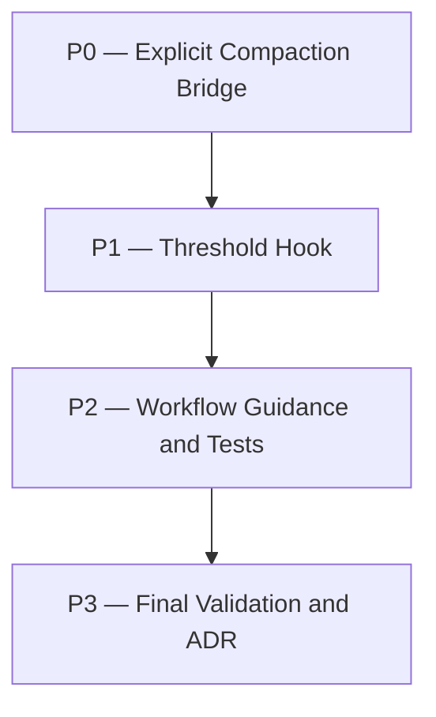

# phase-compaction-hooks Plan

## Source Artifacts

- Proposal: `.plan/phase-compaction-hooks/proposal.md`
- Requirements delta: `.plan/phase-compaction-hooks/requirements.md`, `requirements.nodes.jsonl`, `requirements.edges.jsonl`
- Design: `.plan/phase-compaction-hooks/design.md`, `design.nodes.jsonl`, `design.edges.jsonl`
- Map graph: `.plan/phase-compaction-hooks/map.nodes.jsonl`, `.plan/phase-compaction-hooks/map.edges.jsonl`
- Fact graph: `.plan/phase-compaction-hooks/facts.nodes.jsonl`, `.plan/phase-compaction-hooks/facts.edges.jsonl`
- Research evidence: `.plan/phase-compaction-hooks/evidence/pi-compaction-harness-research.md`

## Planning Assumptions

- Real Pi context compaction must be triggered through Pi extension context (`ctx.compact()`), not by writing Pi session JSONL [F004].
- Cartographer `compact-generate` remains a state/resume snapshot and must not be described as transcript compaction [F008].
- The design accepts a hybrid explicit tool plus threshold hook [REQ-PCH-001] [REQ-PCH-002] [DES-DEC-001].
- Summary focus should use additive `customInstructions` and bounded `state-resume`/selected state fields [REQ-PCH-003] [DES-DEC-002].
- ADR intent: `adr_required: true`; implementation finalization must create or update an ADR after validation.

## Phase Dependency Graph

## Phase Summary

| Order | Phase ID | Phase | Depends On | Unlocks | Exit Criteria |
| ----: | -------- | ----- | ---------- | ------- | ------------- |
| 0 | P0 | Explicit Compaction Bridge | none | P1 | Tool queues/skips real Pi compaction with bounded custom instructions. |
| 1 | P1 | Threshold Hook | P0 | P2 | turn-end guard uses usage percent, active state, cooldown, and configuration. |
| 2 | P2 | Workflow Guidance and Tests | P1 | P3 | Implement skill and tests document actual Pi compaction bridge behavior. |
| 3 | P3 | Final Validation and ADR | P2 | none | Full validation passes and ADR/requirements-fold handling is recorded. |

## Phases

### Phase P0 — Explicit Compaction Bridge

- **Status:** complete
- **Depends on:** none
- **Unlocks:** P1
- **Primary references:** `extensions/cartographer-tools.ts:580`, `skills/plan/scripts/cartographer_state.ts:620`, [REQ-PCH-001], [REQ-PCH-003], [DES-DEC-001], [DES-DEC-002]

#### Objective

Add an explicit Pi extension tool that the Cartographer implementation loop can call after state snapshot compaction to request actual Pi transcript/context compaction.

#### Scope

- Extend the Cartographer tools extension with a minimal extension context type that can access `ctx.compact()` and `ctx.getContextUsage()` when Pi supplies it.
- Register a `cartographer_compact_context` tool with inputs for topic, trigger, phase ID, root, optional summary, threshold, and force behavior.
- Build bounded additive `customInstructions` from user/tool input plus `state-resume` output when available.
- Return compact, deterministic tool output: `queued`, `skipped`, or `unavailable`, with usage metadata when available.

#### Checklist

- [x] **P0.T1** Add helper types/functions for compaction context, active topic/state-resume loading, cooldown state, and instruction rendering.
- [x] **P0.T2** Register `cartographer_compact_context` in `extensions/cartographer-tools.ts` with clear prompt guidance.
- [x] **P0.T3** Ensure the explicit tool calls `ctx.compact({ customInstructions })` only when extension context supports it, otherwise reports a safe skip.
- [x] **P0.T4** Add TypeScript tests with mocked extension context for queued, unavailable, and custom-instruction content outcomes.

#### Validation

- [x] **P0.V1** Run `npm run test:ts -- tests/cartographer_tools.test.ts` and expect pass.
- [x] **P0.V2** Run `node --experimental-strip-types --check extensions/cartographer-tools.ts` and expect pass.

#### Exit Criteria

The explicit bridge tool exists, reports deterministic outcomes, and includes implement-skill/state-resume guidance in custom instructions.

#### Risks and Mitigations

- **Risk:** Tool callers assume synchronous compaction completion. **Mitigation:** tool result says `queued` and relies on `session_compact` observation for completion.
- **Risk:** Tool output leaks too much state. **Mitigation:** cap state-resume/custom-instruction content.

#### Notes for Execution Agent

Implement this phase before the automatic threshold hook so tests can exercise the shared instruction builder and cooldown logic.

### Phase P1 — Threshold Hook

- **Status:** complete
- **Depends on:** P0
- **Unlocks:** P2
- **Primary references:** `extensions/cartographer-tools.ts:580`, [REQ-PCH-002], [REQ-PCH-004], [DES-DEC-001], [DES-DEC-003]

#### Objective

Add a conservative `turn_end` threshold guard that requests real Pi compaction when active Cartographer implementation context exceeds the configured context threshold.

#### Scope

- Add optional extension event registration when `pi.on` is available.
- On `turn_end`, inspect `ctx.getContextUsage().percent` and compare to a default 60% threshold.
- Gate threshold compaction to valid/active `.cartographer/current.json` plus topic state when possible.
- Add environment/config defaults and duplicate/cooldown protection.
- Reuse the P0 instruction builder with threshold-specific trigger text.

#### Checklist

- [x] **P1.T1** Add optional `pi.on("turn_end")` registration with guards for missing usage, disabled threshold, no active topic, below-threshold usage, and cooldown.
- [x] **P1.T2** Derive active Cartographer topic safely from `.cartographer/current.json` and validate the state file exists before threshold compaction.
- [x] **P1.T3** Add tests for threshold crossing, below-threshold skip, no-active-topic skip, and duplicate suppression.
- [x] **P1.T4** Add concise `session_compact` observation/notification or internal cooldown reset if supported by the available extension context.

#### Validation

- [x] **P1.V1** Run `npm run test:ts -- tests/cartographer_tools.test.ts` and expect pass.
- [x] **P1.V2** Run `node --experimental-strip-types --check extensions/cartographer-tools.ts` and expect pass.

#### Exit Criteria

Threshold compaction is available, scoped to active Cartographer implementation state, configurable/disableable, and duplicate-guarded.

#### Risks and Mitigations

- **Risk:** Automatic compaction triggers outside implementation work. **Mitigation:** require active `.cartographer/current.json`/state evidence.
- **Risk:** Repeated compaction loops. **Mitigation:** cooldown and last-trigger tracking.

#### Notes for Execution Agent

Prefer small helper functions that can be unit-tested without a real Pi runtime.

### Phase P2 — Workflow Guidance and Tests

- **Status:** complete
- **Depends on:** P1
- **Unlocks:** P3
- **Primary references:** `skills/implement/SKILL.md:19`, `tests/test_workflow_docs.py:81`, [REQ-PCH-001], [REQ-PCH-003], [DES-COMP-001]

#### Objective

Update Cartographer workflow guidance so future implementation runs call the real Pi compaction bridge after state snapshots and understand the distinction between state compaction and transcript compaction.

#### Scope

- Update `skills/implement/SKILL.md` to require phase-end `cartographer_compact_context` after `cartographer_implement compact`/`cartographer_state compact-generate` when the tool is available.
- Clarify that `compact-generate` is a state snapshot/resume artifact, not actual Pi transcript compaction.
- Mention bounded `customInstructions` and continuing with the implement skill after compaction.
- Extend workflow docs tests to assert the new guidance.

#### Checklist

- [x] **P2.T1** Update implement skill procedure and pitfalls with actual Pi compaction bridge guidance.
- [x] **P2.T2** Add/adjust Python workflow docs tests for the new bridge terminology and safeguards.
- [x] **P2.T3** Ensure prompt guidance for `cartographer_state` and `cartographer_compact_context` is not contradictory.

#### Validation

- [x] **P2.V1** Run `python -m unittest discover tests -p 'test_workflow_docs.py'` and expect pass.
- [x] **P2.V2** Run `npm run test:ts -- tests/cartographer_tools.test.ts` and expect pass.
- [x] **P2.V3** Run `npm run format:prettier:check -- extensions/cartographer-tools.ts skills/implement/SKILL.md tests/cartographer_tools.test.ts tests/test_workflow_docs.py .plan/phase-compaction-hooks/plan.md` and expect pass, or run the formatter then re-check.

#### Exit Criteria

Workflow docs and tests make the actual compaction bridge explicit and prevent future confusion between state snapshots and Pi transcript compaction.

#### Risks and Mitigations

- **Risk:** Guidance becomes too verbose. **Mitigation:** keep explicit bridge instructions concise and operational.

#### Notes for Execution Agent

Do not remove state snapshot instructions; actual Pi compaction is additive after durable state/resume artifacts are written.

### Phase P3 — Final Validation and ADR

- **Status:** complete
- **Depends on:** P2
- **Unlocks:** none
- **Primary references:** `package.json:103`, `docs/adr/`, [REQ-PCH-004], [DES-RISK-001]

#### Objective

Validate the complete implementation, handle ADR/requirements-fold obligations, and finalize implementation evidence.

#### Scope

- Run targeted and broad validation.
- Record requirements fold or approved skip for topic-local requirements.
- Create or update an ADR documenting the accepted hybrid phase-compaction bridge policy.
- Run final auditor/fallback semantic review.

#### Checklist

- [x] **P3.T1** Run targeted extension/docs tests and project script checks.
- [x] **P3.T2** Run full `npm run check` if feasible and record the validation receipt.
- [ ] **P3.T3** Record requirements-fold or requirements-fold-skip handling for this topic's requirement deltas.
- [x] **P3.T4** Create the required ADR using `cartographer_adr` after validation receipts exist.
- [x] **P3.T5** Capture final auditor PASS or approved fallback review.

#### Validation

- [x] **P3.V1** Run `npm run test:ts -- tests/cartographer_tools.test.ts` and expect pass.
- [x] **P3.V2** Run `python -m unittest discover tests -p 'test_workflow_docs.py'` and expect pass.
- [x] **P3.V3** Run `npm run check:scripts` and expect pass.
- [x] **P3.V4** Run `node --experimental-strip-types skills/plan/scripts/manage_jsonl.ts validate-topic --root "$PWD" --topic phase-compaction-hooks --json` and expect pass.
- [x] **P3.V5** Run `python skills/plan/scripts/validate_planning_graph.py --root "$PWD" --topic phase-compaction-hooks --json` and expect pass.
- [x] **P3.V6** Run `npm run check` and expect pass, or record an explicit approved residual risk if the full command is impractical.

#### Exit Criteria

All phases are complete, final validation evidence is recorded, ADR handling exists, and the feature is ready for user review.

#### Risks and Mitigations

- **Risk:** Full project validation is slow or fails due unrelated work. **Mitigation:** record targeted green checks and explicitly identify unrelated failures before asking for direction.

#### Notes for Execution Agent

Do not generate the ADR before deterministic validation; use validation receipt IDs and source commits when available.

## Cross-Phase Validation

- `npm run test:ts -- tests/cartographer_tools.test.ts`
- `python -m unittest discover tests -p 'test_workflow_docs.py'`
- `npm run check:scripts`
- `node --experimental-strip-types skills/plan/scripts/manage_jsonl.ts validate-topic --root "$PWD" --topic phase-compaction-hooks --json`
- `python skills/plan/scripts/validate_planning_graph.py --root "$PWD" --topic phase-compaction-hooks --json`
- `npm run check`

## Open Questions

None blocking. Default threshold starts at 60% per proposal and may be adjusted later if real usage proves too chatty.

## Handoff Guidance

Execute phases in order with the parent/current agent as writer. Use `cartographer_implement start`, `step`, `record`, `compact`, and `finalize` where available. After each phase-end state snapshot, call the actual Pi compaction bridge when available so the next turn resumes from `.cartographer/<topic>/state.json`, `state-resume`, and the implement skill rather than stale transcript memory.

Because `adr_required: true`, final implementation must run `cartographer_adr` after deterministic validation and cite validation receipt IDs or commit evidence. Requirements deltas should either fold into durable requirements docs or receive an approved requirements-fold-skip receipt before finalization.
