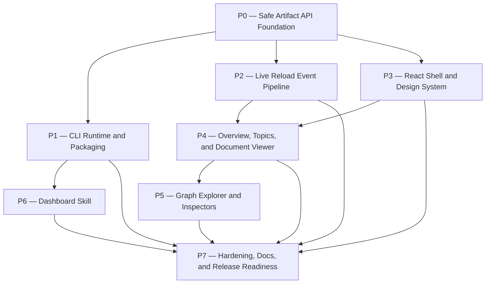

# planning-dashboard Plan

## Source Artifacts

- `.plan/planning-dashboard/proposal.md` — accepted proposal scope for the installed dashboard CLI, thin Pi skill, read-only server/API, live reload, shadcn/ui + Tailwind React client, graph explorer, and validation expectations.
- `.plan/planning-dashboard/map.nodes.jsonl` / `.plan/planning-dashboard/map.edges.jsonl` — topic map with package, skill, helper, dashboard server/client, live-reload, shadcn/Tailwind, and taste-profile references.
- `.plan/planning-dashboard/facts.nodes.jsonl` / `.plan/planning-dashboard/facts.edges.jsonl` — source-backed facts [F001]–[F015].
- `.plan/planning-dashboard/context-packs.jsonl` — `context:planning-dashboard:proposal` summary and candidate dashboard paths.
- `.plan/planning-dashboard/receipts.jsonl` — existing proposal validation receipt.
- `.plan/_index/project-graph.sqlite` and `.plan/_index/project-graph-manifest.json` — refreshed shared project index used for package/test/helper context.
- Verified project references: `file:package.json`, `file:README.md`, `file:extensions/cartographer-tools.ts`, `file:skills/plan/scripts/manage_jsonl.ts`, `file:skills/plan/scripts/validate_planning_graph.py`, `file:skills/plan/scripts/workflow_benchmark.py`, and `file:skills/plan/scripts/adr_records.py`.

## Planning Assumptions

### Confirmed facts

- The dashboard must remain read-only over repository planning artifacts and must not mutate `.plan/`, ADRs, index/cache files, or source files through its API/UI [F007] [F011].
- The installed package can expose a `cartographer-dashboard` CLI and bundle a `skills/dashboard/SKILL.md` entry through `package.json` [F005] [F006].
- Vite is suitable for development/build integration, while installed runtime mode should serve prebuilt assets instead of requiring a Vite dev server in normal use [F001].
- Hono on Node.js is the selected HTTP server stack for the local read-only API, runtime asset server, modular routes, and SSE/live-reload endpoint [F019].
- Existing Cartographer helpers provide metrics, ADR semantics, lifecycle/citation validation, and private-path safety that the dashboard should mirror or adapt rather than reinvent [F008] [F009] [F011].
- The client must use shadcn/ui for React components and Tailwind CSS for styling, design tokens, dark mode, responsive states, and tactile polish [F014] [F015] [F010].
- The repository should establish a strict full-repo ESLint flat config, typescript-eslint typed linting, and Prettier check/write baseline before heavy TS/TSX dashboard implementation expands the codebase, while excluding raw private/cache/generated artifacts [F016] [F017] [F018] [F020].
- Live reload is a v1 requirement: safe `.plan/**` changes should invalidate affected data and refresh connected pages without write access [F013].
- Tests and exploratory commands that arrange `.plan/`, index, or graph artifacts must use temporary/mock project roots, never the repository's real `.plan/` directory.

### Assumptions to carry into implementation

- ADR handling is now explicit: ADR-0003 (`docs/adr/0003-use-local-dashboard-stack-for-cartographer-planning-ui.md`) has been drafted for the selected dashboard stack decisions and should remain draft until implementation finalization can accept, update, or supersede it with validation receipts [F025].
- The dashboard source/build layout is resolved as top-level `dashboard/`: `dashboard/server/`, `dashboard/client/`, `dashboard/shared/`, packaged Vite output from the dashboard build, `bin/cartographer-dashboard.js`, and `skills/dashboard/SKILL.md` [F021].
- `status`/`stop` process metadata should be stored outside `.plan/` under XDG runtime storage when available, with an `os.tmpdir` fallback keyed by repository root hash, so runtime lifecycle does not pollute planning artifacts [F022].
- Watcher dependency choice is resolved as Chokidar for safe `.plan/**` live reload events, and the runtime HTTP library choice is resolved as Hono [F019] [F023].

### Retrieval probes used

1. Existing dashboard artifacts: `.plan/planning-dashboard/proposal.md`, map/fact JSONL, receipts, and context packs.
2. Package manifest and scripts: `package.json`, `tsconfig.json`, `npm run check`, `npm run test:ts`, and `npm run test:py`.
3. Existing extension/tool patterns: `extensions/cartographer-tools.ts` and `tests/cartographer_tools.test.ts`.
4. Planning artifact validators: `skills/plan/scripts/manage_jsonl.ts` and `skills/plan/scripts/validate_planning_graph.py`.
5. Metrics and ADR adapters: `skills/plan/scripts/workflow_benchmark.py` and `skills/plan/scripts/adr_records.py`.
6. Test fixture expectations: `tests/manage_jsonl.test.ts`, `tests/test_validate_planning_graph.py`, and temp-root fixture patterns.
7. Frontend stack requirements: Context7 docs for shadcn/ui and Tailwind CSS plus proposal facts [F014] [F015].
8. TypeScript quality tooling requirements: Context7 docs for ESLint flat config, typescript-eslint typed linting, and Prettier CLI checks plus facts [F016] [F017] [F018].
9. Prior rationale: `.plan/adr-feature/proposal.md` and `.plan/adr-feature/plan.md` as background for ADR graph/currentness semantics.

## Phase Dependency Graph

## Phase Summary

| Order | Phase ID | Phase | Depends On | Unlocks | Exit Criteria |
|---:|---|---|---|---|---|
| 0 | P0 | Safe Artifact API Foundation | none | P1, P2, P3 | TypeScript lint/format tooling is established, and the read-only artifact reader/API model blocks unsafe paths, parses core topic artifacts, and reports health from temp fixtures. |
| 1 | P1 | CLI Runtime and Packaging | P0 | P6, P7 | `cartographer-dashboard start/status/stop` contract, package bin/files updates, runtime server lifecycle, and loopback-only host enforcement are test-covered; final client asset packaging is completed in P7 after P3. |
| 2 | P2 | Live Reload Event Pipeline | P0 | P4, P7 | Safe `.plan/**` watcher, cache invalidation, and event stream deliver debounced create/edit/delete/rename notifications from temp roots. |
| 3 | P3 | React Shell and Design System | P0 | P4, P7 | Vite/React client builds with shadcn/ui + Tailwind, tactile dark tokens, route shell, and API/event client scaffolding. |
| 4 | P4 | Overview, Topics, and Document Viewer | P2, P3 | P5, P7 | Overview/topics/topic workspace, Markdown/reference resolver, Shiki viewer, evidence/receipts/health panels, and live refetch behavior work against fixtures. |
| 5 | P5 | Graph Explorer and Inspectors | P4 | P7 | React Flow graph explorer renders normalized map/fact/plan/ADR data with filters, search, inspectors, and unresolved-endpoint warnings. |
| 6 | P6 | Dashboard Skill | P1 | P7 | `skills/dashboard/SKILL.md` invokes the installed CLI, supports start/topic/status/stop, and remains a thin read-only wrapper. |
| 7 | P7 | Hardening, Docs, and Release Readiness | P1, P2, P3, P4, P5, P6 | implementation handoff complete | Full checks pass, package assets/docs are complete, private-leak/path-safety regressions are covered, and any ADR evaluation decision is recorded. |

## Phases

### Phase P0 — Safe Artifact API Foundation

- **Status:** implemented
- **Depends on:** none
- **Unlocks:** P1, P2, P3
- **Primary references:** `file:package.json`, `file:README.md`, `file:skills/plan/scripts/manage_jsonl.ts`, `file:skills/plan/scripts/validate_planning_graph.py`, `file:skills/plan/scripts/workflow_benchmark.py`, `file:skills/plan/scripts/adr_records.py`, `proposed:dashboard-server`, `constraint:ts-quality-tooling`, [F007], [F008], [F009], [F011], [F016], [F017], [F018]

#### Objective

Create the TypeScript quality baseline and Hono-backed read-only data foundation that every dashboard surface consumes: ESLint/typescript-eslint/Prettier setup, safe root/path resolution, topic artifact discovery, JSONL/Markdown parsing, health diagnostics, and helper-aligned semantic adapters [F019].

#### Scope

- Add strict full-repo ESLint flat config, typescript-eslint typed linting, Prettier config/ignore files, and package scripts before expanding TS/TSX code [F016] [F017] [F018] [F020].
- Add dashboard server/shared source layout and tests without exposing the browser UI yet, using Hono as the server framework [F019].
- Implement safe readers for `.plan/<topic>/proposal.md`, `plan.md`, map/fact/plan graph JSONL, receipts, context packs, sanitized evidence, index manifest references, and ADR graph/Markdown data where present.
- Reject path traversal, outside-root reads, and raw `.plan/_private/**` access.
- Normalize records while preserving original JSONL IDs and edge types.
- Surface parse errors, missing artifacts, broken references, private-path warnings, and stale-index hints as health data rather than throwing opaque server failures.

#### Checklist

- [x] **P0.T1** Establish the selected top-level `dashboard/server`, `dashboard/client`, and `dashboard/shared` source layout, shared TypeScript types, API response conventions, and temp-project fixture builders [F021].
- [x] **P0.T2** Implement root/path safety utilities that canonicalize paths, enforce selected repository root boundaries, and block `.plan/_private/**` reads.
- [x] **P0.T3** Implement topic discovery and safe artifact readers for proposal, plan, map/fact/plan graph JSONL, receipts, context packs, sanitized evidence, index manifest, and ADR files.
- [x] **P0.T4** Implement normalized topic, document, graph, receipt, evidence, ADR, and health models that mirror existing lifecycle, citation, and private-path semantics from Cartographer helpers.
- [x] **P0.T5** Add initial Hono read-only API handlers for overview/topic/topic-doc/topic-graph/file/ADR/health data, using temp fixtures and no mutating endpoints.
- [x] **P0.T6** Add strict full-repo TypeScript quality tooling: `eslint.config.js`, typescript-eslint typed linting, Prettier config/ignore files, devDependencies, and package scripts such as `lint:ts`, `lint:ts:fix`, `format:prettier`, and `format:prettier:check` integrated into the project quality gate for supported files while excluding raw private/cache/generated artifacts.

#### Validation

- [x] **P0.V1** Run `npm run test:ts -- tests/dashboard/artifact-reader.test.ts tests/dashboard/api-health.test.ts`; expect temp-root fixtures to pass path safety, artifact parsing, health warnings, and no-write assertions.
- [x] **P0.V2** Run `npm run typecheck`; expect dashboard server/shared types to be included and strict TypeScript to pass.
- [x] **P0.V3** Manually inspect the API route list and verify there are no mutating HTTP verbs or endpoints for `.plan/`, ADR, index, or source-file writes.
- [x] **P0.V4** Run `npm run lint:ts && npm run format:prettier:check`; expect strict full-repo ESLint/typescript-eslint and Prettier checks to pass for supported files, with explicit ignores for private/cache/generated artifacts.

#### Exit Criteria

- Strict full-repo ESLint flat config, typescript-eslint typed linting, Prettier config, ignore files, and package scripts are in place and runnable for supported files.
- Dashboard server/shared foundations can read fixture planning artifacts and return normalized JSON for all v1 artifact categories.
- Unsafe paths, missing files, malformed JSONL, and private references are represented as health results.
- No test or code path arranges data inside the repository's real `.plan/` directory.

#### Risks and Mitigations

- **Risk:** The dashboard drifts from Cartographer validation semantics. **Mitigation:** Centralize citation/lifecycle/private-path rules and test against fixtures derived from `manage_jsonl.ts` behavior [F011].
- **Risk:** The server accidentally exposes private inputs. **Mitigation:** Deny `.plan/_private/**` before file reads and add regression tests for encoded/relative traversal variants.
- **Risk:** Artifact schema variations cause brittle APIs. **Mitigation:** Preserve raw records in detail payloads and downgrade unknown fields to warnings.
- **Risk:** New lint/format rules create broad unrelated churn. **Mitigation:** Apply the user-selected strict full-repo baseline deliberately, use ignore patterns for private/cache/generated artifacts, and make baseline formatting/lint fixes in the same phase before larger TS work begins [F016] [F017] [F018] [F020].

#### Notes for Execution Agent

Start with TypeScript quality tooling, temp fixture helpers, and safety utilities before adding API breadth. Prefer small pure functions for parsers/normalizers so later UI and graph tests can reuse them.

### Phase P1 — CLI Runtime and Packaging

- **Status:** pending
- **Depends on:** P0
- **Unlocks:** P6, P7
- **Primary references:** `file:package.json`, `proposed:bin-cartographer-dashboard`, `proposed:dashboard-server`, `dependency:npm:hono`, [F001], [F006], [F019]

#### Objective

Expose an installed `cartographer-dashboard` CLI that owns the local Hono server lifecycle, package metadata, runtime asset serving hook, port/root/topic options, JSON status output, and loopback-only host enforcement. Final prebuilt client asset packaging is verified in P7 after the P3 client build exists [F019].

#### Scope

- Add the package `bin` entry, package `files` entries, Hono runtime dependency, and supporting runtime source for `cartographer-dashboard start|status|stop`.
- Implement `--root`, `--topic`, `--host`, `--port`, `--open`, and `--json` options from the proposal.
- Default host binding to loopback, reject non-loopback hosts for v1, and store process/status metadata outside `.plan/`.
- Add the runtime static-asset serving hook, but defer final prebuilt client asset packaging verification to P7 after the P3 client build exists; reserve Vite's programmatic server path for development mode only [F001].

#### Checklist

- [ ] **P1.T1** Add `bin/cartographer-dashboard.js` and package manifest wiring for the selected top-level dashboard runtime/build layout [F021].
- [ ] **P1.T2** Implement `start` with root validation, port selection, loopback host default, non-loopback host rejection, optional topic deep link, optional browser open, JSON output, and runtime asset serving hook.
- [ ] **P1.T3** Implement `status` and `stop` using XDG runtime metadata or an `os.tmpdir` fallback outside `.plan/`, including stale PID cleanup and root-hash-specific status keys [F022].
- [ ] **P1.T4** Update package bin/files/build-script scaffolding so dashboard runtime assets can be included after the P3 client build while transient build/test outputs remain excluded.
- [ ] **P1.T5** Add lifecycle tests for start/status/stop on ephemeral ports and temporary project roots.

#### Validation

- [ ] **P1.V1** Run `npm run test:ts -- tests/dashboard/cli.test.ts`; expect CLI contract, JSON output, ephemeral ports, root selection, topic deep links, status, stop behavior, and rejection of `0.0.0.0`, `::`, and other non-loopback hosts to pass.
- [ ] **P1.V2** Run `node bin/cartographer-dashboard.js start --root "$(mktemp -d)" --host 127.0.0.1 --port 0 --json` in a bounded integration test or test harness; expect loopback-only URL, `mode: "read-only"`, PID/status metadata under XDG runtime/tmp storage outside `.plan/`, and clean shutdown [F022].
- [ ] **P1.V3** Run `npm run check:scripts && npm run typecheck`; expect package entrypoints and TypeScript checks to pass.

#### Exit Criteria

- Users can invoke `cartographer-dashboard start|status|stop` from the installed package contract.
- Runtime metadata does not mutate `.plan/`.
- Non-loopback host requests are rejected for v1.
- Package manifest includes the CLI/runtime scaffolding; final built client asset inclusion is verified in P7.

#### Risks and Mitigations

- **Risk:** Installed package runtime differs from development server behavior. **Mitigation:** Separate runtime asset serving from development/Vite mode, add the static-asset hook in P1, and verify final built client assets in P7.
- **Risk:** PID/status state becomes stale. **Mitigation:** Validate process liveness on `status` and clean stale metadata on `start`/`stop`.
- **Risk:** Package size grows unexpectedly. **Mitigation:** Keep `files` explicit and review build artifacts in P7.

#### Notes for Execution Agent

Do not introduce a Pi extension command for v1. The CLI is the product surface that the later skill wraps.

### Phase P2 — Live Reload Event Pipeline

- **Status:** pending
- **Depends on:** P0
- **Unlocks:** P4, P7
- **Primary references:** `proposed:dashboard-server`, `constraint:plan-live-reload`, [F013], [F011]

#### Objective

Make the server observe safe `.plan/**` changes, invalidate affected cached data, and notify connected clients through a stable live-reload event stream without adding write capabilities.

#### Scope

- Watch safe planning-artifact paths under the selected repository root.
- Ignore `.plan/_private/**`, `.plan/_index/**` raw cache internals unless the event is summarized as a stale-index hint, and any outside-root paths.
- Debounce/coalesce rapid writes and classify events by affected topic/global resource.
- Expose `GET /api/events` using server-sent events unless implementation evidence shows a stronger alternative.
- Provide a disconnected/manual-refresh state for clients when streaming is unavailable.

#### Checklist

- [ ] **P2.T1** Add Chokidar as the selected watcher implementation and document dependency impact, ignore patterns, await-write-finish/atomic-write behavior, and known platform limitations [F023].
- [ ] **P2.T2** Implement safe Chokidar watch registration for `.plan/**` with private-path exclusion and root-bound path normalization [F023].
- [ ] **P2.T3** Implement debounced event coalescing, topic/global cache invalidation, and event payloads like `{ type, topic?, paths, changedAt }`.
- [ ] **P2.T4** Implement `GET /api/events` and connection lifecycle handling for reconnects, heartbeat/keepalive, and stream closure.
- [ ] **P2.T5** Add client-consumable event status metadata for connected, reconnecting, disconnected, and manual-refresh states.

#### Validation

- [ ] **P2.V1** Run `npm run test:ts -- tests/dashboard/live-reload.test.ts`; expect temp-root create/edit/delete/rename events to produce debounced reload notifications and correct topic attribution.
- [ ] **P2.V2** Run `npm run test:ts -- tests/dashboard/private-watch.test.ts`; expect `.plan/_private/**` changes and traversal attempts to produce no client-visible file details.
- [ ] **P2.V3** Run `npm run typecheck`; expect event types, cache invalidation code, and stream handlers to pass strict checks.

#### Exit Criteria

- Safe `.plan` changes are observable and clients can refetch affected resources without manual browser refresh.
- Private changes are ignored or redacted and never surfaced as raw paths/content.
- Event streaming failure is visible to users as a reconnect/manual-refresh state.

#### Risks and Mitigations

- **Risk:** File watchers behave differently across platforms. **Mitigation:** Keep watcher abstraction small, document fallback behavior, and test through temporary directories.
- **Risk:** Rapid JSONL writes create noisy reloads. **Mitigation:** Debounce and coalesce events by topic/resource.
- **Risk:** Event payload leaks sensitive paths. **Mitigation:** Normalize and redact before publishing events.

#### Notes for Execution Agent

Keep live reload separate from Vite hot module reload. This phase is about planning-data reloads from `.plan`, not frontend source development HMR.

### Phase P3 — React Shell and Design System

- **Status:** pending
- **Depends on:** P0
- **Unlocks:** P4, P7
- **Primary references:** `proposed:dashboard-client`, `constraint:shadcn-tailwind`, `external:taste-profile`, [F010], [F014], [F015]

#### Objective

Create the Vite/React client foundation with shadcn/ui components, Tailwind CSS styling, route shell, API client boundaries, live-connection state, and tactile dark design tokens.

#### Scope

- Add Vite/React client source and build wiring.
- Configure Tailwind CSS with the Vite integration and CSS entrypoint [F015].
- Initialize shadcn/ui-compatible aliases/component layout and add the minimal v1 component set [F014].
- Implement the dark tactile cockpit shell: layered surfaces, category colors, focus rings, reduced-motion support, and feedback states [F010].
- Add API/event client scaffolding without completing feature pages yet.

#### Checklist

- [ ] **P3.T1** Add Vite/React client project wiring under `dashboard/client`, build scripts, TypeScript config inclusion, shadcn-compatible aliases, and runtime asset output paths [F021].
- [ ] **P3.T2** Configure Tailwind CSS and semantic CSS variables for dark tactile surfaces, category colors, spacing, borders, elevation, and state tokens.
- [ ] **P3.T3** Initialize shadcn/ui-compatible aliases and add core components for button, card, badge, tabs, sheet/dialog/drawer, tooltip, dropdown menu, scroll area, table, command/search, separator, skeleton, toast/sonner, and form controls.
- [ ] **P3.T4** Build the application shell with left navigation, top status bar, route container, inspector region, live-connection indicator, keyboard focus states, and reduced-motion handling.
- [ ] **P3.T5** Add Vitest Browser Mode coverage for key shadcn component rendering, Tailwind token availability, shell responsiveness, focus states, and reduced-motion behavior [F024].

#### Validation

- [ ] **P3.V1** Run the Vitest Browser Mode client shell tests, such as `npm run test:browser -- tests/dashboard/client-shell.test.tsx`; expect shadcn components, route shell, live-state UI, keyboard focus, and reduced-motion behavior to pass [F024].
- [ ] **P3.V2** Run the dashboard client build command added in this phase, such as `npm run dashboard:build`; expect Tailwind CSS output and Vite assets to build without errors.
- [ ] **P3.V3** Run `npm run typecheck`; expect TS/TSX client source, aliases, and shared API types to pass strict checks.

#### Exit Criteria

- The client shell builds and renders with shadcn/ui + Tailwind CSS.
- The visual foundation visibly follows the tactile dark taste profile rather than generic defaults.
- Later feature pages can consume stable API and live-event client utilities.

#### Risks and Mitigations

- **Risk:** shadcn/ui defaults are accepted without product-specific polish. **Mitigation:** Define theme tokens and component variants before page implementation [F010].
- **Risk:** Frontend tooling conflicts with existing NodeNext TypeScript setup. **Mitigation:** Isolate dashboard client config while keeping top-level typecheck/build scripts explicit.
- **Risk:** CSS output is not packaged. **Mitigation:** Tie Vite build output into P1/P7 package checks.

#### Notes for Execution Agent

Use copied shadcn/ui component code for local customization. Do not introduce a separate black-box component library that bypasses the requested shadcn/Tailwind stack.

### Phase P4 — Overview, Topics, and Document Viewer

- **Status:** pending
- **Depends on:** P2, P3
- **Unlocks:** P5, P7
- **Primary references:** `proposed:dashboard-client`, `proposed:dashboard-server`, `file:skills/plan/scripts/workflow_benchmark.py`, `file:skills/plan/scripts/manage_jsonl.ts`, `file:skills/plan/scripts/adr_records.py`, [F003], [F007], [F008], [F009], [F011], [F013]

#### Objective

Implement the primary human review workflow: overview metrics, topics list, topic detail workspace, health panels, Markdown/fact/source/reference resolution, receipts/evidence views, Shiki-powered document/code viewer, and live refetch behavior.

#### Scope

- Build overview, topics/plans, topic detail, document viewer, health, receipts, and evidence surfaces.
- Render Markdown safely, link fact citations and unambiguous short-form fact references, and share resolver semantics with graph/detail inspectors.
- Show source/fact/file/phase/ADR details in drawers or inspectors.
- Use Shiki for code fences/source viewing and line anchors [F003].
- React to live reload events by refetching affected overview/topic/document/health data [F013].

#### Checklist

- [ ] **P4.T1** Implement overview metrics and recent activity using topic artifacts, receipts, validation health, workflow metrics, and ADR summaries.
- [ ] **P4.T2** Implement topics/plans listing with proposal/plan presence, lifecycle/status, current phase, validations, graph counts, receipts, evidence, and ADR links.
- [ ] **P4.T3** Implement topic detail workspace with proposal, plan, facts, evidence, receipts, health, graph entry, and files tabs.
- [ ] **P4.T4** Implement safe Markdown rendering, fact/source/map/plan/ADR/file reference resolver, broken/ambiguous link UI, and detail drawers.
- [ ] **P4.T5** Implement Shiki document/code viewer with line numbers, line anchors, selected-line highlighting, copy path/link actions, preview/source toggle, and blocked-state UI.
- [ ] **P4.T6** Wire live reload events so visible overview/topic/doc/health resources refetch when affected `.plan` files change.

#### Validation

- [ ] **P4.V1** Run `npm run test:ts -- tests/dashboard/topic-pages.test.tsx`; expect overview, topics, topic workspace, health, receipts, evidence, and ADR summary views to render from temp fixtures.
- [ ] **P4.V2** Run `npm run test:ts -- tests/dashboard/reference-resolver.test.ts tests/dashboard/markdown-viewer.test.tsx`; expect canonical fact citations, unambiguous short forms, broken/ambiguous links, Shiki output, line anchors, and blocked private/outside-root states to pass.
- [ ] **P4.V3** Run `npm run test:ts -- tests/dashboard/live-refetch.test.tsx`; expect visible data to refresh after relevant debounced `.plan` events and show manual-refresh state when the event stream drops.
- [ ] **P4.V4** Run the dashboard client build command; expect no rendering/build regressions from Shiki and Markdown dependencies.

#### Exit Criteria

- A user can browse topics, read proposal/plan/evidence/receipts, follow citations, and inspect referenced safe files without using the terminal.
- Broken or unsafe references appear as visible health states.
- Live `.plan` changes refresh visible dashboard data.

#### Risks and Mitigations

- **Risk:** Resolver behavior differs between Markdown and graph surfaces. **Mitigation:** Implement one shared resolver and test both consumers against the same fixtures.
- **Risk:** Code viewer grows into an editor. **Mitigation:** Keep v1 read-only: no edits, LSP, terminal, or file creation.
- **Risk:** Shiki increases bundle/runtime cost. **Mitigation:** Lazy-load viewer/highlighter where practical and measure build output in P7.

#### Notes for Execution Agent

Focus this phase on reading and navigation. Do not begin the full graph explorer until core detail drawers and resolver semantics are stable.

### Phase P5 — Graph Explorer and Inspectors

- **Status:** pending
- **Depends on:** P4
- **Unlocks:** P7
- **Primary references:** `proposed:dashboard-client`, `proposed:dashboard-server`, [F002], [F004], [F009], [F011]

#### Objective

Add the interactive graph view over normalized map, fact, plan, receipt/validation, implementation, and ADR relationships while preserving original JSONL IDs and making unresolved relationships visible.

#### Scope

- Normalize map/fact/plan/ADR graph layers for React Flow.
- Implement graph explorer route, layer/type/relationship filters, search, minimap, controls, fit-to-view, background grid, and focused highlight chains.
- Reuse P4 inspectors for node/edge details, safe file/URL/document routing, and health warnings.
- Render unresolved endpoints rather than silently dropping them.

#### Checklist

- [ ] **P5.T1** Implement graph normalization for map, source, fact, plan, validation, receipt, implementation, proposed-artifact, and ADR nodes/edges.
- [ ] **P5.T2** Implement React Flow graph canvas with custom node/edge types, minimap, controls, background, fit-to-view, and accessible selection behavior [F002].
- [ ] **P5.T3** Implement layer toggles, type filters, relationship filters, text search, and status/color legends.
- [ ] **P5.T4** Implement node/edge click routing to inspectors, safe file/URL/document viewer targets, and warning states.
- [ ] **P5.T5** Implement chain highlighting for proposal claim → fact → source and phase → files → validations → receipts.

#### Validation

- [ ] **P5.V1** Run `npm run test:ts -- tests/dashboard/graph-normalizer.test.ts`; expect graph normalization from JSONL fixtures, original ID preservation, unresolved endpoint records, and ADR relationship inclusion to pass.
- [ ] **P5.V2** Run `npm run test:ts -- tests/dashboard/graph-explorer.test.tsx`; expect React Flow render smoke tests, filter/search behavior, node/edge routing, and inspector integration to pass.
- [ ] **P5.V3** Run the dashboard client build command; expect React Flow assets and graph UI to build without regressions.

#### Exit Criteria

- Users can explore topic-scoped map/fact/plan/ADR relationships interactively.
- Filters/search/inspectors make noisy graphs navigable.
- Graph health matches the same resolver and validation semantics as Markdown/topic views.

#### Risks and Mitigations

- **Risk:** Graphs become visually overwhelming. **Mitigation:** Start topic-scoped, default to useful layers, and provide search/filter/minimap controls.
- **Risk:** React Flow state diverges from normalized records. **Mitigation:** Test normalization separately from rendering and preserve raw record payloads.
- **Risk:** Unresolved endpoints disappear. **Mitigation:** Model unresolved endpoints as warning nodes/edges and include them in health panels.

#### Notes for Execution Agent

Reuse P4 drawers and resolver code. Do not create a second graph-specific detail model unless it wraps the shared detail payload.

### Phase P6 — Dashboard Skill

- **Status:** pending
- **Depends on:** P1
- **Unlocks:** P7
- **Primary references:** `file:package.json`, `proposed:skills-dashboard`, `proposed:bin-cartographer-dashboard`, [F005], [F006], [F012]

#### Objective

Add the thin packaged Pi skill that invokes the installed dashboard CLI for start/topic/status/stop flows without duplicating server logic or requiring a Pi extension command in v1.

#### Scope

- Add `skills/dashboard/SKILL.md` with description/frontmatter that loads for dashboard start/open/view/status/stop requests.
- Document command behavior for no argument, topic argument, `status`, and `stop`.
- Call `cartographer-dashboard` from PATH first, then a package-relative CLI path fallback if needed.
- Report read-only mode and URL/status clearly.
- Ensure package manifest skill resource inclusion remains correct.

#### Checklist

- [ ] **P6.T1** Add `skills/dashboard/SKILL.md` with purpose, usage examples, read-only statement, and CLI invocation contract.
- [ ] **P6.T2** Document topic deep-link behavior and status/stop examples using the CLI JSON contract.
- [ ] **P6.T3** Add package-relative fallback guidance for missing PATH entry without embedding server startup logic in the skill.
- [ ] **P6.T4** Add tests or documentation checks that verify the skill exists, has valid frontmatter, and references the installed CLI contract.

#### Validation

- [ ] **P6.V1** Run `python -m unittest discover tests -p test_workflow_docs.py` or the updated docs/skill validation test; expect the dashboard skill frontmatter and examples to validate.
- [ ] **P6.V2** Run `npm run check:scripts`; expect packaged skill paths and extension script checks to pass.
- [ ] **P6.V3** Manually verify `skills/dashboard/SKILL.md` does not duplicate server code or imply write access.

#### Exit Criteria

- `/skill:dashboard` has clear behavior for start/topic/status/stop and delegates to the installed CLI.
- The skill explicitly states v1 is read-only.
- No new Pi extension command/tool is required for v1.

#### Risks and Mitigations

- **Risk:** Skill behavior drifts from CLI behavior. **Mitigation:** Keep examples in terms of CLI commands and JSON output.
- **Risk:** Skill command name conflicts later. **Mitigation:** Use `dashboard` for v1 unless a package-level naming conflict is discovered during implementation.
- **Risk:** Skill hides install failures. **Mitigation:** Report missing CLI/package fallback failures clearly.

#### Notes for Execution Agent

The skill should be documentation/procedure, not a second implementation of process management.

### Phase P7 — Hardening, Docs, and Release Readiness

- **Status:** pending
- **Depends on:** P1, P2, P3, P4, P5, P6
- **Unlocks:** implementation handoff complete
- **Primary references:** `file:README.md`, `file:package.json`, `file:AGENTS.md`, `external:taste-profile`, [F010], [F011], [F013], [F014], [F015]

#### Objective

Harden the complete dashboard feature for package use: full validation, docs, accessibility/read-only/private-leak regression coverage, runtime asset packaging, performance sanity checks, and ADR evaluation if implementation decisions warrant it.

#### Scope

- Expand fixture coverage and ensure all dashboard tests use temporary/mock roots.
- Run full package validation and address regressions.
- Confirm runtime assets and dependencies are packaged correctly.
- Document CLI/skill usage, read-only behavior, live reload, privacy boundaries, and development commands.
- Review UI polish against the tactile dark taste profile.
- Evaluate ADR need if the implementation made durable architecture decisions not already captured by proposal metadata.

#### Checklist

- [ ] **P7.T1** Add a small Playwright smoke suite for CLI + server + browser + live reload against disposable repositories with proposal/plan/fact/map/receipt/evidence/ADR artifacts [F024].
- [ ] **P7.T2** Add private-leak and path-traversal regression tests across API, file viewer, live reload events, graph inspectors, and rendered Markdown links.
- [ ] **P7.T3** Verify runtime asset packaging, dependency declarations, package `files`, build scripts, and installed-mode startup from the selected top-level dashboard package-like layout [F021].
- [ ] **P7.T4** Update README/development docs for `cartographer-dashboard`, `/skill:dashboard`, read-only guarantees, live reload behavior, shadcn/Tailwind development, and temp-fixture testing rules.
- [ ] **P7.T5** Perform tactile UI acceptance review for depth, feedback states, motion, focus rings, category colors, reduced-motion support, and non-color status labels.
- [ ] **P7.T6** Update and accept, or explicitly supersede, draft ADR-0003 after final implementation validation receipts exist; if implementation choices materially change, rerun `cartographer_adr evaluate` before finalizing [F025].

#### Validation

- [ ] **P7.V1** Run `npm run check`; expect Python/TypeScript checks, lint/format checks, unit tests, and dashboard-specific tests to pass.
- [ ] **P7.V2** Run `cartographer_jsonl validate-topic --root "$PWD" --topic planning-dashboard`; expect all proposal/plan/map/fact/receipt/context artifacts to validate.
- [ ] **P7.V3** Run `python skills/plan/scripts/validate_planning_graph.py --root "$PWD" --topic planning-dashboard --json`; expect the final plan graph to validate after phase status updates.
- [ ] **P7.V4** Run the Playwright smoke path or manually smoke-test `cartographer-dashboard start --root <temp-fixture-root> --open --json`, topic deep link, live reload, graph explorer, document viewer, and `cartographer-dashboard stop`; fixture setup may write `.plan/`, but the dashboard process itself must not write to the fixture `.plan/` [F024].
- [ ] **P7.V5** Run the project-specific docs/skill/package checks added in earlier phases; expect CLI, skill, runtime asset documentation, and ADR-0003 finalization guidance to remain synchronized [F025].

#### Exit Criteria

- Full validation passes and receipts are available for implementation finalization.
- Runtime dashboard starts from the installed package contract and renders complete v1 surfaces.
- Read-only/privacy boundaries are tested across server, client, live reload, and graph/document viewers.
- Documentation explains how users and agents should start, stop, and validate the dashboard.
- ADR-0003 is accepted, updated, or superseded with final implementation validation receipts.

#### Risks and Mitigations

- **Risk:** Full `npm run check` becomes slow or flaky due to browser/UI tests. **Mitigation:** Keep most tests unit/integration-level with temp fixtures; reserve browser smoke for bounded scripts or manual validation if necessary.
- **Risk:** Runtime packaging misses client assets. **Mitigation:** Validate from a package-like layout, not only dev server mode.
- **Risk:** UI polish slips after functional work. **Mitigation:** Treat P7.T5 as required acceptance, backed by [F010].

#### Notes for Execution Agent

Do not mark implementation complete until deterministic checks and a semantic auditor pass. If a large dependency or server framework choice becomes contentious, stop and ask before shipping it.

## Cross-Phase Validation

- [ ] **CV.V1** After each phase that changes executable code, run the narrow phase tests and `npm run typecheck` before moving to the next phase.
- [ ] **CV.V7** After P0 establishes TS quality tooling, run `npm run lint:ts && npm run format:prettier:check` after each TS/TSX-heavy phase.
- [ ] **CV.V2** After any change to planning artifacts, run `cartographer_jsonl validate-topic --root "$PWD" --topic planning-dashboard`.
- [ ] **CV.V3** After plan graph or phase-status updates, run `python skills/plan/scripts/validate_planning_graph.py --root "$PWD" --topic planning-dashboard --json`.
- [ ] **CV.V4** Before final handoff, run `npm run check` and record validation output in `.plan/planning-dashboard/receipts.jsonl`.
- [ ] **CV.V5** Confirm all tests and manual fixture commands arrange `.plan/`, index, evidence, and graph data under temporary/mock roots, not the real repository `.plan/` directory.
- [ ] **CV.V6** Confirm the dashboard exposes no mutating UI controls or HTTP endpoints in v1.

## Open Questions

No user-blocking open questions remain for planning. The implementation agent should resolve these bounded engineering choices inside the relevant phases and stop only if they materially change scope or dependency risk:

- P0/P1: source/build layout is resolved as top-level `dashboard/` with `bin/cartographer-dashboard.js`; lint/format scope is resolved as strict full-repo for supported files with private/cache/generated exclusions [F020] [F021].
- P1/P2: status metadata location is resolved as XDG runtime/tmp keyed by repository root hash [F022]; watcher dependency strategy is resolved as Chokidar [F023].
- P3/P7: browser/UI test depth is resolved as Vitest Browser Mode for key React coverage plus a small Playwright smoke suite for CLI/server/browser/live-reload flows [F024].
- P7: ADR policy is resolved as draft now, then accept/update/supersede ADR-0003 at implementation finalization with validation receipts [F025].

## Handoff Guidance

- Execute phases in topological order. P1, P2, and P3 may proceed in parallel only after P0 is complete and their contracts are stable.
- Use focused context packs and `cartographer_artifacts` summaries for each implementation handoff; do not pass raw `.plan/_private/**` paths or broad repository dumps.
- Keep every test fixture that creates `.plan/`, index, evidence, or graph artifacts under a temporary/mock root.
- Treat the dashboard as read-only throughout v1. Any proposed write endpoint, editor affordance, or `.plan/` mutation is a scope change and should stop for review.
- Preserve phase/task/validation IDs when updating this plan during implementation.
- Establish and use strict full-repo ESLint/typescript-eslint/Prettier gates before large TS/TSX additions so later phases do not accumulate avoidable style or type-lint debt [F020].
- After deterministic validation for each phase, request a semantic review from `cartographer-auditor`; use fallback reviewer/oracle only with explicit receipt and residual-risk notes.
- Finalization should update and accept, or explicitly supersede, draft ADR-0003 after implementation validation receipts exist; rerun `cartographer_adr evaluate` if implementation choices materially diverge [F025].
