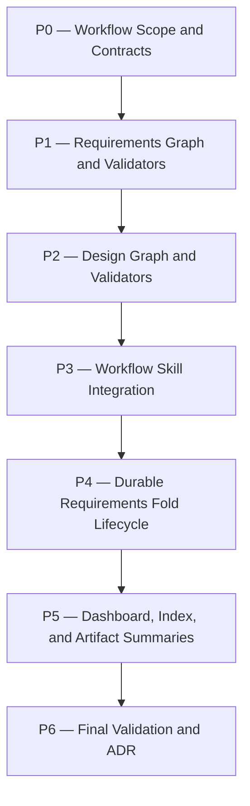

# proposal-design-split Plan

## Source Artifacts

- Proposal: `.plan/proposal-design-split/proposal.md`
- Map graph: `.plan/proposal-design-split/map.nodes.jsonl`, `.plan/proposal-design-split/map.edges.jsonl`
- Fact graph: `.plan/proposal-design-split/facts.nodes.jsonl`, `.plan/proposal-design-split/facts.edges.jsonl`
- Receipts/context: `.plan/proposal-design-split/receipts.jsonl`, `.plan/proposal-design-split/context-packs.jsonl`
- Shared index: `.plan/_index/project-graph.sqlite`, `.plan/_index/project-graph-manifest.json`
- Primary implementation references: `file:skills/proposal/SKILL.md`, `file:skills/plan/SKILL.md`, `file:skills/implement/SKILL.md`, `file:skills/plan/scripts/manage_jsonl.ts`, `file:skills/plan/scripts/validate_planning_graph.py`, `file:README.md`, `dir:docs/adr`

## Planning Assumptions

### Confirmed facts

- The proposal structure should remain the same through the non-design sections: Description, Problem Statement, Goals, Non-Goals, Background, Viability, risks, and ADR metadata stay in `proposal.md` [F001][F003].
- Requirement artifacts are required by scope/risk: small changes that do not affect a core user workflow do not need requirements/design graph artifacts by default [F019].
- For scoped changes, Cartographer topics map to OpenSpec-style changes, and topic-local requirement deltas fold into durable `docs/requirements.md` or split requirements docs after implementation/archive [F014][F016].
- Requirements are behavioral contracts, not implementation plans; design and plan artifacts own implementation detail [F007].
- Design must be graph-backed from the first implementation for scoped changes, using a Decision + Alternative MVP schema with full implementation traceability documented as a fast-follow [F015][F020].
- OpenSpec import/export is not in this first implementation, but domains, requirement/scenario structure, change types, schema metadata, validation status, and archive concepts must map cleanly for a future adapter [F012][F018].
- Existing `plan.md`, `plan.nodes.jsonl`, `plan.edges.jsonl`, receipts, and context packs remain authoritative for implementation execution [F009][F010].

### ADR intent

- `adr_required`: true
- `adr_reason`: The accepted proposal changes Cartographer's durable workflow architecture and artifact dependency model by introducing requirements/design graph phases, durable requirements docs, and the Cartographer-native/OpenSpec-compatible boundary.
- `adr_options_status`: required-before-finalization
- `adr_tool_mode`: evaluate-now-write-after-validation

Implementation finalization must run `cartographer_adr` after deterministic validation and final auditor PASS. The ADR should cite validation receipts and source commits; it must not cite raw private paths.

### Implementation assumptions

- The first implementation should be Cartographer-native only: no OpenSpec import/export commands yet [F012][F018].
- New tests must use temp/mock roots and must not write to the repository's real `.plan/` outside this planning topic.
- Existing validators and read-only artifact summaries should be extended rather than replaced [F011].

## Phase Dependency Graph

## Phase Summary

| Order | Phase ID | Phase | Depends On | Unlocks | Exit Criteria |
| ----: | -------- | ----- | ---------- | ------- | ------------- |
| 0 | P0 | Workflow Scope and Contracts | none | P1 | Scope gate, artifact lifecycle, and schema contracts are documented and tested. |
| 1 | P1 | Requirements Graph and Validators | P0 | P2 | Requirements artifacts validate in temp projects and support topic/change delta semantics. |
| 2 | P2 | Design Graph and Validators | P1 | P3 | Decision + Alternative design graph validates and links to requirements. |
| 3 | P3 | Workflow Skill Integration | P2 | P4 | Proposal, requirements/design, plan, and implement skills describe the new lifecycle coherently. |
| 4 | P4 | Durable Requirements Fold Lifecycle | P3 | P5 | `docs/requirements.md` fold/archive semantics and helper/validation behavior are implemented. |
| 5 | P5 | Dashboard, Index, and Artifact Summaries | P4 | P6 | Index, dashboard/artifact summaries, and docs surface requirements/design/fold artifacts safely. |
| 6 | P6 | Final Validation and ADR | P5 | none | Full checks, topic/graph validation, auditor PASS, and ADR handling are complete. |

## Phases

### Phase P0 — Workflow Scope and Contracts

- **Status:** complete
- **Depends on:** none
- **Unlocks:** P1
- **Primary references:** `file:README.md`, `file:skills/proposal/SKILL.md`, `file:skills/plan/SKILL.md`, `doc:AGENTS.md#cartographer-state-discipline`, [F001], [F003], [F019]

#### Objective

Define the durable workflow contract before changing validators or skills: proposal sections stay intact through design, requirements/design artifacts are scope-gated like ADRs, and topic/change lifecycle terms are consistent.

#### Scope

- Document that `proposal.md` keeps current non-design sections.
- Define the requirements/design scope gate: required when a change impacts core user workflows or has comparable product/contract risk; optional for small non-core changes.
- Define the topic/change lifecycle vocabulary and transition points.
- Add tests for workflow docs so future edits do not regress the contract.

#### Checklist

- [x] **P0.T1** Update README workflow overview to show `proposal -> requirements delta -> design -> plan -> implement -> fold requirements` for scoped changes.
- [x] **P0.T2** Document the ADR-style scope gate for requirements/design artifacts, including the small non-core-workflow exemption.
- [x] **P0.T3** Update proposal-skill contract so `Description`, `Problem Statement`, `Goals`, `Non-Goals`, `Background`, `Viability`, risks, and ADR metadata remain in `proposal.md`, while detailed design moves out.
- [x] **P0.T4** Add or update workflow documentation tests that assert the proposal split, scope gate, and topic/change vocabulary appear in the expected docs/skills.

#### Validation

- [x] **P0.V1** Run `python -m unittest discover tests -p 'test_workflow_docs.py'` and confirm workflow documentation tests pass.
- [x] **P0.V2** Run `rg -n "requirements delta|core user workflow|docs/requirements|topic.*change|## Design" README.md skills/proposal/SKILL.md skills/plan/SKILL.md skills/implement/SKILL.md` and confirm the contract is discoverable.
- [x] **P0.V3** Run `npm run format:prettier:check` after Markdown edits and confirm formatting passes or only pre-existing unrelated formatting issues remain.
- [x] **P0.V4** Run topic and planning graph validation after P0 plan/checkoff updates and confirm both pass.

#### Exit Criteria

- The workflow contract is documented in repo-facing docs and skill instructions.
- Tests guard against accidentally removing proposal background/problem sections or making requirements mandatory for tiny non-core changes.
- No validators or runtime behavior have been changed before the scope language is stable.

#### Risks and Mitigations

- **Risk:** Requirements become mandatory ceremony for every change. **Mitigation:** Encode the small non-core-workflow exemption explicitly [F019].
- **Risk:** Proposal becomes too thin. **Mitigation:** Tests assert Problem Statement and Background remain part of proposal workflow [F001][F003].

#### Notes for Execution Agent

Do not implement helper schemas in this phase. Keep this phase to docs/skill contract and tests so later phases can align to stable language.

### Phase P1 — Requirements Graph and Validators

- **Status:** complete
- **Depends on:** P0
- **Unlocks:** P2
- **Primary references:** `artifact:requirements.md`, `artifact:requirements.nodes.jsonl`, `artifact:requirements.edges.jsonl`, `file:skills/plan/scripts/manage_jsonl.ts`, `file:skills/plan/scripts/validate_planning_graph.py`, [F002], [F006], [F007], [F013], [F014], [F018]

#### Objective

Add Cartographer-native topic-local requirements delta artifacts and deterministic validation for requirement/scenario records.

#### Scope

- Define first-version requirement node and edge schema.
- Support ADDED/MODIFIED/REMOVED and reserve/allow RENAMED-style compatibility metadata for future OpenSpec import/export [F018].
- Validate scenarios, requirement IDs, source/fact links, durable requirement references, and no-private-reference rules.
- Keep requirements behavioral and separate from implementation plan details [F007].

#### Checklist

- [x] **P1.T1** Extend topic artifact discovery/validation to recognize `.plan/<topic>/requirements.md`, `requirements.nodes.jsonl`, and `requirements.edges.jsonl`.
- [x] **P1.T2** Implement requirement node validation for stable IDs, `type`, `change_type`, `domain`, `priority`, `status`, statement/summary, scenario refs, source/fact refs, and optional durable requirement refs.
- [x] **P1.T3** Implement requirement edge validation for `satisfies_goal`, `derived_from`, `supported_by`, `constrains`, `supersedes`, `modifies`, `removes`, `renames`, `validated_by`, and `folds_into`-style relationships as applicable.
- [x] **P1.T4** Add citation validation so `requirements.md`, `design.md`, and `plan.md` can cite requirement IDs and scenario IDs without false fact-citation failures.
- [x] **P1.T5** Add temp-root tests for valid/invalid requirements artifacts, unsupported facts, unresolved durable requirement refs, private path rejection, and OpenSpec-shaped delta sections.

#### Validation

- [x] **P1.V1** Run `npm run test:ts -- tests/manage_jsonl.test.ts tests/cartographer_tools.test.ts` and confirm requirements summary/validation behavior passes.
- [x] **P1.V2** Run `python -m unittest discover tests -p 'test_validate_planning_graph.py'` and confirm planning graph validation accepts valid requirements artifacts and rejects invalid references.
- [x] **P1.V3** Run `npm run check:scripts` and confirm TypeScript/Python helper syntax passes.

#### Exit Criteria

- Requirements artifacts are optional when absent but strictly validated when present.
- Requirement IDs and scenario IDs can be referenced by later artifacts.
- Validation errors explain unresolved refs, duplicate IDs, invalid change types, private references, and unsupported source claims.

#### Risks and Mitigations

- **Risk:** Requirements schema overfits OpenSpec document conventions. **Mitigation:** Keep Cartographer graph records authoritative and treat OpenSpec as compatibility shape only [F012].
- **Risk:** Future import/export needs data not captured now. **Mitigation:** Preserve domains, scenarios, change types, and archive/fold metadata from the start [F018].

#### Notes for Execution Agent

Use temp/mock projects in tests. Do not create real `docs/requirements.md` or mutate this topic's artifacts from tests.

### Phase P2 — Design Graph and Validators

- **Status:** complete
- **Depends on:** P1
- **Unlocks:** P3
- **Primary references:** `artifact:design.md`, `artifact:design.nodes.jsonl`, `artifact:design.edges.jsonl`, `artifact:requirements.nodes.jsonl`, `file:skills/plan/scripts/manage_jsonl.ts`, `file:skills/plan/scripts/validate_planning_graph.py`, [F015], [F020]

#### Objective

Add graph-backed design artifacts using the selected Decision + Alternative MVP schema, with full implementation traceability documented as fast-follow.

#### Scope

- Recognize and validate `.plan/<topic>/design.md`, `design.nodes.jsonl`, and `design.edges.jsonl`.
- Support first-version design node types: `design-decision`, `design-alternative`, `design-component`, and `design-risk` [F020].
- Support first-version edge types: `satisfies`, `supported_by`, `constrained_by`, `alternative_to`, and risk/mitigation relationships.
- Document fast-follow traceability types: `design-interface`, `validation-strategy`, `modifies`, `implemented_by`, and `validated_by` [F020].

#### Checklist

- [x] **P2.T1** Extend validators to parse and validate `design.nodes.jsonl` and `design.edges.jsonl` when present.
- [x] **P2.T2** Enforce unique design node IDs, valid `type`, `status`, `title`, `summary`, `source`, and valid requirement/fact refs.
- [x] **P2.T3** Enforce that accepted `design-decision` nodes either have a `satisfies` edge to a requirement/scenario or carry an explicit infrastructure-only rationale.
- [x] **P2.T4** Validate `alternative_to`, `supported_by`, and `constrained_by` endpoints against known design, requirement, fact, map, and file nodes.
- [x] **P2.T5** Add tests for valid Decision + Alternative design graphs, rejected alternatives, orphan accepted decisions, unresolved requirement refs, and source heading checks.

#### Validation

- [x] **P2.V1** Run `npm run test:ts -- tests/manage_jsonl.test.ts tests/cartographer_tools.test.ts` and confirm design graph validation and summaries pass.
- [x] **P2.V2** Run `python -m unittest discover tests -p 'test_validate_planning_graph.py'` and confirm design graph cross-reference checks pass.
- [x] **P2.V3** Run `npm run check:scripts` and confirm helper syntax passes.

#### Exit Criteria

- Design graph artifacts validate independently and in relation to requirements.
- Decision + Alternative MVP schema is enforced.
- Fast-follow implementation-traceability fields are documented but not required for this first implementation.

#### Risks and Mitigations

- **Risk:** Design graph becomes too heavy. **Mitigation:** Keep first schema limited to decisions, alternatives, components, and risks [F020].
- **Risk:** Design decisions drift from requirements. **Mitigation:** Require accepted decisions to satisfy requirements or document an infrastructure-only rationale [F015].

#### Notes for Execution Agent

Keep design graph validation optional when no requirements/design artifacts are required by scope gate. Do not force tiny non-core topics into design graph artifacts [F019].

### Phase P3 — Workflow Skill Integration

- **Status:** complete
- **Depends on:** P2
- **Unlocks:** P4
- **Primary references:** `file:skills/proposal/SKILL.md`, `file:skills/plan/SKILL.md`, `file:skills/implement/SKILL.md`, `file:README.md`, [F001], [F002], [F008], [F009], [F010], [F019]

#### Objective

Update Cartographer skills so agents produce, consume, and validate proposal, requirements, design, plan, and implementation artifacts in the new lifecycle.

#### Scope

- Proposal skill: keep current non-design proposal structure, evaluate scope gate, and stop detailed design from living in `proposal.md`.
- New or updated requirements/design guidance: define how to create requirements and design artifacts between proposal and plan.
- Plan skill: consume requirements/design artifacts when present and include requirement/design refs in phases/tasks/validations.
- Implement skill: preserve plan authority while carrying requirement/design refs through validation, audit, fold, and ADR handling.

#### Checklist

- [x] **P3.T1** Update `skills/proposal/SKILL.md` skeleton/procedure so detailed `## Design` is replaced by next-artifact guidance while non-design sections remain.
- [x] **P3.T2** Add requirements/design workflow instructions, either as new skill docs or as clearly separated sections in existing proposal/plan guidance.
- [x] **P3.T3** Update `skills/plan/SKILL.md` to read `requirements.*` and `design.*` artifacts, require phase/task refs to requirement/design IDs where applicable, and preserve ADR metadata.
- [x] **P3.T4** Update `skills/implement/SKILL.md` to include requirements/design artifacts as supporting inputs and to preserve requirement/design refs in validation/auditor handoffs.
- [x] **P3.T5** Update role prompts and least-privilege guidance for drafter/compass/auditor to use read-only summaries of requirements/design artifacts.
- [x] **P3.T6** Update workflow docs/tests to assert the new lifecycle, scope gate, and required artifact boundaries.

#### Validation

- [x] **P3.V1** Run `python -m unittest discover tests -p 'test_workflow_docs.py'` and confirm workflow docs tests pass.
- [x] **P3.V2** Run `rg -n "requirements.nodes|design.nodes|design.edges|core user workflow|docs/requirements|OpenSpec" README.md skills/proposal/SKILL.md skills/plan/SKILL.md skills/implement/SKILL.md` and confirm expected guidance exists.
- [x] **P3.V3** Run `npm run format:prettier:check` and confirm Markdown/JSON formatting passes or only pre-existing unrelated issues remain.

#### Exit Criteria

- Agents have clear instructions for when requirements/design are required, how to create them, and how downstream plan/implement workflows consume them.
- The old proposal `## Design` behavior is migrated without losing problem/background/viability sections.
- Plan and implement handoffs include requirement/design traceability where available.

#### Risks and Mitigations

- **Risk:** Skill docs become internally contradictory. **Mitigation:** Add targeted documentation tests and run focused `rg` checks.
- **Risk:** Requirements/design workflow lacks a discoverable entrypoint. **Mitigation:** Add explicit requirements/design sections or skills and reference them from proposal/plan workflows.

#### Notes for Execution Agent

This phase is mostly documentation/skill wiring. Avoid changing validator semantics here unless needed to align terms from P1/P2.

### Phase P4 — Durable Requirements Fold Lifecycle

- **Status:** complete
- **Depends on:** P3
- **Unlocks:** P5
- **Primary references:** `artifact:docs-requirements`, `dir:docs/adr`, `artifact:requirements.md`, `artifact:requirements.nodes.jsonl`, `artifact:requirements.edges.jsonl`, [F014], [F016], [F017], [F018]

#### Objective

Implement the Cartographer-native fold/archive lifecycle that applies accepted topic-local requirement deltas to durable `docs/requirements.md` or split durable requirements files.

#### Scope

- Define `docs/requirements.md` as the initial durable requirements location, analogous to durable ADR docs under `docs/adr` [F014].
- Support split/domain files when the durable requirements doc becomes too large, while preserving OpenSpec domain mapping [F018].
- Add fold validation and receipts so topic-local deltas do not remain the only source of truth after implementation/archive.
- Do not implement OpenSpec import/export commands in this phase; only preserve clean concepts for later adapters [F012][F018].

#### Checklist

- [x] **P4.T1** Document durable requirements file layout and split/domain strategy in README and workflow guidance.
- [x] **P4.T2** Implement or scaffold a Cartographer-native requirements fold helper that applies ADDED/MODIFIED/REMOVED/RENAMED-style deltas to `docs/requirements.md` or split files.
- [x] **P4.T3** Ensure fold output records or preserves stable requirement IDs, scenario IDs, supersession/removal metadata, source topic, and receipt/audit references.
- [x] **P4.T4** Add validation that implemented topics with requirement deltas either have folded durable requirements or an explicit approved skip receipt.
- [x] **P4.T5** Add temp-root tests for add/modify/remove/rename fold behavior, split/domain file behavior, duplicate durable IDs, and missing fold receipts.

#### Validation

- [x] **P4.V1** Run targeted fold helper tests, e.g. `python -m unittest discover tests -p 'test_requirements_records.py'` or the implemented equivalent.
- [x] **P4.V2** Run `npm run test:ts -- tests/manage_jsonl.test.ts tests/cartographer_tools.test.ts` if fold metadata touches TypeScript summaries/tools.
- [x] **P4.V3** Run `npm run check:scripts` and confirm helper syntax passes.

#### Exit Criteria

- Durable requirements docs can be created/updated from topic-local deltas in a temp project.
- Fold lifecycle produces or validates receipt/audit references.
- Future OpenSpec import/export remains out of scope but obvious to add from preserved metadata.

#### Risks and Mitigations

- **Risk:** Fold helper corrupts durable requirements. **Mitigation:** Test in temp roots, require deterministic diffs/receipts, and validate duplicate IDs before writes.
- **Risk:** Single `docs/requirements.md` grows too large. **Mitigation:** Support split/domain files while keeping a simple default [F014][F018].

#### Notes for Execution Agent

If a first implementation of the fold helper is too large, scope it to deterministic Markdown sections plus graph metadata and document limitations as explicit fast-follow tasks. Do not add OpenSpec adapter commands yet.

### Phase P5 — Dashboard, Index, and Artifact Summaries

- **Status:** complete
- **Depends on:** P4
- **Unlocks:** P6
- **Primary references:** `file:README.md`, `file:skills/plan/scripts/manage_jsonl.ts`, `file:skills/plan/scripts/validate_planning_graph.py`, `artifact:requirements.nodes.jsonl`, `artifact:design.nodes.jsonl`, [F011], [F013], [F015], [F017]

#### Objective

Make the new requirements/design/durable-requirements artifacts visible to existing Cartographer retrieval, summaries, and dashboard/read-only surfaces without exposing private data or overloading source retrieval.

#### Scope

- Extend read-only artifact summaries for requirements and design records.
- Ensure index/retrieval behavior treats topic requirements/design as planning artifacts and durable `docs/requirements.md` as project documentation.
- Update dashboard artifact readers/fixtures/graph normalizers if they currently assume only proposal/plan/map/fact/receipt/context artifacts.
- Preserve private artifact safety and compact output budgets.

#### Checklist

- [x] **P5.T1** Extend `cartographer_artifacts` / `manage_jsonl.ts` summaries to include requirements and design graph summaries when present.
- [x] **P5.T2** Update dashboard/server artifact reader, graph normalizer, and fixtures to include requirements/design documents and graph layers safely.
- [x] **P5.T3** Update index-project tests/docs so `.plan/<topic>/requirements.md`, `.plan/<topic>/design.md`, and durable `docs/requirements.md` are retrievable in appropriate scopes.
- [x] **P5.T4** Add reference resolver support for requirement/design IDs in Markdown viewers and graph views where applicable.
- [x] **P5.T5** Add tests that requirements/design summaries do not expose `.plan/_private/**` paths and stay compact.

#### Validation

- [x] **P5.V1** Run `npm run test:ts -- tests/cartographer_tools.test.ts tests/dashboard/artifact-reader.test.ts tests/dashboard/graph-normalizer.test.ts tests/dashboard/reference-resolver.test.ts` and confirm artifact/dashboard behavior passes.
- [x] **P5.V2** Run `python -m unittest discover tests -p 'test_index_project.py'` and confirm retrieval scope behavior passes.
- [x] **P5.V3** Run `npm run dashboard:check` if dashboard code changed.

#### Exit Criteria

- Read-only summaries and dashboard/retrieval surfaces understand requirements and design artifacts.
- New artifacts preserve private-reference safety and Clean Context Contract constraints.
- Durable requirements docs are indexed as ordinary project docs, while topic-local artifacts remain planning scope artifacts.

#### Risks and Mitigations

- **Risk:** Dashboard changes expand the phase too much. **Mitigation:** Keep display minimal: list/read/graph nodes first, defer rich UI affordances.
- **Risk:** New graph layers break existing fixtures. **Mitigation:** Update temp fixtures and normalizers with backward-compatible optional handling.

#### Notes for Execution Agent

Only change dashboard UI if necessary for existing tests/surfaces to represent new artifacts. Rich UX for requirements/design can be a later proposal.

### Phase P6 — Final Validation and ADR

- **Status:** complete
- **Depends on:** P5
- **Unlocks:** none
- **Primary references:** `file:skills/proposal/SKILL.md`, `file:skills/plan/SKILL.md`, `file:skills/implement/SKILL.md`, `file:README.md`, `docs/adr`, [F011], [F012], [F014], [F016], [F018]

#### Objective

Run full validation, validate this topic's artifacts and planning graph, obtain final semantic review, and honor ADR intent.

#### Scope

- Run broad project checks.
- Validate topic and planning graph artifacts.
- Obtain final `cartographer-auditor` PASS.
- Write an ADR because `adr_required: true`, after deterministic validation and auditor evidence exist.
- Confirm no OpenSpec hard dependency or import/export command was introduced.

#### Checklist

- [x] **P6.T1** Run full project validation and record deterministic receipts.
- [x] **P6.T2** Validate `.plan/proposal-design-split` topic artifacts and planning graph.
- [x] **P6.T3** Obtain final read-only `cartographer-auditor` PASS for implementation diff and validation receipts.
- [x] **P6.T4** Create/write the workflow architecture ADR with `cartographer_adr`, citing validation receipt IDs/source commits.
- [x] **P6.T5** Validate ADR graph and confirm the ADR records Cartographer-native requirements/design/fold workflow and OpenSpec-compatible-not-dependent boundary.
- [x] **P6.T6** Confirm no hard OpenSpec runtime dependency, no raw private references, no real `.plan/_private/**` test data, and no duplicate plan truth were introduced.

#### Validation

- [x] **P6.V1** Run `npm run check` and confirm it passes.
- [x] **P6.V2** Run `node --experimental-strip-types skills/plan/scripts/manage_jsonl.ts validate-topic --root "$PWD" --topic proposal-design-split --json` and confirm it passes.
- [x] **P6.V3** Run `python skills/plan/scripts/validate_planning_graph.py --root "$PWD" --topic proposal-design-split --json` and confirm it passes.
- [x] **P6.V4** Run `python skills/plan/scripts/adr_records.py validate --root "$PWD" --json` after ADR creation and confirm it passes.
- [x] **P6.V5** Run `rg -n "openspec" package.json requirements-dev.txt pyproject.toml` and confirm no required OpenSpec dependency was added unless explicitly justified.

#### Exit Criteria

- All deterministic validation is green or has explicitly approved residual risk.
- Final auditor PASS is recorded.
- ADR is written and validated.
- The final handoff lists commits, receipts, ADR path, remaining fast-follow items, and residual risks.

#### Risks and Mitigations

- **Risk:** Full `npm run check` surfaces unrelated failures. **Mitigation:** Record compact failure evidence, distinguish pre-existing failures from introduced failures, and stop for user direction if unrelated repairs would broaden scope.
- **Risk:** ADR is written before enough evidence exists. **Mitigation:** Generate ADR only after final validation receipts and auditor PASS, per accepted metadata.

#### Notes for Execution Agent

This phase finalizes evidence. Do not skip ADR handling: the accepted proposal explicitly marks `adr_required: true`.

## Cross-Phase Validation

- [x] **XV1** `node --experimental-strip-types skills/plan/scripts/manage_jsonl.ts validate-topic --root "$PWD" --topic proposal-design-split --json` passes after plan creation and after final implementation.
- [x] **XV2** `python skills/plan/scripts/validate_planning_graph.py --root "$PWD" --topic proposal-design-split --json` passes after plan creation and after final implementation.
- [x] **XV3** `npm run check:scripts` passes after helper/script changes.
- [x] **XV4** `npm run test:py` and `npm run test:ts` pass after validator/tool/dashboard changes.
- [x] **XV5** `npm run check` passes before final acceptance.
- [x] **XV6** Final `cartographer-auditor` PASS is recorded after deterministic receipts.
- [x] **XV7** `cartographer_adr` writes or confirms the required ADR after validation evidence exists.

## Open Questions

None blocking implementation. Resolved planning decisions:

- Requirements/design graph artifacts are scope-gated like ADRs; small non-core-workflow changes do not require them by default [F019].
- The first design graph schema is Decision + Alternative; full implementation traceability is a fast-follow [F020].
- Durable requirements start at `docs/requirements.md`, with split/domain files when needed and OpenSpec domain mapping preserved [F014][F018].
- First implementation is Cartographer-native only; OpenSpec import/export is deferred but should remain straightforward [F012][F018].

## Handoff Guidance

- Execute phases in order P0 through P6. Do not start a later phase until its dependencies pass validation or an explicit receipt documents an approved exception.
- Keep tests in temp/mock roots. Do not create or mutate real repository `.plan/` fixtures from tests except the active planning artifacts for this topic.
- Preserve current proposal Problem Statement and Background sections; the split moves detailed design out, not the proposal's problem/research sections.
- Treat requirements/design artifacts as optional for tiny non-core-workflow topics, but required for this workflow architecture change.
- When implementing validators, make requirements/design artifacts optional when absent and strict when present.
- Record validation receipts in `.plan/proposal-design-split/receipts.jsonl` after significant checks.
- Use `cartographer-auditor` after deterministic validation receipts for phase/final semantic gates. Use `cartographer-compass` for scope/dependency conflicts, not as an auditor substitute.
- Finalization must run `cartographer_adr` because `adr_required: true`.
