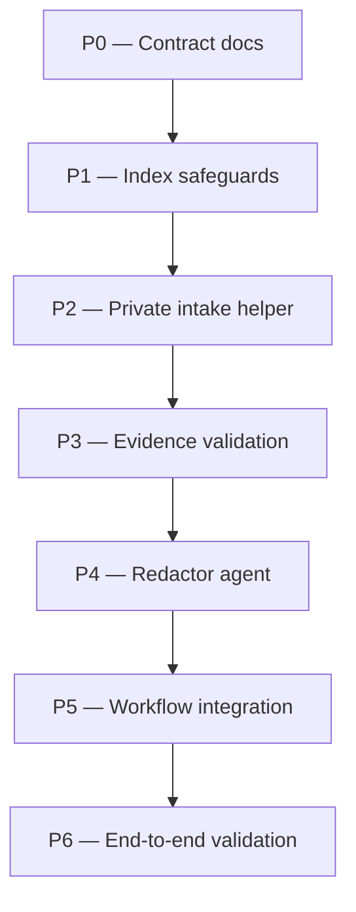

# sensitive-evidence Plan

## Source Artifacts

- Proposal: `.plan/sensitive-evidence/proposal.md`
- Evidence analysis: `.plan/sensitive-evidence/evidence/research-analysis.md`
- Map graph: `.plan/sensitive-evidence/map.nodes.jsonl`, `.plan/sensitive-evidence/map.edges.jsonl`
- Fact graph: `.plan/sensitive-evidence/facts.nodes.jsonl`, `.plan/sensitive-evidence/facts.edges.jsonl`
- Shared index: `.plan/_index/project-graph.sqlite`, `.plan/_index/project-graph-manifest.json`
- Relevant existing files: `README.md`, `.gitignore`, `skills/proposal/SKILL.md`, `skills/index-project/SKILL.md`, `skills/index-project/scripts/index_project.py`, `skills/plan/scripts/manage_jsonl.ts`, `skills/plan/scripts/validate_planning_graph.py`, `extensions/cartographer-tools.ts`, `package.json`, `tests/test_index_project.py`, `tests/manage_jsonl.test.ts`, `tests/test_validate_planning_graph.py`

## Planning Assumptions

### Confirmed facts

- Raw private artifacts should remain local/private and not be cited as committed evidence [F001] [F002] [F003].
- Cartographer should collect only proposal-relevant findings from private artifacts and minimize retained sensitive data [F004] [F005].
- Cartographer already distinguishes committed `.plan/<topic>/` rationale from ignored/generated support artifacts [F006].
- The workflow-optimization topic demonstrates the desired pattern: raw session log in `.plan/_private/`, durable analysis in committed `.plan/<topic>/` evidence [F007] [F008].
- The current proposal workflow lacks topic-first private intake, `.plan/_private` import, redaction, evidence folder, and dedicated analyzer support [F009].

### Implementation assumptions

- The implementation should remain stdlib/runtime-light: Python/TypeScript scripts and Pi tools, not a mandatory external DLP dependency.
- Optional secret scanners such as `gitleaks` or `trufflehog` may be invoked when installed/enabled, but validation must still work without them.
- Private artifact tests must use temporary/mock project roots and synthetic fixtures only; they must not read real `.plan/_private/` or mutate this repository's real `.plan/` except for the intentionally committed plan artifacts.
- The first implementation can preserve safe basenames in manifests; opaque IDs remain an escalation path for sensitive basenames or collisions.

## Phase Dependency Graph

## Phase Summary

| Order | Phase ID | Phase | Depends On | Unlocks | Exit Criteria |
|---:|---|---|---|---|---|
| 0 | P0 | Contract docs | none | P1 | README/skill guidance defines `.plan/_private/<topic>/`, optional inbox, evidence docs, manifests, and non-goals. |
| 1 | P1 | Index safeguards | P0 | P2 | `.plan/_private/**` is ignored and excluded from all index scopes while `.plan/<topic>/evidence/` remains available in `plans`. |
| 2 | P2 | Private intake helper | P1 | P3 | Deterministic helper/tool imports authorized files without reading contents and writes private/commit-safe manifests. |
| 3 | P3 | Evidence validation | P2 | P4 | Validators catch unsafe private references, missing redaction status, and obvious secret patterns without requiring external scanners. |
| 4 | P4 | Redactor agent | P3 | P5 | `cartographer-redactor` is defined with fresh-context, file-only, redaction, output, and stop-rule contracts. |
| 5 | P5 | Workflow integration | P4 | P6 | Proposal workflow runs topic-first intake/redaction before drafting and uses sanitized evidence facts/map relationships. |
| 6 | P6 | End-to-end validation | P5 | none | Synthetic end-to-end tests and full project checks pass without touching real private artifacts. |

## Phases

### Phase P0 — Contract docs

- **Status:** complete
- **Depends on:** none
- **Unlocks:** P1
- **Primary references:** `topic:sensitive-evidence`, `file:README.md`, `file:.gitignore`, `file:skills/proposal/SKILL.md`, `file:skills/index-project/SKILL.md`, [F006], [F009]

#### Objective

Document the private-input and sanitized-evidence contract before changing behavior so later phases have stable terminology, folder rules, and user expectations.

#### Scope

- Update `README.md` to describe:
  - `.plan/_private/<topic>/` as raw/private, ignored, never committed, never indexed by default.
  - optional `.plan/_private/_inbox/<id>/` for pre-topic intake.
  - `.plan/<topic>/evidence/` as committed sanitized evidence.
  - `evidence/manifest.jsonl` versus ignored `manifest.private.jsonl`.
  - `source_kind: sanitized_evidence` source records.
  - basenames-by-default, hash opt-in, optional scanner policy, and evidence-in-`plans` scope.
- Update `.gitignore` guidance if `.plan/_private/` is not present.
- Update `skills/index-project/SKILL.md` and high-level workflow guidance so agents know `.plan/_private/**` is always private and evidence docs are committed rationale.

#### Checklist

- [x] **P0.T1** Add a README section for private planning inputs and sanitized evidence artifacts.
- [x] **P0.T2** Ensure `.gitignore` contains `.plan/_private/` with a clear raw/sensitive comment.
- [x] **P0.T3** Update `skills/index-project/SKILL.md` retrieval contract to mention `.plan/_private/**` exclusion and `.plan/<topic>/evidence/` in `plans` scope.
- [x] **P0.T4** Add concise workflow-language references in `skills/proposal/SKILL.md` so proposal authors see the new contract before implementation hooks are added.

#### Validation

- [x] **P0.V1** Run `rg -n "\.plan/_private|evidence/|sanitized_evidence|manifest.private" README.md skills/index-project/SKILL.md skills/proposal/SKILL.md .gitignore` and confirm the contract appears in the intended files.
- [x] **P0.V2** Run `git check-ignore -v .plan/_private/example/artifact.txt` and confirm `.plan/_private/` is ignored.

#### Exit Criteria

- Documentation clearly distinguishes raw private input, sanitized evidence, generated index/cache, and committed rationale.
- Later implementation phases can cite the contract instead of redefining folder behavior.

#### Risks and Mitigations

- **Risk:** Documentation implies `.plan/_private/` artifacts are safe to cite. **Mitigation:** State that proposal/fact/map records cite sanitized evidence docs only.
- **Risk:** Evidence docs are mistaken for generated cache. **Mitigation:** Explicitly label `.plan/<topic>/evidence/` as commit-safe rationale after redaction.

#### Notes for Execution Agent

Do not implement helper scripts in this phase. Keep the phase limited to contracts and docs.

### Phase P1 — Index safeguards

- **Status:** complete
- **Depends on:** P0
- **Unlocks:** P2
- **Primary references:** `file:skills/index-project/scripts/index_project.py`, `file:tests/test_index_project.py`, `file:skills/index-project/SKILL.md`, [F006], [F008]

#### Objective

Prevent raw private artifacts from entering Cartographer retrieval while preserving sanitized evidence documents as explicit planning rationale.

#### Scope

- Update `skills/index-project/scripts/index_project.py` so `should_include_plan_artifact` excludes `.plan/_private/**` in addition to `.plan/_index/**`.
- Ensure `.plan/<topic>/evidence/*.md` and commit-safe evidence JSONL remain indexable in `plans` scope.
- Ensure index manifests/settings clearly show private exclusions when useful.
- Update index-project docs and tests.

#### Checklist

- [x] **P1.T1** Add `.plan/_private/**` exclusion to the plan-artifact scan path.
- [x] **P1.T2** Add or update tests proving `.plan/_private/<topic>/artifact.txt` is not indexed even when small and indexable by extension.
- [x] **P1.T3** Add or update tests proving `.plan/<topic>/evidence/example-analysis.md` is indexed in `plans` scope.
- [x] **P1.T4** Update `skills/index-project/SKILL.md` and README retrieval-scope text if P0 docs need code-specific clarification.

#### Validation

- [x] **P1.V1** Run `python -m unittest tests.test_index_project` and confirm private artifacts are excluded while evidence docs are retrievable.
- [x] **P1.V2** Run `python skills/index-project/scripts/index_project.py ensure --root "$PWD" --json` and confirm it completes without indexing `.plan/_private/**`.

#### Exit Criteria

- No `.plan/_private/**` files can appear in index files/chunks/query output by default.
- Sanitized evidence docs remain available to `scope=plans` retrieval.

#### Risks and Mitigations

- **Risk:** Excluding all underscore directories would also exclude `.plan/_retrieval`. **Mitigation:** Exclude `_private` specifically; leave existing retrieval miss behavior intact.
- **Risk:** Evidence docs become invisible to plan/proposal workflows. **Mitigation:** Add a positive plans-scope test for `.plan/<topic>/evidence/`.

#### Notes for Execution Agent

Use temporary test projects for indexing tests. Do not place synthetic private fixtures in this repository's real `.plan/_private/`.

### Phase P2 — Private intake helper

- **Status:** complete
- **Depends on:** P1
- **Unlocks:** P3
- **Primary references:** `file:extensions/cartographer-tools.ts`, `file:skills/plan/scripts/manage_jsonl.ts`, `file:package.json`, [F003], [F009]

#### Objective

Add a deterministic intake helper/tool that can import user-authorized private artifacts into `.plan/_private/<topic>/` without reading their contents and produce both private and commit-safe manifests.

#### Scope

- Add a small helper script, preferably `skills/plan/scripts/private_artifacts.py` or similarly named, with actions such as:
  - `import` / `intake` for copying or safely moving authorized files.
  - `manifest` / `list` for reporting commit-safe metadata.
- Support options for:
  - `--root`, `--topic`, repeated `--input`, `--move`, `--basename-mode preserve|sanitize|opaque`, `--hash` opt-in, and `--json`.
  - optional `_inbox` staging when topic is not yet known.
- Write ignored `.plan/_private/<topic>/manifest.private.jsonl` with detailed provenance.
- Write commit-safe `.plan/<topic>/evidence/manifest.jsonl` with safe basenames or opaque IDs, sanitized descriptions, redaction status, and analysis paths.
- Add a `cartographer_evidence` extension tool or equivalent clearly named action in `extensions/cartographer-tools.ts`.

#### Checklist

- [x] **P2.T1** Implement a content-blind private intake CLI that copies external files and refuses/asks for tracked repo files rather than moving them silently.
- [x] **P2.T2** Implement basename preservation by default, collision handling, optional sanitization/opaque naming, and opt-in raw file hashes.
- [x] **P2.T3** Write `manifest.private.jsonl` under `.plan/_private/<topic>/` and commit-safe `evidence/manifest.jsonl` under `.plan/<topic>/evidence/`.
- [x] **P2.T4** Register a `cartographer_evidence` extension tool or equivalent action with concise prompt guidelines and no raw-content output.
- [x] **P2.T5** Add Python and/or TypeScript tests for copy, move refusal for tracked files, basename collision, opt-in hash, and commit-safe manifest output.

#### Validation

- [x] **P2.V1** Run the new helper against a temporary project with synthetic files and confirm it creates `.plan/_private/<topic>/` plus `.plan/<topic>/evidence/manifest.jsonl` without reading/printing contents.
- [x] **P2.V2** Run `python -m unittest tests.test_private_artifacts` or the chosen test module name.
- [x] **P2.V3** Run `npm run check:scripts` to confirm the new script and extension wrapper parse/type-check.

#### Exit Criteria

- A user can start a proposal with external/private artifact paths before topic folders exist.
- Intake creates safe storage and manifests without parent-context exposure to raw file contents.

#### Risks and Mitigations

- **Risk:** File import accidentally leaks original path names into committed manifests. **Mitigation:** Store detailed provenance only in the private manifest; public manifest uses safe basename/opaque ID and sanitized labels.
- **Risk:** Moving a tracked sensitive file breaks user work. **Mitigation:** Detect tracked files with `git ls-files` when inside a git repo and stop for user confirmation.

#### Notes for Execution Agent

The helper may inspect file metadata and paths but must not read raw file contents. If a checksum is requested, stream bytes for hashing without logging or returning content.

### Phase P3 — Evidence validation

- **Status:** complete
- **Depends on:** P2
- **Unlocks:** P4
- **Primary references:** `file:skills/plan/scripts/manage_jsonl.ts`, `file:skills/plan/scripts/validate_planning_graph.py`, `file:tests/manage_jsonl.test.ts`, `file:tests/test_validate_planning_graph.py`, [F001], [F002], [F003], [F005]

#### Objective

Add validation that prevents committed proposal artifacts from directly referencing private inputs or containing obvious sensitive patterns.

#### Scope

- Add evidence validation to the new helper and/or existing JSONL validators.
- Extend `cartographer_jsonl validate-topic` to inspect `.plan/<topic>/evidence/*.md` and `evidence/manifest.jsonl`.
- Extend `validate_planning_graph.py` or call the evidence validator from it so plan validation catches unsafe evidence references too.
- Detect:
  - direct `.plan/_private/` references outside allowed manifest hints.
  - missing `Redaction status` in evidence analyses.
  - obvious secret patterns: GitHub tokens, AWS keys, JWTs, private-key blocks, bearer tokens, password assignments, connection strings, session cookies.
- Allow optional local scanner hooks when installed/enabled, without making them required.

#### Checklist

- [x] **P3.T1** Add reusable secret/private-reference pattern checks with conservative, high-confidence defaults.
- [x] **P3.T2** Validate `evidence/*.md` has source-handling/redaction status sections before facts cite it as sanitized evidence.
- [x] **P3.T3** Update `cartographer_jsonl validate-topic` to report evidence validation errors and counts.
- [x] **P3.T4** Update `validate_planning_graph.py` to reject plan/fact/map/proposal references to raw private inputs outside allowed manifest hints.
- [x] **P3.T5** Add tests with synthetic secrets, safe redacted examples, missing redaction status, and allowed manifest private hints.

#### Validation

- [x] **P3.V1** Run `npm run test:ts` and confirm JSONL/evidence validation tests pass.
- [x] **P3.V2** Run `python -m unittest tests.test_validate_planning_graph` and any new evidence validator tests.
- [x] **P3.V3** Run `cartographer_jsonl validate-topic --topic sensitive-evidence` and confirm this topic still passes.

#### Exit Criteria

- Unsafe private references and obvious secret leakage fail validation before proposal completion.
- Safe sanitized evidence docs and commit-safe manifests pass validation.

#### Risks and Mitigations

- **Risk:** Secret-pattern checks produce false positives in explanatory docs. **Mitigation:** Use high-confidence patterns only and allow explicit redacted placeholders such as `<TOKEN>`.
- **Risk:** Optional scanners create flaky tests. **Mitigation:** Test scanner integration through mocked commands or feature flags; do not require scanners in normal test runs.

#### Notes for Execution Agent

Do not add real secrets to tests. Use synthetic dummy strings designed for test detection and clearly marked as fake.

### Phase P4 — Redactor agent

- **Status:** complete
- **Depends on:** P3
- **Unlocks:** P5
- **Primary references:** `file:.plan/workflow-optimization/proposal.md`, `file:.plan/sensitive-evidence/evidence/research-analysis.md`, [F005], [F008]

#### Objective

Define `cartographer-redactor` as the dedicated fresh-context analyzer for private artifacts.

#### Scope

- Create a project-scoped subagent definition, likely `.pi/agents/cartographer-redactor.md`, with a unique name that cannot be confused with built-in `researcher` or `reviewer`.
- Configure it for fresh context, no inherited skills unless explicitly needed, file-only output by default, and limited tools.
- Include strict rules:
  - analyze only authorized private paths passed by the parent;
  - do not quote raw sensitive content;
  - write analyses only under `.plan/<topic>/evidence/`;
  - produce proposed fact/source/support/map JSONL suggestions;
  - stop when redaction confidence is low or the artifact is too sensitive to summarize.
- Document how package/project users discover or create the agent if project-scoped agent files are unavailable.

#### Checklist

- [x] **P4.T1** Add `cartographer-redactor` agent definition with fresh context, bounded tools, redaction rules, and output contract.
- [x] **P4.T2** Include examples of allowed/forbidden output and required `Evidence Analysis` sections.
- [x] **P4.T3** Add launch guidance for parent workflows, including `outputMode: "file-only"` and explicit artifact paths.
- [x] **P4.T4** Document fallback behavior when the subagent tool or `cartographer-redactor` is unavailable.

#### Validation

- [x] **P4.V1** Run `subagent({ action: "list" })` or the equivalent slash command and confirm `cartographer-redactor` is discoverable in this project.
- [x] **P4.V2** Run `subagent({ action: "get", agent: "cartographer-redactor" })` and confirm the prompt contains fresh-context, redaction, output, and stop-rule requirements.
- [x] **P4.V3** Perform a no-raw-content dry run or prompt review using synthetic fixture paths only; confirm output is file-only and sanitized.

#### Exit Criteria

- `cartographer-redactor` is available for proposal workflows and has a narrower contract than generic built-in subagents.
- Parent workflow has a documented serial fallback if the agent is unavailable.

#### Risks and Mitigations

- **Risk:** Project-scoped agent files may not be packaged for downstream users. **Mitigation:** Document the current discovery path and defer broader package-agent distribution to the specialized-subagents work if needed.
- **Risk:** The redactor becomes a general researcher. **Mitigation:** Prompt forbids product decisions and external research unless explicitly requested; it only extracts sanitized evidence.

#### Notes for Execution Agent

Do not run the redactor against real `.plan/_private/` files during tests. Use tiny synthetic files under `/tmp` or a mock project.

### Phase P5 — Workflow integration

- **Status:** complete
- **Depends on:** P4
- **Unlocks:** P6
- **Primary references:** `file:skills/proposal/SKILL.md`, `file:skills/plan/SKILL.md`, `file:skills/implement/SKILL.md`, `file:extensions/cartographer-tools.ts`, [F007], [F008], [F009]

#### Objective

Integrate private intake, redaction, sanitized evidence facts, and safe retrieval into the proposal workflow and downstream planning guidance.

#### Scope

- Update `skills/proposal/SKILL.md` so private artifact references trigger the intake preflight before normal proposal initialization.
- Add prompt/tool guidance for `cartographer_evidence import`, `cartographer-redactor`, evidence manifest reading, and safe fact/map upserts.
- Teach proposal workflow to create source nodes with `source_kind: sanitized_evidence` and to cite evidence docs instead of raw private files.
- Update `skills/plan/SKILL.md` so planners can use `.plan/<topic>/evidence/` in `plans` scope while treating `.plan/_private/**` as inaccessible private input.
- Update `skills/implement/SKILL.md` only if implementation handoffs need to mention evidence docs or private-reference stop rules.

#### Checklist

- [x] **P5.T1** Add upfront private-artifact detection and topic-first intake steps to `skills/proposal/SKILL.md`.
- [x] **P5.T2** Add redactor launch instructions with explicit paths, file-only output, and no raw-content parent reads.
- [x] **P5.T3** Add sanitized evidence fact/source/map integration instructions, including `source_kind: sanitized_evidence`.
- [x] **P5.T4** Update plan/implement guidance to consume evidence docs through `plans` scope and reject raw `.plan/_private/**` references.
- [x] **P5.T5** Update extension prompt guidelines so `cartographer_evidence` and validation behavior are visible to agents.

#### Validation

- [x] **P5.V1** Run `rg -n "cartographer-redactor|cartographer_evidence|sanitized_evidence|_private|evidence/" skills/proposal/SKILL.md skills/plan/SKILL.md skills/implement/SKILL.md extensions/cartographer-tools.ts` and confirm expected workflow guidance appears.
- [x] **P5.V2** Run `cartographer_jsonl validate-topic --topic sensitive-evidence` and confirm proposal/fact/map artifacts remain valid.

#### Exit Criteria

- A normal proposal workflow can start with private artifact paths, import them safely, analyze them through `cartographer-redactor`, and cite only sanitized evidence.
- Downstream plan/implement workflows know evidence docs are safe rationale and raw private inputs are off limits.

#### Risks and Mitigations

- **Risk:** Proposal prompt becomes too long. **Mitigation:** Put detailed rules in README/helper docs and keep skill additions as compact decision rules.
- **Risk:** Parent agent reads raw files before the redactor. **Mitigation:** Skill guidance explicitly says import without inspection and redactor-only analysis.

#### Notes for Execution Agent

Make skill changes concise. Avoid reprinting the entire proposal in the skill files.

### Phase P6 — End-to-end validation

- **Status:** complete
- **Depends on:** P5
- **Unlocks:** none
- **Primary references:** `file:package.json`, `file:tests/test_index_project.py`, `file:tests/manage_jsonl.test.ts`, `file:tests/test_validate_planning_graph.py`, [F001], [F003], [F006]

#### Objective

Verify the complete sensitive-evidence workflow with synthetic private artifacts and ensure normal package checks still pass.

#### Scope

- Add an end-to-end test fixture in a temporary project:
  1. user-provided synthetic private file path exists outside/inside mock project;
  2. intake imports it to `.plan/_private/<topic>/`;
  3. sanitized evidence doc is created under `.plan/<topic>/evidence/`;
  4. fact/source/support records cite the evidence doc;
  5. validation passes;
  6. index excludes `.plan/_private/**` and includes evidence docs in `plans` scope.
- Add negative tests for direct raw-private references and synthetic secret leakage.
- Run full project validation.

#### Checklist

- [x] **P6.T1** Add synthetic end-to-end tests for intake, manifests, evidence docs, fact graph integration, validation, and index scopes.
- [x] **P6.T2** Add negative tests for direct `.plan/_private/**` citations and generated evidence containing fake secrets.
- [x] **P6.T3** Ensure all new tests use `tempfile`/`mktemp`/mock roots and never use this repository's real `.plan/_private/`.
- [x] **P6.T4** Update any docs or test fixtures needed for stable full-suite validation.

#### Validation

- [x] **P6.V1** Run `npm run check:scripts`.
- [x] **P6.V2** Run `npm run test:py`.
- [x] **P6.V3** Run `npm run test:ts`.
- [x] **P6.V4** Run `npm run check`.
- [x] **P6.V5** Run `git status --short` and confirm no raw private fixtures or generated index/private artifacts are staged or left unignored.

#### Exit Criteria

- The complete workflow is covered by tests and validations.
- No raw private artifacts are committed, indexed, or cited directly.
- Full project checks pass.

#### Risks and Mitigations

- **Risk:** End-to-end tests accidentally write to real `.plan/`. **Mitigation:** Follow `AGENTS.md`; every test creates a mock project root under `/tmp`.
- **Risk:** Full check is slow or optional scanners are missing. **Mitigation:** Keep optional scanners disabled by default and test them through controlled hooks.

#### Notes for Execution Agent

This is the only phase that should run full `npm run check`; earlier phases should prefer targeted checks.

## Cross-Phase Validation

- [x] **XV1** `cartographer_jsonl validate-topic --root "$PWD" --topic sensitive-evidence` passes after each phase that changes topic artifacts.
- [x] **XV2** `python skills/plan/scripts/validate_planning_graph.py --root "$PWD" --topic sensitive-evidence --json` passes after this plan exists and after any plan graph updates.
- [x] **XV3** `python - <<'PY' ...` or equivalent secret-pattern scan over `.plan/sensitive-evidence/` reports no high-confidence secret patterns.
- [x] **XV4** `git check-ignore -v .plan/_private/example/artifact.txt` confirms raw private planning inputs are ignored.

## Open Questions

None. The proposal's former open questions are resolved: safe basenames are allowed for now, raw hashes are opt-in, optional local scanners may be used when installed/enabled, and sanitized evidence docs belong in `scope=plans`.

## Handoff Guidance

Execute phases in order. Do not begin implementation until this plan has passed graph validation. For each phase:

1. Refresh the project index with `cartographer_index ensure` or the CLI equivalent.
2. Read this plan, the proposal, and the phase's primary references.
3. Keep raw `.plan/_private/**` artifacts out of parent, worker, and reviewer context unless the selected phase explicitly implements/test-drives intake with synthetic files.
4. Use temporary/mock project roots for every test fixture that creates `.plan/`, `.plan/_index/`, `.plan/_private/`, or generated evidence artifacts.
5. Run targeted validation for the changed files before broad checks.
6. Stop and ask the user if implementation requires committing raw private artifacts, indexing `.plan/_private/**`, adding a mandatory external scanner dependency, or broadening into a general DLP/compliance system.
