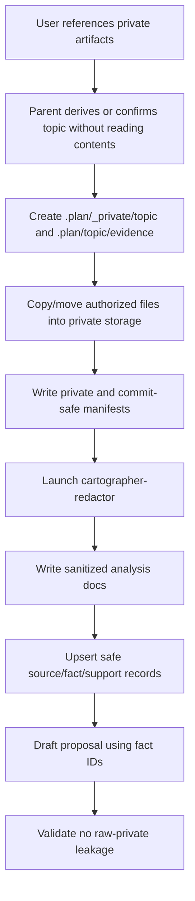

# sensitive-evidence Proposal

## Description

Add a safe private-artifact ingestion workflow for Cartographer proposals. When a user gives Cartographer raw logs, error dumps, session transcripts, screenshots, exports, or private documents up front, Cartographer should first derive or confirm the topic without reading raw contents, import those artifacts into `.plan/_private/<topic>/`, run a dedicated redaction/analyzer agent, and write only sanitized, commit-safe analysis documents under `.plan/<topic>/evidence/`.

The proposal then cites the sanitized evidence docs and extracted fact/map relationships, not the raw private artifacts. This preserves the value of sensitive context while keeping committed proposal evidence clean, reviewable, and safe.

## Problem Statement

Cartographer proposals often need evidence from artifacts that should not be committed: logs, errors, session transcripts, customer/user documents, private screenshots, or debug dumps. The current workflow has no formal path for this, including the common case where the user supplies sensitive files in the initial proposal request before `.plan/<topic>/` or `.plan/_private/<topic>/` exists [F009]. As a result, the parent agent may accidentally:

- read raw sensitive artifacts into long-lived parent context;
- cite `.plan/_private/<topic>/` files directly in committed facts/map records;
- include secrets, PII, raw stack traces, request bodies, or private document text in proposal prose;
- lose useful evidence if raw logs are deleted without a durable analysis; or
- make reviewers choose between safety and traceability.

This is a real risk. OWASP says logs should usually exclude or transform access tokens, session identifiers, PII, passwords, database connection strings, encryption keys, payment data, high-classification data, and commercially sensitive information [F001]. MITRE classifies writing sensitive information to logs as CWE-532 and warns that logs can become a less-protected path for attackers [F002]. GitHub also recommends redacting secrets before logging and using secret-management practices rather than committing sensitive data [F003].

Cartographer needs a first-class workflow for private evidence: raw artifacts stay private, while sanitized analyses become durable proposal evidence. The workflow must solve the chicken-and-egg problem by adding a **topic-first private intake preflight** before normal proposal drafting.

## Goals

1. **Add topic-first private intake.** A user can provide sensitive files at proposal start; Cartographer derives or asks for the topic, creates `.plan/_private/<topic>/`, and imports files before any raw analysis occurs.
2. **Create a dedicated evidence folder.** Every topic may have `.plan/<topic>/evidence/` for sanitized analysis docs and evidence manifests.
3. **Keep raw sensitive artifacts out of committed evidence.** `.plan/_private/<topic>/` remains a local/private input area, not a proposal source of truth.
4. **Add a dedicated analyzer agent.** Introduce `cartographer-redactor`, a fresh-context, file-only subagent that reads explicitly authorized private artifacts and produces sanitized analysis docs.
5. **Extract useful findings and relationships.** The analyzer should turn private artifacts into safe findings, fact suggestions, and map relationships that the proposal can cite.
6. **Strip sensitive information.** Analysis docs must omit secrets, PII, raw stack traces, private document contents, request/response bodies, and enough adjacent context to reconstruct sensitive values.
7. **Validate committed artifacts.** Add checks that proposal/map/fact/evidence files do not contain obvious secrets or forbidden raw-private references.
8. **Preserve minimal Pi/Cartographer workflow.** Use explicit tools, filesystem artifacts, and small contracts rather than a heavy DLP framework.

## Non-Goals

- Do **not** require the user to manually know or create `.plan/_private/<topic>/` before starting a proposal.
- Do **not** commit raw `.plan/_private/<topic>/` artifacts.
- Do **not** build a general-purpose enterprise DLP or compliance platform.
- Do **not** guarantee that every secret or PII item can be detected automatically; the workflow reduces risk and requires review.
- Do **not** index `.plan/_private/<topic>/` in `.plan/_index/` or expose raw private files through default retrieval.
- Do **not** require an analyzer agent for ordinary public docs or project files.
- Do **not** let the analyzer make product/design decisions; it only extracts sanitized evidence.

## Background

### Local precedent

The `workflow-optimization` proposal already demonstrates the desired shape. The raw dogfooding session log lives in that topic's local private storage, while `.plan/workflow-optimization/session-analysis.md` contains the durable analysis used by the proposal [F007]. This new proposal formalizes that pattern so it is repeatable and validated.

Cartographer already treats `.plan/<topic>/` artifacts as intentional rationale that can be reviewed and committed, while generated/local artifacts such as `.plan/_index/` are ignored and not durable rationale [F006]. `.plan/_private/` should follow the generated/local side of that divide; `.plan/<topic>/evidence/` should follow the committed rationale side.

### External guidance

- OWASP's Logging Cheat Sheet recommends excluding or transforming sensitive log data such as tokens, session identifiers, PII, passwords, database connection strings, keys, payment data, and commercially sensitive information [F001].
- CWE-532 identifies sensitive information in log files as a recognized weakness and recommends not writing secrets to logs and protecting log files [F002].
- GitHub Docs define secrets such as API keys, access tokens, database credentials, and private keys, and recommend redaction before logging plus revocation/rotation if exposed [F003].
- NIST's Privacy Framework supports managing privacy risk while protecting individuals' privacy, which maps to data minimization in evidence artifacts [F004].
- OWASP's LLM Top 10 names Sensitive Information Disclosure as a major risk, so LLM-based analysis should have explicit output controls [F005].

## Viability

This is viable because most primitives already exist:

| Existing primitive | Current role | Needed extension |
|---|---|---|
| User-provided paths | Ad hoc files mentioned in chat | Add topic-first intake that copies/moves authorized files before reading them. |
| `.plan/_private/<topic>/` | Local gitignored private input archive | Treat as authorized private input area only. |
| `.plan/_private/_inbox/` | Not yet formalized | Optional temporary ignored holding area when a topic cannot be derived before intake. |
| `.plan/<topic>/` | Commit-worthy rationale | Add `evidence/` subfolder for sanitized analyses. |
| `facts.nodes.jsonl` / `facts.edges.jsonl` | Source-backed research facts | Allow sanitized evidence docs as `source_kind: sanitized_evidence`. |
| `map.nodes.jsonl` / `map.edges.jsonl` | Project/file relationships | Add relationships derived from sanitized evidence, not raw logs. |
| `cartographer_jsonl validate-topic` | Artifact validation | Add checks for private references and redaction/secret-scan status. |
| `cartographer_index` | Project/rationale retrieval | Keep `.plan/_private/` excluded; index evidence docs as committed rationale. |
| Specialized Cartographer subagents | Narrow workflow roles | Add `cartographer-redactor` for private artifact analysis. |

The workflow does not need embeddings, external DLP services, or a new storage layer. It needs a clear folder contract, a dedicated analyzer role, and validators that prevent unsafe evidence from entering committed artifacts.

## Design

### 0. Add a topic-first private artifact intake preflight

The proposal workflow should handle sensitive files before normal proposal drafting, but without reading raw contents into parent context.

When the initial user request includes private artifact paths, attachments, or phrases such as "use these logs" or "consider this private document":

1. **Identify paths and sensitivity intent.** Treat every referenced artifact as private unless the user explicitly says it is public/commit-safe.
2. **Derive the topic from the request text, not file contents.** If the topic is clear, create `.plan/_private/<topic>/` and `.plan/<topic>/evidence/`. If the topic is ambiguous, ask one concise topic/scope question before importing.
3. **Use an ignored inbox only when needed.** If files must be staged before the topic is known, place them under `.plan/_private/_inbox/<timestamp-or-short-id>/` with an ignored private manifest, then move them to `.plan/_private/<topic>/` after topic confirmation.
4. **Import without inspection.** Use filesystem copy/move operations only; do not `read`, summarize, grep, index, or quote raw file contents in the parent session.
5. **Choose copy vs move safely.** Copy external files into `.plan/_private/<topic>/`. Move untracked sensitive files that are already inside the repo only when safe. If a referenced file is tracked by git, stop and ask before moving or rewriting it.
6. **Normalize names.** Preserve original basenames by default when they are safe enough to disclose in local/private storage. Use sanitized basenames or opaque names such as `artifact-001.jsonl` when the basename itself may reveal private information, causes collisions, or the user requests stronger privacy.
7. **Write manifests.** Store detailed provenance only in ignored `.plan/_private/<topic>/manifest.private.jsonl`; write a commit-safe `.plan/<topic>/evidence/manifest.jsonl` with safe basenames or opaque IDs plus sanitized descriptions.
8. **Then launch `cartographer-redactor`.** The redactor receives only the authorized private paths and writes sanitized analysis docs for the normal proposal workflow to cite.

This gives users a natural entry point:

```text
Create a proposal for workflow optimization using these private artifacts:
- /tmp/dogfooding-session.jsonl
- ~/Downloads/error-log.txt
```

Cartographer should translate that into:

```text
.plan/_private/workflow-optimization/artifact-001.jsonl
.plan/_private/workflow-optimization/artifact-002.txt
.plan/workflow-optimization/evidence/artifact-001-analysis.md
.plan/workflow-optimization/evidence/artifact-002-analysis.md
```

### 1. Define the private input and public evidence split

Raw private artifacts live under `.plan/_private/<topic>/` by default after the intake preflight, or another explicitly user-approved ignored private path. They are never proposal evidence directly.

Sanitized evidence lives under:

```text
.plan/<topic>/evidence/
```

Recommended contents:

```text
.plan/<topic>/evidence/
  manifest.jsonl
  <artifact-id>-analysis.md
  <artifact-id>-relationships.jsonl
  redaction-report.md
```

`manifest.jsonl` should be commit-safe. It can include:

```jsonl
{"id":"private-artifact:dogfooding-session","kind":"session-log","private_path_hint":".plan/_private/<topic>/<redacted>.jsonl","analysis":"evidence/dogfooding-session-analysis.md","status":"analyzed","sensitivity":"high","redaction_status":"passed"}
```

Rules:

- `private_path_hint` may include `.plan/_private/<topic>/` and a safe basename. Use a redacted basename or opaque ID only when the basename itself is sensitive, collisions occur, or future needs justify stricter privacy.
- Do not store raw file hashes by default. Hashes can aid reproducibility but may leak metadata; add them only behind an explicit user option.
- Proposal/fact/map citations should point to `evidence/*.md`, not `.plan/_private/<topic>/*`.

### 2. Add `cartographer-redactor`

Create a dedicated project/package subagent named `cartographer-redactor`.

Purpose:

> Review explicitly authorized private artifacts, extract proposal-relevant findings, redact sensitive content, and write commit-safe evidence analyses.

Default configuration:

| Field | Value |
|---|---|
| Context | fresh |
| Tools | `read`, `bash` for bounded local inspection, `write`, optionally `cartographer_jsonl`, and optional local secret scanners when installed/enabled |
| Output | file-only by default |
| Allowed inputs | explicit `.plan/_private/<topic>/` paths or other user-approved ignored private paths |
| Allowed outputs | `.plan/<topic>/evidence/*` and JSONL suggestions |
| Disallowed outputs | raw artifact text, secrets, PII, private document content, long stack traces |

Prompt contract:

```text
You are cartographer-redactor. Analyze only the authorized private artifacts listed below.
Do not quote raw sensitive content. Produce sanitized evidence docs under .plan/<topic>/evidence/.
Extract useful findings, counts, categories, timelines, relationships, and proposal-relevant implications.
Replace sensitive values with placeholders such as <TOKEN>, <EMAIL>, <USER_ID>, <PRIVATE_PATH>, <REQUEST_BODY>, or <PRIVATE_DOC_TEXT>.
Return only a compact receipt plus artifact paths. Stop if the artifact appears too sensitive to summarize safely.
```

The agent should write:

1. `evidence/<artifact-id>-analysis.md`
2. optional `evidence/<artifact-id>-relationships.jsonl`
3. proposed fact/source records for `facts.nodes.jsonl`
4. proposed support edges for `facts.edges.jsonl`
5. proposed map relationships when findings affect project files, symbols, workflows, or decisions

### 3. Proposal workflow integration

When a user request mentions private artifacts, the proposal workflow should run the intake preflight before ordinary proposal initialization:



Parent responsibilities:

- Confirm the user intended the private artifacts to be considered.
- Derive or ask for the topic before reading or analyzing raw files.
- Import files into `.plan/_private/<topic>/` or the temporary ignored inbox without inspecting contents.
- Pass only explicit private artifact paths to `cartographer-redactor`.
- Keep raw artifact content out of parent context.
- Inspect only the sanitized evidence docs and JSONL suggestions.
- Use `cartographer_jsonl upsert` to add safe facts and support edges.
- Validate the topic before finalizing the proposal.

### 4. Evidence document format

Each analysis doc should use this shape:

```markdown
# Evidence Analysis: <artifact-id>

## Source Handling
- Private input: .plan/_private/<topic>/<redacted>
- Analyzer: cartographer-redactor
- Redaction status: passed | passed-with-warnings | blocked
- What was intentionally omitted: secrets, PII, raw request bodies, ...

## Summary
Short direct summary of useful proposal-relevant evidence.

## Findings
1. **Finding title** — sanitized explanation.
   - Evidence class: count/category/timeline/error-pattern/relationship
   - Safe references: related project files, existing fact IDs, map IDs
   - Sensitivity notes: what was redacted

## Relationships
- Finding -> relevant map node/fact/design concern.

## Proposed Fact Records
Safe JSONL snippets or a table of IDs/claims/sources.

## Redaction Notes
Any uncertainty, residual risk, or reason the analyzer refused to summarize a section.
```

Allowed analysis content:

- aggregate counts and metrics;
- categorized error types;
- timelines with coarse timestamps when needed;
- redacted examples using placeholders;
- relationships to project files and existing facts;
- proposal implications and validation suggestions.

Forbidden analysis content:

- access tokens, API keys, session IDs, cookies, private keys, passwords;
- database connection strings;
- payment data;
- personal identifiers unless redacted;
- full raw logs, private document passages, request/response bodies, screenshots as text dumps;
- long raw stack traces unless reduced to safe frame categories and project file references.

### 5. Fact and map integration

Sanitized analysis docs become source nodes:

```jsonl
{"id":"S123","type":"source","title":"Dogfooding session analysis","source_kind":"sanitized_evidence","reference":".plan/<topic>/evidence/dogfooding-session-analysis.md:1"}
```

Facts cite the sanitized analysis:

```jsonl
{"id":"F123","type":"fact","title":"Repeated full checks increased session cost","claim":"The analyzed session showed repeated full validation commands after small changes.","supported_by":"S123"}
{"from":"F123","to":"S123","type":"supported_by","evidence":"Evidence analysis table lists repeated command categories without raw transcript content."}
```

Map edges may link findings to project files or workflow nodes:

```jsonl
{"from":"F123","to":"file:skills/implement/SKILL.md","type":"applies_to","evidence":"Sanitized evidence suggests implementation workflow should use validation receipts."}
```

Raw `.plan/_private/<topic>/` artifacts should not be used as `source` nodes in committed facts. If traceability is needed, use an opaque private-artifact ID in `evidence/manifest.jsonl` and keep raw details local.

### 6. Validation and leakage checks

Add or extend validation to check:

- `proposal.md`, `facts.*.jsonl`, `map.*.jsonl`, and `evidence/*.md` do not reference `.plan/_private/<topic>/` as a direct source except allowed redacted hints in `evidence/manifest.jsonl`.
- Fact `supported_by` edges point to sanitized evidence docs, public sources, or safe project files.
- `evidence/*.md` includes a `Redaction status` section.
- Obvious secret patterns are absent:
  - GitHub tokens, AWS keys, JWTs, private-key blocks, password assignments, connection strings, bearer tokens, session cookies.
- Allow `cartographer-redactor` and validators to invoke optional local scanners such as `gitleaks`, `trufflehog`, or GitHub secret scanning when installed/enabled, but do not make external scanners mandatory.
- Validation errors should fail the proposal workflow; warnings may require user confirmation.

### 7. Indexing and retrieval behavior

- `cartographer_index` should continue excluding `.plan/_private/**` by default, even when the user mentions private artifacts.
- `.plan/<topic>/evidence/` should be included in `plans` scope as committed rationale.
- `scope=code` should exclude `.plan/**`; all scopes should exclude `.plan/_private/**` unless an explicit private-analysis tool is running.
- `scope=plans` may include evidence docs but should not include private manifests unless those manifests are commit-safe.
- Retrieval miss logs should not store raw private snippets, consistent with existing README guidance that miss records help future retrieval without storing raw snippets or secrets [F006].

### 8. Failure and refusal behavior

`cartographer-redactor` should stop and report a blocked analysis when:

- the artifact contains dense secrets/PII that cannot be summarized safely;
- redaction confidence is low;
- the user did not explicitly authorize the path;
- the artifact appears outside `.plan/_private/<topic>/` or another approved ignored private directory;
- the requested analysis would require reproducing private document content.

The parent should then ask the user whether to narrow scope, provide a safer artifact, or proceed without that evidence.

## Proposed Implementation Phases

1. **P0 — Evidence contract and intake preflight:** Document `.plan/_private/<topic>/`, optional `.plan/_private/_inbox/`, copy/move rules, private manifests, and `.plan/<topic>/evidence/` as commit-safe analysis output.
2. **P1 — Import helper:** Add a small deterministic helper/action that imports authorized private files into `.plan/_private/<topic>/` without reading contents and writes private/commit-safe manifests.
3. **P2 — Redactor agent:** Add `cartographer-redactor` with fresh-context defaults, file-only output, redaction rules, and stop conditions.
4. **P3 — Proposal workflow update:** Teach the proposal skill to detect upfront private artifact references, derive/confirm topic, run intake, dispatch the redactor, and cite sanitized analysis docs.
5. **P4 — JSONL integration:** Add helper support for sanitized evidence source nodes and source/fact/support edge suggestions.
6. **P5 — Validators:** Add private-reference and secret-pattern checks for proposal/fact/map/evidence artifacts.
7. **P6 — Index behavior:** Ensure `.plan/_private/**` stays excluded while `evidence/` remains available in `plans` scope.
8. **P7 — Tests and fixtures:** Use temp/mock projects and synthetic sensitive artifacts only; never write tests against the real repo `.plan/_private/<topic>/` or `.plan/`.

## Risks and Mitigations

| Risk | Mitigation |
|---|---|
| Sanitizer misses a secret | Run pattern checks, require redaction status, keep analysis minimal, and preserve human review. |
| Analysis loses useful detail | Keep aggregate metrics, categories, relationships, and safe redacted examples. |
| Raw `.plan/_private/<topic>/` becomes indexed | Explicitly exclude `.plan/_private/**` from index scopes and add tests. |
| Evidence folder becomes a dumping ground | Require each analysis doc to have source handling, findings, relationships, and redaction notes. |
| Private paths leak sensitive names | Preserve basenames by default for usability, but redact or switch to opaque IDs when a basename is sensitive, collides, or user/project policy requires it. |
| Intake happens before topic exists | Derive topic from request text first; if ambiguous, use one clarifying question or temporary `.plan/_private/_inbox/<id>/`. |
| New agent expands workflow complexity | Invoke `cartographer-redactor` only when users explicitly reference private artifacts. |

## Acceptance Criteria for a Future Plan

- Users can start a proposal with external/private artifact paths before topic folders exist.
- The workflow derives or confirms the topic before reading raw private artifacts.
- Authorized private files are imported into `.plan/_private/<topic>/` or temporary `.plan/_private/_inbox/<id>/` without parent-context inspection.
- `.plan/<topic>/evidence/` is documented as the dedicated folder for sanitized analyses.
- Proposal workflow invokes `cartographer-redactor` only after intake for explicit private artifact references.
- Raw `.plan/_private/<topic>/` files are never committed, indexed, or cited as direct fact sources.
- Facts derived from private artifacts cite sanitized evidence docs with `source_kind: sanitized_evidence`.
- Validators flag direct private-input references in committed proposal/map/fact/evidence artifacts except allowed manifest hints.
- Validators or tests catch obvious secret patterns in generated evidence docs.
- Optional local secret scanners can be used by `cartographer-redactor`/validators when installed, without becoming required dependencies.
- Evidence docs are included in `scope=plans` by default so proposal/plan workflows can retrieve committed sanitized evidence.
- Synthetic tests use temp/mock projects and do not read or mutate real `.plan/_private/<topic>/` or real `.plan/` artifacts.

## Resolved Decisions

1. `evidence/manifest.jsonl` may store safe artifact basenames for now; move to opaque IDs only if basenames become risky or a project policy requires it.
2. Raw artifact hashes are opt-in for reproducibility and should not be written by default.
3. `cartographer-redactor` may use optional local secret scanners when installed/enabled.
4. Sanitized evidence docs should be included in `scope=plans` by default.
