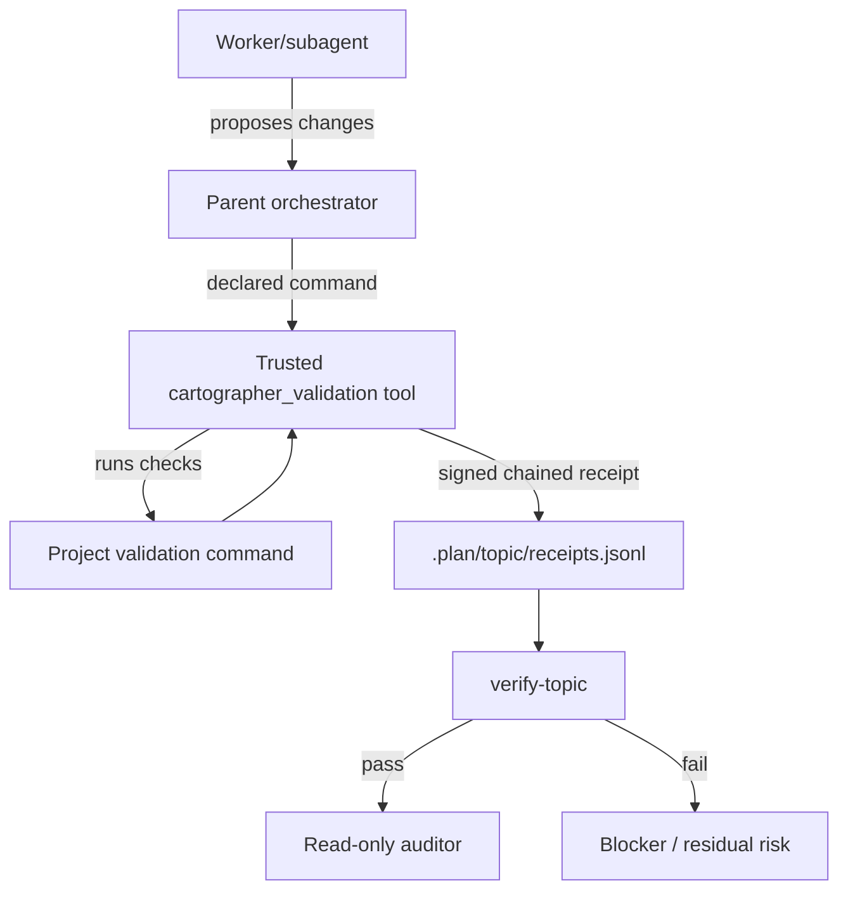

# signed-receipts Proposal

## Description

Add tamper-evident, signed validation receipts to Pi Cartographer so hard go/no-go evidence comes from a trusted validation tool rather than from worker-written JSONL. The existing workflow already stores validation state in `.plan/<topic>/receipts.jsonl`, and validation receipts already describe commands, results, durations, changed-file hashes, output summaries, and validation IDs [F005]. This proposal preserves that artifact but changes the trust boundary: workers and subagents propose work, while a trusted `cartographer_validation` tool runs checks and appends canonical signed receipts [F006].

## Problem Statement

Today, `validation_runner.py` can run a command and append a useful receipt with exit code, duration, output summary, hash-set digest, and changed files [F001]. `manage_jsonl.ts` validates that receipt records are structurally well-shaped [F003]. That is useful audit organization, but it is not tamper-proof proof: an agent with `write` or `bash` can fabricate a plausible JSONL receipt, and the current validator does not verify signatures, record digests, or hash-chain continuity [F002] [F003].

The desired outcome is hard validation evidence: when tests or declared validators pass, the command should have run under a trusted tool host, and the pass receipt should be impractical to forge without that host's signing key.

## Goals

- Add a trusted validation tool that runs commands and appends canonical validation receipts.
- Keep canonical receipt creation out of worker/subagent direct write paths.
- Sign receipt records with a private key unavailable to `bash`, repository files, and agent-visible environment variables.
- Hash-chain receipts so tampering, deletion from the middle, and reordering are detected.
- Extend receipt validation so strict mode rejects unsigned, invalidly signed, or chain-broken canonical validation receipts.
- Make final go/no-go gates rerun declared validation commands through the trusted tool instead of only reading historical receipts.
- Preserve explicit legacy compatibility for historical unsigned receipts while preventing them from satisfying strict hard-evidence gates.

## Non-Goals

- Proving that a chosen command is semantically sufficient. A signature proves the trusted tool produced the receipt for the recorded command and result; the plan, parent, and auditor must still decide whether the command satisfies the validation requirement.
- Protecting against a compromised Pi extension host, OS user, root account, or stolen private key. Signed receipts are tamper-evident evidence, not a complete supply-chain security system.
- Treating worker-authored files, direct `bash`, or manual JSONL edits as trusted validation evidence.
- Storing private signing keys in this repository or in test fixtures.

## Background

Cartographer already has most of the useful receipt content. `validation_runner.py` runs validation commands, records execution metadata, captures changed files, and appends JSONL receipts [F001]. The README defines `.plan/<topic>/receipts.jsonl` as workflow state under the Clean Context Contract [F005]. The missing piece is authenticity: the current append path records a hash-set digest but does not sign the record or link it to prior canonical receipts [F002].

The current JSONL validator is intentionally structural. It checks validation evidence, truncation metadata, and timeout fallback decisions, but it cannot prove that a command actually ran [F003]. Existing tests also accept an unsigned validation receipt as valid, which should become legacy behavior rather than strict go/no-go behavior [F013].

Cartographer already has a Pi extension tool surface in `extensions/cartographer-tools.ts` [F004]. Pi extensions can register custom tools and run with host permissions, which makes the extension host a practical place for signing authority if the installation itself is trusted [F007]. Because tool calls can run in parallel, canonical receipt appends should use the same file mutation queue guidance Pi documents for mutating custom tools [F008].

## Viability

This is viable in the current repository:

- The trusted tool can be registered in the existing Cartographer extension surface [F004].
- Node.js v22 crypto supports Ed25519, which is suitable for compact public-key receipt signatures without adding a runtime dependency [F009].
- RFC 8785 provides a standard JSON canonicalization model for stable hash/signature payload bytes [F010].
- Existing package scripts already run script checks, typecheck, Python tests, TypeScript tests, and aggregate checks [F011].
- Existing tests use temporary roots for receipt behavior, and project policy requires new tests and validation fixtures to avoid mutating the real `.plan/` directory [F012].

The main viability risk is overstating the guarantee. Signed receipts prove that a holder of the trusted signing key produced the receipt payload. They do not prove that the trusted host was uncompromised, that the key was protected forever, or that the command was the right command. The proposal should document that clearly and pair historical receipts with fresh final validation reruns.

## Design

### 1. Define a Canonical Receipt Schema

Create a versioned schema, for example `cartographer.validation-receipt.v1`, that extends existing validation receipt fields [F005]. Required canonical fields should include:

| Field | Purpose |
|---|---|
| `schema_version` | Versioned receipt contract. |
| `id`, `type`, `status` | Existing receipt identity and status. |
| `command`, `cwd`, `exit_code`, `duration_ms` | Command actually run by the trusted tool. |
| `validation_ids` | Declared validation IDs attempted or satisfied. |
| `hash_set_digest`, `changed_files` | Existing file-state evidence retained from current receipts [F001]. |
| `summary`, `truncated`, `full_output_path` | Clean Context Contract output evidence [F005]. |
| `previous_receipt_digest` | Digest of the previous canonical receipt in the topic chain, or `null` for genesis. |
| `record_digest` | SHA-256 over canonical receipt fields excluding signature fields. |
| `signature_algorithm` | `ed25519` for v1 [F009]. |
| `canonicalization` | `jcs-rfc8785` or a documented compatible subset [F010]. |
| `signer_id`, `public_key_id` | Identifies the trusted signing authority and verification key. |
| `signature` | Detached signature over the canonical payload or digest. |

Receipt creation flow:

1. Run the declared command under the trusted tool host.
2. Capture execution result, output summary, changed files, and hash-set digest.
3. Read the previous canonical receipt digest for the topic.
4. Canonicalize the unsigned payload.
5. Compute `record_digest`.
6. Sign the canonical payload or digest.
7. Append the signed receipt through a serialized file-mutation queue [F008].

### 2. Add `cartographer_validation`

Register a new trusted tool in `extensions/cartographer-tools.ts` [F004] with actions such as:

| Action | Behavior |
|---|---|
| `run` | Execute a validation command, capture evidence, sign, hash-chain, and append a canonical receipt. |
| `verify-topic` | Verify all canonical receipt signatures and chain links for `.plan/<topic>/receipts.jsonl`. |
| `verify-file` | Verify a standalone receipt JSONL file for tests and migration. |
| `trust-info` | Return public signer metadata and strict/legacy policy without exposing private key material. |

The private key must be held by the trusted Pi extension/tool host, not passed through command-line arguments, shell-visible environment variables, or repository files [F007]. Unit tests can inject ephemeral signer material into temporary roots, but production strict mode should keep key material outside agent-accessible channels [F012].

### 3. Stop Trusting Worker-Written Canonical Receipts

Update Cartographer workflows so workers and subagents do not write canonical `.plan/<topic>/receipts.jsonl` validation records directly. Worker-authored notes may live in context packs, implementation notes, or explicitly non-canonical files, but hard go/no-go evidence must come from `cartographer_validation.run`.

Recommended trust boundary:

```text
worker/subagent proposes changes
parent or workflow calls cartographer_validation.run
trusted tool runs tests/checks
trusted tool appends signed chained receipt
verify-topic checks signatures and chain
auditor reviews only after deterministic validation passes
```

This aligns with the README's existing stance that subagents consume deterministic validation results but do not replace tool validation or parent orchestration [F006].

### 4. Extend Validation Modes

Extend `manage_jsonl.ts` and the trusted validation tool with explicit policy modes:

| Mode | Behavior |
|---|---|
| `strict` | Canonical validation receipts must be signed, signature-valid, and chain-valid. Unsigned pass receipts are errors. |
| `legacy` | Historical unsigned receipts are allowed as audit notes but marked `legacy_unsigned` and cannot satisfy new hard gates. |
| `dev` | Allows ephemeral test signers and temporary roots only. |

`cartographer_jsonl validate-topic` should remain useful for shape validation, but the hard gate should be `cartographer_validation.verify-topic`, because the trusted tool host owns signer verification policy. Strict topic validation should reject the unsigned receipt pattern currently accepted by tests [F013].

### 5. Require Fresh Final Gates

A receipt is historical evidence. Final success should still require fresh validation:

1. Run each declared validation command through `cartographer_validation.run`.
2. Run `cartographer_validation.verify-topic`.
3. Run `cartographer_jsonl validate-topic` for non-receipt graph/artifact shape [F003].
4. Dispatch `cartographer-auditor` only after deterministic validation passes.
5. If a command fails, the trusted tool writes a signed failed receipt and the phase remains blocked or at residual risk.

### 6. Test the Trust Boundary

Add tests using temporary roots only [F012]:

- signed pass receipt verifies successfully;
- failed command writes a signed failed receipt and returns the command exit code;
- tampering with `status`, `command`, `exit_code`, `summary`, or `hash_set_digest` breaks verification;
- deleting or reordering a middle receipt breaks the hash chain;
- unsigned legacy receipts are accepted only in explicit legacy mode;
- strict validation rejects unsigned pass receipts [F013];
- concurrent appends serialize through the file mutation queue [F008];
- final gate examples run through `cartographer_validation.run`, not direct `bash` receipt writes.

Existing package checks can cover the new implementation and tests [F011].


