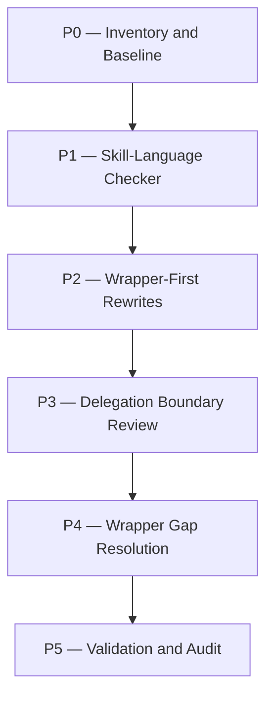

# skills-cleanup Plan

## Source Artifacts

- `.plan/skills-cleanup/proposal.md`
- `.plan/skills-cleanup/map.nodes.jsonl`
- `.plan/skills-cleanup/map.edges.jsonl`
- `.plan/skills-cleanup/facts.nodes.jsonl`
- `.plan/skills-cleanup/facts.edges.jsonl`
- `.plan/skills-cleanup/context-packs.jsonl`
- `.plan/skills-cleanup/receipts.jsonl`
- `.plan/_index/project-graph.sqlite`
- `docs/adr/0004-use-single-writer-cartographer-implementation-state.md`
- `docs/adr/0006-use-deterministic-cartographer-workflow-wrappers-for-lifecycle-gates.md`
- `AGENTS.md` current uncommitted skill-authoring guardrail update

## Planning Assumptions

### Confirmed facts

- Skill cleanup MUST preserve the existing workflow design and userflow; this plan only changes agent-facing skill language and deterministic checks.
- Cartographer workflow mutations MUST route through wrapper tools when available, not prose-only JSONL/status/receipt edits [F001].
- Implementation remains parent/current-agent single-writer by default; specialists are read-only gates unless explicitly scoped, and `cartographer-pathfinder` is legacy opt-in only [F002].
- RFC 2119 keywords are uppercase normative terms and should be used sparingly for real requirements [F003].
- Skill files should be concise, grounded in project-specific evidence, progressively disclosed, and script-first for deterministic work [F004] [F005] [F006] [F008].
- Skill descriptions should be trigger-oriented and checked against positive plus near-miss prompts when practical [F007].
- Current stale language exists in `skills/plan/SKILL.md`, `skills/proposal/SKILL.md`, and `skills/interview/SKILL.md` [F009] [F010] [F011].
- Existing project scripts support validation with `npm run check`, `npm run check:scripts`, lint, format, typecheck, dashboard, and tests [F012].

### Assumptions to carry into implementation

- `AGENTS.md` already has a user-requested skill-authoring guardrail section. Treat it as intentional local work; validate and include it in the cleanup unless the user says otherwise.
- Requirements/design artifacts are not required unless implementation discovers a missing wrapper whose addition changes durable workflow behavior.
- If a dedicated wrapper is missing for a required JSONL mutation, implementation should prefer adding a narrow wrapper/script. If that is too large for scope, document an explicit `cartographer_jsonl upsert` fallback with validation, receipt evidence, and residual risk.
- ADR intent: `adr_required: false`; this work implements existing ADR-0004/ADR-0006 rather than selecting a new architecture.

## Phase Dependency Graph

## Phase Summary

| Order | Phase ID | Phase | Depends On | Unlocks | Exit Criteria |
| ----: | -------- | ----- | ---------- | ------- | ------------- |
| 0 | P0 | Inventory and Baseline | none | P1 | Stale language inventory and current `AGENTS.md` baseline documented. |
| 1 | P1 | Skill-Language Checker | P0 | P2 | Deterministic skill-language checker exists and fails on known stale patterns. |
| 2 | P2 | Wrapper-First Rewrites | P1 | P3 | Proposal/plan/interview/implement skills use wrapper-first JSONL/lifecycle language. |
| 3 | P3 | Delegation Boundary Review | P2 | P4 | Delegated writing prompts comply with ADR-0004 read-only/single-writer boundaries. |
| 4 | P4 | Wrapper Gap Resolution | P3 | P5 | Missing wrapper/fallback gaps are either implemented narrowly or explicitly documented. |
| 5 | P5 | Validation and Audit | P4 | implementation handoff | Targeted checks, package checks, topic validation, and auditor review pass. |

## Phases

### Phase P0 — Inventory and Baseline

- **Status:** complete
- **Depends on:** none
- **Unlocks:** P1
- **Primary references:** `file:skills/plan/SKILL.md`, `file:skills/proposal/SKILL.md`, `file:skills/interview/SKILL.md`, `file:skills/implement/SKILL.md`, `file:AGENTS.md`, [F009], [F010], [F011]

#### Objective

Create a concrete inventory of stale skill language and establish the current guardrail baseline before editing skill files.

#### Scope

- Inspect target `SKILL.md` files and `.pi/agents/cartographer-*.md` prompts.
- Classify direct JSONL write wording, lifecycle prose-only wording, stale delegation wording, RFC 2119 misuse, long prose blocks, and script gaps.
- Preserve the already-applied `AGENTS.md` skill-authoring guardrail section unless user direction changes.

#### Checklist

- [x] **P0.T1** Capture an inventory of stale/direct-write language with file and line references.
- [x] **P0.T2** Capture delegation-writing findings against ADR-0004 with file and line references.
- [x] **P0.T3** Confirm target skill line counts and identify sections that should become one-level references or scripts.
- [x] **P0.T4** Verify the current `AGENTS.md` guardrail update is intentional local work for this topic.

#### Validation

- [x] **P0.V1** Run `git status --short`; expected result shows only intentional cleanup/proposal/plan artifacts and any user-approved local `AGENTS.md` change.
- [x] **P0.V2** Run `rg -n "(hand-edit|append|upsert|create .*jsonl|update .*jsonl|plan\.nodes|plan\.edges|interview\.nodes|facts\.nodes|map\.nodes|pathfinder|delegate routine phase edits)" skills .pi/agents AGENTS.md`; expected result is saved/summarized as the inventory baseline, not necessarily zero.

#### Exit Criteria

- Inventory exists in the phase notes, a receipt, or a context pack.
- No skill rewrite begins until stale patterns are classified.

#### Risks and Mitigations

- **Risk:** Inventory misses old wording hidden in prompt snippets. **Mitigation:** Search both `skills/` and `.pi/agents/`.
- **Risk:** Treating user-approved `AGENTS.md` changes as unrelated local work. **Mitigation:** Keep them in scope and mention in status before implementation edits.

#### Notes for Execution Agent

Do not edit skill files during P0 except for adding inventory artifacts or receipts if needed.

### Phase P1 — Skill-Language Checker

- **Status:** complete
- **Depends on:** P0
- **Unlocks:** P2
- **Primary references:** `file:skills/plan/scripts/validate_planning_graph.py`, `file:skills/plan/scripts/manage_jsonl.ts`, `file:package.json`, [F001], [F003], [F008], [F012]

#### Objective

Add deterministic checks that keep future skill edits aligned with wrapper-first, single-writer, RFC 2119, and script-first rules.

#### Scope

- Add a bounded checker such as `skills/plan/scripts/check_skill_language.py`.
- Check only committed/project skill assets by default; avoid `.plan/_private/**`, generated indexes, and temporary files.
- Detect high-risk stale phrasing rather than trying to judge all prose semantically.

#### Checklist

- [x] **P1.T1** Add a non-interactive `--json` skill-language checker with concise `--help`.
- [x] **P1.T2** Include checks for direct JSONL mutation phrasing, wrapper fallback wording, delegated write authority, RFC 2119 casing/usage hotspots, skill line counts, and frontmatter description presence.
- [x] **P1.T3** Add focused unit tests or fixture checks for allowed read-only JSONL wording versus forbidden write wording.
- [x] **P1.T4** Wire the checker into an appropriate package script only if it does not make routine checks noisy or brittle; otherwise document the targeted command in the skill cleanup plan/handoff.

#### Validation

- [x] **P1.V1** Run `python skills/plan/scripts/check_skill_language.py --root "$PWD" --json`; expected result is a structured report, initially allowed to flag stale skill files before P2.
- [x] **P1.V2** Run `npm run check:scripts`; expected result passes after the new script is syntactically valid.
- [x] **P1.V3** Run the relevant Python test command for the checker; expected result passes.

#### Exit Criteria

- Checker runs deterministically with bounded output.
- Known stale patterns are detectable before rewrites.

#### Risks and Mitigations

- **Risk:** Over-broad lint creates false positives. **Mitigation:** Prefer targeted patterns with allowlists for wrapper/tool examples.
- **Risk:** Checker becomes a semantic reviewer. **Mitigation:** Keep it deterministic and use auditor/compass for judgment.

#### Notes for Execution Agent

If adding the checker changes package scripts, keep the change small and document why in the phase commit body.

### Phase P2 — Wrapper-First Rewrites

- **Status:** complete
- **Depends on:** P1
- **Unlocks:** P3
- **Primary references:** `file:skills/proposal/SKILL.md`, `file:skills/plan/SKILL.md`, `file:skills/interview/SKILL.md`, `file:skills/implement/SKILL.md`, `file:skills/plan/scripts/cartographer_workflow.ts`, [F001], [F009], [F010], [F011]

#### Objective

Rewrite skill instructions so agents read JSONL for context but route canonical writes, lifecycle changes, receipts, status changes, and validation completion through dedicated Cartographer tools/scripts.

#### Scope

- Clean `skills/proposal/SKILL.md` and `skills/plan/SKILL.md` first because they contain the most direct stale JSONL creation/update wording.
- Clean `skills/interview/SKILL.md` and `skills/implement/SKILL.md` next, keeping the one-question interview gate and parent single-writer loop intact.
- Keep `skills/index-project/SKILL.md` and `skills/dashboard/SKILL.md` mostly as validation targets unless inventory finds stale mutation wording.
- Replace English procedures with exact tool/script commands for deterministic actions.

#### Checklist

- [x] **P2.T1** Replace proposal skill direct map/fact JSONL write language with `cartographer_proposal`, `cartographer_fact`, `cartographer_index slice-jsonl`, `cartographer_jsonl validate-topic`, and explicit fallback wording.
- [x] **P2.T2** Replace plan skill direct plan graph creation/status/checkoff language with `cartographer_plan generate-graph`, `cartographer_plan_status set`, `cartographer_validation complete-item`, and `cartographer_plan finalize`.
- [x] **P2.T3** Replace interview skill direct `interview.*.jsonl` upsert wording with a dedicated wrapper/script path if available, or a clearly marked temporary `cartographer_jsonl upsert` fallback plus validation/receipt requirements.
- [x] **P2.T4** Tighten implement skill status/checklist/receipt wording so wrappers are the default and direct edits are explicit escape hatches.
- [x] **P2.T5** Apply RFC 2119 language only to real agent requirements and remove verbose filler.

#### Validation

- [x] **P2.V1** Run `python skills/plan/scripts/check_skill_language.py --root "$PWD" --json`; expected result has no blocking stale direct-write findings for edited skills.
- [x] **P2.V2** Run `rg -n "(Create or update these|Write each finding|Create .*plan\.nodes|Upsert .*interview|append .*receipts|hand-edit)" skills/*/SKILL.md`; expected result is empty or only explicitly allowed fallback examples.
- [x] **P2.V3** Run `npm run format:prettier:check`; expected result passes or only reports unrelated pre-existing formatting outside the touched files.

#### Exit Criteria

- Target skill files consistently say wrappers/scripts own writes.
- Workflow/userflow ordering remains unchanged.

#### Risks and Mitigations

- **Risk:** Over-tightening removes useful agent guidance. **Mitigation:** Preserve concise commands, gotchas, and acceptance criteria.
- **Risk:** Interview writes lack a dedicated wrapper. **Mitigation:** Resolve in P4 rather than hiding the gap in prose.

#### Notes for Execution Agent

Do not change lifecycle semantics while rewriting language. If a wording change implies a semantic change, stop and ask or call `cartographer-compass`.

### Phase P3 — Delegation Boundary Review

- **Status:** complete
- **Depends on:** P2
- **Unlocks:** P4
- **Primary references:** `file:skills/proposal/SKILL.md`, `file:skills/plan/SKILL.md`, `file:skills/implement/SKILL.md`, `file:.pi/agents/cartographer-pathfinder.md`, `doc:docs/adr/0004-use-single-writer-cartographer-implementation-state.md#decision`, [F002]

#### Objective

Ensure delegated-agent and specialist language matches ADR-0004: parent owns canonical writes; specialists review, advise, or draft read-only by default.

#### Scope

- Review skill prompt snippets and `.pi/agents/cartographer-*.md` files.
- Remove or reframe language that asks generic `planner`, `researcher`, `scout`, `worker`, or `pathfinder` agents to mutate canonical artifacts.
- Keep explicit fallback/legacy opt-in paths with scope, stop rules, evidence, and receipts.

#### Checklist

- [x] **P3.T1** Update delegated-role prompts so children return suggestions/drafts/reports, not canonical JSONL mutations.
- [x] **P3.T2** Ensure `cartographer-pathfinder` is described only as deprecated/legacy opt-in where relevant.
- [x] **P3.T3** Ensure auditor/compass/archivist handoffs are read-only and consume artifact summaries/receipts.
- [x] **P3.T4** Add least-privilege handoff language where missing.

#### Validation

- [x] **P3.V1** Run `rg -n "(planner.*create|researcher.*append|scout.*rewrite|pathfinder.*default|worker.*canonical|mutate canonical|write authority)" skills .pi/agents`; expected result is empty or explicitly documented fallback language.
- [x] **P3.V2** Run `python skills/plan/scripts/check_skill_language.py --root "$PWD" --json`; expected result has no blocking ADR-0004 delegation findings.

#### Exit Criteria

- No default delegated writer path remains for routine implementation or canonical artifact mutation.
- Specialist prompts remain useful and least-privilege.

#### Risks and Mitigations

- **Risk:** Removing delegated drafting entirely would change workflow efficiency. **Mitigation:** Keep read-only drafts/suggestions and parent-owned application.

#### Notes for Execution Agent

If a delegated agent definition conflicts with this plan, prefer updating the prompt to read-only over deleting the agent.

### Phase P4 — Wrapper Gap Resolution

- **Status:** complete
- **Depends on:** P3
- **Unlocks:** P5
- **Primary references:** `file:skills/plan/scripts/cartographer_workflow.ts`, `file:skills/plan/scripts/manage_jsonl.ts`, `file:extensions/cartographer-tools.ts`, [F001], [F008], [F010]

#### Objective

Resolve remaining places where skill wording needs a tool-owned mutation but no dedicated tool/script exists.

#### Scope

- Focus on interview artifact writes and any other gaps found by P0-P3.
- Add a narrow wrapper/script only when it preserves current workflow semantics and avoids direct JSONL-write prose.
- If a wrapper is too large or would alter workflow semantics, document a temporary fallback boundary with `cartographer_jsonl upsert`, validation, receipt evidence, and residual risk.

#### Checklist

- [x] **P4.T1** Decide whether interview artifact writes need a narrow wrapper/script or explicit temporary fallback language.
- [x] **P4.T2** Implement any narrow wrapper/script and extension exposure needed for current skill wording.
- [x] **P4.T3** Add tests for new wrapper/script behavior using temp/mock roots only.
- [x] **P4.T4** Update skill text to reference the new wrapper/script or approved fallback exactly.

#### Validation

- [x] **P4.V1** Run `npm run check:scripts`; expected result passes.
- [x] **P4.V2** Run targeted tests for any new wrapper/script; expected result passes.
- [x] **P4.V3** Run `node --experimental-strip-types --check extensions/cartographer-tools.ts` if extension tooling changes; expected result passes.

#### Exit Criteria

- No remaining skill text requires an agent to manually write canonical JSONL without a named tool/script/fallback boundary.
- New wrapper/script work is tested or deliberately deferred with a receipt.

#### Risks and Mitigations

- **Risk:** Wrapper work expands into workflow redesign. **Mitigation:** Stop and ask if a tool change alters lifecycle/userflow semantics.

#### Notes for Execution Agent

Use mock roots under `/tmp` for tests that create `.plan/` artifacts.

### Phase P5 — Validation and Audit

- **Status:** pending
- **Depends on:** P4
- **Unlocks:** implementation handoff
- **Primary references:** `file:package.json`, `file:skills/plan/scripts/validate_planning_graph.py`, `.plan/skills-cleanup/auditor-report.md`, [F012]

#### Objective

Prove the skill cleanup is deterministic, scoped, and ready for implementation closure.

#### Scope

- Run targeted skill-language checks.
- Run project validation appropriate to changed files.
- Validate Cartographer topic artifacts.
- Capture auditor PASS or approved fallback.

#### Checklist

- [ ] **P5.T1** Run final skill-language checker and targeted `rg` checks for stale direct-write/delegation patterns.
- [ ] **P5.T2** Run package checks covering touched Python/TypeScript/scripts/docs.
- [ ] **P5.T3** Run topic JSONL validation and planning graph validation.
- [ ] **P5.T4** Capture final `cartographer-auditor` PASS through `cartographer_handoff auditor`.
- [ ] **P5.T5** Record ADR handling: no new ADR required unless implementation discovers a durable workflow change.

#### Validation

- [ ] **P5.V1** Run `python skills/plan/scripts/check_skill_language.py --root "$PWD" --json`; expected result passes with no blocking findings.
- [ ] **P5.V2** Run `npm run check`; expected result passes or any unrelated failure has explicit user-approved residual risk.
- [ ] **P5.V3** Run `node --experimental-strip-types skills/plan/scripts/manage_jsonl.ts validate-topic --root "$PWD" --topic skills-cleanup --json`; expected result passes.
- [ ] **P5.V4** Run `python skills/plan/scripts/validate_planning_graph.py --root "$PWD" --topic skills-cleanup --json`; expected result passes.

#### Exit Criteria

- All required validation receipts exist.
- Auditor PASS or approved fallback receipt exists.
- Plan checklist/status reflects completed phases.
- No unreviewed direct JSONL-write or delegated writer language remains in target skills.

#### Risks and Mitigations

- **Risk:** `npm run check` is broad and may reveal unrelated failures. **Mitigation:** Record exact failure scope and ask before accepting residual risk.
- **Risk:** Candidate-only map warnings persist. **Mitigation:** Reverify only references used by implementation; warnings do not block if no high-impact unverified citation remains.

#### Notes for Execution Agent

Do not start implementation closure until deterministic receipts and semantic audit evidence are captured.

## Cross-Phase Validation

- `python skills/plan/scripts/check_skill_language.py --root "$PWD" --json`
- `npm run check:scripts`
- `npm run check`
- `node --experimental-strip-types skills/plan/scripts/manage_jsonl.ts validate-topic --root "$PWD" --topic skills-cleanup --json`
- `python skills/plan/scripts/validate_planning_graph.py --root "$PWD" --topic skills-cleanup --json`

## Open Questions

None. If implementation discovers that removing direct interview JSONL wording requires a durable workflow wrapper decision, stop and ask whether to create a requirements/design/ADR path.

## Handoff Guidance

- Execute phases in order with the parent/current agent as writer.
- Use `cartographer_implement start` and `cartographer_implement step` before edits.
- Use `cartographer_plan_status` for phase/task/validation status updates.
- Use `cartographer_validation` for command receipts and `cartographer_handoff auditor` for semantic gates.
- Keep specialists read-only; they may return findings or suggestions only.
- Preserve proposal scope: no workflow design or userflow change.
- ADR handling: `adr_required: false` unless implementation discovers a new durable workflow decision beyond conforming to ADR-0004/ADR-0006.
