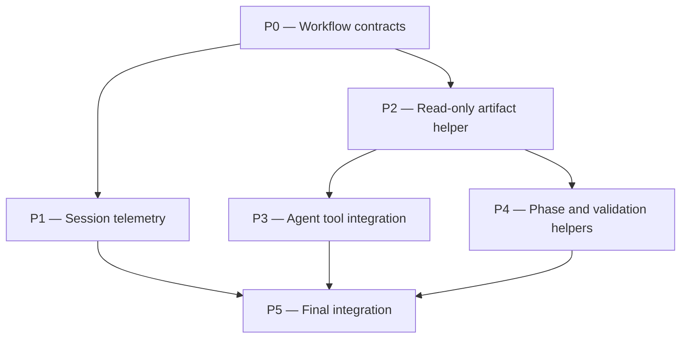

# subagent-reliability Plan

## Source Artifacts

- `.plan/subagent-reliability/proposal.md`
- `.plan/subagent-reliability/map.nodes.jsonl`
- `.plan/subagent-reliability/map.edges.jsonl`
- `.plan/subagent-reliability/facts.nodes.jsonl`
- `.plan/subagent-reliability/facts.edges.jsonl`
- `.plan/subagent-reliability/evidence/adr-session-analysis.md`
- `.plan/subagent-reliability/evidence/subagent-tooling-analysis.md`
- `.plan/subagent-reliability/receipts.jsonl`
- `.plan/subagent-reliability/context-packs.jsonl`
- `.plan/_index/project-graph.sqlite`
- `.plan/_index/project-graph-manifest.json`

## Retrieval Plan Used

- `cartographer_index ensure` refreshed the shared project index before planning.
- `cartographer_jsonl validate-topic --topic subagent-reliability` verified proposal/map/fact/evidence inputs.
- Source-code retrieval used the curated map plus focused reads of `skills/proposal/SKILL.md`, `skills/plan/SKILL.md`, `skills/implement/SKILL.md`, `skills/plan/scripts/analyze_session.py`, `skills/plan/scripts/manage_jsonl.ts`, `extensions/cartographer-tools.ts`, `.pi/agents/cartographer-*.md`, `tests/test_analyze_session.py`, `tests/test_workflow_docs.py`, `tests/manage_jsonl.test.ts`, `tests/cartographer_tools.test.ts`, `README.md`, and `package.json`.
- Rationale retrieval reused prior workflow and receipt proposals through facts [F012] and [F013].
- Sanitized evidence retrieval used only `.plan/subagent-reliability/evidence/adr-session-analysis.md` and `.plan/subagent-reliability/evidence/subagent-tooling-analysis.md` [F001], [F014], [F015].

## Planning Assumptions

### Confirmed facts

- The reviewed session was subagent-heavy and included timeout-scale child calls [F001], [F002].
- The session had context/output pressure and substantial parent tool activity after delegated work [F003], [F004].
- The user observed a missed auditor gate and worker handoff gaps [F005], [F006].
- `pi-subagents` already supports structured acceptance contracts and treats worker completion as intermediate, not final completion [F007], [F008].
- Current Cartographer workflow text has reviewer/auditor role mismatch and under-specified proposal/plan auditor gates [F009], [F010].
- Current session timeout detection can overmatch non-subagent records [F011].
- Prior Cartographer rationale already favors clean-context, bounded specialized subagents and trusted validation before auditor review [F012], [F013].
- Focused tooling evidence shows underused explicit acceptance/timeout/control fields, shell/custom-script friction, and missing direct Cartographer child tool access [F014], [F015], [F016].

### Decisions for this plan

- Implement least-privilege tool expansion, not blanket tool grants.
- Keep mutable canonical artifact writes parent-owned unless a phase explicitly introduces a scoped safe helper.
- Prefer a new read-only artifact helper over granting full `cartographer_jsonl` to read-only agents.
- Improve existing session analyzer and extension/helper surfaces before adding new project agents.
- Treat ADR generation as implementation-finalization work after validation receipts exist; this plan preserves `adr_required: true` from the proposal.

## Phase Dependency Graph

## Phase Summary

| Order | Phase ID | Phase | Depends On | Unlocks | Exit Criteria |
|---:|---|---|---|---|---|
| 0 | P0 | Workflow contracts | none | P1, P2 | README, workflow skills, and docs tests define deterministic-then-auditor gates, structured acceptance, timeout/fallback receipts, and least-privilege child tool policy. |
| 1 | P1 | Session telemetry | P0 | P5 | Session analyzer reports precise subagent outcomes and tooling summaries from synthetic sessions without leaking raw payloads. |
| 2 | P2 | Read-only artifact helper | P0 | P3, P4 | A child-safe read-only artifact/index helper exposes record lookup, citation, validation, receipt, context-pack, and evidence-manifest summaries with tests. |
| 3 | P3 | Agent tool integration | P2 | P5 | Cartographer agent frontmatter/prompts and workflow handoffs use least-privilege helper access by role, not blanket mutable tools. |
| 4 | P4 | Phase and validation helpers | P2 | P5 | Parent-owned phase/acceptance extraction and validation receipt helper paths reduce ad-hoc scripts while preserving validation trust boundaries. |
| 5 | P5 | Final integration | P1, P3, P4 | none | Full checks, topic validation, planning graph validation, auditor pass, and ADR-deferred receipt are complete. |

## Phases

### Phase P0 — Workflow contracts

- **Status:** complete
- **Depends on:** none
- **Unlocks:** P1, P2
- **Primary references:** `file:skills/proposal/SKILL.md`, `file:skills/plan/SKILL.md`, `file:skills/implement/SKILL.md`, `file:README.md`, `file:tests/test_workflow_docs.py`, [F005], [F007], [F008], [F009], [F010], [F014], [F016]

#### Objective

Make the parent workflow contract explicit before implementing helper tools or changing child toolsets.

#### Scope

- Update proposal, plan, and implement skills so deterministic validation receipts plus `cartographer-auditor` PASS are the preferred completion gate.
- Make fallback review/audit paths explicit and receipted.
- Require structured `subagent(...)` acceptance for non-trivial pathfinder/worker handoffs.
- Document role-specific least-privilege tool policy and why full mutable JSONL/private/ADR/receipt authority is not granted to every child.
- Update README and workflow documentation tests accordingly.

#### Checklist

- [x] **P0.T1** Update `skills/proposal/SKILL.md` final validation guidance to require deterministic validation before `cartographer-auditor`, with explicit fallback receipts.
- [x] **P0.T2** Update `skills/plan/SKILL.md` final validation guidance to require `validate_planning_graph.py`/JSONL validation before `cartographer-auditor`, with explicit fallback receipts.
- [x] **P0.T3** Update `skills/implement/SKILL.md` to make `cartographer-pathfinder` the default phase writer, structured acceptance mandatory for non-trivial phase handoffs, and `cartographer-auditor` the default phase/final semantic gate.
- [x] **P0.T4** Document timeout/control/fallback receipt rules, including `cartographer-compass` escalation before substantial parent takeover after repeated child failures.
- [x] **P0.T5** Update `README.md` and `tests/test_workflow_docs.py` to assert auditor gates, structured acceptance, timeout/fallback receipts, and least-privilege child tool policy.

#### Validation

- [x] **P0.V1** Run `python -m unittest discover tests -p "test_workflow_docs.py"` and confirm the workflow documentation contract tests pass.
- [x] **P0.V2** Run `rg -n "cartographer-auditor|structured acceptance|least-privilege|timeout/fallback|cartographer-pathfinder" README.md skills tests/test_workflow_docs.py` and confirm each workflow surface documents the contract.
- [x] **P0.V3** Run `npm run check:scripts` to ensure scripts/extensions still parse after documentation/test changes.

#### Exit Criteria

The parent workflow is contractually clear enough that later phases can add tools and agent updates without relying on ambiguous generic worker/reviewer wording.

#### Risks and Mitigations

- **Risk:** This becomes prompt-only hardening. **Mitigation:** Later phases add helper tools and tests that enforce the policy.
- **Risk:** Workflow docs overstate tool support before it exists. **Mitigation:** Word P0 as policy plus future helper names; P2/P3 implement and wire those helpers.

#### Notes for Execution Agent

This phase is documentation/test focused. Do not change agent frontmatter tools or extension behavior yet unless needed to make tests coherent.

### Phase P1 — Session telemetry

- **Status:** pending
- **Depends on:** P0
- **Unlocks:** P5
- **Primary references:** `file:skills/plan/scripts/analyze_session.py`, `file:tests/test_analyze_session.py`, `.plan/subagent-reliability/evidence/adr-session-analysis.md`, `.plan/subagent-reliability/evidence/subagent-tooling-analysis.md`, [F001], [F002], [F011], [F014], [F015]

#### Objective

Make session retrospectives precise enough to diagnose subagent reliability and tooling issues without custom one-off scripts or raw transcript exposure.

#### Scope

- Split true subagent tool records from heuristic timeout mentions.
- Report per-agent outcome counts, long durations, error counts, acceptance/timeout/async/control field presence, and sanitized tooling-signal categories.
- Add an analyzer mode or report section for `subagent-outcomes` / `tooling-summary`.
- Preserve strict redaction behavior and raw-content omission.
- Update tests with synthetic sessions that include true subagent timeouts, timeout mentions in non-subagent tools, acceptance fields, async/control fields, command failures, and secret payloads.

#### Checklist

- [ ] **P1.T1** Refactor `is_subagent_timeout` or related analyzer logic so non-subagent timeout mentions are reported separately from true subagent timeouts.
- [ ] **P1.T2** Add per-agent tables for subagent calls, errors, timeouts, and longest durations.
- [ ] **P1.T3** Add acceptance/timeout/async/control usage counts for subagent records when those fields are visible.
- [ ] **P1.T4** Add sanitized tooling-friction category counts similar to command-not-found, schema/tool validation, exact-edit failures, custom-script creation, and Cartographer CLI/tool usage.
- [ ] **P1.T5** Extend `tests/test_analyze_session.py` with synthetic fixtures that prove no raw payloads or secrets leak.

#### Validation

- [ ] **P1.V1** Run `python -m py_compile skills/plan/scripts/analyze_session.py`.
- [ ] **P1.V2** Run `python -m unittest discover tests -p "test_analyze_session.py"`.
- [ ] **P1.V3** Run a synthetic analyzer command in `/tmp` and confirm the report distinguishes true subagent timeout records from timeout mentions.

#### Exit Criteria

Future proposal authors can generate the same kind of tooling review now captured in `.plan/subagent-reliability/evidence/subagent-tooling-analysis.md` without writing a custom script in the parent session.

#### Risks and Mitigations

- **Risk:** Pi session schema variations make strict parsing brittle. **Mitigation:** Keep schema-tolerant aggregate parsing and label unknowns rather than failing.
- **Risk:** Tooling snippets leak raw content. **Mitigation:** Use capped redaction and tests for secrets/long payloads.

#### Notes for Execution Agent

Use temporary synthetic sessions for tests; do not run tests against the repository's real planning artifacts except for read-only validation.

### Phase P2 — Read-only artifact helper

- **Status:** pending
- **Depends on:** P0
- **Unlocks:** P3, P4
- **Primary references:** `file:extensions/cartographer-tools.ts`, `file:skills/plan/scripts/manage_jsonl.ts`, `file:tests/manage_jsonl.test.ts`, `file:tests/cartographer_tools.test.ts`, `file:.pi/agents/cartographer-auditor.md`, [F015], [F016], [F903]

#### Objective

Give read-only and drafting subagents a structured way to inspect Cartographer artifacts without full mutable JSONL access or ad-hoc shell scripts.

#### Scope

- Add a least-privilege helper named `cartographer_artifacts` or `cartographer_jsonl_read`.
- Support read-only actions only: `list-records`, `show-record`, `validate-topic-summary`, `fact-citation-summary`, `receipt-summary`, `context-pack-summary`, and `evidence-manifest-summary`.
- Ensure evidence summaries do not expose raw private paths or raw private content.
- Keep `cartographer_jsonl upsert` and canonical artifact mutation out of this helper.
- Add TypeScript and/or script tests for record lookup, summaries, path safety, truncation, and no private reference leakage.

#### Checklist

- [ ] **P2.T1** Implement read-only artifact summary actions in `skills/plan/scripts/manage_jsonl.ts` or a new stdlib-compatible helper script.
- [ ] **P2.T2** Register the helper in `extensions/cartographer-tools.ts` with a read-only schema and Clean Context Contract output shaping.
- [ ] **P2.T3** Add `fact-citation-summary` that verifies proposal/plan citations against `facts.nodes.jsonl` and `facts.edges.jsonl` without editing artifacts.
- [ ] **P2.T4** Add `receipt-summary` and `context-pack-summary` actions for auditor/pathfinder handoffs.
- [ ] **P2.T5** Add tests proving the helper cannot perform upserts, does not expose raw private references, and returns compact summaries.

#### Validation

- [ ] **P2.V1** Run `node --experimental-strip-types --check skills/plan/scripts/manage_jsonl.ts`.
- [ ] **P2.V2** Run `node --experimental-strip-types --check extensions/cartographer-tools.ts`.
- [ ] **P2.V3** Run `npm run test:ts`.
- [ ] **P2.V4** Run `python -m unittest discover tests -p "test_manage_jsonl.py"` if Python-side JSONL helper tests are added or changed.

#### Exit Criteria

Auditor, compass, drafter, archivist, pathfinder, and redactor prompts can ask for artifact summaries through a safe helper instead of scripting JSONL reads through `bash`.

#### Risks and Mitigations

- **Risk:** Existing `cartographer_jsonl list` already overlaps. **Mitigation:** Keep the new helper explicitly read-only and summary-oriented for child safety, or add read-only aliases with clear extension-level action restrictions.
- **Risk:** Extension-level tool filtering may not enforce per-action policy. **Mitigation:** Prefer a separate helper tool over passing full `cartographer_jsonl` to read-only children.

#### Notes for Execution Agent

Do not add write/upsert actions to this helper. If implementation discovers Pi cannot expose custom tools to project agents through frontmatter, document that and keep helper use in parent/delegation prompts.

### Phase P3 — Agent tool integration

- **Status:** pending
- **Depends on:** P2
- **Unlocks:** P5
- **Primary references:** `file:.pi/agents/cartographer-auditor.md`, `file:.pi/agents/cartographer-compass.md`, `file:.pi/agents/cartographer-drafter.md`, `file:.pi/agents/cartographer-archivist.md`, `file:.pi/agents/cartographer-pathfinder.md`, `file:.pi/agents/cartographer-redactor.md`, `file:skills/implement/SKILL.md`, [F007], [F008], [F014], [F016]

#### Objective

Wire least-privilege helper access into Cartographer subagent definitions and handoff prompts while preserving parent orchestration authority.

#### Scope

- Update agent frontmatter/tool lists where supported.
- If direct helper tool grants are unsupported, update prompts and workflow handoffs to pass helper receipts/summaries from the parent.
- Keep read-only agents read-only.
- Give `cartographer-pathfinder` read-only artifact/index summaries plus existing edit/write tools and validation helper access, but not unrestricted private evidence, ADR, or canonical receipt mutation.
- Give `cartographer-redactor` session/evidence helper access only for explicitly authorized private artifacts and sanitized outputs.
- Update workflow prompts to use `acceptance`, `async`, `outputMode: "file-only"`, and `control` for long child runs.

#### Checklist

- [ ] **P3.T1** Update `cartographer-auditor` to require artifact helper summaries and deterministic receipt paths before PASS/FAIL, while remaining read-only.
- [ ] **P3.T2** Update `cartographer-compass` to use read-only artifact/index summaries for scope/dependency/repeated-failure decisions.
- [ ] **P3.T3** Update `cartographer-drafter` and `cartographer-archivist` to cite existing facts/maps via read-only helper summaries and emit suggestions or assigned drafts only.
- [ ] **P3.T4** Update `cartographer-pathfinder` to report acceptance criteria status, changed files, validation evidence, residual blockers, and no-staged-files evidence.
- [ ] **P3.T5** Update `cartographer-redactor` to prefer `cartographer_session`/evidence summaries for session artifacts and keep sanitized output boundaries explicit.
- [ ] **P3.T6** Update proposal/plan/implement handoff templates to pass structured acceptance, async/control settings, helper summary paths, and timeout fallback receipt requirements.

#### Validation

- [ ] **P3.V1** Run `subagent({ action: "list" })` manually or through documented verification and confirm the Cartographer agents remain discoverable.
- [ ] **P3.V2** Run `rg -n "cartographer_artifacts|cartographer_jsonl_read|acceptance|control|outputMode|cartographer_session" .pi/agents skills` and confirm role prompts reference the new helper contracts.
- [ ] **P3.V3** Run `python -m unittest discover tests -p "test_workflow_docs.py"` to ensure docs/tests capture the agent-tool policy.

#### Exit Criteria

Cartographer subagents have clearer, safer tool access and handoff contracts, and no read-only role gains broad mutation/private/ADR authority.

#### Risks and Mitigations

- **Risk:** Giving `bash` plus read-only helper access still permits manual parsing. **Mitigation:** Make the helper the documented preferred path and add tests/docs around least privilege; consider reducing `bash` only after measured evidence supports it.
- **Risk:** Tool grants fail in child runtime. **Mitigation:** Preserve parent-generated helper summaries as a fallback in handoff prompts.

#### Notes for Execution Agent

Do not run live private evidence through child agents except the redactor with explicitly authorized paths. Keep helper summaries commit-safe.

### Phase P4 — Phase and validation helpers

- **Status:** pending
- **Depends on:** P2
- **Unlocks:** P5
- **Primary references:** `file:skills/implement/SKILL.md`, `file:skills/plan/scripts/validate_planning_graph.py`, `file:skills/plan/scripts/validation_runner.py`, `file:extensions/cartographer-tools.ts`, `file:package.json`, [F007], [F013], [F015]

#### Objective

Reduce parent and child custom scripts for phase extraction, acceptance-contract creation, and validation receipts while keeping hard validation parent-owned.

#### Scope

- Add a parent-oriented `cartographer_phase` helper or script action to summarize next executable phase, dependencies, checklist IDs, validation IDs, source references, and suggested acceptance contract fields.
- Add or expose a validation helper around the existing validation runner so declared commands can produce compact receipts without children hand-writing canonical evidence.
- Keep signed/trusted receipt cryptography aligned with the separate signed-receipts direction; this phase may add a compatible wrapper without claiming cryptographic guarantees unless those are implemented.
- Ensure helper outputs follow the Clean Context Contract.

#### Checklist

- [ ] **P4.T1** Implement a phase-summary helper that reads `plan.md`/`plan.nodes.jsonl`/`plan.edges.jsonl` and returns next executable phase details.
- [ ] **P4.T2** Include suggested `subagent(...)` acceptance criteria, evidence, verify commands, and stop rules in the phase summary.
- [ ] **P4.T3** Add an extension/tool wrapper for validation runner receipts or document parent-only invocation if the wrapper is deferred.
- [ ] **P4.T4** Ensure timeout/failure receipts include fallback decision fields required by validators.
- [ ] **P4.T5** Add tests for phase extraction, dependency blocking, acceptance-contract generation, validation receipt shape, and no mutation of the real repository `.plan/` during tests.

#### Validation

- [ ] **P4.V1** Run `python -m unittest discover tests -p "test_validation_runner.py"`.
- [ ] **P4.V2** Run `python -m unittest discover tests -p "test_validate_planning_graph.py"`.
- [ ] **P4.V3** Run `npm run test:ts` if extension wrapper behavior is added.
- [ ] **P4.V4** Run the phase-summary helper against a temporary mock plan and confirm it does not mutate the real repository `.plan/`.

#### Exit Criteria

Parent implementation handoffs can be generated from plan artifacts without custom parsing scripts, and validation evidence remains deterministic and parent-owned.

#### Risks and Mitigations

- **Risk:** This overlaps the signed-receipts proposal. **Mitigation:** Implement a compatible wrapper around existing validation receipts and leave cryptographic signing to that accepted plan unless explicitly merged.
- **Risk:** Phase extraction overfits current Markdown format. **Mitigation:** Prefer plan graph JSONL when present and test Markdown fallback with representative fixtures.

#### Notes for Execution Agent

Respect AGENTS.md: tests must use temporary/mock project roots for plan/receipt artifacts and must not mutate the real `.plan/` during test setup.

### Phase P5 — Final integration

- **Status:** pending
- **Depends on:** P1, P3, P4
- **Unlocks:** none
- **Primary references:** `file:README.md`, `file:package.json`, `file:tests/test_workflow_docs.py`, `file:tests/test_analyze_session.py`, `file:tests/manage_jsonl.test.ts`, `file:tests/cartographer_tools.test.ts`, `.plan/subagent-reliability/proposal.md`, [F012], [F013], [F014], [F016]

#### Objective

Validate the complete subagent reliability workflow, update planning artifacts, and leave ADR finalization ready for implementation completion.

#### Scope

- Run the broad project quality gates.
- Validate `.plan/subagent-reliability` artifacts and planning graph.
- Run a final `cartographer-auditor` semantic pass after deterministic validation receipts.
- Update README/examples with the final role/tool matrix and child handoff examples.
- Record ADR outcome according to proposal metadata: draft/write ADR only after implementation validation receipts exist, or stop if the ADR decision needs user confirmation.

#### Checklist

- [ ] **P5.T1** Update README with final role/tool matrix and examples for auditor gate, pathfinder acceptance, read-only artifact helper, and timeout fallback receipts.
- [ ] **P5.T2** Ensure proposal/plan/implement skill examples use helper summaries and structured acceptance rather than vague child prompts.
- [ ] **P5.T3** Run and record topic validation, planning graph validation, and full project checks.
- [ ] **P5.T4** Dispatch `cartographer-auditor` with deterministic receipt paths and context-pack paths; apply required corrections before finalizing.
- [ ] **P5.T5** Finalize ADR intent with `cartographer_adr` after validation receipts and implementation commits exist, or record an explicit user-deferred ADR receipt.

#### Validation

- [ ] **P5.V1** Run `npm run check`.
- [ ] **P5.V2** Run `cartographer_jsonl validate-topic --topic subagent-reliability`.
- [ ] **P5.V3** Run `python skills/plan/scripts/validate_planning_graph.py --root "$PWD" --topic subagent-reliability --json`.
- [ ] **P5.V4** Run a final `cartographer-auditor` pass and confirm PASS with receipt/context-pack references.
- [ ] **P5.V5** Run `cartographer_adr` draft/write/validate only when implementation validation receipts and source commits are available.

#### Exit Criteria

All subagent reliability changes are documented, tested, validated, audited, and ready for ADR finalization according to the proposal metadata.

#### Risks and Mitigations

- **Risk:** Full `npm run check` is slower than targeted checks. **Mitigation:** Use targeted checks per phase, but require full check in final integration.
- **Risk:** ADR finalization lacks enough evidence before implementation commits. **Mitigation:** Keep ADR writing deferred until receipts/source commits exist, as the proposal requires.

#### Notes for Execution Agent

Do not mark implementation complete until deterministic validation and auditor PASS are both recorded. Preserve least-privilege scope even if helper implementation is incomplete.

## Cross-Phase Validation

- Run `cartographer_jsonl validate-topic --topic subagent-reliability` after each planning artifact update and at final integration.
- Run `python skills/plan/scripts/validate_planning_graph.py --root "$PWD" --topic subagent-reliability --json` after plan graph changes and before final response.
- Run `npm run check:scripts` after any script or extension changes.
- Run targeted tests for changed areas during phases, then `npm run check` at final integration.
- Run `git diff --check` before each implementation commit.
- Dispatch `cartographer-auditor` only after deterministic validation receipts exist.

## Open Questions

- Should the read-only artifact helper be a new tool (`cartographer_artifacts`) or a read-only wrapper/alias around existing `cartographer_jsonl` actions? The plan prefers a separate helper if per-action child permissions cannot be enforced.
- Should the validation helper include signed receipts now, or remain a compatibility wrapper around `validation_runner.py` while the separate signed-receipts plan handles cryptographic trust? The plan assumes compatibility wrapper first unless the user merges the signed-receipts scope.
- Can project agent frontmatter reliably expose custom extension tools to child agents in this Pi runtime? If not, parent-generated helper summaries remain the fallback.

## Handoff Guidance

- Execute phases in dependency order: P0, then P1/P2 as dependency-ready work, then P3/P4, then P5.
- Use `cartographer-pathfinder` as the single writer for implementation phases when available; use built-in `worker` only as explicit fallback.
- Use structured `acceptance` for each non-trivial writer handoff: checklist IDs, changed-files evidence, validation commands, residual-risk reporting, stop rules, and `maxFinalizationTurns: 3`.
- Keep read-only roles read-only. Do not grant broad mutable JSONL, private evidence, ADR, or canonical receipt-writing authority to all subagents.
- After repeated child/tool failure or timeout, call `cartographer-compass` before broad parent takeover.
- Before finalizing any phase or the full plan, run deterministic validation and dispatch `cartographer-auditor` with receipt/context-pack paths.
- ADR metadata is `adr_required: true`; implementation finalization should use `cartographer_adr` only after validation receipts and source commits exist.
