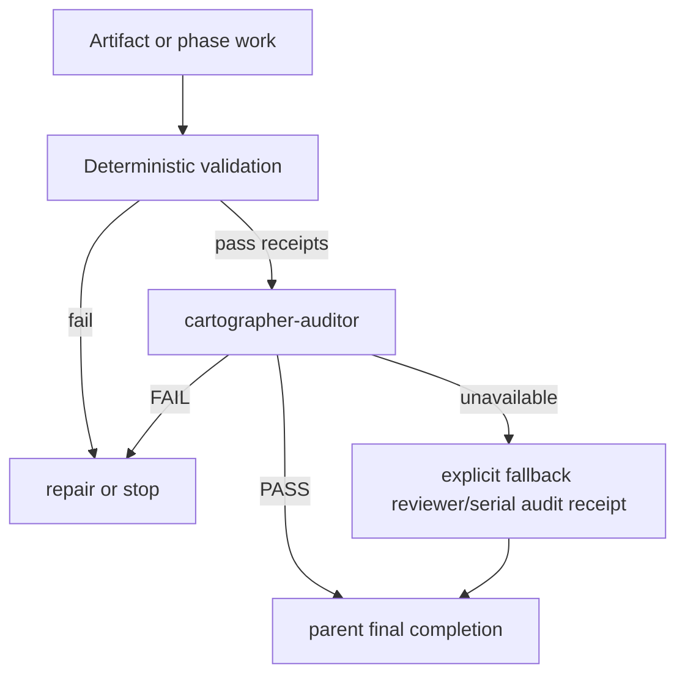

# subagent-reliability Proposal

## Description

Harden Pi Cartographer's project-scoped subagents and parent workflow gates so delegated work is bounded, observable, and not considered complete until deterministic validation and a Cartographer auditor pass succeed. The proposal uses the authorized session log only through sanitized evidence at `.plan/subagent-reliability/evidence/adr-session-analysis.md`; raw transcript content is not cited.

The change is targeted: keep the existing lean `cartographer-*` agent set, but make their contracts enforceable through workflow wording, structured `subagent(...)` acceptance, timeout/control receipts, and tests. The tool-access recommendation is **selective expansion**: give Cartographer subagents read-only index/artifact helpers where useful, but do not grant every child full mutable `cartographer_jsonl`, private-evidence, ADR, or receipt-writing authority.

## Problem Statement

The ADR dogfooding session exposed subagent reliability failures at the workflow boundary, not just inside any one child agent:

| Symptom | Evidence | Consequence |
|---|---|---|
| Timeout-scale delegated turns | The sanitized report counted 107 subagent calls, 17 subagent errors, and longest subagent turns of about 600s, 566s, and 300s [F001], [F002]. | The parent can block for many minutes without a clear progress, retry, or fallback decision. |
| Context and output pressure | The same report shows 2,035 entries, four compactions, and tool/text outputs up to 166,878 characters [F003]. | Parent and child context can drift, making completion judgments depend on lossy transcript continuity. |
| Parent rework burden | The session had high direct `bash`, `edit`, and JSONL activity after delegated work, and the user reported that worker agents left the parent to finish implementation [F004], [F006]. | Worker/pathfinder handoffs are not yet strong enough proof of phase completion. |
| Missing auditor gate | The user reported that the parent had to be told to use the auditor before treating work as complete [F005]. | Proposal/plan/implementation finalization can drift from Cartographer's intended deterministic-then-auditor contract. |
| Workflow wording mismatch | Current skills name `cartographer-auditor` and `cartographer-pathfinder` as preferred agents, but final validation and implementation steps still emphasize generic reviewer/worker roles [F009], [F010]. | The parent can follow the letter of a workflow while skipping the project-specific gate the project intended. |
| Evidence precision gap | The session analyzer can overmatch timeout strings and produced timeout rows for non-subagent tools with blank agents [F011]. | Future retrospective data can misclassify failures unless telemetry is tightened. |
| Child tooling gap | Focused tooling analysis found low explicit acceptance/timeout/control usage, custom-script and CLI friction, and current child agents lacking direct Cartographer artifact/index tools [F014], [F015], [F016]. | Subagents waste time shelling out or hand-parsing artifacts, and read-only agents lack a safe structured way to inspect map/fact/receipt state. |

## Goals

1. **Make auditor completion gates explicit.** Proposal, plan, and implementation workflows should require deterministic validation receipts followed by `cartographer-auditor` PASS when that agent is available; fallback to built-in reviewer/oracle or serial review must be explicit and receipted [F005], [F010].
2. **Strengthen worker/pathfinder handoffs.** Implementation children should receive structured acceptance contracts with criteria, evidence, verification commands, stop rules, and bounded finalization turns instead of only prose prompts [F006], [F007].
3. **Bound and observe subagent runs.** Parent workflows should use async/status/control patterns, named timeout budgets, progress/needs-attention thresholds, and timeout fallback decisions so long child calls do not become silent blockers [F002].
4. **Keep parent orchestration authoritative.** Worker completion is an intermediate state; parent review, auditor validation, and final checks remain required unless the user explicitly requested worker-only output [F008].
5. **Improve retrospective telemetry.** `analyze_session.py` should report true subagent outcomes by agent/run, long durations, timeout reasons, and gate/acceptance signals without overmatching raw text [F011].
6. **Expand child tools by least privilege.** Give Cartographer subagents safe read-only index/JSONL/artifact access where it helps them inspect facts, maps, context packs, receipts, and validation summaries; reserve mutation and private/ADR authority for the parent or narrowly scoped tools [F014], [F015], [F016].
7. **Add deterministic helper tools where repeated custom scripts appear.** Prefer small helpers such as `cartographer_jsonl_read`, `cartographer_artifacts`, `cartographer_session tooling-summary`, and `cartographer_phase` over ad-hoc Python/CLI snippets in every run [F015].
8. **Preserve Cartographer minimalism.** Reuse the existing narrow agents (`pathfinder`, `auditor`, `compass`, `drafter`, `archivist`, `redactor`) rather than adding generic clones [F012].

## Non-Goals

- Do not change Pi's `pi-subagents` runtime or require new external orchestration frameworks.
- Do not make subagents mandatory when no executable subagents are available; serial fallback should remain supported, explicit, and receipted.
- Do not allow several writer children to edit the same worktree in parallel.
- Do not trust worker-authored notes as hard validation evidence; deterministic/trusted validation remains separate [F013].
- Do not read, commit, or cite raw private session transcripts.
- Do not expand the project-specific agent set unless a later measured proposal proves a need.
- Do not grant full mutable `cartographer_jsonl upsert`, raw private-evidence import/read, ADR write, or canonical receipt-writing permissions to all subagents.
- Do not treat `bash` access as an adequate substitute for safe, structured read-only artifact tools when repeated custom parsing appears in session evidence.

## Background

Pi Cartographer already moved toward artifact-first, clean-context workflows. The prior workflow-optimization proposal identified context bloat, subagent timeout risk, and the need for optional bounded Cartographer-specific agents [F012]. The signed-receipts proposal further separated worker/subagent proposals from trusted validation evidence and placed auditor review after deterministic validation [F013].

The current repository partially reflects that direction. The project has narrow agent files for `cartographer-pathfinder`, `cartographer-auditor`, `cartographer-compass`, and `cartographer-drafter` (`file:.pi/agents/cartographer-pathfinder.md`, `file:.pi/agents/cartographer-auditor.md`, `file:.pi/agents/cartographer-compass.md`, `file:.pi/agents/cartographer-drafter.md`). The workflow skills also prefer Cartographer-specific agents, but some final validation text still points at generic reviewer/oracle or worker/reviewer loops, leaving room for the missed-auditor incident [F009], [F010].

The pi-subagents guidance already provides the runtime pattern this project should use: parent-owned orchestration, single-writer children, structured acceptance contracts, async review loops, child progress/attention control, and the rule that a worker handoff is not final completion [F007], [F008], [F905].

## Viability

This is highly viable because it is mostly a contract-and-validation tightening pass:

| Existing asset | Proposed use |
|---|---|
| `skills/proposal/SKILL.md` | Replace reviewer/oracle-first final validation wording with deterministic validation + `cartographer-auditor` gate, explicit fallback receipts, and completion checklist. |
| `skills/plan/SKILL.md` | Apply the same final plan audit gate after `validate_planning_graph.py` and `cartographer_jsonl validate-topic`. |
| `skills/implement/SKILL.md` | Make `cartographer-pathfinder` the default writer, structured acceptance mandatory for phase handoffs, `cartographer-auditor` the phase/final semantic gate, and `cartographer-compass` the repeated-failure timeout advisor. |
| `.pi/agents/cartographer-pathfinder.md` | Clarify that a child must report incomplete acceptance criteria and cannot claim done without validation evidence/residual risks. |
| `.pi/agents/cartographer-auditor.md` | Clarify PASS/FAIL requirements and that completion is blocked if deterministic receipts or acceptance evidence are missing. |
| `skills/plan/scripts/analyze_session.py` | Tighten subagent timeout/outcome classification and add tests for the overmatch seen in this proposal's evidence. |
| `tests/test_workflow_docs.py` and `tests/test_analyze_session.py` | Lock the workflow wording and session telemetry behavior with cheap deterministic tests. |
| `extensions/cartographer-tools.ts` and JSONL/session helpers | Add read-only child-safe artifact summaries and session tooling summaries so subagents do not need ad-hoc shell/Python parsing for routine map/fact/receipt inspection. |

The main risk is overcorrecting into heavy process. The design avoids that by changing defaults, gates, and handoff contracts without introducing a new runtime dependency or new agent family.

## ADR Metadata

- `adr_required`: true
- `adr_reason`: This is a durable cross-workflow policy decision for Cartographer subagent orchestration, completion authority, validation trust boundaries, and auditor gates.
- `adr_options_status`: proposed-options-in-design
- `adr_tool_mode`: evaluate-now; draft/write after implementation validation receipts exist

Candidate ADR options for implementation finalization:

1. **Prompt-only hardening.** Update skill/agent text but do not use runtime acceptance or receipts. Lowest effort, but least enforceable.
2. **Workflow contract plus least-privilege tool hardening (recommended).** Update skills/agents/tests so parent workflows must use structured acceptance, deterministic receipts, auditor gates, explicit fallback decisions, and child-safe read-only artifact/index tooling.
3. **Broad runtime/tool expansion.** Add broader extension tools or subagent orchestration receipt machinery. More enforceable, but too heavy unless the least-privilege wrappers still leave measured failures.

## Design

### 1. Make completion gates deterministic-then-auditor

Update `skills/proposal/SKILL.md`, `skills/plan/SKILL.md`, and `skills/implement/SKILL.md` so completion cannot be reported while the auditor gate is missing.

Required workflow shape:

Details:

- Proposal workflow: after `cartographer_jsonl validate-topic`, dispatch `cartographer-auditor` with topic, artifact paths, validation receipt/report, acceptance criteria, and questions. Final response must state the auditor PASS path or the explicit fallback reason.
- Plan workflow: after `validate_planning_graph.py` and JSONL validation, dispatch `cartographer-auditor`; built-in reviewer/oracle become fallback roles, not the preferred final gate.
- Implement workflow: after phase validation commands and before phase completion/commit, dispatch `cartographer-auditor`; final cross-phase validation should also have an auditor/fallback receipt.
- Any serial fallback must write a receipt that explains why auditor was unavailable or unsuitable.

This directly addresses the reported missed-auditor incident [F005] and the current wording mismatch [F010].

### 2. Harden pathfinder/worker handoff contracts

Change implementation handoffs from prose-only prompts to structured acceptance contracts whenever the `subagent(...)` tool supports them.

Parent-side requirements in `skills/implement/SKILL.md`:

- Use `cartographer-pathfinder` by default for phase edits; built-in `worker` is an explicit fallback.
- Put phase text, checklist IDs, plan/map/fact paths, and context-pack path in `task`.
- Put definition of done in `acceptance.criteria`.
- Require evidence: `changed-files`, `commands-run`, `validation-output`, `residual-risks`, `diff-summary`, and `no-staged-files` when applicable.
- Add `verify` commands for phase validation commands when safe and known.
- Add stop rules for out-of-scope edits, unapproved product/design decisions, repeated tool failures, and validation that cannot be run.
- Use `maxFinalizationTurns: 3` as the default bounded self-review/repair budget.

Child-side requirements in `.pi/agents/cartographer-pathfinder.md`:

- Report acceptance criteria as complete/incomplete, not just prose confidence.
- If validation was skipped, identify why and what parent should run.
- Never claim phase completion when residual blockers remain.
- Stop and escalate after repeated tool failures rather than continuing broad parent-rework-inducing edits.

This uses pi-subagents' existing acceptance mechanism [F007] and reinforces that worker completion is not final completion [F008].

### 3. Add timeout, progress, and fallback receipts

Make long-running subagent behavior observable and bounded:

- Default non-trivial worker/auditor/drafter calls to `async: true` unless a foreground result is intentionally required.
- Name timeout budgets by role, for example:
  - pathfinder phase implementation: 10 minutes foreground equivalent or async with attention control;
  - auditor semantic pass: 5 minutes;
  - drafter/proposal synthesis: 5 minutes;
  - redactor/session evidence: file-only output and explicit budget.
- Enable subagent control attention thresholds for long runs where supported.
- After any timeout or repeated child/tool failure, append a receipt or context-pack note with: role, objective, timeout duration, partial artifacts, narrowed retry decision, serial fallback decision, or `cartographer-compass` recommendation.
- Invoke `cartographer-compass` before the parent silently takes over substantial worker duties after repeated failures.

This addresses timeout-scale child turns in the session evidence [F002] and keeps parent authority clear.

### 4. Improve session telemetry for subagent reliability

Update `skills/plan/scripts/analyze_session.py` and `tests/test_analyze_session.py` so future evidence is more precise:

- Count actual subagent tool results separately from generic records that merely contain words like `worker`, `reviewer`, or `timeout`.
- Report per-agent outcome counts: completed, timed out, errored, interrupted/needs-attention when schema fields are present.
- Keep a separate `timeout_mentions` or `possible_timeout_mentions` section for heuristic text matches, so it cannot be confused with true child timeouts.
- Add longest-subagent-turns and subagent-error tables by agent.
- Add optional detection of acceptance contracts, auditor calls, reviewer/auditor PASS/FAIL outcomes, and worker handoff evidence when those fields are visible in JSONL metadata without reproducing raw transcript content.
- Add synthetic tests proving raw payloads and secrets stay out of Markdown/JSON outputs.

This fixes the overmatch observed in the current sanitized report [F011] while preserving private evidence handling.

### 5. Add least-privilege Cartographer tool access for child agents

The session evidence points to both orchestration friction and tooling friction: subagent records underused explicit acceptance/timeout/control fields, while the broader transcript showed shell/custom-script/tool-use error categories [F014], [F015]. Current Cartographer child agents also expose only basic file/shell tools, so graph and JSONL work falls back to `bash` and CLI commands [F016].

Do **not** grant every child the full mutable Cartographer tool surface. Instead, add or configure least-privilege access by role:

| Agent | Recommended tools | Rationale |
|---|---|---|
| `cartographer-auditor` | `read`, `bash`, read-only `cartographer_index`, read-only JSONL/artifact summary tool | Lets the auditor inspect proposal/plan/fact/map/receipt state and verify references without hand-written shell parsing. No mutation. |
| `cartographer-compass` | `read`, `bash`, read-only `cartographer_index`, read-only JSONL/artifact summary tool | Speeds scope/dependency/repeated-failure decisions while preserving advisory-only authority. |
| `cartographer-drafter` | Existing `write` plus read-only index/JSONL/artifact summaries | Lets the drafter cite existing facts/maps accurately. Parent should still own final validation and upserts unless a scoped writer helper is added. |
| `cartographer-archivist` | Read-only index/JSONL plus a scoped `fact-suggestions` writer or current file-only output | Avoids duplicate facts and reduces JSONL formatting mistakes without giving broad mutation authority. |
| `cartographer-pathfinder` | `read`, `bash`, `edit`, `write`, read-only index/JSONL/artifact summaries, validation-runner/trusted validation tool | Speeds phase context gathering and validation evidence. It should not get unrestricted ADR/evidence/private-import authority. |
| `cartographer-redactor` | `read`, `bash`, `write`, `cartographer_session` for session artifacts, evidence manifest/list helpers | Standardizes session/log analysis and reduces custom parsing scripts while keeping raw-private handling confined to redaction outputs. |

The key missing primitive is a **read-only JSONL/artifact tool**, not blanket access to `cartographer_jsonl upsert`. If the current extension cannot restrict actions per agent, create a new wrapper such as `cartographer_artifacts` or `cartographer_jsonl_read` with only:

- `list-records` / `show-record` by file, type, or ID;
- `validate-topic` and `validate-file` summaries;
- `fact-citation-summary` for proposal/plan Markdown;
- `receipt-summary` and `context-pack-summary`;
- `evidence-manifest-summary` that never exposes raw `.plan/_private/**` paths.

Mutable operations should remain parent-owned or be exposed through narrow scoped helpers, for example `append-fact-suggestions` to a drafter/archivist output file, not direct writes to canonical map/fact/receipt artifacts.

### 6. Add helper tools to avoid repeated custom scripts

The focused tooling analysis found many custom-script and Cartographer CLI usage signals [F015]. Add small deterministic helpers before adding more agent prompt instructions:

1. **`cartographer_artifacts` / `cartographer_jsonl_read`:** read-only artifact listing, record lookup, validation summaries, citation checks, and receipt/context-pack summaries.
2. **`cartographer_validation`:** trusted validation runner/receipt tool from the signed-receipts direction, so workers do not fabricate or hand-write hard validation evidence [F013].
3. **`cartographer_session` enhancements:** add a `subagent-outcomes` or `tooling-summary` action that reports per-agent durations, timeout/error outcomes, acceptance/async/control usage, and sanitized tooling friction categories.
4. **`cartographer_phase` helper:** parent-only helper to extract the next phase, checklist IDs, validation IDs, and candidate acceptance contract from `plan.md`/`plan.nodes.jsonl`.

### 7. Document and test the workflow guarantees

Update docs/tests to make the new contract durable:

- README `Cartographer subagents` should state that `cartographer-auditor` is the preferred semantic completion gate, `cartographer-pathfinder` is the preferred single-phase writer, and generic builtin agents are fallbacks.
- Agent frontmatter or project settings should grant read-only Cartographer artifact/index access where available, and tests/docs should explain why full mutable JSONL tools are not granted to read-only agents.
- `tests/test_workflow_docs.py` should assert that proposal, plan, and implement skills mention the auditor gate, structured acceptance, timeout/fallback receipts, least-privilege child tools, and Cartographer-specific default roles.
- `tests/test_analyze_session.py` should cover the new session `tooling-summary`/`subagent-outcomes` evidence.
- `package.json` validation remains the implementation check surface: `npm run check:scripts`, `npm run test:py`, `npm run test:ts`, and `npm run check`.

## Retrieval Plan Used

- `cartographer_index ensure` to create/refresh `.plan/_index/project-graph.sqlite`.
- `cartographer_index slice-jsonl` for the initial topic map, followed by manual curation and `cartographer_jsonl validate-topic`.
- Focused reads of `.pi/agents/cartographer-*.md`, `skills/proposal/SKILL.md`, `skills/plan/SKILL.md`, `skills/implement/SKILL.md`, `skills/plan/scripts/analyze_session.py`, `tests/test_analyze_session.py`, `tests/test_workflow_docs.py`, `README.md`, and `package.json`.
- Plans-scope retrieval for `.plan/workflow-optimization/*` and `.plan/signed-receipts/proposal.md` to reuse prior rationale.
- Sanitized session analysis generated from the authorized JSONL log into `.plan/subagent-reliability/evidence/adr-session-analysis.md`.
- Focused sanitized tooling analysis generated into `.plan/subagent-reliability/evidence/subagent-tooling-analysis.md` to evaluate whether missing child tools contributed to reliability issues.
