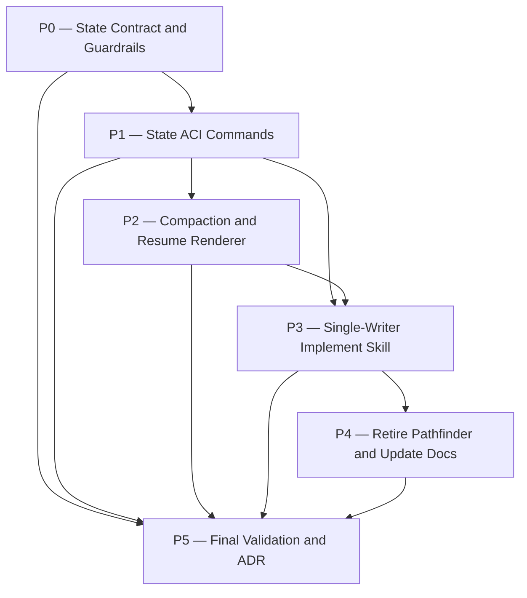

# sunset-pathfinder Plan

## Source Artifacts

- Proposal: `.plan/sunset-pathfinder/proposal.md`
- Map graph: `.plan/sunset-pathfinder/map.nodes.jsonl`, `.plan/sunset-pathfinder/map.edges.jsonl`
- Fact graph: `.plan/sunset-pathfinder/facts.nodes.jsonl`, `.plan/sunset-pathfinder/facts.edges.jsonl`
- Context packs: `.plan/sunset-pathfinder/context-packs.jsonl`
- Receipts: `.plan/sunset-pathfinder/receipts.jsonl`
- Shared index: `.plan/_index/project-graph.sqlite` and manifest
- Primary source files verified for planning:
  - `file:skills/implement/SKILL.md`
  - `file:.pi/agents/cartographer-pathfinder.md`
  - `file:README.md`
  - `file:docs/adr/0002-require-auditable-cartographer-subagent-handoffs.md`
  - `file:extensions/cartographer-tools.ts`
  - `file:skills/plan/scripts/manage_jsonl.ts`
  - `file:skills/plan/scripts/validation_runner.py`
  - `file:AGENTS.md`
  - `package.json`
  - `.gitignore`

## Planning Assumptions

- `.plan/<topic>/plan.md`, `plan.nodes.jsonl`, `plan.edges.jsonl`, `receipts.jsonl`, and `context-packs.jsonl` remain authoritative for current planning/evidence; `.cartographer/` state references these artifacts rather than duplicating the plan graph [F092][F094].
- This effort does **not** introduce `plan.json`, generated `status.md`, or any generated human Markdown state view [F092][F093].
- Agent execution state uses strictly structured JSON/JSONL: `.cartographer/<topic>/state.json`, `.cartographer/<topic>/journal.jsonl`, schemas, and optional `.cartographer/current.json` as a local ignored pointer [F070][F071][F072][F095][F096].
- Journal records are scarce curated lessons/gotchas/constraints only, not raw logs, validation history, receipts, or transcripts [F095].
- Agents may read state files directly, but canonical state/journal/current mutations go through a semantic state-transition ACI with schema + invariant checks; direct state edits are only an escape hatch followed by validation [F083][F087][F090].
- `compact.generate` and controlled resume context injection are separate operations: compaction writes/validates state, while resume rendering injects bounded context data without mutating state [F047][F048][F050].
- `cartographer-pathfinder` leaves the default implementation path; `cartographer-auditor`, `cartographer-compass`, and `cartographer-archivist` remain read-only specialists [F009][F055][F060][F061][F066].
- ADR finalization is required because this revises the writer-subagent portion of ADR-0002 while retaining deterministic receipts and read-only auditor principles [F062].
- Tests that generate `.plan/`, `.cartographer/`, indexes, receipts, or state fixtures must use temporary/mock roots, never the repository's real `.plan/` directory.

## Phase Dependency Graph

## Phase Summary

| Order | Phase ID | Phase | Depends On | Unlocks | Exit Criteria |
| ----: | -------- | ----- | ---------- | ------- | ------------- |
| 0 | P0 | State Contract and Guardrails | none | P1, P5 | State/journal/current schema contracts and temp-root validation tests exist; `.cartographer/current.json` is ignored without ignoring all `.cartographer/`. |
| 1 | P1 | State ACI Commands | P0 | P2, P3, P5 | Semantic state/journal/current mutation commands and extension registration are implemented with tests and output shaping. |
| 2 | P2 | Compaction and Resume Renderer | P1 | P3, P5 | `compact.generate` writes/validates state; resume rendering is bounded, read-only, and separate. |
| 3 | P3 | Single-Writer Implement Skill | P1, P2 | P4, P5 | `skills/implement/SKILL.md` no longer delegates default edits to pathfinder and documents the single-writer loop. |
| 4 | P4 | Retire Pathfinder and Update Docs | P3 | P5 | Pathfinder is retired/deprecated from the default path; README/skill/AGENTS guidance match the new workflow and retain read-only specialists. |
| 5 | P5 | Final Validation and ADR | P0, P1, P2, P3, P4 | none | Full checks, topic/plan validation, auditor PASS, and a new ADR amending/superseding the writer-subagent portion of ADR-0002 are complete. |

## Phases

### Phase P0 — State Contract and Guardrails

- **Status:** complete
- **Depends on:** none
- **Unlocks:** P1, P5
- **Primary references:** `data-artifact:.cartographer/state.json`, `data-artifact:.cartographer/journal.jsonl`, `data-artifact:.cartographer/schemas`, `data-artifact:.cartographer/current.json`, `file:skills/plan/scripts/manage_jsonl.ts`, `file:skills/plan/scripts/validation_runner.py`, [F070][F071][F077][F078][F080][F081][F092][F094][F095][F096]

#### Objective

Define the minimal file-backed execution state contract and tests before exposing mutation commands. Preserve `.plan` as the planning/evidence source of truth and avoid `plan.json` or generated Markdown state views.

#### Scope

- Add package-owned schema/templates and validation fixtures for per-topic `.cartographer/<topic>/state.json` and `.cartographer/<topic>/journal.jsonl`.
- Define the optional `.cartographer/current.json` shape as an ignored local active-topic pointer.
- Add only `.cartographer/current.json` to `.gitignore`; do not ignore all `.cartographer/`.
- Add tests using temporary/mock roots only.

#### Checklist

- [x] **P0.T1** Define the `state.json` contract with `schema_version`, `topic`, `source_refs` to existing `.plan` artifacts with hashes, `current_phase_id`, `active_task_ids`, `active_validation_ids`, exactly one `next_action`, `working_set`, `known_failures`, validation receipt refs, `journal_refs`, `resume`, and `updated_at`.
- [x] **P0.T2** Define validator invariants that resolve phase/task/validation IDs against existing `.plan/<topic>/plan.nodes.jsonl`, verify receipt and journal refs, check source hashes or staleness, and reject duplicate plan truth such as `plan.json`.
- [x] **P0.T3** Define the `journal.jsonl` contract for bounded, evidence-linked records only; reject raw `.plan/_private/**` references, transcript-like records, full command output, and validation-history duplication.
- [x] **P0.T4** Add `.cartographer/current.json` to `.gitignore` as a local non-authoritative pointer, without ignoring `.cartographer/<topic>/state.json` or `journal.jsonl`.
- [x] **P0.T5** Add temp-root tests that scaffold minimal `.plan/<topic>/plan.md`, `plan.nodes.jsonl`, `receipts.jsonl`, and `context-packs.jsonl` fixtures instead of touching the real repository `.plan/`.

#### Validation

- [x] **P0.V1** Run targeted state contract tests, e.g. `npm run test:ts -- tests/cartographer_state.test.ts`; expect valid fixtures to pass and invalid duplicate-plan/private-path/multi-next-action fixtures to fail.
- [x] **P0.V2** Run `npm run check:scripts`; expect any new script/schema-loader paths to parse cleanly.
- [x] **P0.V3** Confirm tests do not create or mutate the repository's real `.plan/`, `.plan/_index/`, `.plan/_runs/`, or `.cartographer/` artifacts; expected result is generated data only under temp roots.

#### Exit Criteria

- Minimal state/journal/current contracts are clear, schema-backed, and tested.
- `.plan` remains authoritative and no `plan.json` or generated state Markdown is introduced.
- `.cartographer/current.json` is ignored locally and state/journal remain available for review when workflows create them.

#### Risks and Mitigations

- **Risk:** State proliferates into another giant context surface [F078]. **Mitigation:** hard size/field limits, explicit JSON fields, and journal scarcity rules.
- **Risk:** Validator accidentally duplicates plan authority [F092]. **Mitigation:** resolve IDs against `.plan` artifacts; never maintain a second task graph.
- **Risk:** Tests mutate real planning artifacts. **Mitigation:** all generated artifact tests use temp/mock roots.

#### Notes for Execution Agent

Prefer adding a small state-specific test file over expanding broad integration tests first. Keep schema fields boring, enumerable, and exact; avoid free-form prompts in state.

### Phase P1 — State ACI Commands

- **Status:** complete
- **Depends on:** P0
- **Unlocks:** P2, P3, P5
- **Primary references:** `config:cartographer-state-aci`, `file:extensions/cartographer-tools.ts`, `file:skills/plan/scripts/manage_jsonl.ts`, `file:skills/plan/scripts/validation_runner.py`, [F083][F084][F087][F088][F089][F090][F091]

#### Objective

Implement observable-file / controlled-write state management so agents can read JSON/JSONL state directly but mutate it through deterministic semantic commands.

#### Scope

- Add a small state helper CLI, suggested path `skills/plan/scripts/cartographer_state.ts` or an equivalent Cartographer-owned helper.
- Register a `cartographer_state` extension wrapper in `extensions/cartographer-tools.ts` with compact output shaping.
- Implement semantic commands for state/journal/current mutation, leaving `compact.generate` and resume rendering to P2.
- Reuse `manage_jsonl.ts` and `validation_runner.py` patterns for atomic JSONL writes, concise receipts, and temp-root tests.

#### Checklist

- [x] **P1.T1** Add the state helper CLI with JSON output, rooted path handling, private-path protection, atomic writes, and temp-project friendly behavior.
- [x] **P1.T2** Implement `state-init` and `state-validate` to create/check `.cartographer/<topic>/state.json`, `.cartographer/<topic>/journal.jsonl`, and schemas against `.plan` plan/receipt/context artifacts.
- [x] **P1.T3** Implement semantic state mutation commands such as `state-set-next`, `state-set-working-set`, `state-record-validation-ref`, and `state-mark-stale`; avoid weak generic setters as the public interface.
- [x] **P1.T4** Implement `journal-append` with required kind, summary, impact, importance, and evidence refs; reject routine logs and raw/private references.
- [x] **P1.T5** Implement `current-set` for `.cartographer/current.json` as an optional disposable active-topic hint that validates referenced state paths when possible.
- [x] **P1.T6** Register the state tool in `extensions/cartographer-tools.ts` with role guidance that state mutation is parent/active-writer controlled and outputs follow the Clean Context Contract.
- [x] **P1.T7** Add CLI and extension tests covering success, invariant failures, stale source refs, invalid receipt refs, journal scarcity failures, and current-pointer staleness.

#### Validation

- [x] **P1.V1** Run `npm run test:ts -- tests/cartographer_state.test.ts tests/cartographer_tools.test.ts`; expect CLI behavior and tool registration to pass under temp roots.
- [x] **P1.V2** Run `npm run check:scripts`; expect the new helper and extension registration to parse.
- [x] **P1.V3** Run a temp-project smoke test for `state-init`, `state-validate`, `journal-append`, and `current-set`; expected result is valid files under the temp root and no writes to repository `.plan/`.

#### Exit Criteria

- State, journal, and current pointer writes have deterministic commands and validation.
- Raw files remain readable/diffable; mutations are mediated by semantic transitions.
- Tool outputs are compact and do not expose raw private paths.

#### Risks and Mitigations

- **Risk:** ACI overengineering or opaque state bugs [R007]. **Mitigation:** keep commands small, raw files observable, tests direct, and validation runnable outside the extension.
- **Risk:** Generic setters permit contradictory state. **Mitigation:** expose semantic transitions with preconditions [F088].

#### Notes for Execution Agent

Do not build a task-management system or `plan.json`. Commands should reference existing `.plan` nodes and receipts by ID. If the exact helper filename changes, update docs/tests in the same phase.

### Phase P2 — Compaction and Resume Renderer

- **Status:** complete
- **Depends on:** P1
- **Unlocks:** P3, P5
- **Primary references:** `config:cartographer-compact`, `config:cartographer-state-aci`, `data-artifact:.cartographer/state.json`, `data-artifact:.cartographer/journal.jsonl`, `data-artifact:.plan/{topic}/receipts.jsonl`, `data-artifact:.plan/{topic}/context-packs.jsonl`, [F012][F035][F036][F045][F047][F048][F050][F053]

#### Objective

Add milestone-driven compaction and controlled resume context injection as separate, validated operations.

#### Scope

- Add a `compact-generate` state transition that rewrites and validates `.cartographer/<topic>/state.json` from current state, selected journal refs, `.plan` refs, receipt refs, and working set metadata.
- Add a read-only resume renderer, suggested action `state-resume` or `resume-render`, that emits bounded `CARTOGRAPHER_RESUME_CONTEXT` from validated state and selected journal records.
- Ensure compaction writes/validates state but does not inject context; ensure resume rendering injects/prints context but does not mutate state.

#### Checklist

- [x] **P2.T1** Implement `compact-generate` with milestone trigger metadata, exact path/ID/command preservation, source hash checks, known failure refs, selected journal refs, and exactly one `next_action`.
- [x] **P2.T2** Implement a read-only resume renderer with fixed sections: topic, source status, current phase, active tasks, next action, working set, known failures, selected journal, validation refs, and expected first response.
- [x] **P2.T3** Enforce controlled context injection rules: no raw logs, no raw `.plan/_private/**`, no unbounded file contents, no executable instructions sourced from free-form state strings, and output within Clean Context budgets.
- [x] **P2.T4** Add compaction tests for invalid/missing IDs, stale source hashes, receipt ref resolution, forbidden/write overlap, journal ref resolution, and multi-next-action rejection.
- [x] **P2.T5** Add resume-renderer tests proving it is read-only by comparing state/journal/current file hashes before and after rendering.

#### Validation

- [x] **P2.V1** Run targeted compaction/resume tests, e.g. `npm run test:ts -- tests/cartographer_state.test.ts`; expect compaction mutation tests and read-only resume tests to pass.
- [x] **P2.V2** Run `npm run check:scripts`; expect helper and extension code to parse.
- [x] **P2.V3** Run a temp-project compact/resume smoke check; expected output contains a bounded `CARTOGRAPHER_RESUME_CONTEXT` block and no raw/private path content.

#### Exit Criteria

- Compaction is a validation-backed state transition, not a narrative chat summary.
- Resume rendering is bounded, read-only, and safe to inject as data.
- The two operations are documented separately in code/tool help and tests.

#### Risks and Mitigations

- **Risk:** A bad compacted snapshot becomes canonical [R001]. **Mitigation:** schema + invariant validation before accepting the snapshot.
- **Risk:** Resume data turns into prompt injection [R003]. **Mitigation:** fixed renderer instructions, data-only fields, and no free-form prompt text from state.

#### Notes for Execution Agent

Keep compaction boring and exact. Do not add generated Markdown handoff/status files in this phase.

### Phase P3 — Single-Writer Implement Skill

- **Status:** complete
- **Depends on:** P1, P2
- **Unlocks:** P4, P5
- **Primary references:** `file:skills/implement/SKILL.md`, `data-artifact:.plan/{topic}/plan.md`, `data-artifact:.plan/{topic}/plan.nodes.jsonl`, `data-artifact:.plan/{topic}/receipts.jsonl`, [F052][F054][F055][F061][F064]

#### Objective

Rewrite the implementation workflow so the parent/current agent is the default long-horizon writer and uses state, journal, compaction, and deterministic receipts to survive context churn.

#### Scope

- Replace default `cartographer-pathfinder` delegation in `skills/implement/SKILL.md` with the single-writer loop: Orient → Select → Narrow → Inspect → Act → Validate → Record → Compact → Continue.
- Document direct state read path and ACI-only mutation path.
- Preserve parent-owned deterministic validation receipts, `cartographer-auditor` semantic PASS, `cartographer-compass` decision escalation, conventional commits, and stop rules.
- Remove requirements that the parent avoid substantial edits unless pathfinder/fallback is approved.

#### Checklist

- [x] **P3.T1** Update the implement skill metadata/overview so implementation is parent-owned by default and `cartographer-pathfinder` is no longer the default phase writer.
- [x] **P3.T2** Replace phase delegation procedure with the single-writer loop, including state orient, singular next action, working-set narrowing, fresh file inspection, small patching, validation, state/journal recording, compaction triggers, and artifact-based continuation.
- [x] **P3.T3** Document controlled resume behavior: after resume context injection, the agent first reports current phase, single next action, and files to inspect, and does not edit until after that response.
- [x] **P3.T4** Preserve deterministic validation receipt requirements and `cartographer-auditor` as the read-only semantic gate after receipts pass.
- [x] **P3.T5** Document journal scarcity, `.plan` authority, no `plan.json`, no generated status Markdown, and `.cartographer/current.json` as a non-authoritative hint.
- [x] **P3.T6** Update workflow documentation tests so they assert the single-writer loop, state ACI, retained auditor gate, and absence of default pathfinder delegation.

#### Validation

- [x] **P3.V1** Run `python -m unittest discover tests -p 'test_workflow_docs.py'`; expect implement workflow documentation assertions to pass.
- [x] **P3.V2** Search `skills/implement/SKILL.md` for active default pathfinder delegation language; expected result is no remaining instruction that `cartographer-pathfinder` is the default phase writer.
- [x] **P3.V3** Run `npm run format:prettier:check`; expect Markdown/JSON formatting to pass.

#### Exit Criteria

- The implement skill can be followed without writer subagents.
- State/journal/compact/resume operations are integrated into the execution loop.
- Auditor/compass read-only specialist roles and deterministic receipts remain intact.

#### Risks and Mitigations

- **Risk:** Removing the writer subagent weakens perceived safety. **Mitigation:** keep working-set leases, deterministic receipts, final auditor PASS, and compacted state [F040][F062].
- **Risk:** Docs accidentally make state prompt-only. **Mitigation:** require ACI mutations and validation for state changes [F083][F090].

#### Notes for Execution Agent

This phase changes workflow authority. Be precise: the parent/current agent writes by default; read-only specialists remain available; pathfinder is not a routine fallback unless explicitly retained/deprecated in P4 docs.

### Phase P4 — Retire Pathfinder and Update Docs

- **Status:** complete
- **Depends on:** P3
- **Unlocks:** P5
- **Primary references:** `file:.pi/agents/cartographer-pathfinder.md`, `file:README.md`, `file:AGENTS.md`, `file:skills/proposal/SKILL.md`, `file:skills/plan/SKILL.md`, `file:.pi/agents/cartographer-auditor.md`, `file:.pi/agents/cartographer-compass.md`, `file:.pi/agents/cartographer-archivist.md`, [F009][F051][F060][F062][F066][F090]

#### Objective

Align package-facing docs and agent definitions with the new default workflow: no default writer subagent, retained read-only specialists, `.cartographer/` state artifacts, and ADR-0002 principles kept where still valid.

#### Scope

- Mark `cartographer-pathfinder` retired/deprecated from the default implementation path.
- Update README package overview, subagent table, role/tool matrix, quick start implement flow, helper CLI/tool reference, safety notes, and “What gets written”.
- Update `AGENTS.md` with stable operating rules only: read state/journal directly, mutate via ACI, validate direct edits, keep journal scarce, treat `current.json` as ignored/local, and keep `.plan` authoritative.
- Add minor proposal/plan skill notes only where needed to keep artifact/source-of-truth boundaries clear.
- Do not remove read-only specialist subagents.

#### Checklist

- [x] **P4.T1** Update `.pi/agents/cartographer-pathfinder.md` to state that the writer subagent is retired/deprecated from the default path and should not be used for routine implementation handoffs.
- [x] **P4.T2** Update README package overview and quick-start implementation diagram to show the parent single-writer loop with deterministic validation and auditor gate.
- [x] **P4.T3** Update README subagent table and role/tool matrix so `cartographer-auditor`, `cartographer-compass`, and `cartographer-archivist` are retained read-only specialists and `cartographer-pathfinder` is marked retired/deprecated or legacy-only.
- [x] **P4.T4** Update README “What gets written” and helper reference to describe `.cartographer/<topic>/state.json`, `.cartographer/<topic>/journal.jsonl`, schemas, ignored `.cartographer/current.json`, and the `cartographer_state` tool/CLI.
- [x] **P4.T5** Update `AGENTS.md`, `skills/proposal/SKILL.md`, and `skills/plan/SKILL.md` only as needed to reference stable `.cartographer` operating rules, minimal state artifacts, and read-only specialist posture without making implementation state authoritative planning data.
- [x] **P4.T6** Add/adjust docs tests for retired pathfinder wording, single-writer README flow, AGENTS stable-rule guidance, `.cartographer/current.json` ignore guidance, journal scarcity, and retained deterministic-receipts/auditor principles.

#### Validation

- [x] **P4.V1** Run `python -m unittest discover tests -p 'test_workflow_docs.py'`; expect README/skill documentation assertions to pass.
- [x] **P4.V2** Run `npm run format:prettier:check`; expect Markdown formatting to pass.
- [x] **P4.V3** Search README, implement skill, and pathfinder agent definition for pathfinder-as-default remnants; expected result is only deprecation/legacy wording, not default workflow instructions.

#### Exit Criteria

- User-facing docs and AGENTS guidance match the new default single-writer behavior.
- Read-only specialists remain documented and least-privilege.
- `.cartographer/current.json` is documented as ignored/non-authoritative; `state.json` and `journal.jsonl` are not described as replacing `.plan`.

#### Risks and Mitigations

- **Risk:** Docs imply all subagents are removed. **Mitigation:** explicitly retain read-only specialists [F009][F066].
- **Risk:** ADR-0002 appears contradicted. **Mitigation:** docs say its deterministic receipt and read-only auditor principles remain; P5 reconciles the writer-subagent portion in a new ADR [F062].

#### Notes for Execution Agent

Do not over-edit unrelated README sections. Keep examples compact and avoid adding generated Markdown state views.

### Phase P5 — Final Validation and ADR

- **Status:** complete
- **Depends on:** P0, P1, P2, P3, P4
- **Unlocks:** none
- **Primary references:** `file:docs/adr/0002-require-auditable-cartographer-subagent-handoffs.md`, `data-artifact:.plan/{topic}/receipts.jsonl`, `file:README.md`, `file:skills/implement/SKILL.md`, [F062][F064]

#### Objective

Prove the implementation is coherent across tooling, docs, tests, and planning artifacts, then create the required ADR that reconciles ADR-0002 with the new single-writer default.

#### Scope

- Run the broad project validation gate.
- Validate the `sunset-pathfinder` topic and this plan graph.
- Obtain final semantic review after deterministic receipts pass.
- Create/validate a new ADR that amends or supersedes the writer-subagent portion of ADR-0002 while preserving deterministic receipts, read-only auditor review, least-privilege helper access, and sanitized evidence boundaries.

#### Checklist

- [x] **P5.T1** Run final broad validation and record deterministic validation receipts in `.plan/sunset-pathfinder/receipts.jsonl`.
- [x] **P5.T2** Validate `sunset-pathfinder` topic artifacts and plan graph after plan files are written.
- [x] **P5.T3** Obtain a read-only `cartographer-auditor` PASS after deterministic receipts pass.
- [x] **P5.T4** Use `cartographer_adr` / `skills/plan/scripts/adr_records.py` to draft/write/validate a new ADR, with validation receipt IDs and source commits, that explicitly revises ADR-0002's writer-subagent assumption but retains its receipt/auditor principles.
- [x] **P5.T5** Confirm final artifacts do not introduce `plan.json`, generated `status.md`, raw `.plan/_private/**` references, broad `.cartographer/` ignore rules, or unreceipted validation claims.
- [x] **P5.T6** Prepare final handoff listing completed phases, commits, validation receipt IDs, auditor PASS, ADR path, and residual risks.

#### Validation

- [x] **P5.V1** Run `npm run check`; expect all script checks, typecheck, lint, format checks, and tests to pass.
- [x] **P5.V2** Run `node --experimental-strip-types skills/plan/scripts/manage_jsonl.ts validate-topic --root "$PWD" --topic sunset-pathfinder --json`; expect `ok: true`.
- [x] **P5.V3** Run `python skills/plan/scripts/validate_planning_graph.py --root "$PWD" --topic sunset-pathfinder --json`; expect `ok: true`.
- [x] **P5.V4** Run `python skills/plan/scripts/adr_records.py validate --root "$PWD" --json` after ADR creation; expect ADR graph validation to pass.
- [x] **P5.V5** Record/read final `cartographer-auditor` PASS referencing the deterministic validation receipts.

#### Exit Criteria

- Full project checks pass.
- Topic and plan graph validation pass.
- Auditor approves the implementation.
- ADR is written and validated, or implementation stops for user direction if ADR metadata/tooling blocks finalization.
- Final handoff includes receipts, commits, ADR outcome, and no unresolved blockers.

#### Risks and Mitigations

- **Risk:** ADR drift remains unresolved [R005]. **Mitigation:** P5 is not complete until the new ADR is written/validated or the user explicitly defers with a receipt.
- **Risk:** Final validation only checks docs, not runtime tool behavior. **Mitigation:** P0-P2 targeted tests plus `npm run check` cover helper behavior and extension registration.

#### Notes for Execution Agent

Do not write the ADR before deterministic final validation evidence exists. Do not include raw/private paths or brittle raw log paths in ADR content.

## Cross-Phase Validation

- Use `skills/plan/scripts/validation_runner.py` or `cartographer_validation` for repeatable phase receipts when executing commands, e.g. `python skills/plan/scripts/validation_runner.py --receipt-file .plan/sunset-pathfinder/receipts.jsonl --phase-id P1 --validation-id P1.V1 --command "npm run test:ts -- tests/cartographer_state.test.ts tests/cartographer_tools.test.ts" --json`.
- Run narrow phase checks before broad gates; rerun affected checks after fixes.
- Keep raw command output in `/tmp/pi-cartographer-runs/` or ignored `.plan/_runs/` only when explicitly useful; receipts should carry compact summaries.
- Validate state/journal/current behavior only against temp/mock project roots during tests.
- Validate docs and workflow wording after P3 and P4 with `python -m unittest tests.test_workflow_docs`.
- Run final `npm run check`, topic validation, planning graph validation, ADR validation, and auditor review in P5.

## Open Questions

No blocking scope questions. Non-blocking implementation detail: the exact helper script/action names may change if the implementation keeps the same semantics, updates docs/tests, and preserves the ACI contract.

## Handoff Guidance

- Execute phases in dependency order and preserve the phase/task/validation IDs in this plan.
- The parent/current implementation agent is the writer; do not launch `cartographer-pathfinder` as the default implementation worker.
- Use read-only specialists only where appropriate: `cartographer-auditor` for semantic gates, `cartographer-compass` for scope/dependency/repeated-failure decisions, and `cartographer-archivist` for isolated research compression if new research becomes necessary.
- Keep `.plan` artifacts authoritative for planning/checkoff/receipts/context packs. `.cartographer/<topic>/state.json` and `journal.jsonl` are execution/resume state and curated memory only.
- Stop for user direction if implementing the state helper requires changing package runtime dependencies, introducing `plan.json`, adding generated Markdown state views, or weakening deterministic receipt/auditor gates.
- At finalization, create the ADR only after deterministic validation receipts pass and cite receipt IDs/source commits, not raw logs or private artifacts.
