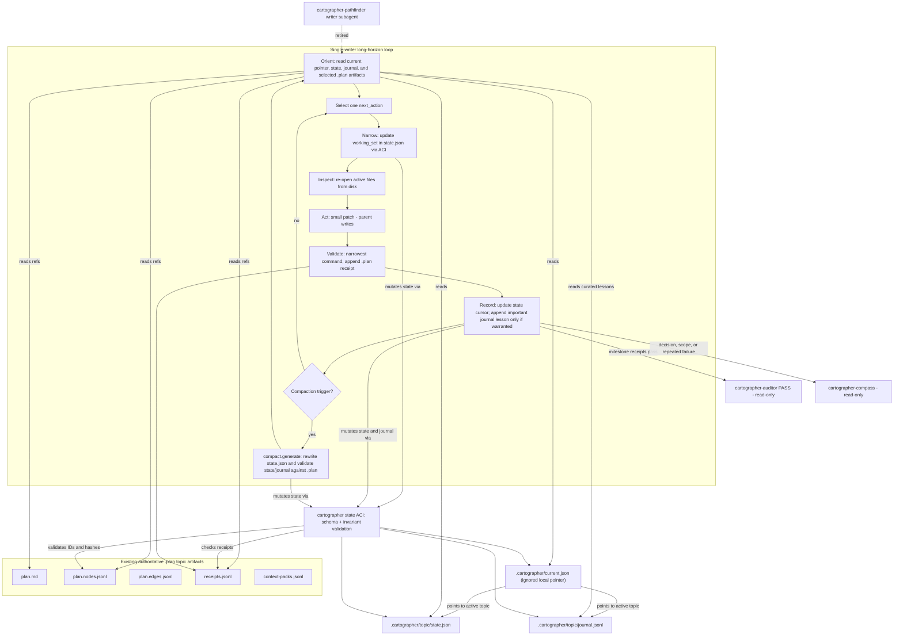
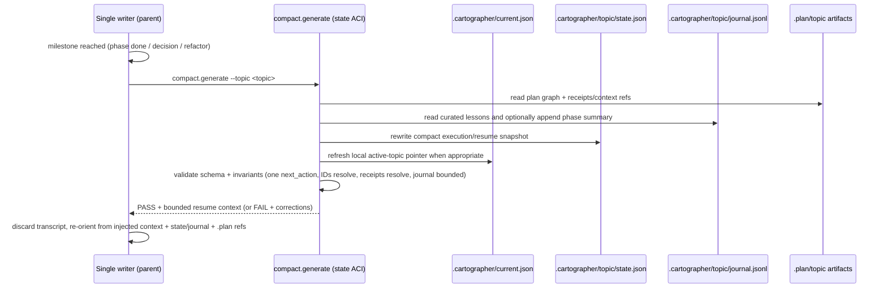

# sunset-pathfinder Proposal

## Description

### At a glance

| Area | Proposal |
|---|---|
| Default implementer | The parent agent becomes the single writer for long-horizon implementation work [F052][F055]. |
| Retired default path | `cartographer-pathfinder` stops being the default writer subagent [F060][F061]. |
| Durable execution state | `.cartographer/<topic>/state.json` stores the compact resume cursor, active IDs, working set, failures, receipt refs, journal refs, and resume instructions [F071][F092][F094]. |
| Durable memory | `.cartographer/<topic>/journal.jsonl` stores only curated lessons/gotchas/constraints that must survive compaction [F095][C007]. |
| Active-topic hint | `.cartographer/current.json` is optional, git-ignored, and non-authoritative [F096]. |
| Source of truth | `.plan/<topic>/plan.md`, `plan.nodes.jsonl`, `plan.edges.jsonl`, `receipts.jsonl`, and `context-packs.jsonl` remain authoritative [F064][C006]. |
| Write safety | Agents may read state files directly, but mutate them through a state-transition ACI that validates schemas + invariants [F083][C005]. |
| Specialists retained | `cartographer-auditor`, `cartographer-compass`, and `cartographer-archivist` remain read-only specialists [F009][F055][F066]. |

### Core thesis

Retire the `cartographer-pathfinder` writer subagent and replace Cartographer's implementation workflow with a **single-writer, long-horizon coding loop** built on:

1. just-in-time context curation;
2. strategic **milestone-driven compaction**; and
3. **persisted execution state to file**.

The reframe at the center of this proposal:

> The goal is not to *offload edit work to save context*; it is to *externalize durable task state so the same editor can survive context churn* [F054].

### Current vs. proposed behavior

| Today | Proposed |
|---|---|
| `implement` delegates each plan phase's edits to `cartographer-pathfinder`; the parent owns sequencing, validation, and commits [F060][F061]. | The same parent agent performs the edits and follows an explicit Orient → Select → Narrow → Inspect → Act → Validate → Record → Compact → Continue loop [F052]. |
| Context durability depends heavily on conversation history and reactive compaction. | Resume-critical state lives in `.cartographer/<topic>/state.json` and a curated `.cartographer/<topic>/journal.jsonl` [F071][F092][F095]. |
| Handoffs can create latency, error surface, and parent/subagent state drift [F063]. | One writer owns the working set; read-only subagents are used only for isolated review/exploration [F009][F055][F066]. |
| Planning artifacts already live under `.plan/`. | `.plan/` stays authoritative; `.cartographer/` references it instead of duplicating it [F064][C006]. |

## Problem Statement

### 1. Context overload is the long-horizon failure mode

Long-horizon coding fails less because the context window is too small and more because the context becomes a **polluted append-only event log** [F032].

Typical pollution includes:

- obsolete hypotheses;
- dead-end tool output;
- stale plans;
- verbose diffs;
- one-off reasoning that should no longer influence behavior.

This causes two compounding problems:

- **Context rot:** recall degrades as the window fills [F001][F002].
- **Latency and quality loss:** both context rot and prefill latency scale with how much is in the window, not merely with the model's maximum window size [F017].

Peer-reviewed SWE-agent work names the same failure: append-only maintenance and passively triggered compression cause context explosion, semantic drift, and degraded long-running reasoning [F026][F029].

### 2. Writer subagents do not fix parent-context overload

Cartographer's current answer is to delegate writing to a fresh-context pathfinder subagent. That does not solve the problem for the **parent**.

In the sanitized `subagent-reliability` session:

| Signal | Observation |
|---|---|
| Subagent calls | 107 |
| Subagent errors | 17 |
| Long subagent turns | about 600s / 566s / 300s |
| Session entries | 2,035 |
| Compactions | 4 |
| Largest tool/text outputs | up to 166,878 characters |
| User-reported outcome | worker agents left the parent to finish implementation anyway [F063] |

Result: the writer subagent added latency, error surface, and handoff overhead while the parent still had to carry and complete the work in a context compacted reactively.

### 3. The missing capability

Most harnesses compact **the conversation** rather than **the project state**, preserving the wrong thing [F034].

Cartographer needs a disciplined way for a single writer to keep a small, high-signal, **non-conversational** representation of the work that:

- lives on disk;
- survives compaction and session resets;
- references canonical `.plan` artifacts;
- avoids duplicating the plan graph; and
- avoids becoming another transcript log [F023][F048][C006][C007].

## Goals

| ID | Goal | Success criteria |
|---|---|---|
| G1 | **Single-writer loop** | A single focused writer is the default implementer and runs Orient → Select → Narrow → Inspect → Act → Validate → Record → Compact → Continue. `cartographer-pathfinder` leaves the default `implement` path [F052][F055] (`goal:single-writer-loop`). |
| G2 | **Strategic compaction** | Reactive near-limit auto-compaction is replaced by milestone-driven compaction that produces a factual, exact, validated state snapshot instead of a narrative chat summary [F035][F036][F047] (`goal:milestone-compaction`). |
| G3 | **Persisted execution state and curated journal** | `.cartographer/<topic>/state.json`, `.cartographer/<topic>/journal.jsonl`, and their schemas persist only resume-critical working memory. They reference `.plan` artifacts by path/hash and are mutated through a validating state-transition ACI [F071][F078][F083][F092][F094][F095][C006][C007] (`goal:persisted-state`). |
| G4 | **Keep read-only specialists** | `cartographer-auditor`, `cartographer-compass`, and `cartographer-archivist` continue to explore/review in isolated context and return condensed results [F009][F066] (`goal:keep-readonly-specialists`). |
| G5 | **Reconcile the decision record** | ADR-0002 is amended or superseded for the writer-subagent portion so the durable decision record remains coherent [F062] (`goal:reconcile-adr`). |
| G6 | **Reuse existing infrastructure** | The design builds on `.plan` plan graphs, receipts/context-packs, Clean Context Contract, `validation_runner.py`, and `analyze_session.py` rather than inventing parallel machinery [F064][C001][F092] (`goal:reuse-infrastructure`). |

## Non-Goals

### State and source-of-truth boundaries

- **Not** replacing `.plan/<topic>/plan.md`, `plan.nodes.jsonl`, or `plan.edges.jsonl`; they remain authoritative for per-topic planning [F092][C006].
- **Not** introducing a duplicate `plan.json` task graph yet; that belongs to the later `.cartographer`/docs migration if the project moves to JSON-backed generated Markdown [F092][F093].
- **Not** generating human-readable derived Markdown views in this effort; those are deferred to the later JSON-backed documentation migration [F093].
- **Not** turning `journal.jsonl` into a transcript, event stream, raw log, or receipt replacement; it is a scarce curated lessons journal [F095][C007].
- **Not** making `.cartographer/current.json` authoritative or commit-worthy; it is a git-ignored local pointer that must be safe to delete or ignore [F096].

### Subagent and runtime boundaries

- **Not** removing read-only specialist subagents or banning subagents generally; only the *writer* subagent leaves the default path [F009][F055].
- **Not** making the single-writer loop mandatory where it cannot run; serial/single-checkout operation and approved fallbacks remain supported and receipted [C002].
- **Not** changing Pi's `pi-subagents` runtime or requiring external orchestration frameworks [C003].
- **Not** auto-merging worktrees or building parallel-writer orchestration; single-writer-per-worktree safety is preserved [F065].

### Explicitly out of scope

- **Not** building model fine-tuning such as CAT/AgentFold training pipelines; this proposal adopts their *patterns*, not their training systems [F027][F030].
- **Not** committing raw logs, raw sessions, or private artifacts; raw evidence stays outside committed context [F043][C001].

## Background

### Context engineering: the operating principle

Context engineering means curating the smallest set of high-signal tokens that produce the desired behavior, treating context as a finite resource with diminishing returns [F003].

Anthropic identifies three relevant long-horizon techniques [F004][F010]:

| Technique | Best use | Relevance here |
|---|---|---|
| Compaction | Manage in-session growth. | Useful, but lossy; must be milestone-driven and explicit. |
| Structured note-taking / memory | Iterative development with clear milestones. | This proposal's main mechanism. |
| Sub-agent architectures | Complex research/analysis where parallel exploration pays dividends. | Retained for read-only specialists, not default writing. |

Phase-by-phase code implementation is primarily a **note-taking + compaction** problem, not a parallel-writer problem.

### First-party primitives validate the shape

Anthropic's cookbook separates the relevant levers [F011][F012][F013][F015]:

| Lever | What it does | Design implication |
|---|---|---|
| **Compaction** | Whole-transcript, lossy summary for in-session growth. | Must explicitly preserve exact paths, symbols, commands, and next actions. |
| **Tool-result clearing** | Drops bulky, re-fetchable tool results without inference cost. | Prefer re-opening files from disk over carrying old output. |
| **Memory** | External storage that survives across sessions. | Store durable state on disk, not only in chat. |

Important constraint: compaction preserves high-level facts better than obscure specifics. One probe preserved 3/3 high-level facts and 0/3 appendix specifics, and custom compaction instructions fully replace the default summary prompt [F012].

Therefore, the compacted artifact must name the exact details it must keep.

### Disk state survives compaction

Claude Code memory docs provide the load-bearing mechanism:

- project-root memory survives compaction because it is re-read from disk and re-injected [F023];
- memory must be concise and specific to be followed reliably [F021][F022]; and
- memory is context, not enforced configuration, so hard gates still need hooks/tooling [F025].

### Research evidence

| Source | Relevant pattern | Evidence |
|---|---|---|
| CAT (Context as a Tool) | Treat context maintenance as a callable tool over stable task semantics + condensed long-term memory + high-fidelity short-term interactions. Compress proactively at milestones. | SWE-Compressor reaches 57.6% on SWE-Bench-Verified, beating ReAct and static-compression baselines under a bounded context budget [F027][F028]. |
| AgentFold | Treat context as a cognitive workspace to be actively sculpted: granular condensation for fine detail and deep consolidation for finished sub-tasks. | A 30B model beats far larger models and leading proprietary agents on BrowseComp [F030][F031]. |
| User design brief | Defines the operational loop and state model. | Four-layer working memory where only mission/plan/ground-truth survive compaction [F033], tiered retention [F041], forget-list [F042], mandatory singular next action [F045], rolling state over chat summary [F048], fixed resumption prompt [F050], and the full long-horizon loop [F052]. |

### State format and mutation interface

The persisted-state design has two separate concerns: **shape** and **mutation**.

#### Shape

For state the agent must repeatedly reload, update, diff, validate, and trust, use schema-constrained structured files rather than Markdown [F070][F071][F072][F073][F074].

| Format | Use in this proposal | Rationale |
|---|---|---|
| JSON | `state.json`, `current.json` | Canonical current-truth snapshot; schema-validatable; diff/patch friendly; can require exactly one `next_action`; can reject unknown fields [F071][F078]. |
| JSONL | `journal.jsonl`, existing receipts | Append-only atomic records with compact entries and fewer merge conflicts [F072][F095]. |
| TOML | Stable config later, if needed | Human-friendly configuration format [F073]. |
| YAML | Avoid for canonical state | Indentation and implicit typing can produce subtle invalid state [F074]. |

For this MVP, the durable state surface is intentionally small:

- `.cartographer/<topic>/state.json`;
- `.cartographer/<topic>/journal.jsonl`;
- schemas for both;
- existing `.plan` artifacts as authoritative plan/evidence/receipt history;
- no generated Markdown views yet [F092][F093][F094][F095][C006][C007].

The win is JSON/JSONL **plus schema plus invariants**: enums instead of free text, stable IDs everywhere, explicit size limits, and cross-file checks back to the current `.plan` graph and receipts [F078][F080][F081][F094].

#### Mutation

The strongest mutation pattern is hybrid [F083][F084][F086][F087][F088][F090][F091]:

- agents read raw state files directly;
- agents mutate state through semantic ACI commands with preconditions;
- the ACI validates the result;
- raw files remain observable, diffable, and recoverable;
- direct edits are an escape hatch only, followed by validation.

This mirrors SWE-agent's finding that a purpose-built Agent-Computer Interface materially improves agents' ability to navigate, edit, and test [F085].

### Existing Cartographer foundations

Cartographer already has most of the needed substrate [F064]:

- durable workflow records in `receipts.jsonl` and `context-packs.jsonl`;
- Clean Context Contract budgets (~8KB/16KB);
- raw output redirected to `/tmp`;
- compact validation receipts via `validation_runner.py`;
- telemetry via `analyze_session.py`.

It also already requires one writer per worktree and warns that "async does not make parallel writes safe" [F065].

ADR-0002 made delegated writer work provisional pending deterministic receipts plus an auditor PASS, but it assumes a writer subagent exists. That assumption is the piece this proposal revisits [F062].

## Viability

### Feasibility summary

This has been done, and it is well within reach.

The pattern is supported by:

- Anthropic's compaction + structured note-taking + disk-memory guidance [F004][F006][F023];
- CAT's quantitative SWE-Bench-Verified result [F028];
- AgentFold's BrowseComp result [F031];
- the design brief's end-to-end loop [F052][F053][F055]; and
- Anthropic's first-party primitives (`compact_20260112`, `clear_tool_uses_20250919`, `memory_20250818`) as working references for trigger/instructions/keep/exclude semantics [T001][T002][T003].

### Why implementation cost is moderate

| Work item | Why it is bounded |
|---|---|
| Retire default writer delegation | Mostly a skill/doc/agent-definition edit, not a runtime change [C003][F061]. |
| Add MVP state contract | Adds `state.json`, `journal.jsonl`, and schemas while reusing existing `.plan` graphs, receipts/context-packs, `manage_jsonl.ts`, and `validation_runner.py` patterns [F064][F092][F094][F095][C001]. |
| Add `compact.generate` / `state validate` | Deterministically rewrites/checks compact state and journal records against existing `.plan` artifacts: one `next_action`, IDs resolve, paths are valid, forbidden/write scopes do not overlap, receipt IDs exist, hashes match or state is stale, journal entries remain bounded and evidence-linked [F094][F095][C007][R003][F025]. |

### Main risks and mitigations

| Risk | Why it matters | Mitigation |
|---|---|---|
| Bad compacted snapshot becomes canonical [R001] | A wrong state file can mislead the next session. | Make compaction a validation step; require schema + invariant checks [F047]. |
| Persisted state is only as good as what was written [R002] | Missing state is missing memory. | Use tiered retention, rolling updates, and explicit record/compact steps [F041][F048][F053]. |
| Prompt rules are not hard gates [R003] | Agents can ignore instruction-level process. | Validate with deterministic checks and receipts [F025]. |
| Reduced parallel write throughput [R004] | Removing a writer subagent reduces theoretical parallelism. | Accept this trade-off; evidence shows the writer subagent left the parent to finish anyway [F063]. Independent topics still use one-branch-per-topic worktrees [F065]. |
| ADR drift [R005] | ADR-0002 currently documents the writer-subagent approach. | Reconcile it explicitly in the ADR step [F062]. |
| State-file proliferation [R006] | Too many files can recreate the giant-context problem. | Keep `.plan` authoritative; add only `state.json`, `journal.jsonl`, schemas, and ignored `current.json`; enforce journal scarcity [F078][F092][F095][C006][C007]. |
| ACI bugs / opacity / overengineering [R007] | Tool bugs can become state bugs. | Keep raw files observable and schema-validatable outside the harness; keep direct-edit escape hatch + validation [F086][F090]. |

## ADR Metadata

| Field | Value |
|---|---|
| `adr_required` | `true` |
| `adr_reason` | This is a durable, cross-cutting workflow + architecture decision: it retires a standing subagent role, rewrites the default `implement` loop, introduces a minimal on-disk execution-state contract, adds a state-transition ACI, and revisits the writer-subagent portion of ADR-0002 [F060][F061][F062][F083][C005][R005]. |
| Alternatives/rationale | The user's design brief contrasts writer-subagents with single-writer context engineering, and in-repo session evidence shows the current pathfinder pattern underperformed [F054][F055][F063]. |
| `adr_options_status` | Documented. Option A: keep `cartographer-pathfinder` as default writer. Option B (recommended): single-writer loop with milestone compaction, minimal `state.json`, curated `journal.jsonl`, ACI-mediated mutation, and retained read-only specialists. Option C: hybrid writer subagent only for embarrassingly parallel independent file sets. |
| `adr_tool_mode` | Finalize after validation: generate or explicitly skip the ADR via `cartographer_adr` at implementation finalization, citing validation receipts and commits. |

## Design

### Design summary

The design keeps planning and evidence where they already live, then adds only the state needed to resume safely.

| Layer | Responsibility |
|---|---|
| `.plan/<topic>/...` | Authoritative plan graph, receipts, context packs, and proposal/plan prose [F064][C006]. |
| `.cartographer/<topic>/state.json` | Compact current execution/resume snapshot [F071][F092][F094]. |
| `.cartographer/<topic>/journal.jsonl` | Curated durable lessons and constraints only [F095][C007]. |
| `.cartographer/current.json` | Optional ignored active-topic hint [F096]. |
| State ACI | Controlled write path for state, journal, current pointer, and compaction validation [F083][C005]. |

### Compaction and controlled context injection

This design uses two separate operations that should not be conflated:

| Operation | Writes project state? | Adds context to the agent? | Purpose |
|---|---:|---:|---|
| `compact.generate` | Yes | No | Rewrite and validate the durable execution snapshot on disk [F047][F048]. |
| `state resume` / resume renderer | No | Yes | Render a bounded, structured context block from validated state for the next agent turn [F050][F096]. |

This is **controlled context injection**, not arbitrary prompt injection. The injected content is rendered from validated JSON/JSONL and treated as data. It must not override system, developer, project, or latest-user instructions [F083][C005].

**Compaction flow.**

1. **Trigger.** A milestone fires: phase boundary, diagnosed failure, decision, file-set change, risky refactor, handoff, or context threshold [F035][F046].
2. **Collect.** The ACI reads the current `state.json`, selected journal records, `.plan` plan graph refs, receipt refs, and active working-set metadata [F094][F095].
3. **Reduce.** The parent proposes only durable facts: current cursor, next action, known failures, working set, receipt refs, selected journal refs, and stale/forget guidance [F036][F048].
4. **Validate.** The ACI checks schema + invariants against `.plan` artifacts before accepting the new snapshot [F047][F094].
5. **Commit.** The ACI atomically writes `state.json`, optionally appends a scarce `journal.jsonl` record, refreshes `current.json` when appropriate, and records validation evidence through existing receipts where needed [F049][F064][F095].
6. **Reload.** The parent discards stale transcript assumptions and re-orients from disk [F048][F050].

**Resume/context injection flow.**

A resume renderer such as `cartographer state resume --topic <topic>` should output a small block with fixed sections:

```text
<CARTOGRAPHER_RESUME_CONTEXT version="1" source=".cartographer/<topic>/state.json">
Topic: <topic>
Source status: hashes-valid | stale
Current phase: <phase id>
Active tasks: <task ids>
Next action: <one action>
Working set: <write_allowed/read_only/forbidden paths>
Known failures: <bounded list with receipt refs>
Selected journal: <only referenced high-importance lessons>
Validation refs: <receipt ids>
Required first response: current phase, next action, files to inspect
</CARTOGRAPHER_RESUME_CONTEXT>
```

The renderer must enforce these boundaries:

- no raw logs, raw private paths, full command output, or unbounded file contents;
- no executable instructions sourced from arbitrary state strings;
- fixed instruction text comes from the skill/renderer, not from free-form `state.json` content;
- state may select a `resume.template_id` and provide data fields, but should not carry a free-form prompt;
- if `current.json` is stale or points at invalid state, ignore it and fall back to explicit topic selection [F096].

After injection, the agent must first report the current phase, singular next action, and files it will inspect. It must not edit until after that response [F050].



### Implementation plan

#### Step 1 — Define the minimal `.cartographer/` execution state

**Outcome.** Establish strictly structured, schema-validatable execution/resume artifacts that survive compaction and resets without duplicating planning or recreating a transcript log [F071][F092][F094][F095][C006][C007].

**Artifacts.**

| Artifact | Format | Role | Key fields / notes |
|---|---|---|---|
| `.cartographer/<topic>/state.json` | JSON (canonical) | Execution/resume snapshot | `schema_version`, `topic`, `source_refs`, `current_phase_id`, `active_task_ids`, `active_validation_ids`, singular `next_action`, `working_set`, `known_failures`, `last_validation_receipt_ids`, `journal_refs`, `resume`, `updated_at`; `resume` carries template/data refs rather than a free-form prompt; rejects unknown fields [F071][F078][F094]. |
| `.cartographer/<topic>/journal.jsonl` | JSONL (canonical, curated) | Important lessons journal | Append-only records for durable gotchas, implementation insights, failed hypotheses worth not repeating, user constraints, and phase/milestone summaries [F095][C007]. |
| `.cartographer/<topic>/schemas/state.schema.json` | JSON Schema | State contract | Validates the state snapshot; cross-file invariant checks resolve IDs and receipts against existing `.plan` artifacts [F077][F094]. |
| `.cartographer/<topic>/schemas/journal.schema.json` | JSON Schema | Journal contract | Validates bounded, typed, evidence-linked journal records; rejects raw private references and oversized/transcript-like entries [F095][C007]. |
| `.cartographer/current.json` | JSON (git-ignored/local) | Active-topic pointer | Optional, disposable hint: `active_topic`, `state_path`, `journal_path`, `worktree_id`, `git_branch`, `updated_at`; never authoritative [F096]. |

**Example files.** These examples show shape and intent; exact enum values and hash fields should be finalized in the schemas.

<details>
<summary><code>.cartographer/current.json</code></summary>

```json
{
  "schema_version": 1,
  "active_topic": "example-topic",
  "state_path": ".cartographer/example-topic/state.json",
  "journal_path": ".cartographer/example-topic/journal.jsonl",
  "root": "/path/to/project",
  "worktree_id": "feature-example-topic",
  "git_branch": "feature/example-topic",
  "last_seen_commit": "abc1234",
  "updated_at": "2026-06-10T05:40:00Z"
}
```

</details>

<details>
<summary><code>.cartographer/&lt;topic&gt;/state.json</code></summary>

```json
{
  "schema_version": 1,
  "topic": "example-topic",
  "source_refs": {
    "plan_md": {
      "path": ".plan/example-topic/plan.md",
      "sha256": "sha256:plan-md"
    },
    "plan_nodes": {
      "path": ".plan/example-topic/plan.nodes.jsonl",
      "sha256": "sha256:plan-nodes"
    },
    "plan_edges": {
      "path": ".plan/example-topic/plan.edges.jsonl",
      "sha256": "sha256:plan-edges"
    },
    "receipts": {
      "path": ".plan/example-topic/receipts.jsonl",
      "sha256": "sha256:receipts"
    },
    "context_packs": {
      "path": ".plan/example-topic/context-packs.jsonl",
      "sha256": "sha256:context-packs"
    }
  },
  "current_phase_id": "P2",
  "active_task_ids": ["P2.T1"],
  "active_validation_ids": ["P2.V1"],
  "next_action": {
    "id": "next:P2.T1.inspect-active-files",
    "kind": "inspect",
    "summary": "Re-open the active implementation files and confirm the next edit target.",
    "task_id": "P2.T1"
  },
  "working_set": {
    "write_allowed": [
      {
        "path": "skills/implement/SKILL.md",
        "reason": "Active phase updates the implement workflow."
      }
    ],
    "read_only": [
      {
        "path": ".plan/example-topic/proposal.md",
        "reason": "Proposal scope and non-goals."
      }
    ],
    "forbidden": [
      {
        "path": ".plan/_private/**",
        "reason": "Raw private inputs are never loaded into working context."
      }
    ]
  },
  "known_failures": [
    {
      "id": "failure:P2.V1:lint",
      "summary": "Lint failed on the first attempt; rerun after the targeted formatter change.",
      "status": "active",
      "last_seen_receipt_id": "receipt:P2:validation:2026-06-10T05:35:00Z"
    }
  ],
  "last_validation_receipt_ids": [
    "receipt:P2:validation:2026-06-10T05:35:00Z"
  ],
  "journal_refs": [
    "journal:20260610T053000Z:mermaid-rendering"
  ],
  "resume": {
    "template_id": "cartographer.single_writer.resume.v1",
    "resume_order": [
      ".cartographer/example-topic/state.json",
      ".cartographer/example-topic/journal.jsonl#journal:20260610T053000Z:mermaid-rendering",
      ".plan/example-topic/plan.md",
      ".plan/example-topic/receipts.jsonl",
      "skills/implement/SKILL.md"
    ],
    "expected_first_response": [
      "current_phase",
      "next_action",
      "files_to_inspect"
    ],
    "must_ignore": [
      "prior chat speculation",
      "stale generated snippets"
    ]
  },
  "updated_at": "2026-06-10T05:40:00Z"
}
```

</details>

<details>
<summary><code>.cartographer/&lt;topic&gt;/journal.jsonl</code></summary>

```jsonl
{"id":"journal:20260610T053000Z:mermaid-rendering","ts":"2026-06-10T05:30:00Z","kind":"gotcha","phase_id":"proposal","task_ids":[],"summary":"Mermaid diagrams may fail to render when edges target subgraph IDs or labels with punctuation are unquoted.","impact":"Use explicit nodes with quoted labels and node-to-node edges in proposal diagrams.","evidence":[{"path":".plan/example-topic/proposal.md"},{"receipt_id":"receipt:proposal:validation:2026-06-10T05:16:48Z"}],"importance":4,"status":"active","tags":["mermaid","dashboard","docs"]}
{"id":"journal:20260610T054500Z:scope-rule","ts":"2026-06-10T05:45:00Z","kind":"constraint","phase_id":"P2","task_ids":["P2.T1"],"summary":"Do not add a duplicate plan.json while .plan remains authoritative.","impact":"State validation should resolve phase/task/validation IDs against .plan/example-topic/plan.nodes.jsonl instead of maintaining a second plan graph.","evidence":[{"path":".plan/example-topic/proposal.md"}],"importance":5,"status":"active","tags":["state","scope","plan-graph"]}
```

</details>

**State invariants.** State is governed by schema + invariants, not prose. The MVP invariant set is intentionally small [F078][F080][F081][F094]:

- exactly one `next_action`;
- `current_phase_id`, `active_task_ids`, and `active_validation_ids` resolve in `.plan/<topic>/plan.nodes.jsonl`;
- working-set paths exist or are approved globs;
- forbidden paths do not overlap write-allowed paths;
- referenced receipt IDs exist in `.plan/<topic>/receipts.jsonl`;
- `journal_refs` resolve to journal records when listed;
- recorded source hashes match the current `.plan` artifacts or the state is marked stale.

Every record stays factual and exact: preserve exact paths, symbols, commands, assertions, decisions, next action, and non-goals; never store speculation, raw logs, or "we might" prose [F036].

**Journal discipline.** Append a journal record only when future context-reset-you would otherwise waste time, repeat a mistake, or miss an important constraint. Do not log:

- every tool call;
- raw command output;
- validation history already captured in `.plan/<topic>/receipts.jsonl`;
- decisions significant enough to require an ADR [F095][C007].

The skills must teach this explicitly so `journal.jsonl` remains a curated memory trail, not a second transcript.

**Current pointer discipline.** `current.json` is intentionally weaker than per-topic state. On startup or after reboot, an agent may use it to discover the active topic in the current worktree, but must validate that:

- `state_path` exists;
- root/branch hints are plausible;
- the referenced state is not stale.

If validation fails, ignore `current.json` and fall back to explicit user instruction, topic listing, or the most recently updated valid topic state [F096].

**Files.** New `.cartographer/<topic>/state.json`, `.cartographer/<topic>/journal.jsonl`, corresponding schemas, and ignored `.cartographer/current.json`. Existing `.plan/<topic>/plan.md`, `plan.nodes.jsonl`, `plan.edges.jsonl`, `receipts.jsonl`, and `context-packs.jsonl` stay canonical and are referenced, not copied [F064][F092][C006].

**Dependencies.** None.

**Risks.** State quality [R002], drift from `.plan` [C006], and journal bloat [R006]. Mitigation: source hashes, validation invariants, and skill-level journal discipline [F094][F095][C007].

#### Step 2 — Add the minimal state-management ACI

**Outcome.** Make the state snapshot and journal safe to mutate while keeping the files directly readable: *observable state, controlled writes* [F083][F087][C005].

**Why an ACI is needed.** Direct LLM editing of canonical JSON/JSONL can [F084]:

- drop or invent fields;
- corrupt JSON;
- update state without evidence;
- violate cross-file invariants.

**Command surface.**

| Command | Purpose |
|---|---|
| `current set` | Update the ignored active-topic pointer. |
| `state init` | Create a valid initial topic state. |
| `state validate` | Check schema + cross-file invariants. |
| `state set-next` | Replace the singular next action. |
| `state set-working-set` | Update write/read/forbidden scopes. |
| `state record-validation-ref` | Add receipt references without duplicating receipts. |
| `journal append` | Append a bounded, evidence-linked important lesson. |
| `state mark-stale` | Mark state stale when source hashes no longer match. |
| `compact.generate` | Rewrite compact state and validate it against `.plan`. |

These commands update `state.json`, `journal.jsonl`, and `current.json` atomically where applicable; validate against existing `.plan` artifacts; and append or reference existing `.plan` validation receipts when workflow state materially changes [F084][F089][F094][F095].

`journal append` requires kind, impact, evidence reference, and importance so routine chatter does not enter durable memory [C007].

Raw files remain observable, diffable, and recoverable. The escape hatch is direct edits only when the ACI is unavailable, followed by `cartographer state validate` [F086][F090].

**Files.** `config:cartographer-state-aci` in `file:extensions/cartographer-tools.ts` and/or a `skills/plan/scripts/` helper, reusing `file:skills/plan/scripts/validation_runner.py` and `file:skills/plan/scripts/manage_jsonl.ts` patterns.

**Dependencies.** Step 1.

**Risks.** ACI bugs, opacity, or overengineering [R007]. Mitigation: observable files, out-of-harness schema validation, and direct-edit + validate escape hatch [F086][F090].

#### Step 3 — Rewrite the `implement` skill as the single-writer loop

**Outcome.** Replace pathfinder delegation with the parent-owned long-horizon loop [F052].

**Loop.**

| Step | Action | State interaction |
|---|---|---|
| 1. Orient | Use explicit user instruction or valid `current.json`; read `state.json`, selected high-importance journal records, and referenced `.plan` artifacts. | Read only [F096]. |
| 2. Select | Choose the singular `next_action`. | Update through ACI [F045]. |
| 3. Narrow | Define the active `working_set` before editing. | Update `state.json` through ACI [F040]. |
| 4. Inspect | Re-open active files from disk; do not trust code read many turns ago. | Refresh context from files [F038][F007]. |
| 5. Act | Apply a small parent-owned patch. | Parent writes code/docs. |
| 6. Validate | Run the narrowest useful command. | Record receipt in `.plan/<topic>/receipts.jsonl` [F049][F064]. |
| 7. Record | Update cursor/receipt refs; append journal only for important lessons/gotchas/constraints. | Mutate state/journal through ACI [F048][F087][F095][C007]. |
| 8. Compact | If a trigger fires, rewrite compact state. | `compact.generate` validates state + journal [F047][F053]. |
| 9. Continue | Re-orient from artifacts. | Ignore stale transcript except latest user instruction [F050]. |

All state, journal, and current-pointer mutations go through the ACI. `.plan` remains the plan/evidence source of truth [F083][F092][C006].

**Files.** `file:skills/implement/SKILL.md` [F061]. Remove `cartographer-pathfinder` as default writer and replace Pathfinder delegation/acceptance sections with this loop and ACI-mediated state/journal updates. Keep the deterministic-receipts-then-auditor gate.

**Dependencies.** Steps 1–2. The Step 6 auditor gate remains part of the loop.

**Risks.** Loss of parallel write throughput [R004]. Accepted because the writer subagent left the parent to finish in practice [F063], and serial fallback remains supported [C002].

#### Step 4 — Retire `cartographer-pathfinder` and confirm read-only specialists

**Outcome.** Remove the writer subagent from the default path while preserving read-only specialist value.

**Changes.**

- Mark `file:.pi/agents/cartographer-pathfinder.md` retired/deprecated.
- Optionally retain it behind explicit opt-in for Option C: embarrassingly parallel independent file sets [F060].
- Update README subagent table and role/tool matrix.
- Document writing as parent-owned.
- Document `cartographer-auditor`, `cartographer-compass`, and `cartographer-archivist` as retained read-only specialists [F009][F066][F055].

**Files.** `file:.pi/agents/cartographer-pathfinder.md`; `file:README.md` subagents table, role/tool matrix, and quick-start `implement` diagram [F064].

**Dependencies.** Steps 1–3.

**Risks.** Decision-record drift vs. ADR-0002 [R005]. Handled in Step 7.

#### Step 5 — Milestone-driven compaction via `compact.generate`

**Outcome.** Make compaction an explicit, validated state transition instead of emergency near-limit summarization.

**Triggers.** Run `compact.generate` at meaningful boundaries [F035][F046]:

- phase started;
- phase completed;
- test failure diagnosed;
- decision made;
- file-set changed;
- before switching areas;
- before risky refactor;
- before handoff;
- configurable context-usage threshold (~60%, explicitly heuristic).

**What compaction does.**

1. Rewrites `state.json` with the current cursor, working set, known failures, receipt refs, selected journal refs, and resume template/data refs.
2. Validates schema + invariants against existing `.plan` artifacts.
3. Validates that the journal remains bounded, typed, and evidence-linked [F047][F053][F094][F095].
4. Optionally appends a phase-summary or lesson journal record only when the run produced a genuinely important insight [C007].
5. Renders or points to a bounded resume-context block, then instructs the parent to reload from artifacts and ignore prior chat except the latest user instruction [F048][F050].

These are deterministic checks, not prompt text [R003][F025]. Custom compaction instructions must enumerate exact details to retain because compaction otherwise drops obscure specifics [F012][F036].



**Files.** `config:cartographer-compact` as a command of `config:cartographer-state-aci` in `file:extensions/cartographer-tools.ts` and/or a `skills/plan/scripts/` helper. `.plan/<topic>/receipts.jsonl` remains canonical validation history; `journal.jsonl` remains a curated lessons trail [F049][F064][F095].

**Dependencies.** Steps 1–2; reuses existing `.plan` receipts.

**Risks.** Bad snapshot [R001], journal bloat [R006], and overengineering. Mitigations: validation [F047], append criteria + schemas [C007], and only adding checks that pay off [F018].

#### Step 6 — Keep deterministic-receipts-then-auditor gating and add controlled resume injection

**Outcome.** Preserve the existing quality gate and harden against post-compaction amnesia without trusting arbitrary prompt text from state files.

**Quality gate retained.**

1. deterministic validation receipts;
2. `cartographer-auditor` PASS;
3. conventional commit [F062].

**Controlled resume injection.** After compaction or resume, a fixed renderer loads artifacts in order:

1. `state.json`;
2. selected high-importance journal records;
3. referenced `.plan` plan graph;
4. receipts;
5. context packs;
6. active files [F050][F014][F096].

It then injects a bounded `CARTOGRAPHER_RESUME_CONTEXT` block as context data. Fixed instructions live in the skill/renderer; state only provides validated data and a `resume.template_id`.

Before editing, the agent responds with:

- current phase;
- singular next action;
- files to inspect.

Then it edits only after that response. This operationalizes the assume-interruption mindset for a writer that may be compacted at any time.

**Files.** `file:skills/implement/SKILL.md`; `file:.pi/agents/cartographer-auditor.md` unchanged; minor `file:skills/proposal/SKILL.md` / `file:skills/plan/SKILL.md` notes for minimal state and journal artifacts.

**Dependencies.** Steps 1–5.

**Risks.** Resumption prompt is instruction-level [R003]. Acceptable because deterministic receipts and auditor PASS remain the hard quality bar.

#### Step 7 — Reconcile ADR-0002 and update AGENTS.md / docs

**Outcome.** Keep the decision record coherent and keep durable rules separate from live task state.

**ADR work.** At implementation finalization, generate a new ADR via `cartographer_adr` that supersedes or amends the writer-subagent portion of ADR-0002. Cite validation receipts and commits. ADR-0002's deterministic-receipts-then-auditor and least-privilege principles for read-only specialists remain in force [F062][R005].

**Documentation rules to add.** Project instruction files should contain stable operating rules, not live task state [F051][F090][F021][F022][F095][F096][C007]:

- read `.cartographer/<topic>/state.json` and curated journal entries directly;
- mutate state/journal only through `cartographer state …` / `journal append` commands;
- after any direct edit, run `cartographer state validate`;
- append `journal.jsonl` only for important lessons/gotchas/constraints that would otherwise be rediscovered;
- treat `.cartographer/current.json` as an ignored local hint only;
- run `npm run check` before commit;
- keep raw logs/sessions out of committed context [F043][C001].

**Files.** `file:docs/adr/0002-require-auditable-cartographer-subagent-handoffs.md` superseded/amended via new ADR; `file:README.md`; AGENTS.md; `.gitignore` entry for `.cartographer/current.json`.

**Dependencies.** Steps 1–6; validation receipts must exist before the ADR is written.

**Risks.** None beyond keeping the new ADR consistent with retained ADR-0002 principles.
