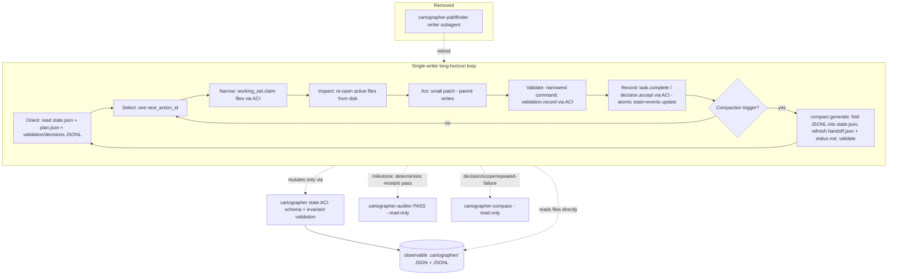

# sunset-pathfinder Proposal

## Description

Retire the `cartographer-pathfinder` writer subagent and replace Cartographer's implementation workflow with a **single-writer, long-horizon coding loop** built on three context-engineering disciplines: just-in-time context curation, strategic **milestone-driven compaction**, and **persisted session state to file**.

Today the `implement` skill delegates each plan phase's edits to `cartographer-pathfinder`, a narrow single-phase writer subagent, while the parent owns sequencing, validation, and commits [F060][F061]. This proposal removes the writer subagent from the default path. The same parent agent performs the edits, but it is kept coherent over long horizons by **canonical, schema-validated state files** under `.cartographer/` — a single `state.json` current-truth snapshot, append-only JSONL history (`validation.jsonl`, `decisions.jsonl`, `events.jsonl`), a `plan.json` task graph, `working-set.json`, a `handoff.json` resumption index, and `config.toml` — that it rolls forward after every material action and compacts at explicit semantic milestones [F052][F070][F079]. Format follows purpose: JSON for current truth, JSONL for append-only evidence, TOML for stable config, and Markdown only for human-facing docs (this proposal, `plan.md`, ADRs, README) plus a *generated, non-authoritative* `status.md` view [F070][F075][C004]. Crucially, the agent **reads** state directly as files but **mutates** it only through a semantic state-transition ACI (Agent-Computer Interface) that validates JSON Schema + cross-file invariants and appends evidence — observable state, controlled writes [F083][C005]. Read-only specialist subagents (`cartographer-auditor`, `cartographer-compass`, `cartographer-archivist`) are retained, matching the pattern where sub-agents add the most value for isolated exploration and review rather than parallel writing [F009][F055][F066].

The reframe at the center of this proposal: the goal is not to *offload edit work to save context*, but to *externalize durable task state so the same editor can survive context churn* [F054].

## Problem Statement

Long-horizon coding fails less because the context window is too small and more because the context becomes a **polluted append-only event log**: the agent keeps re-reading obsolete hypotheses, dead-end tool output, stale plans, verbose diffs, and one-off reasoning that should no longer influence behavior [F032]. Recall degrades as the window fills (context rot), and both context rot and prefill latency scale with how much is in the window — not with the window's hard limit — so even 1M-token models degrade on long sessions [F001][F002][F017]. Peer-reviewed work on SWE-agents names the same failure: append-only maintenance and passively triggered compression cause context explosion, semantic drift, and degraded long-running reasoning [F026][F029].

Cartographer's current answer — delegate the writing to a fresh-context pathfinder subagent — does not solve this for the *parent*, and the project's own evidence shows it underperforms in practice. The sanitized `subagent-reliability` session recorded 107 subagent calls, 17 subagent errors, individual subagent turns of roughly 600s/566s/300s, 2,035 entries, four compactions, and tool/text outputs up to 166,878 characters — and the user reported that **worker agents left the parent to finish implementation anyway** [F063]. So the writer subagent added latency, error surface, and handoff overhead while still forcing the parent to carry and complete the work in a context that was being compacted reactively.

Most harnesses make this worse by compacting *the conversation* rather than *the project state*, which preserves the wrong thing [F034]. What is missing is a disciplined way for a single writer to keep a small, high-signal, **non-conversational** representation of the work — one that survives compaction and session resets because it lives on disk [F023][F048].

## Goals

- **G1 — Single-writer loop.** Make a single focused writer the default implementer, running an explicit Orient → Select → Narrow → Inspect → Act → Validate → Record → Compact → Continue loop, and retire `cartographer-pathfinder` from the default `implement` path [F052][F055] (`goal:single-writer-loop`).
- **G2 — Strategic compaction.** Replace reactive near-limit auto-compaction with **milestone-driven compaction** as an explicit workflow action, producing a factual, exact, validated state artifact rather than a narrative chat summary [F035][F036][F047] (`goal:milestone-compaction`).
- **G3 — Persisted session state (canonical files + controlled writes).** Persist working memory as **canonical, schema-validated state files** under `.cartographer/` — `state.json` (current truth), `plan.json`, `working-set.json`, append-only `validation.jsonl`/`decisions.jsonl`/`events.jsonl`, `handoff.json`, and `config.toml` — that the agent reads directly but mutates only through a state-transition ACI validating schema + invariants; human understanding comes from generated, non-authoritative Markdown views. This lets the same editor survive context churn and resets by re-orienting from artifacts, not transcript memory [F070][F079][F083][C004][C005] (`goal:persisted-state`).
- **G4 — Keep read-only specialists.** Preserve `cartographer-auditor`/`cartographer-compass`/`cartographer-archivist` as read-only specialists that explore/review in isolated context and return condensed results [F009][F066] (`goal:keep-readonly-specialists`).
- **G5 — Reconcile the decision record.** Amend or supersede the writer-subagent portion of ADR-0002 so the documented decision stays coherent [F062] (`goal:reconcile-adr`).
- **G6 — Reuse existing infrastructure.** Build on Cartographer's existing receipts/context-packs, Clean Context Contract, `validation_runner.py`, and `analyze_session.py` rather than inventing parallel machinery [F064][C001] (`goal:reuse-infrastructure`).

## Non-Goals

- **Not** removing read-only specialist subagents or banning subagents generally; only the *writer* subagent leaves the default path [F009][F055].
- **Not** making the single-writer loop mandatory where it cannot run; serial/single-checkout operation and approved fallbacks remain supported and receipted [C002].
- **Not** changing Pi's `pi-subagents` runtime or requiring external orchestration frameworks; this is implementable in Cartographer skills, agent definitions, docs, and helper scripts [C003].
- **Not** building model fine-tuning (CAT/AgentFold train models); this proposal adopts their *patterns*, not their training pipelines [F027][F030].
- **Not** auto-merging worktrees or building parallel-writer orchestration; single-writer-per-worktree safety is preserved [F065].
- **Not** committing raw logs, raw sessions, or private artifacts; raw evidence stays outside committed context [F043][C001].

## Background

**Context engineering is the discipline of curating the smallest set of high-signal tokens** that produce the desired behavior, treating context as a finite resource with diminishing returns [F003]. Anthropic identifies three long-horizon techniques — compaction, structured note-taking (agentic memory), and sub-agent architectures — and is explicit that note-taking "excels for iterative development with clear milestones" while multi-agent architectures pay off for "complex research and analysis where parallel exploration pays dividends" [F004][F010]. Phase-by-phase code implementation is squarely in the note-taking-plus-compaction regime, not the parallel-writer regime.

Anthropic's cookbook makes the levers precise and composable: **compaction** is a whole-transcript, lossy summary that handles all in-session growth; **tool-result clearing** is a sub-transcript, lossless-if-re-fetchable edit that drops bulky re-fetchable results at no inference cost; and **memory** is external storage that survives across sessions and is only as good as what the agent chose to save [F011][F012][F013][F015]. Critically, compaction reliably preserves high-level facts but loses obscure specifics (a probe preserved 3/3 high-level facts and 0/3 appendix specifics), and custom instructions *fully replace* the default summary prompt — so the compaction artifact must explicitly name the exact paths, symbols, and commands it must keep [F012]. The Claude Code memory docs add the load-bearing mechanism for this proposal: **project-root memory survives compaction because it is re-read from disk and re-injected, whereas conversation-only instructions are lost** [F023]; memory should be concise and specific to be followed reliably, and is "context, not enforced configuration" — hard gates need hooks/tooling [F021][F022][F025].

Two recent papers independently validate the design. **CAT (Context as a Tool)** elevates context maintenance to a callable tool over a structured workspace of *stable task semantics + condensed long-term memory + high-fidelity short-term interactions*, compressing proactively at milestones; its SWE-Compressor reaches 57.6% on SWE-Bench-Verified, beating ReAct and static-compression baselines under a bounded context budget [F027][F028]. **AgentFold** treats context as a cognitive workspace to be actively sculpted, "folding" at multiple scales — granular condensation to keep fine detail, deep consolidation to abstract finished sub-tasks — and a 30B model beats far larger models and leading proprietary agents on BrowseComp [F030][F031]. The user's design brief distills these into a concrete operating model: a four-layer working memory (mission/plan/ground-truth/scratch) where only the first three survive compaction [F033], tiered retention [F041], a forget-list to stop stale ideas resurfacing [F042], a single mandatory next action per snapshot [F045], rolling state over summary-of-chat [F048], a fixed resumption prompt [F050], and the full long-horizon loop that is "the long-horizon replacement for writer subagents" [F052].

**The shape and mutation interface of agent state matter as much as the loop.** Two follow-on design conversations refine the persisted-state design. On **format**: for state the agent must repeatedly reload, update, diff, validate, and trust, use schema-constrained structured files, not Markdown — JSON for the current-truth snapshot (one canonical, schema-validatable, diff/patch-friendly file that can require a singular `next_action` and reject unknown fields), JSONL for append-only receipts/events (atomic records, no merge conflicts, compactable into the snapshot), TOML for stable config, and YAML avoided for canonical state (indentation/implicit-typing footguns that LLMs render subtly invalid) [F070][F071][F072][F073][F074]. Markdown is *demoted* to generated, non-authoritative views (`status.md`) so the agent never reads stale prose instead of structured truth [F075][F076]. The real win is JSON **plus schema plus invariants** — enums instead of free text, stable IDs everywhere, explicit size limits, and cross-file invariants (e.g. `next_action` singular, `current_phase_id` resolves in `plan.json`, completed tasks are not active, forbidden paths never overlap write paths) [F077][F078][F080][F081]. On **mutation**: the strongest pattern is a hybrid where the LLM reads state as files but changes it through an ACI of semantic state-transition commands (`task.complete --validation …`, `phase.advance`, `compact.generate`) that enforce preconditions and update multiple files atomically, while raw files stay observable/diffable/recoverable and an escape hatch permits direct edits (then re-validate) if the ACI is unavailable [F083][F084][F086][F087][F088][F090][F091]. This is the lesson of SWE-agent: a purpose-built Agent-Computer Interface materially improves agents' ability to navigate, edit, and test [F085].

**Cartographer is already most of the way there.** It persists workflow state in `receipts.jsonl`/`context-packs.jsonl`, enforces a Clean Context Contract (~8KB/16KB budgets, raw output to `/tmp`, compact receipts), and ships `validation_runner.py` (deterministic receipts) and `analyze_session.py` (telemetry) [F064]. It already requires one writer per worktree and warns that "async does not make parallel writes safe" [F065]. ADR-0002 already made delegated writer work provisional pending deterministic receipts plus an auditor PASS — but it assumes a writer subagent exists, which is exactly the part this proposal revisits [F062].

## Viability

**This has been done, and it is well within reach.** The pattern is endorsed by Anthropic (compaction + structured note-taking + the survives-compaction-because-it-is-on-disk mechanism) [F004][F006][F023], demonstrated quantitatively by CAT on SWE-Bench-Verified [F028] and AgentFold on BrowseComp [F031], and specified end-to-end in the design brief [F052][F053][F055]. Anthropic's first-party primitives (`compact_20260112`, `clear_tool_uses_20250919`, `memory_20250818`) are a working reference for trigger/instructions/keep/exclude semantics [T001][T002][T003].

Implementation cost is **moderate and low-risk** because it is mostly subtractive plus reuse:

- Removing the writer from the default path is a skill/doc/agent-definition edit, not a runtime change [C003][F061].
- The state files extend existing receipts/context-packs and reuse the `manage_jsonl.ts` validator and `validation_runner.py` receipt patterns; JSON Schemas plus cross-file invariant checks are runnable outside the harness, and the state-transition ACI is a natural sibling of the existing `cartographer_*` tools [F064][F077][F089][C001].
- A deterministic `compact.generate` ACI command folds append-only JSONL history into the `state.json` snapshot and *validates* it (singular `next_action`; `current_phase_id`/`next_action_id` resolve in `plan.json`; active working-set files exist; no forbidden/allowed path overlap; unique receipt IDs; completed tasks not active; unknown fields rejected), addressing the "instructions are not enforcement" risk with real checks [F077][F088][F053][R003][F025].

The hard parts are discipline and lossiness, not feasibility. A bad compacted summary becomes canonical and is worse than none [R001], persisted state is only as good as what is written [R002], and prompt-level rules are not hard gates [R003] — all mitigated by tiered retention, rolling updates, the compaction-as-validation step, and deterministic checks [F041][F047][F048][F053]. Removing a parallel writer also nominally reduces parallel write throughput [R004], but the project's own evidence shows the writer subagent was not actually offloading parallel work — it left the parent to finish [F063] — and genuinely independent topics still parallelize through the one-branch-per-topic worktree model [F065]. State-file proliferation could recreate the giant-context problem [R006]; this is bounded by explicit size limits, a small always-loaded snapshot/handoff plus on-demand JSONL detail, and the Clean Context Contract [F024][F078][C001]. Adding an ACI introduces its own risks — tool bugs becoming state bugs, opacity, and overengineering [R007] — mitigated by the hybrid model: the canonical files stay observable and schema-validatable outside the harness, with a direct-edit escape hatch that requires re-validation [F086][F090]. Finally, ADR-0002 must be reconciled rather than silently contradicted [R005][F062], which this proposal records as an explicit ADR obligation.

## ADR Metadata

- `adr_required`: true
- `adr_reason`: This is a durable, cross-cutting workflow + architecture decision — it retires a standing subagent role, rewrites the default `implement` loop, introduces a new on-disk canonical state-artifact contract **and a state-transition ACI (read-as-files / mutate-via-validated-commands) as its enforcement half**, and revisits the writer-subagent portion of the already-accepted ADR-0002 [F060][F061][F062][F083][C005][R005]. Alternatives and rationale are supplied by the user's design brief (writer-subagents vs. single-writer context engineering) and the in-repo session evidence [F054][F055][F063], so this is not a directed choice lacking rationale.
- `adr_options_status`: documented — Option A: keep `cartographer-pathfinder` as default writer (status quo per ADR-0002); Option B (proposed): single-writer context-engineering loop with milestone compaction + persisted canonical state files mutated through a state-transition ACI, read-only specialists retained; Option C: hybrid (writer subagent only for embarrassingly-parallel independent file sets). The proposal recommends Option B and will supersede/amend ADR-0002 accordingly.
- `adr_tool_mode`: finalize-after-validation — generate or explicitly skip the ADR via `cartographer_adr` at implementation finalization, citing validation receipts and commits.

## Design



### Step 1 — Define the canonical `.cartographer/` state files (JSON/JSONL/TOML) + schemas

**Purpose / outcome.** Establish strictly-structured, schema-validatable state that survives compaction and resets, so the single writer re-orients from canonical files instead of transcript memory. Format follows purpose; Markdown is demoted to generated, non-authoritative views [F070][F075][C004].

**What it adds.** A `.cartographer/` state directory (per topic) [F079]:

| Artifact | Format | Role | Key fields / notes |
|---|---|---|---|
| `state.json` | JSON (canonical) | Current truth | `schema_version`, `current_phase_id`, `focus`, `next_action_id` (singular), `active_task_ids`, `blocked`, `known_failures`, `last_validation_receipt_id`, `limits`; rejects unknown fields [F071][F078] |
| `plan.json` | JSON | Task graph | phases → tasks with `id`/`status`/`depends_on`; mirrors/derives from the plan skill's `plan.nodes/edges` [F079] |
| `working-set.json` | JSON | Scope lease | `mode: single_writer`; `active`/`read_only`/`forbidden` entries with reasons; forbidden ∩ write = ∅ [F040][F079] |
| `validation.jsonl` | JSONL | Append-only receipts | `id`,`ts`,`command`,`status` enum,`summary`,`log_path`; raw logs out of context [F072][F043] |
| `decisions.jsonl` | JSONL | Append-only ADR-lite | `id`,`ts`,`title`,`status`,`reason`,`impact[]`; optionally mirrored to human ADRs [F072][F039] |
| `events.jsonl` | JSONL | Audit trail | append-only tool/action events; compactable into `state.json` [F072] |
| `handoff.json` | JSON | Resumption | `resume_order[]`, `resume_instruction`, `must_ignore[]` (prior chat speculation, generated Markdown) [F050] |
| `config.toml` | TOML | Stable config | `[compaction]` triggers, per-agent `[agents.*]` mode/allowed-tools, `pathfinder.enabled=false` [F074] |
| `schemas/*.schema.json` | JSON Schema | Shape contract | state/plan/working-set/validation/decision; runnable outside the harness [F077] |
| `status.md` | Markdown (generated) | Human view | rendered from `state.json`; `authoritative:false` so it is never treated as truth [F075][F076] |

State is governed by **schema + invariants**, not prose: enums instead of free text (`status` pending|active|blocked|complete|cancelled|superseded; validation unknown|passed|failed|skipped|waived; scope read_only|write_allowed|forbidden|generated|external), stable IDs everywhere (`phase_id`/`task_id`/`decision_id`/`validation_id`/`event_id`), explicit size limits, and cross-file invariants (singular `next_action`; `current_phase_id`/`next_action_id` resolve in `plan.json`; active working-set files exist; completed tasks not active; unique receipt IDs; unknown top-level fields rejected) [F077][F078][F080][F081]. Every record stays factual and exact — preserve exact paths/symbols/commands/assertions/decisions/next-action/non-goals; never store speculation, raw logs, or "we might" prose [F036].

**Files.** New artifacts under `.cartographer/`; reuse `data-artifact:.plan/{topic}/receipts.jsonl` and `data-artifact:.plan/{topic}/context-packs.jsonl` as canonical sources; validate JSONL with the `manage_jsonl.ts` pattern [F064]. Keep records small and tiered to avoid recreating a giant-context problem [F024][F078][R006].

**Dependencies.** None (foundational).

**Risks.** State only as good as what is written [R002]; file proliferation [R006] — bounded by limits, schemas, and the Clean Context Contract [F078][C001].

### Step 2 — Add the state-management ACI (read files, mutate through tools)

**Purpose / outcome.** Make canonical state safe to mutate by routing all writes through a semantic Agent-Computer Interface, while keeping the files directly readable — *observable state, controlled writes* [F083][F087][C005].

**Detail.** Direct LLM editing of canonical JSON predictably drops/invents fields, corrupts JSON, marks tasks complete without validation, or violates cross-file invariants [F084]. Instead, expose **semantic state-transition commands** (not generic setters) [F088]: `task.start`/`task.block`/`task.complete --validation <id>`, `validation.record`, `decision.accept`, `working_set.claim`/`release`, `phase.advance --from <P> --to <P> --receipt <id>`, `compact.generate`, `handoff.refresh`, and `state validate`. Each command enforces preconditions, updates `state.json`/`plan.json`/`events.jsonl` **atomically**, and runs the validation stack after every mutation [F084][F089]. Four layers cooperate: (1) JSON Schema (shape), (2) invariant checks (cross-file logic), (3) ACI commands (allowed transitions), (4) Git diffs / human review (observability) [F089]. Raw files remain observable/diffable/recoverable, and a documented **escape hatch** allows direct edits only when the ACI is unavailable, followed by `cartographer state validate` [F086][F090]. The read path is unchanged: the agent may read `.cartographer/*.json` and `*.jsonl` directly [F083]. This mirrors the SWE-agent ACI result that purpose-built interfaces materially improve agent reliability [F085].

**Files.** `config:cartographer-state-aci` implemented in `file:extensions/cartographer-tools.ts` (and/or a `skills/plan/scripts/` helper), reusing `file:skills/plan/scripts/validation_runner.py` and `file:skills/plan/scripts/manage_jsonl.ts` patterns; `config.toml` supplies policy.

**Dependencies.** Step 1 (files + schemas).

**Risks.** ACI as a single point of failure / tool bugs / overengineering [R007] — mitigated by observable files, out-of-harness schema validation, and the escape hatch [F086][F090].

### Step 3 — Rewrite the `implement` skill as the single-writer loop

**Purpose / outcome.** Replace pathfinder delegation with the explicit Orient → Select → Narrow → Inspect → Act → Validate → Record → Compact → Continue loop performed by the parent [F052].

**Detail.** Per phase the parent: (1) **Orients** by reading `state.json`, `plan.json`, and the validation/decisions JSONL; (2) **Selects** the singular `next_action_id` [F045]; (3) **Narrows** via `working_set.claim` (scope + reason) before editing [F040]; (4) **Inspects** by re-opening only active files from disk — never trusting code "read 40 turns ago" [F038][F007]; (5) **Acts** with a small patch; (6) **Validates** with the narrowest useful command, recorded via `validation.record` [F049]; (7) **Records** the transition via `task.complete`/`decision.accept` (atomic state + `events.jsonl` update) while facts are fresh [F048][F087]; (8) **Compacts** if a trigger fires (Step 5); (9) **Continues** by re-orienting from artifacts. All mutations go through the ACI; reads hit files directly [F083].

**Files.** `file:skills/implement/SKILL.md` (primary rewrite) [F061]; remove `cartographer-pathfinder` as default writer and replace the Pathfinder delegation/acceptance sections with the loop and ACI-mediated state updates. Keep the deterministic-receipts-then-auditor gate (Step 6).

**Dependencies.** Steps 1–2 (the auditor gate from Step 6 is retained as part of the loop; see Step 6).

**Risks.** Loss of parallel write throughput [R004] — accepted, given the writer subagent left the parent to finish in practice [F063]; serial fallback already supported [C002].

### Step 4 — Retire `cartographer-pathfinder` and confirm read-only specialists

**Purpose / outcome.** Remove the writer subagent from the default path while explicitly retaining read-only specialists.

**Detail.** Set `pathfinder.enabled=false` in `config.toml` and mark `file:.pi/agents/cartographer-pathfinder.md` retired/deprecated (optionally available behind an explicit opt-in for Option C parallel independent file sets) [F060][F074]. Update the README subagents table and role/tool matrix so writing is parent-owned and `cartographer-auditor`, `cartographer-compass`, and `cartographer-archivist` are documented as the retained read-only specialists — exactly the pattern where sub-agents add value [F009][F066][F055].

**Files.** `file:.pi/agents/cartographer-pathfinder.md`; `file:README.md` (subagents table, role/tool matrix, quick-start `implement` diagram) [F064].

**Dependencies.** Steps 1–3.

**Risks.** Decision-record drift vs ADR-0002 [R005] — handled in Step 7.

### Step 5 — Milestone-driven compaction via the `compact.generate` command

**Purpose / outcome.** Make compaction an explicit, validated state transition instead of emergency near-limit summarization.

**Detail.** Define triggers (in `config.toml`): phase started/completed, test-failure diagnosed, decision made, file-set change, before switching areas, before a risky refactor, before handoff, and a configurable context-usage threshold (~60%, explicitly a heuristic) [F035][F046][F074]. On a trigger, `compact.generate` **folds append-only JSONL history into the `state.json` snapshot**, regenerates `handoff.json` and `status.md`, and validates schema + invariants: exactly one active `next_action`; `current_phase_id`/`next_action_id` resolve in `plan.json`; active working-set files exist; no stale failed command if a later passing receipt exists; unique receipt IDs; completed tasks not active; unknown fields rejected [F072][F077][F047][F053]. These are deterministic schema/invariant checks, not prompt text [R003][F025]. Custom compaction instructions must enumerate exact details to retain, since compaction otherwise drops obscure specifics [F012][F036]. After compaction the parent reloads artifacts (per `handoff.json`) and ignores prior chat except the latest user instruction [F048][F050].

```mermaid
sequenceDiagram
  participant W as Single writer (parent)
  participant K as compact.generate (state ACI)
  participant FS as .cartographer/ (state.json + JSONL) + receipts.jsonl
  W->>W: milestone reached (phase done / decision / refactor)
  W->>K: compact.generate --phase P?
  K->>FS: read receipts + JSONL history + current state.json
  K->>FS: fold history into state.json; refresh handoff.json + status.md
  K->>K: validate schema + invariants (one next_action, IDs resolve, files exist, receipts unique)
  K-->>W: PASS + reload instruction (or FAIL + corrections)
  W->>W: discard transcript, re-orient from state.json/handoff.json
```

**Files.** `config:cartographer-compact` (a command of `config:cartographer-state-aci`) in `file:extensions/cartographer-tools.ts` and/or a `skills/plan/scripts/` helper, mirroring `file:skills/plan/scripts/validation_runner.py`; phase receipts are the canonical compaction source [F049][F064].

**Dependencies.** Steps 1–2 (files + ACI); reuses receipts.

**Risks.** Bad snapshot becomes canonical [R001] — mitigated by the validation step [F047]; over-engineering — add only checks that pay off [F018].

### Step 6 — Keep deterministic-receipts-then-auditor gating and add a fixed resumption prompt

**Purpose / outcome.** Preserve the existing quality gate and harden against post-compaction amnesia.

**Detail.** Retain: deterministic validation receipts → `cartographer-auditor` PASS → conventional commit, unchanged from the current `implement` discipline and ADR-0002 [F062]. Add a **fixed resumption prompt** (sourced from `handoff.json`) used after every compaction/session reset: resume from repository artifacts in `resume_order` (`state.json` → `decisions.jsonl` → `plan.json` → `working-set.json` → `validation.jsonl`), respond with current phase + the singular next action + files to inspect, and **do not edit until after that response** [F050][F014]. This operationalizes the assume-interruption mindset for a writer that may be compacted at any time.

**Files.** `file:skills/implement/SKILL.md`; `file:.pi/agents/cartographer-auditor.md` (unchanged role); minor `file:skills/proposal/SKILL.md` / `file:skills/plan/SKILL.md` notes for the new artifacts.

**Dependencies.** Steps 1–5.

**Risks.** Resumption prompt is instruction-level [R003] — acceptable since the deterministic auditor/receipt gate remains the hard quality bar.

### Step 7 — Reconcile ADR-0002 and update AGENTS.md / docs

**Purpose / outcome.** Keep the decision record coherent and keep durable rules separate from live task state.

**Detail.** At implementation finalization, generate a new ADR (via `cartographer_adr`) that **supersedes or amends** the writer-subagent portion of ADR-0002, citing validation receipts and commits; ADR-0002's deterministic-receipts-then-auditor and least-privilege principles for *read-only* specialists remain in force [F062][R005]. Update README and AGENTS-style guidance so project instruction files hold **stable operating rules** — e.g. "read `.cartographer/*.json`/`*.jsonl` directly but mutate canonical state only via `cartographer state …`; after any direct edit run `cartographer state validate`", "run `npm run check` before commit" — not live task state [F051][F090][F021][F022]. Keep raw logs/sessions out of committed context [F043][C001].

**Files.** `file:docs/adr/0002-require-auditable-cartographer-subagent-handoffs.md` (superseded/amended via new ADR); `file:README.md`; AGENTS.md.

**Dependencies.** Steps 1–6; validation receipts must exist before the ADR is written.

**Risks.** None beyond keeping the new ADR consistent with retained ADR-0002 principles.
