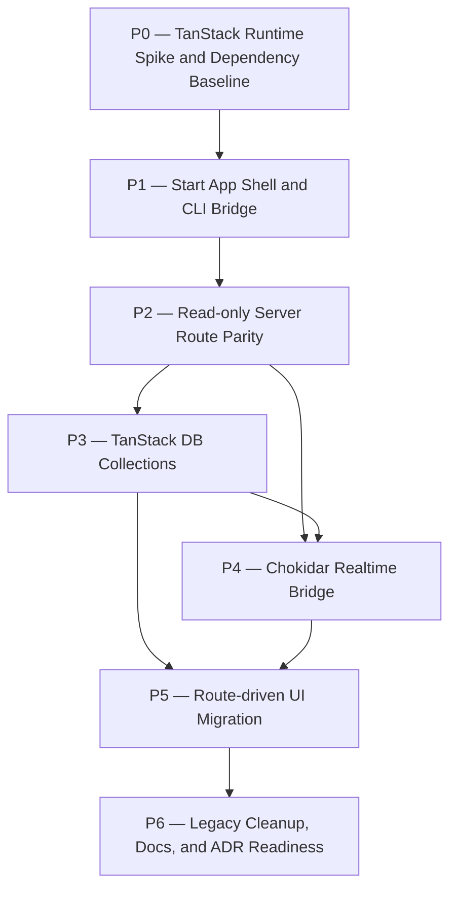

# tanstack-dashboard Plan

## Source Artifacts

- `.plan/tanstack-dashboard/proposal.md` — accepted proposal scope for converting the dashboard to TanStack Start with TanStack DB-backed realtime state.
- `.plan/tanstack-dashboard/map.nodes.jsonl` / `.plan/tanstack-dashboard/map.edges.jsonl` — curated map of current dashboard CLI/runtime/server/client/tests plus proposed TanStack dependencies.
- `.plan/tanstack-dashboard/facts.nodes.jsonl` / `.plan/tanstack-dashboard/facts.edges.jsonl` — source-backed facts [F001]–[F015] about the current dashboard stack, TanStack Start, TanStack DB, Chokidar, tests, and ADR constraints.
- `.plan/tanstack-dashboard/context-packs.jsonl` — `context:tanstack-dashboard:proposal` compact implementation context.
- `.plan/tanstack-dashboard/receipts.jsonl` — proposal validation and serial audit fallback receipts.
- `.plan/_index/project-graph.sqlite` and `.plan/_index/project-graph-manifest.json` — refreshed shared project index.
- Verified project references: `file:package.json`, `file:bin/cartographer-dashboard.js`, `file:dashboard/server/cli.ts`, `file:dashboard/server/runtime.ts`, `file:dashboard/server/app.ts`, `file:dashboard/server/artifact-reader.ts`, `file:dashboard/server/live-reload.ts`, `file:dashboard/shared/models.ts`, `file:dashboard/client/src/App.tsx`, `file:dashboard/client/src/lib/events.ts`, `file:dashboard/client/src/lib/live-refetch.ts`, `file:docs/adr/0003-use-local-dashboard-stack-for-cartographer-planning-ui.md`, and dashboard tests.

## Planning Assumptions

### Confirmed facts

- The current dashboard is split between a Hono Node runtime and a separately built Vite React client, coordinated by package scripts and the `cartographer-dashboard` bin [F001].
- Current read-only API routes are centralized in `dashboard/server/app.ts` and expose only GET routes for dashboard artifact reads and live events [F002].
- Chokidar already watches safe `.plan/**` paths, ignores `.plan/_private/**`, debounces changes, and publishes shared `LiveReloadEvent` records over SSE [F003] [F005].
- Client state currently lives in React hooks and manual refetch effects in `dashboard/client/src/App.tsx` [F004].
- TanStack Start supports full-stack route files with server handlers/functions and Vite plugin configuration [F006] [F007].
- TanStack DB supports collections, query-backed collection loading, and React live queries [F008] [F009].
- Chokidar provides the watch, ignore, all-event, await-write-finish, and async cleanup primitives needed for the filesystem boundary [F010].
- ADR-0003 currently records the accepted Hono + Chokidar + standalone Vite/React dashboard stack, so this migration must produce a follow-up ADR after validation [F011].
- The dashboard must stay local, loopback-only, read-only, and private-safe [F012].
- Existing tests already cover live reload, route safety, private path blocking, and fixture-root discipline [F013] [F014].
- The TanStack packages are not currently declared, so dependency, lockfile, script, and package-file updates are part of the work [F015].

### Implementation assumptions

- The migration should be staged. Keep old Hono/Vite paths temporarily until equivalent TanStack Start routes, runtime, tests, and package smoke checks pass.
- Chokidar remains the server-side filesystem watcher; TanStack DB is a browser-side reactive cache/projection, not an authoritative artifact store.
- Query-backed TanStack DB collections should be the first implementation mode. Directly patching complex local collection objects from file events is deferred until refetch/invalidation behavior is tested.
- All tests that create `.plan/`, index, or graph artifacts must use temp/mock roots, never this repository's real `.plan/` directory [F014].
- `adr_required: true` from the proposal is carried forward. Implementation finalization must run `cartographer_adr` to create, supersede, or amend ADR-0003 after validation receipts exist [F011].

### Retrieval probes used

1. Package and script probes: `package.json`, `dashboard:build`, `dashboard:check`, `check:scripts`, `test:browser`, `cartographer-dashboard` bin.
2. Runtime probes: `bin/cartographer-dashboard.js`, `dashboard/server/cli.ts`, `dashboard/server/runtime.ts`, `dashboard/server/assets.ts`.
3. API/safety probes: `dashboard/server/app.ts`, `dashboard/server/artifact-reader.ts`, `dashboard/server/safety.ts`, `dashboard/server/jsonl.ts`.
4. Live reload probes: `dashboard/server/live-reload.ts`, `dashboard/shared/models.ts`, `dashboard/client/src/lib/events.ts`, `dashboard/client/src/lib/live-refetch.ts`.
5. UI probes: `dashboard/client/src/App.tsx`, `dashboard/client/src/features/review-workflow.tsx`, `dashboard/client/src/features/graph-explorer.tsx`, `dashboard/client/src/features/document-viewer.tsx`.
6. Test probes: `tests/dashboard/live-reload.test.ts`, `tests/dashboard/privacy-regressions.test.tsx`, `tests/dashboard/client-shell.test.tsx`, `tests/dashboard/smoke.test.ts`, `tests/dashboard/package-assets.test.ts`.
7. Rationale probes: `.plan/planning-dashboard/plan.md`, ADR-0003, and proposal facts for current stack constraints.

## Phase Dependency Graph

## Phase Summary

| Order | Phase ID | Phase | Depends On | Unlocks | Exit Criteria |
| ----: | -------- | ----- | ---------- | ------- | ------------- |
| 0 | P0 | TanStack Runtime Spike and Dependency Baseline | none | P1 | A minimal TanStack Start build runs through the dashboard CLI boundary, package dependencies/scripts are staged, and old runtime paths remain intact. |
| 1 | P1 | Start App Shell and CLI Bridge | P0 | P2 | The CLI can start/status/stop the Start-based dashboard shell on loopback with topic deep links and runtime metadata outside `.plan/`. |
| 2 | P2 | Read-only Server Route Parity | P1 | P3, P4 | Start server routes/functions provide parity for existing read-only dashboard endpoints while preserving safety and response envelopes. |
| 3 | P3 | TanStack DB Collections | P2 | P4, P5 | Typed query-backed collections expose overview/topic/document/graph/ADR/live-status state and are consumed by live queries in isolated tests. |
| 4 | P4 | Chokidar Realtime Bridge | P2, P3 | P5 | Chokidar/SSE events invalidate or refresh the correct TanStack Query/TanStack DB collections without surfacing private paths or writes. |
| 5 | P5 | Route-driven UI Migration | P3, P4 | P6 | Existing dashboard UI surfaces render from Start routes and TanStack DB live queries, with topic navigation handled by TanStack Router. |
| 6 | P6 | Legacy Cleanup, Docs, and ADR Readiness | P5 | implementation handoff complete | Hono/standalone Vite legacy code is removed or explicitly retained with rationale, docs/tests/scripts pass, package smoke passes, and ADR follow-through is ready. |

## Phases

### Phase P0 — TanStack Runtime Spike and Dependency Baseline

- **Status:** complete
- **Depends on:** none
- **Unlocks:** P1
- **Primary references:** `file:package.json`, `file:bin/cartographer-dashboard.js`, `file:dashboard/client/vite.config.ts`, `dependency:npm:@tanstack/react-start`, `dependency:npm:@tanstack/react-router`, `dependency:npm:@tanstack/react-db`, `dependency:npm:@tanstack/query-db-collection`, `dependency:npm:@tanstack/react-query`, [F006], [F007], [F008], [F009], [F015]

#### Objective

Prove the minimum TanStack Start runtime and dependency shape before migrating the production dashboard. This phase should answer the highest-risk question: can a built Start dashboard be launched by `cartographer-dashboard` without requiring users to manage a separate frontend server?

#### Scope

- Add or spike the minimum required TanStack Start, Router, DB, Query, and query-collection dependencies in `package.json` and lockfile [F015].
- Configure a Start-compatible Vite entry using `tanstackStart()` before the React plugin [F007].
- Create a minimal dashboard Start app shell that can build and render a placeholder overview route.
- Keep the existing Hono runtime and standalone Vite client intact during the spike.
- Document the selected Start output/server entrypoint that later phases should use from the CLI.

#### Checklist

- [x] **P0.T1** Add the TanStack dependency baseline and update the lockfile without removing Hono/Vite runtime dependencies yet.
- [x] **P0.T2** Introduce a Start-compatible dashboard app entry and Vite config, preserving existing aliases and Tailwind/shadcn requirements where possible.
- [x] **P0.T3** Build a minimal Start route tree with `/` and `/topics/$topic` placeholder routes.
- [x] **P0.T4** Prove a production Start build can be launched from Node in a source checkout and record the runtime entrypoint contract for P1.
- [x] **P0.T5** Add temporary compatibility notes explaining which old dashboard files remain active until later phases.

#### Validation

- [x] **P0.V1** Run the narrow TanStack Start build command chosen in P0 and verify server/client output exists.
- [x] **P0.V2** Run `npm run typecheck`; expect new Start route/app types to pass or clearly document generated route type steps.
- [x] **P0.V3** Run `npm run lint:ts -- dashboard/**/*.{ts,tsx}` or the closest supported lint command; expect no new lint failures.
- [x] **P0.V4** Manual check: launch the minimal Start server on loopback and verify `/` plus `/topics/demo` respond without a separate Vite dev server.

#### Exit Criteria

- The exact Start runtime/build entrypoint is known and documented for P1.
- Dependency and script changes are staged but old dashboard runtime remains usable.
- No read-only/private-safety behavior is weakened.

#### Risks and Mitigations

- **Risk:** TanStack Start generated route files or build output conflict with current package layout. **Mitigation:** keep the spike minimal and do not delete old runtime code until P1/P2 parity passes.
- **Risk:** Dependency versions cause Vite/React/test incompatibility. **Mitigation:** validate with typecheck/build immediately and isolate version changes in this phase.

#### Notes for Execution Agent

Use Context7 docs during implementation for exact current package names and commands. Do not assume older Start examples are still correct.

### Phase P1 — Start App Shell and CLI Bridge

- **Status:** complete
- **Depends on:** P0
- **Unlocks:** P2
- **Primary references:** `file:bin/cartographer-dashboard.js`, `file:dashboard/server/cli.ts`, `file:dashboard/server/runtime.ts`, `file:dashboard/server/assets.ts`, `file:README.md`, [F001], [F006], [F012]

#### Objective

Move the user-facing runtime boundary to the TanStack Start app while preserving the existing `cartographer-dashboard start|status|stop` CLI and `/skill:dashboard` expectations.

#### Scope

- Adapt the CLI/runtime layer to start the built Start server or handler selected in P0.
- Preserve `--root`, `--topic`, `--host`, `--port`, `--open`, and `--json` behavior.
- Preserve loopback-only host enforcement, process metadata outside `.plan/`, stale PID cleanup, and topic deep links [F012].
- Keep any Hono runtime code behind a compatibility path only until server route parity is complete.

#### Checklist

- [x] **P1.T1** Refactor runtime startup so `cartographer-dashboard start` launches the Start app build/handler on the selected loopback host and port.
- [x] **P1.T2** Preserve `status` and `stop` metadata semantics, including root-hash keys and runtime metadata outside `.plan/`.
- [x] **P1.T3** Map `--topic <topic>` to the Start `/topics/$topic` route without manual client `history.pushState` assumptions.
- [x] **P1.T4** Update source-checkout resolver behavior if Start build/server files require different import resolution than current `.ts` source execution.
- [x] **P1.T5** Keep the old runtime available as a fallback only until P2 route parity is validated.

#### Validation

- [x] **P1.V1** Run `npm run test:ts -- tests/dashboard/cli.test.ts`; expect CLI lifecycle, JSON output, loopback host rejection, topic URL, status, and stop behavior to pass or be updated for equivalent Start behavior.
- [x] **P1.V2** Run a bounded manual or automated smoke command: `node bin/cartographer-dashboard.js start --root "$(mktemp -d)" --host 127.0.0.1 --port 0 --topic demo --json`; expect a Start route URL and clean shutdown.
- [x] **P1.V3** Run `npm run check:scripts && npm run typecheck`; expect CLI/runtime entrypoints to pass.

#### Exit Criteria

- The installed CLI contract still works while launching the TanStack Start shell.
- Users still do not need to manage a separate server and frontend process.
- Runtime metadata and host safety remain unchanged.

#### Risks and Mitigations

- **Risk:** Start runtime process lifecycle differs from Hono's `serve` handle. **Mitigation:** wrap it behind the existing runtime handle interface and test start/status/stop before API migration.
- **Risk:** Installed package behavior diverges from source checkout behavior. **Mitigation:** keep package smoke validation in P6 and source-checkout tests in P1.

#### Notes for Execution Agent

Do not alter dashboard product behavior yet. This phase is runtime plumbing plus route shell only.

### Phase P2 — Read-only Server Route Parity

- **Status:** complete
- **Depends on:** P1
- **Unlocks:** P3, P4
- **Primary references:** `file:dashboard/server/app.ts`, `file:dashboard/server/artifact-reader.ts`, `file:dashboard/server/safety.ts`, `file:dashboard/server/jsonl.ts`, `file:dashboard/shared/models.ts`, `file:tests/dashboard/api-health.test.ts`, `file:tests/dashboard/privacy-regressions.test.tsx`, [F002], [F006], [F012], [F013]

#### Objective

Port the current read-only Hono API surface to TanStack Start server routes/functions while preserving response envelopes, shared models, safety behavior, and fixture-based test coverage.

#### Scope

- Implement Start server routes/functions for health, overview, topics, topic details, documents, graph, evidence, safe files, ADRs, index manifest, event status, and event stream placeholders.
- Reuse server-only artifact reader, safety, JSONL, and shared model modules.
- Keep all routes read-only and GET-compatible unless TanStack Start requires internal method conventions for server functions; no dashboard mutation endpoints.
- Preserve `ApiResponse<T>` semantics during migration.

#### Checklist

- [x] **P2.T1** Create Start server route/function equivalents for every current `READ_ONLY_ROUTES` entry except full live stream behavior, which is completed in P4.
- [x] **P2.T2** Move or fence server-only modules so artifact readers and path safety code are not bundled into client code (lazy server imports in handlers).
- [x] **P2.T3** Preserve `apiSuccess`/`apiFailure` response shape and typed shared models.
- [x] **P2.T4** Add a dedicated Start-backed route smoke test suite against the live Start server to validate API payload contracts.
- [x] **P2.T5** Keep old Hono endpoints only as a temporary compatibility shim until all parity tests pass.

#### Validation

- [x] **P2.V1** Run `npm run test:ts -- tests/dashboard/api-health.test.ts tests/dashboard/artifact-reader.test.ts`; expect route parity, health summaries, and artifact parsing to pass.
- [x] **P2.V2** Run `npm run test:ts -- tests/dashboard/privacy-regressions.test.tsx`; expect private path blocking, outside-root rejection, and GET/read-only route expectations to pass under Start routes (using the existing Hono compatibility harness during transition).
- [x] **P2.V3** Run `npm run typecheck`; expect server/client boundaries to typecheck without leaking Node-only modules to browser bundles.

#### Exit Criteria

- Start server routes cover the old read-only API contract.
- Private path, outside-root, and read-only guarantees are test-covered.
- P3 can consume stable server route data through query-backed collections.

#### Risks and Mitigations

- **Risk:** Start server route APIs require different request/response mechanics than Hono. **Mitigation:** keep a thin adapter around existing loader functions and preserve tests at response-contract level.
- **Risk:** Client bundle accidentally imports Node modules. **Mitigation:** isolate server route files and run production build/typecheck early.

#### Notes for Execution Agent

Prefer extracting pure loader functions from route handlers rather than rewriting artifact semantics.

### Phase P3 — TanStack DB Collections

- **Status:** complete
- **Depends on:** P2
- **Unlocks:** P4, P5
- **Primary references:** `file:dashboard/client/src/lib/api.ts`, `file:dashboard/shared/models.ts`, `dependency:npm:@tanstack/react-db`, `dependency:npm:@tanstack/query-db-collection`, `dependency:npm:@tanstack/react-query`, [F004], [F008], [F009], [F012]

#### Objective

Introduce a typed TanStack DB state layer for dashboard data so UI components can read overview, topics, topic artifacts, documents, graphs, ADRs, health, and live status through collections and live queries rather than scattered React state.

#### Scope

- Define a QueryClient/DB provider location for the Start app.
- Create query-backed collections for overview, topics, topic artifacts, documents, topic graphs, ADRs, health, live status, and live events.
- Use stable `getKey` functions and shared dashboard model types.
- Omit or explicitly reject mutation handlers; dashboard state remains read-only [F012].
- Add live-query selectors that can be tested independently before full UI migration.

#### Checklist

- [x] **P3.T1** Add a dashboard DB module with collection definitions and key/schema helpers for current API models.
- [x] **P3.T2** Wire TanStack Query and TanStack DB providers into the Start app root.
- [x] **P3.T3** Port `dashboardApi` fetchers into collection query functions, preserving `ApiResponse<T>` error handling.
- [x] **P3.T4** Add live-query hooks/selectors for overview metrics, selected topic artifacts, graph data, ADR list, live status, and health warnings.
- [x] **P3.T5** Ensure collection mutation paths are absent or throw explicit read-only errors.

#### Validation

- [x] **P3.V1** Run focused collection unit tests for keying, query fetch success/failure, and read-only mutation behavior.
- [x] **P3.V2** Run `npm run test:browser -- tests/dashboard/client-shell.test.tsx` or an updated collection-aware browser test; expect providers and shell render without manual data-fetch state regressions.
- [x] **P3.V3** Run `npm run typecheck`; expect collection types and live-query selectors to pass.

#### Exit Criteria

- Dashboard data can be loaded into typed collections from read-only server routes.
- UI code has tested live-query selectors available for P5.
- No collection path writes planning artifacts or source files.

#### Risks and Mitigations

- **Risk:** Query-backed collection APIs differ from expected docs. **Mitigation:** keep this phase focused, use official docs during implementation, and add narrow tests before UI migration.
- **Risk:** Collection state becomes another source of truth. **Mitigation:** document collections as reactive projections of server reads and make mutation handlers unavailable.

#### Notes for Execution Agent

Do not optimize for granular event patches yet. Correct query-backed reads are the foundation for P4.

### Phase P4 — Chokidar Realtime Bridge

- **Status:** complete
- **Depends on:** P2, P3
- **Unlocks:** P5
- **Primary references:** `file:dashboard/server/live-reload.ts`, `file:dashboard/client/src/lib/events.ts`, `file:dashboard/client/src/lib/live-refetch.ts`, `file:dashboard/shared/models.ts`, `file:tests/dashboard/live-reload.test.ts`, `file:tests/dashboard/private-watch.test.ts`, [F003], [F005], [F010], [F013]

#### Objective

Bridge Chokidar/SSE live events into TanStack Query and TanStack DB collection refresh behavior so the dashboard updates in realtime while keeping Chokidar as the filesystem boundary.

#### Scope

- Preserve server-side Chokidar watch semantics, private-path ignore rules, index-stale summarization, debouncing, and event shapes [F003] [F005] [F010].
- Implement a Start-compatible `/api/events` stream and `/api/events/status` route.
- Replace the old manual `createLiveRefetchPlan` effect with a collection invalidation/refetch bridge.
- Store live status/latest event in collections for the live badge and diagnostics.
- Prefer targeted invalidation/refetch over hand-patching complex graph/document data.

#### Checklist

- [x] **P4.T1** Port or wrap `createLiveReloadService` for the Start runtime without changing private-path filtering.
- [x] **P4.T2** Implement Start-compatible SSE response handling for `/api/events` with status, reload, heartbeat, reconnect, and cleanup behavior.
- [x] **P4.T3** Map `LiveReloadEvent` resources to collection invalidation/refetch rules for overview, topics, selected topic artifacts, documents, graph, ADRs, health, and index status.
- [x] **P4.T4** Update client event bridge to write live status/latest events into TanStack DB collections.
- [x] **P4.T5** Add tests proving safe fixture-root file changes refresh the relevant collection-backed UI state and private changes do not leak.

#### Validation

- [x] **P4.V1** Run `npm run test:ts -- tests/dashboard/live-reload.test.ts`; expect Start-compatible event status/stream and Chokidar topic events to pass.
- [x] **P4.V2** Run `npm run test:ts -- tests/dashboard/private-watch.test.ts`; expect private paths to remain ignored/redacted.
- [x] **P4.V3** Run updated live-refetch/collection tests; expect each event kind to invalidate or refresh only intended collections.
- [x] **P4.V4** Run `npm run typecheck`; expect event bridge and collection integration to pass.

#### Exit Criteria

- Chokidar file changes flow through SSE into TanStack DB-backed live UI state.
- Private paths and raw `.plan/_private/**` contents never appear in events, collections, or UI.
- Manual React refetch orchestration is replaced by tested collection invalidation/refetch logic.

#### Risks and Mitigations

- **Risk:** SSE streaming APIs differ in TanStack Start server routes. **Mitigation:** validate stream mechanics before removing the old live-reload route.
- **Risk:** Over-broad invalidation causes expensive reloads. **Mitigation:** start correct and coarse, then refine with event resource/topic matching once stable.

#### Notes for Execution Agent

Preserve existing `LiveReloadEvent` type compatibility unless tests force an additive change.

### Phase P5 — Route-driven UI Migration

- **Status:** complete
- **Depends on:** P3, P4
- **Unlocks:** P6
- **Primary references:** `file:dashboard/client/src/App.tsx`, `file:dashboard/client/src/features/review-workflow.tsx`, `file:dashboard/client/src/features/graph-explorer.tsx`, `file:dashboard/client/src/features/document-viewer.tsx`, `file:dashboard/client/src/lib/api.ts`, `file:dashboard/client/src/lib/events.ts`, `file:dashboard/client/src/lib/live-refetch.ts`, [F004], [F008], [F012], [F013]

#### Objective

Move the existing dashboard UI onto TanStack Router/Start routes and TanStack DB live queries while preserving the cockpit UI, read-only behavior, topic workspace, graph explorer, and document viewer.

#### Scope

- Convert root and topic detail navigation to TanStack Start routes.
- Replace manual overview/topic/ADR `useState` and data-fetch effects with live-query selectors [F004] [F008].
- Keep shadcn/Tailwind styling, React Flow graph explorer, Markdown/code viewer, evidence/receipt/health panels, and private blocked states.
- Replace manual `history.pushState` with route navigation.
- Keep browser tests and fixture data updated for route-driven behavior.

#### Checklist

- [x] **P5.T1** Move `DashboardShell` responsibilities into the Start root route/layout and route components.
- [x] **P5.T2** Convert topic selection and deep links to TanStack Router route params/search state.
- [x] **P5.T3** Replace overview, topic, ADR, health, document, and graph manual fetch state with TanStack DB live-query selectors.
- [x] **P5.T4** Update review workflow panels, graph explorer, document viewer, reference resolver, and live badge to consume collection-backed props or hooks.
- [x] **P5.T5** Preserve read-only/private blocked-state UI and all existing product surfaces.

#### Validation

- [x] **P5.V1** Run `npm run test:browser -- tests/dashboard/client-shell.test.tsx`; expect route shell, navigation, live badge, focus, reduced motion, and core UI rendering to pass.
- [x] **P5.V2** Run `npm run test:ts -- tests/dashboard/topic-pages.test.tsx tests/dashboard/reference-resolver.test.ts tests/dashboard/markdown-viewer.test.tsx`; expect topic pages, references, and document rendering to pass.
- [x] **P5.V3** Run `npm run test:ts -- tests/dashboard/graph-normalizer.test.ts tests/dashboard/graph-explorer.test.tsx`; expect graph explorer behavior to remain intact.
- [x] **P5.V4** Run `npm run dashboard:build`; expect the Start dashboard production build to succeed.

#### Exit Criteria

- User-facing dashboard routes and components are powered by TanStack Start and TanStack DB.
- Existing visual/product capabilities survive the migration.
- Old manual React state/refetch code is removed or reduced to local UI-only state.

#### Risks and Mitigations

- **Risk:** UI migration becomes a redesign. **Mitigation:** keep markup/styling components stable and change data/navigation plumbing first.
- **Risk:** Live-query updates are hard to observe in browser tests. **Mitigation:** add fixture event hooks and assert rendered collection state changes after simulated events.

#### Notes for Execution Agent

Local UI state such as active tabs, filters, and drawer open state can remain React state. Server/artifact state should move to collections.

### Phase P6 — Legacy Cleanup, Docs, and ADR Readiness

- **Status:** complete
- **Depends on:** P5
- **Unlocks:** implementation handoff complete
- **Primary references:** `file:package.json`, `file:README.md`, `file:skills/dashboard/SKILL.md`, `file:docs/adr/0003-use-local-dashboard-stack-for-cartographer-planning-ui.md`, `file:tests/dashboard/smoke.test.ts`, `file:tests/dashboard/package-assets.test.ts`, [F001], [F011], [F012], [F013], [F015]

#### Objective

Remove or justify legacy split-stack code, update package scripts/docs/tests, run full validation, and prepare ADR finalization for the new TanStack Start + TanStack DB architecture.

#### Scope

- Remove obsolete Hono runtime/dependencies and standalone Vite client config only after Start parity passes, or explicitly document any retained compatibility code.
- Update package scripts, package files, smoke tests, dashboard skill docs, README, and development guidance.
- Validate package build and installed-mode startup.
- Record ADR follow-through requirements and prepare `cartographer_adr` finalization after implementation receipts exist.

#### Checklist

- [x] **P6.T1** Remove Hono-specific runtime/app/assets code and dependencies if fully replaced; otherwise document retained compatibility scope and risks.
- [x] **P6.T2** Update `dashboard:build`, `dashboard:check`, `check:scripts`, browser test config, package `files`, and package asset tests for TanStack Start output.
- [x] **P6.T3** Update README and `skills/dashboard/SKILL.md` to state that normal use is a single full-stack dashboard app with no separate frontend server.
- [x] **P6.T4** Update smoke tests to launch the built Start dashboard through `cartographer-dashboard`, exercise topic routes, live reload, graph/document surfaces, and stop cleanly.
- [x] **P6.T5** Run ADR evaluation/finalization guidance: after implementation validation, create a new ADR that supersedes/amends ADR-0003 or explicitly records why ADR-0003 remains current [F011].
- [x] **P6.T6** Re-run all deterministic Cartographer validation for this plan/topic and ensure receipts are appended.

#### Validation

- [x] **P6.V1** Run `npm run dashboard:check`; expect build plus browser smoke/dashboard checks to pass.
- [x] **P6.V2** Run `npm run test:ts -- tests/dashboard/package-assets.test.ts tests/dashboard/smoke.test.ts`; expect package files and installed-mode smoke behavior to pass.
- [x] **P6.V3** Run `npm run check`; expect full project validation to pass.
- [x] **P6.V4** Run `node --experimental-strip-types skills/plan/scripts/manage_jsonl.ts validate-topic --root "$PWD" --topic tanstack-dashboard --json`; expect topic artifacts to validate.
- [x] **P6.V5** Run `python skills/plan/scripts/validate_planning_graph.py --root "$PWD" --topic tanstack-dashboard --json`; expect plan graph validation to pass.
- [x] **P6.V6** Run `cartographer_adr evaluate --topic tanstack-dashboard` or tool equivalent after implementation receipts exist; expect ADR-required status to be resolved with a create/supersede/amend decision.

#### Exit Criteria

- No obsolete split-stack code or dependencies remain unless intentionally documented.
- Package, docs, skill, tests, and smoke commands describe the new single full-stack app model.
- Full validation passes with receipts.
- ADR follow-through is ready for implementation finalization.

#### Risks and Mitigations

- **Risk:** Removing Hono too early hides route parity regressions. **Mitigation:** remove only after P2–P5 tests pass and package smoke succeeds.
- **Risk:** Docs imply write capabilities because TanStack DB sounds like a database. **Mitigation:** explicitly state TanStack DB is a read-only reactive projection/cache for dashboard artifacts.

#### Notes for Execution Agent

Do not mark implementation complete until `npm run check`, topic validation, planning graph validation, and ADR finalization guidance are all recorded.

## Cross-Phase Validation

- [x] **CV.V1** After each phase that changes TypeScript/TSX, run `npm run typecheck` and the narrowest relevant dashboard tests.
- [x] **CV.V2** After package/script changes, run `npm run check:scripts` and a bounded CLI start/status/stop smoke against a temp root.
- [x] **CV.V3** After route/API changes, run dashboard API, artifact-reader, privacy, and live-reload tests against temporary fixtures.
- [x] **CV.V4** After UI/state changes, run browser/client-shell, topic page, graph, markdown/reference, and live collection tests.
- [x] **CV.V5** Before final handoff, run `npm run check`, topic JSONL validation, planning graph validation, and ADR evaluation/finalization.

## Open Questions

- None blocking before P0. P0 must determine the exact TanStack Start Node/build entrypoint used by `cartographer-dashboard`.
- P6 must decide, based on implementation evidence, whether the new ADR supersedes ADR-0003 or amends it while retaining Chokidar/read-only constraints.

## Handoff Guidance

- Execute phases in order. Do not start P1 until P0 proves the Start runtime/build boundary, and do not remove legacy Hono/Vite paths until P2–P5 parity tests pass.
- Keep one writer in the active worktree. If delegating implementation, use phase-scoped workers with acceptance criteria and require validation receipts per phase.
- Preserve local loopback-only, read-only, and private-path constraints in every phase. Stop and ask before introducing any mutating dashboard API, hosted deployment behavior, authentication, or editor-like write UI.
- Use official TanStack Start and TanStack DB docs during implementation for exact package names, plugin setup, route conventions, and collection APIs.
- All test arrange/setup that creates `.plan/`, index, graph, or dashboard fixture artifacts must use temp/mock roots, not the repository's real `.plan/` directory [F014].
- Because `adr_required: true`, implementation finalization must run `cartographer_adr` after deterministic validation receipts exist and record whether the new decision supersedes or amends ADR-0003 [F011].
