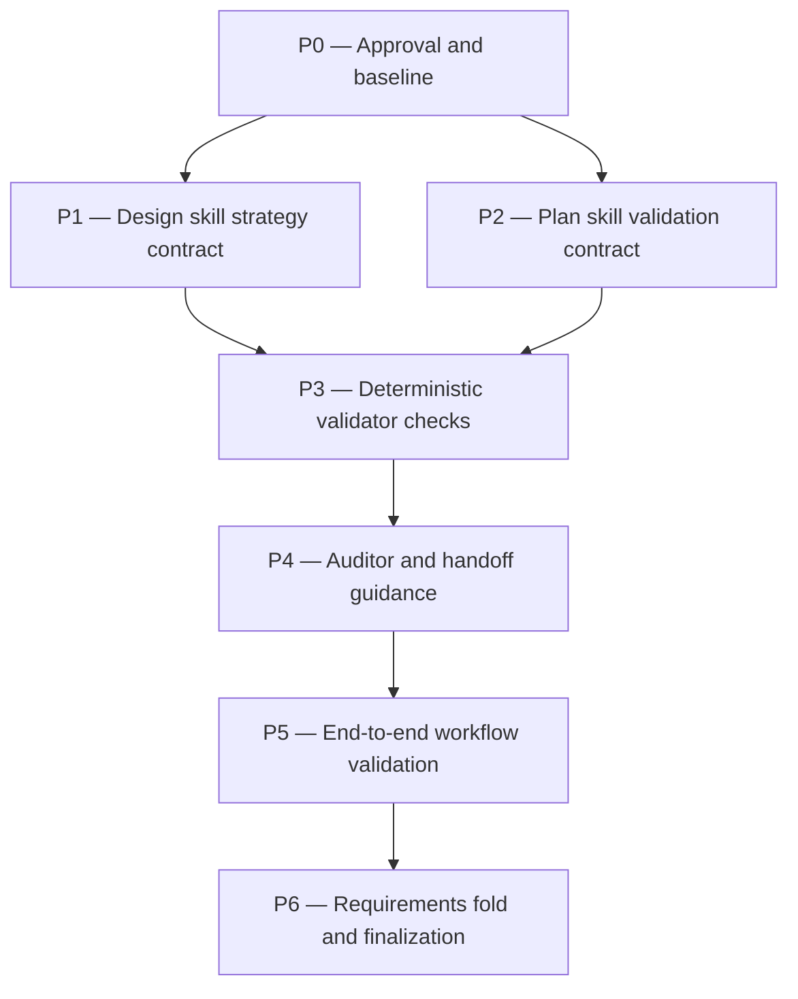

# testing-strategy Plan

## Source Artifacts

- `.plan/_index/project-graph.sqlite`
- `.plan/_index/project-graph-manifest.json`
- `.plan/testing-strategy/proposal.md`
- `.plan/testing-strategy/requirements.md`
- `.plan/testing-strategy/requirements.nodes.jsonl`
- `.plan/testing-strategy/requirements.edges.jsonl`
- `.plan/testing-strategy/design.md`
- `.plan/testing-strategy/design.nodes.jsonl`
- `.plan/testing-strategy/design.edges.jsonl`
- `.plan/testing-strategy/map.nodes.jsonl`
- `.plan/testing-strategy/map.edges.jsonl`
- `.plan/testing-strategy/facts.nodes.jsonl`
- `.plan/testing-strategy/facts.edges.jsonl`
- `.plan/testing-strategy/context-packs.jsonl`
- `package.json`
- `skills/design/SKILL.md`
- `skills/plan/SKILL.md`
- `skills/plan/scripts/validate_planning_graph.py`
- `.pi/agents/cartographer-auditor.md`
- `tests/test_validate_planning_graph.py`
- `tests/test_workflow_docs.py`

## Planning Assumptions

### Confirmed facts

- This topic changes externally visible Cartographer workflow behavior, so requirements and design artifacts are required and available.
- `adr_required: false` for this proposal itself. The plan must preserve that reason: the workflow change is behavioral/validation policy, not a project architecture or dependency decision.
- Topic-specific future testing-toolchain changes that add, remove, replace, or standardize tools such as Vitest, Playwright, Cypress, Jest, pytest, or similar must trigger ADR evaluation/generation before implementation treats them as accepted.
- Existing project checks are defined in `package.json`: `npm run check:scripts`, `npm run typecheck`, `npm run lint:ts`, `npm run lint:py`, `npm run format:prettier:check`, `npm run format:check`, `npm run test:py`, `npm run test:ts`, `npm run test:browser`, and aggregate `npm run check`.
- Tests must use temp/mock roots and must not mutate the repository's real `.plan/` except through intended Cartographer workflow artifacts.
- Research facts [F001], [F002], [F003], and [F004] support layered unit/integration/E2E testing guidance.

### Assumptions

- Implementation should use current Python `unittest` and TypeScript Vitest infrastructure already present in this repository; no testing-toolchain pivot is planned.
- Deterministic validator enforcement should start with narrow structural/prose checks for this workflow rather than attempting subjective test-quality judgment.
- Auditor guidance may be updated after plan approval because the accepted design includes auditor responsibilities, but auditor remains read-only and semantic.

## Requirement Test Coverage Matrix

| Requirement / Scenario | Planned coverage | Validation evidence |
| ---------------------- | ---------------- | ------------------- |
| `REQ-TEST-001` — Design-phase testing strategy | P1 updates `skills/design/SKILL.md`; P3 adds design strategy validator checks; P5 runs focused docs/validator tests. | `P1.V1`, `P1.V2`, `P3.V1`, `P3.V2`, `P5.V1`, `P5.V2` |
| `REQ-TEST-002` — Plan validation names concrete tests | P2 updates `skills/plan/SKILL.md`; P3 adds generic-only plan validation rejection; P5 runs focused workflow and validator tests. | `P2.V1`, `P2.V2`, `P3.V1`, `P3.V2`, `P5.V1`, `P5.V2` |
| `REQ-TEST-003` — At least one E2E validation | P1/P2 document E2E strategy and plan expectations; P3 validates E2E presence; P5 runs a temp-root synthetic workflow E2E smoke. | `P1.V1`, `P2.V1`, `P3.V1`, `P3.V2`, `P5.V2` |
| `REQ-TEST-004` — Existing-tool preservation and user-approved pivots | P0 preserves ADR metadata; P1/P2 document existing-tool and ADR-trigger handling; P3 detects toolchain pivot prerequisites; P6 preserves final ADR metadata. | `P0.V1`, `P1.V1`, `P2.V1`, `P3.V1`, `P6.V3`, `P6.V4` |
| `SCN-TEST-001` — TypeScript frontend feature | P1/P2 require language/app-type and existing tool discovery; P5 includes TypeScript regression coverage with existing tools. | `P1.V1`, `P2.V1`, `P5.V4` |
| `SCN-TEST-002` — Python CLI/system tool feature | P3/P5 require temp-root validator fixtures and Python focused tests, proving CLI/system-tool style temp-root validation. | `P3.V1`, `P5.V1`, `P5.V2`, `P5.V3` |
| `SCN-TEST-003` — Tool pivot recommendation | P0/P1/P2/P3/P6 preserve user approval and ADR-trigger behavior for major pivots. | `P0.V1`, `P1.V1`, `P2.V1`, `P3.V1`, `P6.V4` |
| `SCN-TEST-004` — Plan rejects generic validation | P2 documents generic-only rejection; P3 adds failing validator tests; P5 runs focused tests. | `P2.V1`, `P3.V1`, `P3.V2`, `P5.V1`, `P5.V2` |

All topic-generated requirements and scenarios have planned validation coverage. No non-test/manual-only exceptions are planned.

## Phase Dependency Graph

## Phase Summary

| Order | Phase ID | Phase | Depends On | Unlocks | Exit Criteria |
| ----: | -------- | ----- | ---------- | ------- | ------------- |
| 0 | P0 | Approval and baseline | none | P1, P2 | Design/plan inputs are approved, current diffs understood, and no implementation edits start from stale artifacts. |
| 1 | P1 | Design skill strategy contract | P0 | P3 | `skills/design/SKILL.md` requires the design-owned Testing Strategy and escalation rules from `DES-TEST-001`, `DES-TEST-004`, and `DES-TEST-005`. |
| 2 | P2 | Plan skill validation contract | P0 | P3 | `skills/plan/SKILL.md` requires strategy-derived concrete validation gates and plan auditor inputs from `DES-TEST-002` and `DES-TEST-004`. |
| 3 | P3 | Deterministic validator checks | P1, P2 | P4 | Validator/helper checks detect missing strategy evidence, generic-only plan validations, missing E2E validation, and ADR-trigger language where structurally possible. |
| 4 | P4 | Auditor and handoff guidance | P3 | P5 | Auditor/handoff instructions check testing strategy and plan validation evidence after deterministic receipts. |
| 5 | P5 | End-to-end workflow validation | P4 | P6 | Focused unit/integration tests and at least one synthetic workflow E2E smoke pass using temp roots. |
| 6 | P6 | Requirements fold and finalization | P5 | none | Requirements fold/skip is recorded, final checks pass, and implementation handoff preserves ADR metadata. |

## Phases

### Phase P0 — Approval and baseline

- **Status:** complete
- **Depends on:** none
- **Unlocks:** P1, P2
- **Primary references:** `.plan/testing-strategy/design.md`, `.plan/testing-strategy/context-packs.jsonl`, `.plan/testing-strategy/receipts.jsonl`, `package.json`, [F004]

#### Objective

Start implementation from approved, validated design artifacts and a clean understanding of the current repository testing surface.

#### Scope

- Confirm the expanded design is the accepted source for implementation.
- Preserve proposal ADR metadata and requirements/design IDs in implementation notes.
- Verify existing test scripts and relevant files before editing.
- Do not implement source changes until plan approval.

#### Checklist

- [x] **P0.T1** Confirm the current design gate is approved or explicitly approved by the user for implementation planning, citing `DES-TEST-001` through `DES-TEST-005`.
- [x] **P0.T2** Review current uncommitted planning artifacts and decide whether to commit design/plan artifacts before implementation starts.
- [x] **P0.T3** Verify existing test commands in `package.json` and identify focused test files: `tests/test_validate_planning_graph.py`, `tests/test_workflow_docs.py`, and relevant TypeScript workflow tests.
- [x] **P0.T4** Preserve proposal ADR metadata in implementation handoff: `adr_required: false` for this workflow proposal, with ADR triggers for future project testing-toolchain changes.

#### Validation

- [x] **P0.V1** Run `git status --short` and verify only expected planning artifacts are modified before implementation edits start. Testing Strategy Trace: design `DES-TEST-004`; layer static/manual; command `git status --short`; manual evidence `.plan/testing-strategy/receipts.jsonl`.
- [x] **P0.V2** Run `node --experimental-strip-types skills/plan/scripts/manage_jsonl.ts validate-topic --root "$PWD" --topic testing-strategy --json` and expect no errors. Testing Strategy Trace: design `DES-TEST-004`; layer integration; validates topic graph integrity.

#### Exit Criteria

- Approved design and plan inputs are identified.
- Existing validation scripts are confirmed.
- No implementation edit begins from stale or unexplained planning artifacts.

#### Risks and Mitigations

- **Risk:** Implementation starts before the expanded design is accepted.  
  **Mitigation:** Treat design approval as a prerequisite and stop if the user has not approved the design changes.

#### Notes for Execution Agent

Use Cartographer wrappers for status/validation receipts. Do not change `.cartographer` state during this phase.

### Phase P1 — Design skill strategy contract

- **Status:** complete
- **Depends on:** P0
- **Unlocks:** P3
- **Primary references:** `skills/design/SKILL.md`, `.plan/testing-strategy/design.md`, `.plan/testing-strategy/design.nodes.jsonl`, [F001], [F002], [F003], [F004]

#### Objective

Update the design workflow instructions so behavior-changing topics must produce a project-specific Testing Strategy before planning.

#### Scope

- Add concise design-skill requirements for the Testing Strategy section.
- Include existing tool discovery, related ADR handling, unit/integration/E2E expectations, and at-least-once E2E validation.
- Document when to invoke researcher/archivist, compass/oracle, or interview/user approval.
- Preserve existing design workflow structure and graph-backed decision handling.

#### Checklist

- [x] **P1.T1** Update `skills/design/SKILL.md` to require a `Testing Strategy` section for applicable behavior-changing topics.
- [x] **P1.T2** Add required strategy fields from `DES-TEST-001`, including language/app type, existing test tools, related ADRs, source-backed docs, unit/integration/E2E strategy, and E2E recurrence/evidence mode.
- [x] **P1.T3** Add escalation guidance from `DES-TEST-005`: researcher/archivist for missing evidence, compass/oracle for decision consistency, interview/user approval for user-owned tool/ADR/risk decisions.
- [x] **P1.T4** Ensure the design skill still requires validation receipt, context pack, auditor PASS, and approved design transition before planning.

#### Validation

- [x] **P1.V1** Add/update `tests/test_workflow_docs.py` assertions that `skills/design/SKILL.md` contains `Testing Strategy`, `researcher`, `cartographer-compass`, `interview`, `E2E`, and related ADR/supersession guidance; run `python -m unittest tests.test_workflow_docs.WorkflowDocsTests`. Testing Strategy Trace: design `DES-TEST-001`, `DES-TEST-005`; layer unit/static docs test.
- [x] **P1.V2** Run `python skills/plan/scripts/check_skill_language.py --root . --json` and verify the updated skill text does not introduce prohibited manual JSONL mutation guidance. Testing Strategy Trace: design `DES-TEST-004`; layer static contract check.

#### Exit Criteria

- Design skill tells agents what testing strategy evidence to collect and how to escalate uncertainty.
- Workflow documentation tests cover the new design contract.

#### Risks and Mitigations

- **Risk:** Skill text becomes too verbose and loses operational clarity.  
  **Mitigation:** Keep additions checklist-oriented and move only durable, high-signal rules into the skill.

#### Notes for Execution Agent

Follow skill-authoring rules in `AGENTS.md`: terse agent-facing text, RFC 2119 keywords only for hard requirements, and no generic testing prose beyond what agents need to act.

### Phase P2 — Plan skill validation contract

- **Status:** complete
- **Depends on:** P0
- **Unlocks:** P3
- **Primary references:** `skills/plan/SKILL.md`, `.plan/testing-strategy/design.md`, `.plan/testing-strategy/requirements.md`, [F004]

#### Objective

Update the plan workflow instructions so plan validation gates are concrete, strategy-derived, and auditable.

#### Scope

- Require plan phases that change behavior to cite the accepted Testing Strategy.
- Require focused unit/integration/E2E validation items before broad project checks.
- Require each topic-generated requirement and scenario to map to planned validation coverage or an explicit justified exception.
- Require at least one E2E validation item for applicable behavior-changing topics.
- Require plan-auditor inputs to include strategy evidence, requirement coverage evidence, and deterministic validation receipts.
- Preserve ADR metadata handling.

#### Checklist

- [x] **P2.T1** Update `skills/plan/SKILL.md` to consume `design.md` Testing Strategy and design IDs when present.
- [x] **P2.T2** Add a compact `Testing Strategy Trace` expectation for behavior-changing validation items, covering layer, concrete artifact/scenario/command, covered requirement/scenario IDs, E2E contribution, and justified non-applicability.
- [x] **P2.T3** Add plan-gate evidence requirements from `DES-TEST-004`: concrete validations, requirement/scenario coverage matrix, at-least-one E2E validation, broad checks separated from focused tests, and ADR-trigger detection.
- [x] **P2.T4** Update final auditor prompt guidance so plan audit checks strategy-derived validations, rejects generic-only behavior-change gates, and rejects uncovered requirements/scenarios without justified exceptions.

#### Validation

- [x] **P2.V1** Add/update `tests/test_workflow_docs.py` assertions that `skills/plan/SKILL.md` includes `Testing Strategy Trace`, concrete test artifacts/scenarios/commands, requirement/scenario coverage, at least one `E2E` validation, generic-only validation rejection, and ADR-trigger language; run `python -m unittest tests.test_workflow_docs.WorkflowDocsTests`. Testing Strategy Trace: design `DES-TEST-002`, `DES-TEST-004`; layer unit/static docs test; covers `REQ-TEST-002`, `REQ-TEST-003`, `REQ-TEST-004`, and `SCN-TEST-004`.
- [x] **P2.V2** Run `python skills/plan/scripts/check_skill_language.py --root . --json` and verify the plan skill still routes canonical mutations through wrappers. Testing Strategy Trace: design `DES-TEST-004`; layer static contract check.

#### Exit Criteria

- Plan skill requires concrete strategy-derived validation gates.
- Documentation tests lock the new plan contract.

#### Risks and Mitigations

- **Risk:** Plan skill mandates too much detail for non-behavioral changes.  
  **Mitigation:** Scope the requirement to behavior-changing/applicable topics and allow justified non-applicability for skipped layers except required E2E where applicable.

#### Notes for Execution Agent

Do not describe ADR generation as out of scope; carry `adr_required` and ADR-trigger metadata into assumptions/handoff guidance.

### Phase P3 — Deterministic validator checks

- **Status:** complete
- **Depends on:** P1, P2
- **Unlocks:** P4
- **Primary references:** `skills/plan/scripts/validate_planning_graph.py`, `tests/test_validate_planning_graph.py`, `.plan/testing-strategy/design.md`, `.plan/testing-strategy/requirements.md`, [F004]

#### Objective

Add deterministic checks that catch missing testing-strategy evidence and generic plan validation before auditor handoff.

#### Scope

- Extend or add narrow validator/helper logic for design and plan artifacts.
- Keep validators structural: presence, traceability, concrete fields, and receipt/evidence signals; not subjective test-quality judgment.
- Ensure tests use temp roots and synthetic topics.
- Preserve existing validation behavior and error messages where possible.

#### Checklist

- [x] **P3.T1** Add design-artifact checks that detect missing `Testing Strategy` section for behavior-changing topics with design/requirements artifacts.
- [x] **P3.T2** Add design strategy field checks for language/app type, existing tools, docs/sources, unit/integration/E2E strategy, at-least-one E2E validation, related ADR notes, and unresolved-decision/escalation notes.
- [x] **P3.T3** Add plan checks that flag behavior-changing phases whose validation items are generic-only, lack concrete test artifacts/scenarios/commands/manual evidence, omit requirement/scenario coverage, or omit an at-least-once E2E validation for applicable topics.
- [x] **P3.T4** Add requirement/scenario coverage checks that ensure every topic-generated `REQ-*` and `SCN-*` is covered by planned validation or has an explicit justified non-test/manual evidence exception.
- [x] **P3.T5** Add ADR-trigger detection for accepted or required major testing-toolchain changes when plan/design prose treats them as implementation prerequisites.
- [x] **P3.T6** Add unit tests in `tests/test_validate_planning_graph.py` using temp project roots for passing and failing design/plan strategy cases, including an uncovered requirement failure.

#### Validation

- [x] **P3.V1** Run `python -m unittest tests.test_validate_planning_graph.PlanningGraphValidatorTests` and verify new temp-root tests pass. Testing Strategy Trace: design `DES-TEST-004`; layer unit/integration for validator behavior; focused command selector `tests.test_validate_planning_graph.PlanningGraphValidatorTests`.
- [x] **P3.V2** Run `python skills/plan/scripts/validate_planning_graph.py --root "$PWD" --topic testing-strategy --json` and verify the real topic passes after the validator change. Testing Strategy Trace: design `DES-TEST-004`; layer integration against this topic's artifacts.
- [x] **P3.V3** Run `npm run check:scripts` and verify Python/TypeScript scripts still parse. Testing Strategy Trace: design `DES-TEST-004`; layer static; artifact `skills/plan/scripts/validate_planning_graph.py`.

#### Exit Criteria

- Deterministic validation fails on missing/boilerplate strategy obligations, generic-only validation gates, and uncovered topic-generated requirements/scenarios.
- Existing and new validator tests pass without mutating real `.plan/` in test setup.

#### Risks and Mitigations

- **Risk:** Validator heuristics become brittle against legitimate wording variation.  
  **Mitigation:** Check headings, IDs, structured markers, and concrete command/artifact patterns rather than exact prose where possible.

#### Notes for Execution Agent

If validator scope becomes too large, add a narrow helper function with explicit unit tests instead of embedding fragile ad-hoc checks throughout the validator.

### Phase P4 — Auditor and handoff guidance

- **Status:** complete
- **Depends on:** P3
- **Unlocks:** P5
- **Primary references:** `.pi/agents/cartographer-auditor.md`, `skills/plan/SKILL.md`, `skills/design/SKILL.md`, `.plan/testing-strategy/design.md`

#### Objective

Update semantic audit/handoff guidance so auditors inspect testing-strategy quality and plan validation gates after deterministic receipts pass.

#### Scope

- Keep `cartographer-auditor` read-only and semantic.
- Add design/plan-specific audit expectations for testing strategy evidence, requirement/scenario coverage, and concrete validation gates.
- Ensure handoff/context-pack instructions include receipt IDs, strategy evidence summaries, requirement coverage summaries, unresolved decisions, and deterministic PASS/FAIL receipt paths.
- Do not give auditor mutation authority.

#### Checklist

- [x] **P4.T1** Update `.pi/agents/cartographer-auditor.md` to inspect Testing Strategy evidence, requirement/scenario coverage, existing tool/ADR consideration, meaningful E2E validation, and generic-only validation gate rejection.
- [x] **P4.T2** Update relevant skill handoff prompts so auditor receives strategy evidence summaries, requirement coverage summaries, deterministic validation receipt IDs, context-pack IDs, and unresolved-decision notes.
- [x] **P4.T3** Add/update `tests/test_workflow_docs.py` assertions that auditor/handoff guidance mentions testing strategy evidence, requirement coverage, plan validation gates, E2E, and deterministic receipts.
- [x] **P4.T4** Confirm no auditor prompt grants write, receipt append, ADR write, or raw private access.

#### Validation

- [x] **P4.V1** Run `python -m unittest tests.test_workflow_docs.WorkflowDocsTests` and verify auditor/handoff guidance assertions pass. Testing Strategy Trace: design `DES-TEST-004`; layer unit/static docs test; focused command selector `tests.test_workflow_docs.WorkflowDocsTests`.
- [x] **P4.V2** Run `rg -n "Testing Strategy|E2E|generic-only|deterministic validation" .pi/agents/cartographer-auditor.md skills/design/SKILL.md skills/plan/SKILL.md` and verify expected guidance appears in the intended files. Testing Strategy Trace: design `DES-TEST-004`; layer manual/static inspection; artifacts `.pi/agents/cartographer-auditor.md`, `skills/design/SKILL.md`, and `skills/plan/SKILL.md`.

#### Exit Criteria

- Auditor instructions can green-light or reject design/plan strategy evidence and requirement/scenario coverage without redoing deterministic validation.
- Least-privilege auditor constraints remain intact.

#### Risks and Mitigations

- **Risk:** Auditor guidance is implemented too early or too broadly.  
  **Mitigation:** Execute this phase only after plan approval and keep the change limited to accepted design responsibilities.

#### Notes for Execution Agent

This phase intentionally updates auditor guidance because the design now calls for it. If the user withdraws design approval, block before P4.

### Phase P5 — End-to-end workflow validation

- **Status:** complete
- **Depends on:** P4
- **Unlocks:** P6
- **Primary references:** `tests/test_validate_planning_graph.py`, `skills/plan/scripts/validate_planning_graph.py`, `skills/plan/scripts/manage_jsonl.ts`, `package.json`, [F004]

#### Objective

Run focused tests plus at least one E2E-style workflow smoke that proves the design-to-plan validation path works end to end.

#### Scope

- Run focused Python validator tests.
- Run focused docs/skill guidance tests.
- Run a synthetic temp-root Cartographer topic through JSONL/topic validation and planning graph validation.
- Run broad checks after focused tests pass.

#### Checklist

- [x] **P5.T1** Create or update a test helper/fixture that builds a synthetic temp-root topic with requirements, design Testing Strategy, plan validations, facts, and map records.
- [x] **P5.T2** Ensure the synthetic topic includes one E2E validation item, one failing/generic-only variant, and one failing uncovered-requirement variant.
- [x] **P5.T3** Run focused validator and workflow-doc tests first.
- [x] **P5.T4** Run broad project checks only after focused tests pass.

#### Validation

- [x] **P5.V1** Run `python -m unittest tests.test_validate_planning_graph.PlanningGraphValidatorTests tests.test_workflow_docs.WorkflowDocsTests` and verify focused Python tests pass. Testing Strategy Trace: design `DES-TEST-002`, `DES-TEST-004`; layer unit/integration; focused command selectors `tests.test_validate_planning_graph.PlanningGraphValidatorTests` and `tests.test_workflow_docs.WorkflowDocsTests`.
- [x] **P5.V2** Run a temp-root E2E smoke: `tmpdir=$(mktemp -d); python -m unittest tests.test_validate_planning_graph.PlanningGraphValidatorTests.test_testing_strategy_valid_topic_passes` or the equivalent new targeted E2E fixture test, and verify it exercises `manage_jsonl.ts validate-topic` plus `validate_planning_graph.py` against a synthetic topic under `/tmp`. Testing Strategy Trace: design `DES-TEST-003`, `DES-TEST-004`; layer E2E smoke; contributes the required at-least-once E2E validation.
- [x] **P5.V3** Run `npm run test:py` and verify all Python tests pass. Testing Strategy Trace: design `DES-TEST-004`; layer broad regression after focused tests; artifact `tests/test_validate_planning_graph.py`.
- [x] **P5.V4** Run `npm run test:ts` and verify TypeScript tests pass. Testing Strategy Trace: design `DES-TEST-004`; layer broad regression after focused checks; artifact `tests/dashboard/client-shell.test.tsx`.
- [x] **P5.V5** Run `npm run check:scripts` and verify script syntax checks pass. Testing Strategy Trace: design `DES-TEST-004`; layer broad static after focused checks; artifact `skills/plan/scripts/validate_planning_graph.py`.

#### Exit Criteria

- Focused tests prove validator/docs behavior.
- At least one synthetic workflow E2E validation has run under `/tmp`.
- Broad regressions pass or failures are triaged with receipts and residual risks.

#### Risks and Mitigations

- **Risk:** The E2E validation mutates real planning artifacts.  
  **Mitigation:** Build the synthetic project under `/tmp` and assert all generated `.plan/` files live there.

#### Notes for Execution Agent

If the exact E2E fixture name differs after implementation, update the validation item through `cartographer_plan_status`/plan artifact tooling rather than silently substituting an unrecorded command.

### Phase P6 — Requirements fold and finalization

- **Status:** complete
- **Depends on:** P5
- **Unlocks:** none
- **Primary references:** `docs/requirements.md`, `.plan/testing-strategy/requirements.md`, `.plan/testing-strategy/receipts.jsonl`, `.plan/testing-strategy/context-packs.jsonl`, `README.md`

#### Objective

Finalize implementation evidence, preserve requirement/ADR metadata, and prepare the topic for implementation closeout.

#### Scope

- Fold or explicitly skip folding topic requirements into durable requirements documentation.
- Run final topic/planning validation and auditor handoff.
- Preserve `adr_required: false` with the testing-toolchain ADR trigger caveat.
- Prepare conventional commit(s) for implementation changes after validation.

#### Checklist

- [x] **P6.T1** Run or plan the requirements fold step for `docs/requirements.md#testing-strategy-workflow`, or record an approved `requirements-fold-skip` receipt if folding is intentionally deferred.
- [x] **P6.T2** Create/update final context pack with changed files, validation receipts, E2E evidence, ADR metadata, and residual risks.
- [x] **P6.T3** Run final `cartographer-auditor` semantic gate after deterministic validation receipts pass.
- [x] **P6.T4** Prepare a conventional commit message based on staged implementation files only.

#### Validation

- [x] **P6.V1** Run `node --experimental-strip-types skills/plan/scripts/manage_jsonl.ts validate-topic --root "$PWD" --topic testing-strategy --json` and verify no errors. Testing Strategy Trace: design `DES-TEST-004`; layer integration.
- [x] **P6.V2** Run `python skills/plan/scripts/validate_planning_graph.py --root "$PWD" --topic testing-strategy --json` and verify the topic plan graph passes. Testing Strategy Trace: design `DES-TEST-004`; layer integration.
- [x] **P6.V3** Run `npm run check` if focused validations are green and local time/resources permit; otherwise record which narrower checks passed and why full check was deferred. Testing Strategy Trace: design `DES-TEST-004`; layer broad final regression after focused validations; report artifact `/tmp/pi-cartographer-runs/implementation-20260614T001211Z.log`.
- [x] **P6.V4** Record final auditor PASS through `cartographer_handoff auditor` with receipts from P5/P6 and the updated context pack. Testing Strategy Trace: design `DES-TEST-004`; layer semantic audit; artifact `.plan/testing-strategy/final-auditor.md`.

#### Exit Criteria

- Topic artifacts validate.
- Requirements fold/skip evidence exists.
- Auditor PASS or approved fallback exists.
- Implementation handoff preserves ADR metadata and E2E evidence.

#### Risks and Mitigations

- **Risk:** Finalization skips ADR metadata because `adr_required` is false.  
  **Mitigation:** Record `adr-not-required` reasoning and keep the future testing-toolchain ADR trigger in handoff guidance.

#### Notes for Execution Agent

Use parent-owned wrappers for receipts, handoff, and status updates. Do not manually check off plan items in Markdown.

## Cross-Phase Validation

- [ ] **PX.V1** Topic JSONL validation: `node --experimental-strip-types skills/plan/scripts/manage_jsonl.ts validate-topic --root "$PWD" --topic testing-strategy --json`.
- [ ] **PX.V2** Planning graph validation: `python skills/plan/scripts/validate_planning_graph.py --root "$PWD" --topic testing-strategy --json`.
- [ ] **PX.V3** Focused validator tests: `python -m unittest tests.test_validate_planning_graph.PlanningGraphValidatorTests`.
- [ ] **PX.V4** Focused workflow documentation tests: `python -m unittest tests.test_workflow_docs.WorkflowDocsTests`.
- [ ] **PX.V5** E2E workflow smoke under `/tmp`: run the new synthetic topic fixture that invokes topic JSONL validation and planning graph validation against a temp root and verifies the required E2E validation path.
- [ ] **PX.V6** Broad regression, after focused checks pass: `npm run test:py`, `npm run test:ts`, `npm run check:scripts`, and finally `npm run check` when feasible.

## Open Questions

- None for planning. User approval remains required before implementing the plan.

## Handoff Guidance

- Execute phases in order. P1 and P2 may be worked independently after P0, but P3 depends on both because validators need the final design/plan skill contracts.
- Use existing test tools only. This plan does not approve a testing-toolchain pivot and does not require a new ADR for the proposal itself.
- If implementation discovers a need to add, remove, replace, or standardize a major testing tool, stop and run `cartographer_adr evaluate`/generation before treating that change as accepted.
- Preserve the project rule that tests and E2E fixtures must use `/tmp` or mock roots and must not mutate this repository's real `.plan/` except through intended workflow artifacts.
- Record validation through `cartographer_validation`; update checklist/validation status through `cartographer_plan_status` and `cartographer_validation complete-item` rather than manual Markdown checkoffs.
- Run `cartographer-auditor` only after deterministic validation receipts pass, and provide the auditor with the Testing Strategy evidence, plan validation trace evidence, context-pack ID, receipt IDs, and deterministic receipt output path.
