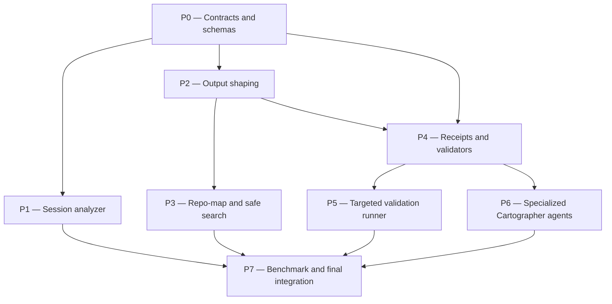

# workflow-optimization Plan

## Source Artifacts

- `.plan/workflow-optimization/proposal.md`
- `.plan/workflow-optimization/map.nodes.jsonl`
- `.plan/workflow-optimization/map.edges.jsonl`
- `.plan/workflow-optimization/facts.nodes.jsonl`
- `.plan/workflow-optimization/facts.edges.jsonl`
- `.plan/workflow-optimization/session-analysis.md`
- `.plan/workflow-optimization/researcher-brief.md`
- `.plan/_index/project-graph.sqlite`
- `.plan/_index/project-graph-manifest.json`

## Retrieval Plan Used

- `cartographer_index ensure` — confirm the shared project index is fresh before planning.
- `cartographer_jsonl validate-topic --topic workflow-optimization` — confirm proposal/map/fact inputs are internally valid.
- `cartographer_index context --scope code` for `workflow optimization clean context receipts repo-map session analyzer output budgets subagents validation` — identify likely source and tool surfaces.
- `cartographer_index context --scope plans` for the same query — retrieve prior retrieval-workflow and sensitive-evidence rationale that constrains this plan.
- `rg` for `query_index`, `context_index`, `runCommand`, `repo-map`, `search`, `receipts`, `validation-receipt`, and subagent role names — verify exact current entry points.
- Targeted reads of `extensions/cartographer-tools.ts`, `skills/index-project/scripts/index_project.py`, `skills/plan/scripts/manage_jsonl.ts`, `skills/plan/scripts/validate_planning_graph.py`, `package.json`, and existing tests — confirm implementation and validation hooks.

## Planning Assumptions

### Confirmed facts

- Pi intentionally favors minimal, extension/package-based workflows over built-in plan mode or always-on subagents [F001].
- Large LLM-facing tool outputs degrade context quality and should be truncated or summarized by tools [F003].
- The dogfooding session produced large inline `cartographer_index query` outputs and other 32KB-63KB payloads [F016].
- Subagent timeouts slowed workflow validation, so deterministic checks should run before semantic review [F017].
- Long implementation turns and repeated validation contributed major wall-clock and context costs [F018].
- Existing skills already advise clean-context behavior, but tool defaults and validators do not yet enforce the most important rules [F020].
- Lexical-first retrieval remains the right default, but it needs deduplication, generic-term handling, and compact repo-map/context projections [F004] [F005] [F006].
- Durable filesystem checkpoints can provide LangGraph-like resumability without adopting a framework dependency [F012].
- Workflow optimization should be measured with small real tasks and metrics rather than manual prompt tweaking alone [F014].

### Decisions made for this plan

- Keep the CLI raw/debug-friendly for backwards compatibility; make the Pi extension tools summarize/cap LLM-facing output by default.
- Use `/tmp/pi-cartographer-runs/` for oversized full-output logs by default; allow an explicitly ignored `.plan/_runs/` replay location only when requested.
- Implement safe lexical search as a `cartographer_index` action first, not a separate tool, to avoid tool sprawl.
- Start with output budgets of 8KB normal and 16KB expanded; tests should make these configurable but enforce default caps.
- Keep `.plan/<topic>` rationale artifacts commit-worthy; do not commit raw full outputs, raw sessions, or generated run logs.
- Treat the existing `cartographer-redactor` as the sensitive-evidence specialist; do not merge it into the workflow-optimization lean five-agent set.

## Phase Dependency Graph

## Phase Summary

| Order | Phase ID | Phase | Depends On | Unlocks | Exit Criteria |
|---:|---|---|---|---|---|
| 0 | P0 | Contracts and schemas | none | P1, P2, P4 | README and skills define the Clean Context Contract, output budgets, receipt/context-pack schemas, run-log policy, and specialized-agent contract. |
| 1 | P1 | Session analyzer | P0 | P7 | A safe session analyzer CLI produces compact Markdown/JSON reports from synthetic Pi session JSONL without leaking raw contents. |
| 2 | P2 | Output shaping | P0 | P3, P4 | Extension tool responses enforce default output caps, save oversized output to files, and summarize `query`/artifact-producing actions. |
| 3 | P3 | Repo-map and safe search | P2 | P7 | `repo-map` and safe fixed-string `search` actions provide compact, verified retrieval handoffs with tests for dedupe and `rg --` safety. |
| 4 | P4 | Receipts and validators | P0, P2 | P5, P6 | Receipt/context-pack JSONL helpers and validators enforce workflow hygiene before implementation phases are marked complete. |
| 5 | P5 | Targeted validation runner | P4 | P7 | Command receipts track changed-file hashes, summarized outputs, targeted/full validation status, and skip decisions safely. |
| 6 | P6 | Specialized Cartographer agents | P4 | P7 | The lean five `cartographer-*` agents are defined with fresh context, budgets, receipts, stop rules, and workflow skill integration. |
| 7 | P7 | Benchmark and final integration | P1, P3, P5, P6 | none | Full project checks, plan/topic validation, benchmark fixtures, and clean-context regression checks pass. |

## Phases

### Phase P0 — Contracts and schemas

- **Status:** complete
- **Depends on:** none
- **Unlocks:** P1, P2, P4
- **Primary references:** `file:README.md`, `file:skills/proposal/SKILL.md`, `file:skills/plan/SKILL.md`, `file:skills/implement/SKILL.md`, `file:skills/index-project/SKILL.md`, [F001], [F003], [F020]

#### Objective

Define the enforceable clean-context and workflow-state contracts before changing tools or agents.

#### Scope

- Document the Clean Context Contract fields: `summary`, `references`, `counts`, `token_estimate`, `truncated`, `full_output_path`, `verification`, and `next_actions`.
- Define default budgets: 8KB normal LLM-facing output and 16KB expanded diagnostics.
- Define `receipts.jsonl`, `context-packs.jsonl`, and validation receipt records, including which fields are commit-worthy and which full logs must stay in `/tmp` or ignored run storage.
- Update README and workflow skills so later phases can reference short contracts instead of repeating long advisory prose.
- Resolve proposal open questions in documentation: extension summarizes by default, CLI remains raw/debug-friendly, search starts as a `cartographer_index` action, and benchmarks use five small dogfooding tasks.

#### Checklist

- [x] **P0.T1** Add a README section for the Clean Context Contract, output budget defaults, and full-output storage policy.
- [x] **P0.T2** Add schema examples for `receipts.jsonl`, `context-packs.jsonl`, validation receipts, and oversized-output receipts.
- [x] **P0.T3** Update `skills/proposal/SKILL.md`, `skills/plan/SKILL.md`, and `skills/implement/SKILL.md` to require compact receipts/context packs at workflow boundaries instead of relying only on transcript memory.
- [x] **P0.T4** Update `skills/index-project/SKILL.md` to describe `context`, future `repo-map`, future `search`, and extension-vs-CLI output behavior.
- [x] **P0.T5** Document that `.plan/_runs/` is optional ignored replay storage and that raw run logs must not be committed.

#### Validation

- [x] **P0.V1** Run `rg -n "Clean Context Contract|receipts.jsonl|context-packs.jsonl|full_output_path|maxOutputChars" README.md skills` and confirm all contract concepts are documented.
- [x] **P0.V2** Run `rg -n "8KB|16KB|/tmp/pi-cartographer-runs|.plan/_runs" README.md skills` and confirm output-budget/run-log policy is explicit.
- [x] **P0.V3** Run `npm run check:scripts` to ensure helper scripts and extension TypeScript still parse after documentation-adjacent changes.

#### Exit Criteria

The project has a single documented contract that later tool, validator, and agent phases can enforce without duplicating long instructions.

#### Risks and Mitigations

- **Risk:** Contract prose becomes another advisory-only layer. **Mitigation:** Keep P0 concise and make P2/P4/P5 validators enforce the high-impact fields.
- **Risk:** Run-log policy accidentally encourages committed raw outputs. **Mitigation:** State that `/tmp` is default and `.plan/_runs/` must be ignored when used.

#### Notes for Execution Agent

Do not implement output shaping or receipt validators in this phase. Make only contract/docs/skill wording changes unless a tiny `.gitignore` addition is needed for documented ignored run storage.

### Phase P1 — Session analyzer

- **Status:** complete
- **Depends on:** P0
- **Unlocks:** P7
- **Primary references:** `file:.plan/workflow-optimization/session-analysis.md`, `file:extensions/cartographer-tools.ts`, `file:skills/plan/scripts/manage_jsonl.ts`, [F015], [F016], [F017], [F018]

#### Objective

Add a deterministic session analyzer so future workflow retrospectives can cite compact reports instead of manually loading large Pi session transcripts into chat.

#### Scope

- Add a stdlib-only Python analyzer, likely `skills/plan/scripts/analyze_session.py`, that reads Pi JSONL sessions line-by-line.
- Compute role/tool counts, assistant usage totals, compaction points, largest tool outputs, longest turns, repeated validation commands, tool errors, subagent timeouts, and cost/duration summaries when fields are present.
- Write Markdown and optional JSON reports to an explicit output path; print only a compact receipt inline.
- Avoid printing raw user/tool payloads by default; include snippets only when redacted, capped, and explicitly requested.
- Add synthetic session fixtures in tests under temporary directories, not the repository's real `.plan/` or private archives.

#### Checklist

- [x] **P1.T1** Implement the analyzer CLI with `--input`, `--out`, `--json-out`, `--max-output-chars`, and `--json` receipt options.
- [x] **P1.T2** Add report sections that reproduce the dogfooding analysis categories without depending on exact private session contents.
- [x] **P1.T3** Add tests for counts, largest outputs, compaction detection, timeout detection, and redaction/no-raw-content behavior using synthetic fixtures.
- [x] **P1.T4** Document how proposal authors should import private sessions through the sensitive-evidence workflow before analyzing them.

#### Validation

- [x] **P1.V1** Run `python -m py_compile skills/plan/scripts/analyze_session.py`.
- [x] **P1.V2** Run `python -m unittest discover tests -p "test_analyze_session.py"`.
- [x] **P1.V3** Run a synthetic analyzer command and verify stdout contains only a compact receipt and report paths, not raw fixture payload text.

#### Exit Criteria

A future proposal can generate a commit-safe session analysis report from a synthetic or authorized private session without expanding raw transcript contents into the parent context.

#### Risks and Mitigations

- **Risk:** Session schemas vary across Pi versions. **Mitigation:** Treat unknown JSONL fields as optional and include a schema-observation section in the report.
- **Risk:** Analyzer leaks raw private text. **Mitigation:** Test for fixture secrets/long payloads not appearing in stdout or report summaries unless deliberately redacted.

#### Notes for Execution Agent

Keep this as a CLI-first phase. Extension wiring can happen in P2 after shared output shaping exists.

### Phase P2 — Output shaping

- **Status:** complete
- **Depends on:** P0
- **Unlocks:** P3, P4
- **Primary references:** `file:extensions/cartographer-tools.ts`, `symbol:extensions/cartographer-tools.ts#runCommand`, `symbol:skills/index-project/scripts/index_project.py#query_index`, `file:package.json`, [F003], [F016], [F020]

#### Objective

Make Pi extension tool responses budget-aware by default while preserving raw CLI behavior for debugging and tests.

#### Scope

- Refactor `extensions/cartographer-tools.ts` so helper command output can be summarized, capped, and saved to a full-output file when needed.
- Add extension parameters such as `maxOutputChars`, `outputPath`, and `raw`/expanded diagnostics where appropriate.
- Keep direct CLI commands raw unless their own command explicitly provides a summary/report mode.
- Summarize `cartographer_index query` and artifact-producing actions inline; prefer `context`/`read` for LLM-facing retrieval; include `next_actions` and references.
- Add unit-testable TypeScript helper functions for truncation/receipt behavior instead of testing only through Pi runtime integration.
- Wire the P1 analyzer into an extension action only after the common cap/receipt behavior exists.

#### Checklist

- [x] **P2.T1** Add a shared output-shaping helper that returns `summary`, `counts`, `truncated`, `full_output_path`, and `next_actions` when stdout/stderr exceeds budget.
- [x] **P2.T2** Extend `cartographer_index` schema for `maxOutputChars`, `outputPath`, and raw/summary behavior without breaking existing actions.
- [x] **P2.T3** Ensure `query` summaries list top paths, counts, warnings, and follow-up `context`/`read` actions instead of full JSON by default.
- [x] **P2.T4** Ensure `slice-jsonl`, `ensure`, `status`, JSONL validation, evidence, and session-analyzer actions return concise path/count receipts.
- [x] **P2.T5** Add TypeScript tests for under-budget output, over-budget output, explicit `outputPath`, and failure-output summarization.

#### Validation

- [x] **P2.V1** Run `node --experimental-strip-types --check extensions/cartographer-tools.ts`.
- [x] **P2.V2** Run `npm run test:ts` and confirm output-shaping tests pass.
- [x] **P2.V3** Run `npm run check:scripts` and confirm Python and TypeScript helpers parse.
- [x] **P2.V4** Manually exercise or unit-test a large synthetic command result and confirm inline content stays within the configured budget and includes a full-output path.

#### Exit Criteria

The extension no longer exposes large raw query/tool output to the parent context by default, and full output remains available through explicit file references.

#### Risks and Mitigations

- **Risk:** Existing users expect raw `cartographer_index query` output from the extension. **Mitigation:** Keep raw CLI unchanged and provide explicit `raw` or `outputPath` escape hatches.
- **Risk:** Summaries hide failures. **Mitigation:** Failure receipts include command, exit code, first failure block, and full-output path.

#### Notes for Execution Agent

Prefer pure helper functions and tests around output shaping. Avoid broad Pi-runtime assumptions that are hard to test locally.

### Phase P3 — Repo-map and safe search

- **Status:** complete
- **Depends on:** P2
- **Unlocks:** P7
- **Primary references:** `file:skills/index-project/scripts/index_project.py`, `symbol:skills/index-project/scripts/index_project.py#query_index`, `symbol:skills/index-project/scripts/index_project.py#context_index`, `file:tests/test_index_project.py`, [F004], [F005], [F006], [F007]

#### Objective

Add compact retrieval products that reduce raw search/query output while preserving lexical-first speed and exact-evidence verification.

#### Scope

- Add `repo-map` to the indexer as a compact, token-budgeted overview of top relevant files, symbols/headings, neighbors, tests, and follow-up reads/searches.
- Add a safe fixed-string `search` action that uses `rg --fixed-strings -- <pattern> <paths...>` by default, supports regex only explicitly, and returns compact match references.
- Expose both actions through `cartographer_index` with output-shaping from P2.
- Rank repo-map entries with current FTS/query scores, graph centrality from imports/references/contains edges, exact identifier/path hits, and test/config relevance.
- Keep entries candidate-marked until direct reads, focused search, or validation proves them.

#### Checklist

- [x] **P3.T1** Implement `repo-map` CLI options: `--topic`, `--scope`, `--max-tokens`, `--limit`, filters, and `--json`.
- [x] **P3.T2** Implement safe `search` CLI/action with fixed-string default, explicit regex mode, path constraints, match limits, and budgeted snippets.
- [x] **P3.T3** Add extension schema/prompt-guideline support for `repo-map` and `search`.
- [x] **P3.T4** Update README and index/proposal/plan/implement skills to prefer `repo-map`/`context`/safe `search` over raw `query` for LLM-facing context.
- [x] **P3.T5** Add tests for repo-map ranking, deduped/merged context, generic-term warnings, and patterns beginning with `-`.

#### Validation

- [x] **P3.V1** Run `python -m unittest discover tests -p "test_index_project.py"`.
- [x] **P3.V2** Run `python skills/index-project/scripts/index_project.py repo-map --root "$PWD" --topic "workflow optimization" --max-tokens 1500 --json` and confirm output is compact and relevant.
- [x] **P3.V3** Run a safe-search fixture for a pattern that begins with `-` and confirm it is treated as a pattern, not an `rg` flag.
- [x] **P3.V4** Run `npm run check:scripts` after extension schema updates.

#### Exit Criteria

Routine local context gathering can start from `repo-map`, `context`, and safe `search` receipts instead of full `query` JSON or broad shell commands.

#### Risks and Mitigations

- **Risk:** Repo-map ranking becomes misleading. **Mitigation:** Include candidate labels, verification hints, and follow-up reads/searches; do not treat repo-map as proof.
- **Risk:** Safe search duplicates index features. **Mitigation:** Keep it narrow: exact lexical verification and footgun prevention, not a full search framework.

#### Notes for Execution Agent

Use temporary mock projects for tests. Do not write generated slices or run logs into the real `.plan/` during tests.

### Phase P4 — Receipts and validators

- **Status:** complete
- **Depends on:** P0, P2
- **Unlocks:** P5, P6
- **Primary references:** `file:skills/plan/scripts/manage_jsonl.ts`, `file:skills/plan/scripts/validate_planning_graph.py`, `file:skills/plan/SKILL.md`, `file:skills/implement/SKILL.md`, [F012], [F018], [F020]

#### Objective

Turn workflow hygiene into durable records and validation rules instead of relying on agents to remember long instructions.

#### Scope

- Add JSONL helper support for `receipts.jsonl` and `context-packs.jsonl` records.
- Validate required receipt fields, lifecycle states, evidence references, output-budget fields, subagent timeout fallback decisions, and phase-completion consistency.
- Extend plan/implement skills so every phase handoff has a context pack and every validation/signoff has a receipt.
- Keep bulky logs outside committed artifacts; receipts may reference full-output paths but should remain compact and safe.
- Add tests for valid/invalid receipts, context packs, timeout fallback metadata, and completed phases without receipts.

#### Checklist

- [x] **P4.T1** Extend `manage_jsonl.ts` with list/upsert/validate support for receipt and context-pack files.
- [x] **P4.T2** Extend `validate_planning_graph.py` and/or JSONL validation to warn when completed phases lack validation receipts or context packs.
- [x] **P4.T3** Add validation for LLM-facing oversized-output receipts that lack `full_output_path`, `truncated`, or budget metadata.
- [x] **P4.T4** Add validation for subagent timeout receipts that lack narrowed retry, serial fallback, or user-escalation decisions.
- [x] **P4.T5** Update `skills/plan/SKILL.md` and `skills/implement/SKILL.md` to create/read receipts and context packs at phase boundaries.

#### Validation

- [x] **P4.V1** Run `node --experimental-strip-types skills/plan/scripts/manage_jsonl.ts validate-topic --root <tmp-project> --topic <fixture> --json` against valid and invalid receipt fixtures.
- [x] **P4.V2** Run `python skills/plan/scripts/validate_planning_graph.py --root <tmp-project> --topic <fixture> --json` against receipt/context-pack fixtures.
- [x] **P4.V3** Run `npm run test:py` and `npm run test:ts`.
- [x] **P4.V4** Run `cartographer_jsonl validate-topic --root "$PWD" --topic workflow-optimization` after adding this plan's receipt-aware artifacts.

#### Exit Criteria

Validators can detect missing or unsafe workflow-state records before an implementation phase is marked complete or semantic review is launched.

#### Risks and Mitigations

- **Risk:** Receipt validation becomes noisy. **Mitigation:** Start with warnings for existing topics and errors only for new records that claim completion/signoff.
- **Risk:** Receipts become verbose. **Mitigation:** Enforce compact summaries and file references; store full command output elsewhere.

#### Notes for Execution Agent

Preserve backwards compatibility for existing `.plan/` topics. New validation should not retroactively fail all historical plans unless they opt into completed receipt status.

### Phase P5 — Targeted validation runner

- **Status:** complete
- **Depends on:** P4
- **Unlocks:** P7
- **Primary references:** `file:skills/implement/SKILL.md`, `file:package.json`, `file:skills/plan/scripts/manage_jsonl.ts`, `file:skills/plan/scripts/validate_planning_graph.py`, [F011], [F018]

#### Objective

Reduce repeated full-suite validation while preserving a final full gate and durable evidence for each phase.

#### Scope

- Add a deterministic validation runner, likely `skills/plan/scripts/validation_runner.py`, that executes declared commands, captures duration/exit code, summarizes output, stores full logs outside committed artifacts, and writes validation receipts.
- Track changed-file hashes before/after validation so identical full checks can be skipped only when safe and explicitly recorded.
- Map changed file groups to targeted checks where practical, while always keeping `npm run check` as the final full gate before phase completion/commit.
- Update implement workflow to run targeted checks first during repair loops and write a validation receipt after every command decision.
- Add tests with synthetic commands that pass, fail, emit large output, and repeat without file changes.

#### Checklist

- [x] **P5.T1** Implement validation runner CLI with `--command`, `--phase-id`, `--validation-id`, `--receipt-file`, `--max-output-chars`, and JSON receipt output.
- [x] **P5.T2** Add changed-file hash-set recording and safe skip logic for unchanged repeated full checks.
- [x] **P5.T3** Add output summarization/failure-block extraction and full-log path handling consistent with P2.
- [x] **P5.T4** Update `skills/implement/SKILL.md` to use targeted validation receipts before repeated full-suite runs and to require one final full gate.
- [x] **P5.T5** Add Python tests for pass/fail/large-output/skip cases using temporary projects and commands.

#### Validation

- [x] **P5.V1** Run `python -m py_compile skills/plan/scripts/validation_runner.py`.
- [x] **P5.V2** Run `python -m unittest discover tests -p "test_validation_runner.py"`.
- [x] **P5.V3** Run `npm run check` and confirm final full-suite validation still passes.
- [x] **P5.V4** Inspect a generated validation receipt from a synthetic repeated command and confirm it records skip reason, hash set, and previous receipt reference without hiding failures.

#### Exit Criteria

Implementation phases can run faster repair loops with targeted validation receipts, while the final full validation remains explicit and auditable.

#### Risks and Mitigations

- **Risk:** Skip logic misses integration failures. **Mitigation:** Allow skips only for repeated unchanged checks and require final `npm run check` before phase signoff.
- **Risk:** Command logs leak sensitive output. **Mitigation:** Apply P2 output caps and store full logs in `/tmp` or explicitly ignored run storage.

#### Notes for Execution Agent

Do not make the runner a new workflow engine. It should be a small command/receipt helper used by existing skills.

### Phase P6 — Specialized Cartographer agents

- **Status:** pending
- **Depends on:** P4
- **Unlocks:** P7
- **Primary references:** `.pi/agents/cartographer-redactor.md`, `file:skills/proposal/SKILL.md`, `file:skills/plan/SKILL.md`, `file:skills/implement/SKILL.md`, [F008], [F009], [F017], [F905]

#### Objective

Define the approved lean Cartographer-specific subagents only after the contracts and receipts they consume are available.

#### Scope

- Add the lean five project agents: `cartographer-archivist`, `cartographer-drafter`, `cartographer-pathfinder`, `cartographer-auditor`, and `cartographer-compass`.
- Configure fresh-context defaults, limited tools, output budgets, file-only large outputs, stop rules, receipt/context-pack requirements, and concise return receipts.
- Update proposal/plan/implement skills to prefer the lean five where appropriate and to treat built-in `researcher`, `planner`, `worker`, `reviewer`, `oracle`, `delegate`, `scout`, and `context-builder` as explicit fallback/substitution paths.
- Do not add Cartographer clones of `scout`, `delegate`, or `context-builder`.
- Keep `cartographer-redactor` as a separate sensitive-evidence agent with a different purpose.

#### Checklist

- [ ] **P6.T1** Create `.pi/agents/cartographer-archivist.md` for source-backed research compression into fact JSONL suggestions and file-only briefs.
- [ ] **P6.T2** Create `.pi/agents/cartographer-drafter.md` for proposal/plan drafting from compact map/fact/context-pack inputs.
- [ ] **P6.T3** Create `.pi/agents/cartographer-pathfinder.md` for single-phase implementation handoffs with receipt and validation obligations.
- [ ] **P6.T4** Create `.pi/agents/cartographer-auditor.md` for semantic review after deterministic validation receipts pass.
- [ ] **P6.T5** Create `.pi/agents/cartographer-compass.md` for rare scope/dependency/repeated-failure decision conflicts.
- [ ] **P6.T6** Update README and workflow skills with default-agent mapping, fallback policy, timeout policy, and no-generic-clone policy.

#### Validation

- [ ] **P6.V1** Run `subagent list` or the equivalent Pi subagent discovery check and confirm the five new agents are discoverable along with `cartographer-redactor`.
- [ ] **P6.V2** Run `rg -n "cartographer-archivist|cartographer-drafter|cartographer-pathfinder|cartographer-auditor|cartographer-compass" .pi/agents README.md skills` and confirm docs/skills reference all five.
- [ ] **P6.V3** Run a contract check, manual or scripted, confirming each agent defaults to fresh context, has a bounded output contract, and forbids broad rediscovery or child subagent orchestration.
- [ ] **P6.V4** Run `rg -n "cartographer-scout|cartographer-delegate|cartographer-context-builder" .pi/agents README.md skills` and confirm there are no proposed default agents with those names.

#### Exit Criteria

Cartographer workflows have narrow role agents that consume context packs and receipts, while deterministic tools remain responsible for mechanical validation and routine retrieval.

#### Risks and Mitigations

- **Risk:** Custom agents recreate generic agent sprawl. **Mitigation:** Implement only the approved lean five and explicitly validate absent scout/delegate/context-builder analogs.
- **Risk:** Agent definitions become stale with tool contracts. **Mitigation:** Reference the Clean Context Contract and receipt schemas rather than duplicating detailed tool procedures.

#### Notes for Execution Agent

If package distribution of project-scoped `.pi/agents` is uncertain, document discovery/creation steps and keep agent files in the repository as project definitions until a package-level subagent mechanism is approved.

### Phase P7 — Benchmark and final integration

- **Status:** pending
- **Depends on:** P1, P3, P5, P6
- **Unlocks:** none
- **Primary references:** `file:tests/test_index_project.py`, `file:tests/test_validate_planning_graph.py`, `file:tests/manage_jsonl.test.ts`, `file:package.json`, [F014], [F015], [F019]

#### Objective

Validate the complete workflow-optimization package with regression tests, small benchmarks, and artifact checks before marking the plan ready for implementation completion.

#### Scope

- Add a small benchmark/regression suite around the five proposal tasks: research-heavy proposal, plan from accepted proposal, doc-only phase, index/query/test phase, and session-review proposal.
- Assert measurable clean-context improvements: output budget enforcement, query summary behavior, safe search, receipt creation, validation skip behavior, and specialized-agent contract availability.
- Run all tests in temporary/mock project roots; never mutate the repository's real private or generated planning artifacts during tests.
- Add final documentation notes that explain how to compare future dogfooding sessions against the baseline metrics in `.plan/workflow-optimization/session-analysis.md`.
- Validate plan/topic artifacts and ensure no raw run logs or private artifacts are staged.

#### Checklist

- [ ] **P7.T1** Add benchmark fixtures and/or a lightweight benchmark script that records wall time, tool-output size, timeout count, full-check reruns, validation pass rate, and receipt coverage.
- [ ] **P7.T2** Add regression tests for P1-P6 behaviors without depending on the private dogfooding session archive.
- [ ] **P7.T3** Update README or workflow docs with benchmark usage and success-per-token measurement guidance.
- [ ] **P7.T4** Run full validation and record concise results in implementation notes/receipts.
- [ ] **P7.T5** Update `.plan/workflow-optimization/plan.md` and `plan.nodes.jsonl` statuses only after actual implementation validation passes.

#### Validation

- [ ] **P7.V1** Run `npm run check`.
- [ ] **P7.V2** Run `cartographer_jsonl validate-topic --root "$PWD" --topic workflow-optimization`.
- [ ] **P7.V3** Run `python skills/plan/scripts/validate_planning_graph.py --root "$PWD" --topic workflow-optimization --json`.
- [ ] **P7.V4** Run benchmark/regression commands and confirm output budget, receipt, timeout-policy, and specialized-agent checks pass.
- [ ] **P7.V5** Run `git status --short` and confirm only intentional source, test, doc, and `.plan/workflow-optimization/` artifacts are staged; ignored run/private artifacts are not staged.

#### Exit Criteria

The workflow-optimization implementation can demonstrate fewer large inline outputs, durable phase state, bounded subagent use, targeted validation receipts, and measurable regression coverage while preserving Pi minimalism.

#### Risks and Mitigations

- **Risk:** Benchmarks become slow or flaky. **Mitigation:** Use synthetic fixtures and small deterministic commands; leave full real dogfooding comparison as manual analysis.
- **Risk:** Final integration expands scope. **Mitigation:** Treat P7 as validation/measurement only; defer new feature ideas to a future proposal.

#### Notes for Execution Agent

Do not use the raw private dogfooding archive in tests. Use synthetic sessions and sanitized committed evidence only.

## Cross-Phase Validation

- [ ] **X.V1** Run `npm run check` after all phases are implemented.
- [ ] **X.V2** Run `cartographer_jsonl validate-topic --root "$PWD" --topic workflow-optimization` after plan artifacts and any receipt/context-pack validators are updated.
- [ ] **X.V3** Run `python skills/plan/scripts/validate_planning_graph.py --root "$PWD" --topic workflow-optimization --json` and confirm no errors.
- [ ] **X.V4** Verify no raw session transcript, oversized command log, `.plan/_runs/` file, or private artifact is staged.
- [ ] **X.V5** Verify default extension output for a large synthetic query/tool result stays within the configured inline budget and includes a full-output path.
- [ ] **X.V6** Verify the final docs and skill prompts still state that embeddings, LangGraph, LlamaIndex, DSPy, MCP, and mandatory subagents remain non-goals unless a future proposal accepts them.

## Open Questions

None for planning. The proposal's open questions are resolved as planning assumptions above; if implementation evidence contradicts one, stop and ask before changing scope.

## Handoff Guidance

- Execute phases in topological order. P1 and P2 may proceed after P0; P3 waits for P2; P4 waits for P0 and P2; P5 and P6 wait for P4; P7 waits for P1, P3, P5, and P6.
- Keep each phase reviewable and commit-worthy. Do not combine P1-P7 into one long implementation turn.
- Use deterministic tools and targeted tests before semantic review. Launch specialized Cartographer agents only after their definitions exist and only with context packs/receipts.
- For tests that create `.plan/`, `.plan/_index/`, `.plan/_retrieval/`, `.plan/_runs/`, or private/evidence artifacts, use temporary/mock project roots under `/tmp`.
- Preserve CLI backwards compatibility unless a task explicitly says otherwise. Extension UX may summarize/cap output by default.
- Stop for user review if implementation requires a new dependency, a new heavyweight workflow runtime, mandatory subagent use, raw-log committed storage, or a new Cartographer agent outside the approved lean set.
