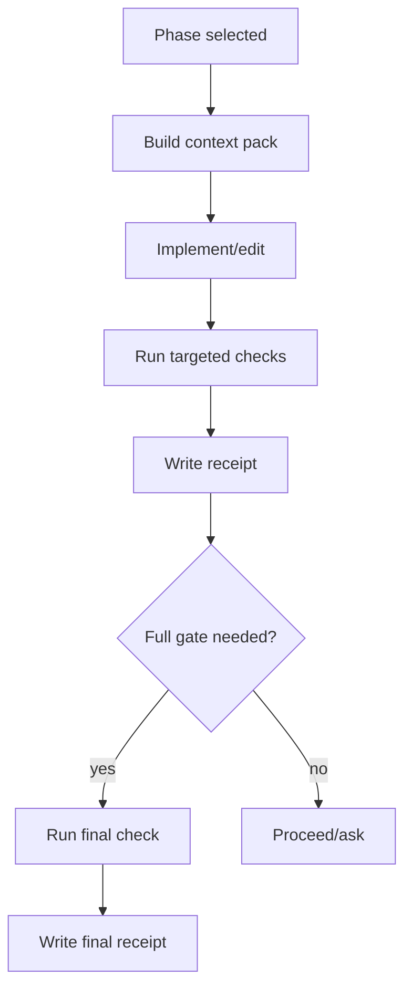
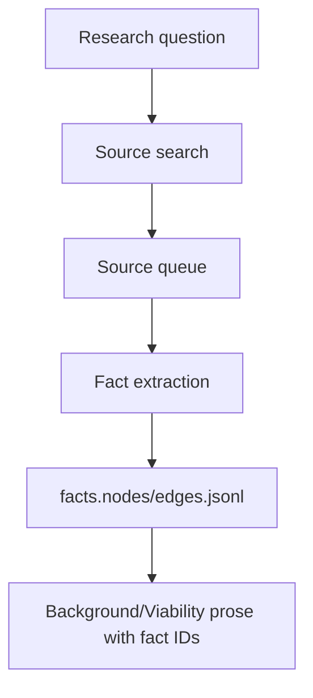

# workflow-optimization Proposal

## Description

Improve Pi Cartographer's proposal, planning, research, and implementation workflows so they produce high-quality plans and executions with substantially less context pollution, lower timeout risk, and better wall-clock performance. The core change is to make Cartographer **artifact-first and budget-aware**: parent turns should carry compact receipts, citations, and file-line handles, while large discovery outputs, validation logs, research notes, and subagent work stay in bounded artifacts.

This proposal is grounded in `.plan/workflow-optimization/session-analysis.md`, derived from an archived local private session log, plus current Cartographer skills/tools, Pi documentation, and prior art from GrepRAG, Aider, SWE-agent, Anthropic, Claude Code, Codex, LangGraph, LlamaIndex, and DSPy. It keeps with Pi's philosophy: minimal core, explicit tools, clear skill workflows, and no heavyweight always-on orchestration. Pi intentionally omits built-in subagents and plan mode in favor of extensions, skills, and packages [F001]. Cartographer should therefore remain a small package of composable workflows, not become a framework inside Pi.

## Problem Statement

The dogfooding session showed that the current workflow can succeed, but it succeeds expensively:

| Finding | Evidence | Consequence |
|---|---|---|
| Context bloat | 607 JSONL entries, 288 assistant messages, 287 tool results, 37.6M cache-read tokens, and compaction at 262,950 tokens [F015] | The session relied too much on transcript continuity instead of durable, compact state. Since Pi compaction is explicitly lossy [F002], critical implementation context can degrade. |
| Large raw outputs | `cartographer_index query` returned 63,793 and 52,484 character payloads; diff/rg/web outputs also reached 32KB-51KB [F016] | Raw diagnostic and retrieval payloads consumed main context and made later reasoning noisier. |
| Subagent timeout risk | Reviewer/worker subagents timed out at 60s, 90s, and 120s [F017] | LLM review became slower and less reliable than deterministic validation for mechanical checks. |
| Long implementation turns | `implement the plan` and `continue implementation` lasted about 775s and 721s, used 55 and 85 tools, and emitted 144KB/192KB of tool text [F018] | A phase could become one very large turn instead of a series of compact checkpoints. |
| Advisory rules were insufficient | Current skills already warn against large reads, broad scouting, and child-output inlining, yet the session still produced large outputs and timeout-prone handoffs [F020] | The important rules need to be enforced in tool defaults, validators, and workflow receipts, not only prose instructions. |
| Avoidable ACI/tool errors | The session included quoting mistakes, exact-edit mismatches, an incorrect unittest module path, and an `rg` pattern interpreted as a flag [F018] | The agent-computer interface should make common workflow operations harder to misuse. |

The package needs to shift from "the model remembers and follows long workflow instructions" to "the workflow exposes small, typed, verifiable state at each step." This is aligned with Pi's clean-context philosophy and with external guidance that context is the most important resource to manage [F010].

## Goals

1. **Reduce parent-context token load.** Default Cartographer tools and skills should return compact summaries, references, and receipts instead of raw multi-10KB outputs [F003], [F016].
2. **Make workflow state durable and resumable.** Each proposal/plan/implementation phase should write compact receipts that preserve decisions, retrieval context, changed files, validation results, and next actions outside the chat transcript [F002], [F012].
3. **Use deterministic checks before LLM review.** JSONL validators, graph validators, command runners, and targeted checks should gate mechanical correctness before any semantic review subagent gets involved [F017], [F008].
4. **Keep subagents optional, bounded, and useful.** Subagents should be used for parallel breadth, independent judgment, focused drafting, scoped implementation, or semantic review—not routine file discovery or validation that a CLI can do [F009], [F020].
5. **Create Cartographer-specific subagents.** After the clean-context, receipt, retrieval, and validation contracts exist, add only the specialized `cartographer-*` agents the workflow needs; do not mirror generic built-in `delegate`, `scout`, or `context-builder` roles.
6. **Improve retrieval quality without heavy machinery.** Continue lexical/symbol-first retrieval, but enforce snippet budgets, deduplication, adjacent-snippet merging, generic-term downranking, and repo-map summaries [F004], [F005], [F006].
7. **Reduce repeated full validations.** Track validation receipts and changed-file hashes so the workflow runs targeted checks during repair loops and a full gate only when useful [F018].
8. **Harden the agent-computer interface.** Add safe wrappers and clearer tool modes for common search, query, validation, and reporting operations, inspired by SWE-agent's finding that ACI design materially affects coding-agent results [F007].
9. **Measure improvements.** Add session/workflow telemetry summaries so future prompt/tool changes can be evaluated by success-per-token, wall time, timeout count, validation pass rate, and context-output volume [F014], [F015].

## Non-Goals

- Do **not** replace Pi's built-in compaction/session model or add a heavy workflow engine.
- Do **not** adopt LangGraph, LlamaIndex, DSPy, MCP, embeddings, or vector search as hard dependencies. Their patterns are useful; their frameworks are out of scope for a minimal Pi package [F001], [F012], [F013], [F014].
- Do **not** make subagents mandatory. Cartographer should still work serially and deterministically when subagents are unavailable or timing out.
- Do **not** create a Cartographer-themed clone for every built-in subagent. In particular, do not add a scout/delegate/context-builder equivalent unless a future measured need proves deterministic tools and the parent workflow are insufficient.
- Do **not** store full raw transcripts or large command logs in committed `.plan/<topic>/` artifacts. Commit durable rationale and concise evidence; keep bulky generated caches/logs ignored or temporary.
- Do **not** change the current philosophy that `.plan/<topic>` rationale artifacts are commit-worthy while `.plan/_index/` is generated and ignored [F019].
- Do **not** create final ADRs in `docs/`; prior workflow decisions explicitly kept that as separate future work [F019].

## Background

### Session review takeaways

The session succeeded in implementing `retrieval-workflow`, but it exposed a mismatch between desired behavior and actual behavior. The skills now say to prefer compact index/context, use `rg` for exact evidence, and avoid dumping large artifacts, but the parent session still received very large query outputs, diffs, and rg results [F016], [F020]. The implementation phase also spent substantial time in one long turn, including repeated checks and subagent waits [F018].

This is exactly the failure mode Pi's philosophy tries to avoid: the conversation becomes the workflow database. Pi can compact, but compaction is lossy [F002]. Cartographer should instead treat `.plan/` JSONL/Markdown and small receipts as the durable workflow database, with the chat as a control surface.

### External research and prior art

- **GrepRAG:** The strongest code-retrieval finding remains lexical-first. GrepRAG reports dramatic latency wins for ripgrep and identifies exact identifiers as crucial for code tasks [F004]. Its limitations—ambiguous high-frequency terms, redundant snippets, and fragmented adjacent context—map directly to Cartographer's context packing needs [F005].
- **Aider repo map:** Aider's repository map is a compact, graph-ranked overview of important files, symbols, and signatures within a token budget [F006]. Cartographer already has a SQLite graph and JSONL maps; the missing piece is making a small repo-map synopsis a first-class context product.
- **SWE-agent ACI:** SWE-agent improved outcomes by designing concise, LM-centric commands: bounded file viewing, linter-gated edits, and search output that lists matching files instead of overwhelming match context [F007]. Cartographer's tools should similarly be designed for model ergonomics, not just CLI completeness.
- **Anthropic agent guidance:** Anthropic recommends the simplest viable workflow first and warns that agentic complexity trades latency/cost for capability [F008]. Their multi-agent research system shows the upside of parallel subagents but also reports about 15x chat-token use and notes coding tasks are often less parallelizable than research [F009].
- **Claude Code and Codex:** Both emphasize context discipline, scoped prompts, project instructions, skills, tests, and clear done criteria [F010], [F011]. Cartographer's skills should convert this into repeatable receipts and validators.
- **Durable workflow frameworks:** LangGraph demonstrates durable checkpoints and human-in-the-loop resume patterns [F012]. Cartographer can borrow the idea through small filesystem checkpoints instead of adding a runtime dependency.
- **LlamaIndex and DSPy:** Query transforms/source nodes and metric-driven program optimization point toward logging retrieval misses, query expansions, and workflow metrics before adding heavier retrieval [F013], [F014].

## Viability

This improvement is highly viable because Cartographer already has most primitives:

| Existing primitive | Current role | Proposed extension |
|---|---|---|
| `cartographer_index context` | Compact snippets with token budget | Make it the default LLM-facing index output; reserve `query` for debugging or file-only JSON. |
| SQLite + FTS5 graph | Candidate retrieval/map source | Add repo-map synopsis and graph-ranked top symbol/file summary. |
| `cartographer_jsonl validate-topic` | Artifact validation | Gate proposal/plan/review before `cartographer-auditor`; add budget/receipt validation. |
| `validate_planning_graph.py` | Plan graph validation | Extend to verify phase receipts and fact/validation coverage. |
| `.plan/<topic>` JSONL/Markdown | Durable rationale | Add small `receipts.jsonl`/`context-packs.jsonl` records for state checkpoints. |
| Skills | Workflow instructions | Shorten prompts and reference tool-enforced contracts instead of repeating long rules. |
| Extension tools | Deterministic interface | Add output shaping, safe search wrappers, and artifact-output modes. |

The main engineering work is not a rewrite. It is enforcing existing principles with defaults, schemas, validators, and receipts. The largest risk is overbuilding. To avoid that, implementation should proceed in small phases and measure improvements against this dogfooding baseline: lower tool-output characters, fewer full-check reruns, fewer timeout-prone subagent calls, and no compaction before a comparable plan implementation completes.

## Design

### 1. Add a workflow/session retrospective tool

Create a small script and extension action that summarizes Pi session JSONL and Cartographer workflow artifacts into a compact report. The dogfooding review should not require manually reading a 2.9MB session file or dumping full transcript chunks.

**Proposed artifacts/actions:**

- `skills/plan/scripts/analyze_session.py` or `skills/index-project/scripts/analyze_session.py`
- Optional extension action: `cartographer_jsonl({ action: "analyze-session", file, topic? })` or a new narrowly named `cartographer_session` tool if keeping JSONL actions clean matters more.
- Output defaults:
  - Markdown report path, e.g. `.plan/<topic>/session-analysis.md`
  - Optional JSON summary, e.g. `.plan/<topic>/session-analysis.json`
  - Inline response capped to a short summary.

**Metrics to compute:**

- message/tool counts by role/tool
- assistant usage totals and context/compaction points
- longest turns by duration/tool count/output chars
- largest tool outputs by chars/tool/action
- repeated validation commands
- tool errors grouped by cause
- subagent timeout/attention events
- modified/read files derived from compaction details when present

**Why this helps:**

This turns sessions into feedback data. DSPy-style prompt/workflow optimization needs metrics, even if we do not adopt DSPy [F014]. Future proposals can cite a compact report instead of rehydrating entire sessions [F015].

### 2. Introduce a Clean Context Contract

Move the most important context rules from prose into a documented and validated contract.

**Contract fields for LLM-facing outputs:**

```json
{
  "summary": "Short human-readable result",
  "references": [{"path":"...","start_line":1,"end_line":20}],
  "counts": {"matches": 42, "omitted": 38},
  "token_estimate": 1200,
  "truncated": true,
  "full_output_path": "/tmp/... or .plan/_runs/...",
  "verification": {"read": {...}, "rg": [...], "validation": [...]},
  "next_actions": ["read file:...", "run targeted check:..."]
}
```

**Rules:**

- Parent-context output should target **≤8KB** for normal tool results and **≤16KB** for explicit expanded diagnostics.
- Anything larger should be saved to a file and represented by a compact receipt.
- `cartographer_index query` via extension should summarize by default. Full JSON should require `outputPath`, `raw: true`, or direct CLI use.
- `cartographer_index context` should be recommended as the default LLM-facing retrieval action.
- `read` of generated JSONL/map/fact artifacts should be replaced by `cartographer_jsonl list --limit`, `cartographer_index read`, or section-specific helpers.

**Why this helps:**

Pi extension docs explicitly warn that large tool outputs cause context overflow, compaction failures, and degraded performance [F003]. The dogfooding session showed exactly that failure mode [F016].

### 3. Add phase receipts and context packs

Add small, append-only records that checkpoint workflow state after each major step.

**Proposed files:**

```text
.plan/<topic>/receipts.jsonl
.plan/<topic>/context-packs.jsonl
```

**Receipt shape:**

```json
{
  "id": "receipt:P2:validation:2026-06-07T05:40:00Z",
  "type": "validation-receipt",
  "phase_id": "P2",
  "status": "passed",
  "changed_files": ["skills/index-project/scripts/index_project.py"],
  "commands": [{"command":"npm run test:py", "result":"passed", "duration_ms": 1516}],
  "summary": "Targeted Python tests passed after updating fixture counts.",
  "full_output_path": "/tmp/pi-cartographer-runs/...",
  "verified": true,
  "verification": {"validation": ["npm run test:py"]}
}
```

**Context pack shape:**

```json
{
  "id": "context:P2:implementation",
  "type": "context-pack",
  "phase_id": "P2",
  "budget_tokens": 3000,
  "references": ["skills/index-project/scripts/index_project.py:949", "tests/test_index_project.py:318"],
  "summary": "Only query/context/miss-log implementation and tests are needed for this phase.",
  "candidate_files": [...],
  "verified_files": [...],
  "open_questions": []
}
```

**Workflow integration:**



**Why this helps:**

LangGraph uses checkpoints for durable execution and resume [F012]. Cartographer can get the same practical benefit with tiny JSONL records and without adding framework complexity. It also gives Pi compaction better durable state to preserve [F002].

### 4. Make repo-map synopsis first-class

Add an action that emits a compact repo-map summary inspired by Aider rather than a list of raw query matches.

**Proposed action:**

```bash
python skills/index-project/scripts/index_project.py repo-map --root "$PWD" --topic "..." --max-tokens 1500 --json
```

or via tool:

```json
cartographer_index({"action":"repo-map","topic":"workflow optimization","maxTokens":1500})
```

**Contents:**

- top relevant files by lexical score + graph centrality + recent mention/change boost
- top symbols/doc sections with signatures/headings only
- dependency/import/reference neighbors
- known validation/test files
- exact follow-up reads/rg commands
- excluded/omitted count

**Why this helps:**

Aider's repo map shows that a small symbol/signature map can give broad codebase awareness inside a tight token budget [F006]. Cartographer already has nodes/edges/chunks; it mainly needs a better LLM-facing projection.

### 5. Reshape retrieval tools around context, not raw JSON

`cartographer_index query` is useful for machines but too large for routine parent context. The dogfooding session's largest outputs were full query payloads [F016].

**Changes:**

1. Extension tool `cartographer_index` should treat actions by audience:
   - `context`: LLM-facing, compact default.
   - `repo-map`: LLM-facing, compact overview.
   - `query`: debugging/machine output, summarized inline unless `raw`/`outputPath` is requested.
   - `read`: targeted file/node context, capped with line ranges.
   - `slice-jsonl`: artifact-producing, inline only the written paths and counts.
2. Add `maxOutputChars` and `outputPath` parameters to extension tools.
3. Save full raw JSON to `/tmp` by default when it exceeds budget; optionally to ignored `.plan/_runs/` for replay.
4. Include `next_actions` in output so the model knows what to do without rereading.
5. Include warnings when `.plan/` rationale scope is being mixed into source-code retrieval.

**Why this helps:**

GrepRAG's improvements are about making retrieved context denser, less redundant, and less fragmented [F005]. Tool output shaping applies the same idea to workflow context.

### 6. Add a safe lexical-search wrapper

Many dogfooding errors were not reasoning failures; they were tool-interface mistakes. A safe, typed search wrapper should remove shell quoting and `rg` flag footguns.

**Proposed action:**

```json
cartographer_index({
  "action": "search",
  "topic": "--scope code",
  "mode": "fixed",
  "paths": ["README.md", "skills"],
  "limit": 50,
  "maxOutputChars": 8000
})
```

If overloading `cartographer_index` feels wrong, add a separate `cartographer_search` extension tool.

**Behavior:**

- Always calls `rg --fixed-strings -- <pattern> <paths...>` for fixed mode.
- Supports regex mode explicitly.
- Returns file list + first few references by default, not every matching line.
- Offers `context=true` to include small snippets.
- Saves full output only when requested or oversized.

**Why this helps:**

SWE-agent found that concise search output was less confusing than showing too much match context [F007]. GrepRAG shows lexical search is powerful when query and ranking are disciplined [F004].

### 7. Replace routine LLM review with deterministic validation plus targeted auditor prompts

The workflow should separate mechanical validation from judgment.

**Before:**

- Launch a generic reviewer to inspect raw proposal/plan artifacts.
- Wait 60s-90s.
- Reviewer may time out and return nothing.

**After:**

1. Parent runs deterministic validators first:
   - JSONL syntax/resolution
   - fact citations/support edges
   - plan dependency graph
   - lifecycle/verification metadata
   - changed-file/test coverage checks
2. Parent writes validation receipt.
3. `cartographer-auditor` gets only:
   - acceptance criteria
   - diff summary or proposal summary
   - validation receipt
   - a compact context pack
   - specific unresolved questions
4. If `cartographer-auditor` times out once, stop retrying and perform a serial skeptical review or ask user if semantic risk remains.

**Why this helps:**

Dogfooding reviewer/worker subagents timed out repeatedly [F017]. Anthropic recommends simple workflows where possible and evaluator loops where criteria are clear [F008]. Mechanical JSONL validation is not a good use of an LLM.

### 8. Add specialized Cartographer subagents after the core contracts

Subagents should be powerful but scarce. Cartographer should stop depending on generic built-in role names for its core workflows and define a small, themed, unambiguous `cartographer-*` set whose behavior is driven by the Clean Context Contract, context packs, validation receipts, and Cartographer tools.

These agents should be added **after** the high-impact tool and artifact work. They are consumers of the improved contracts, not substitutes for them. A custom agent cannot fix raw 50KB tool outputs, missing receipts, or repeated full checks unless the tools and validators expose better behavior first [F016], [F018], [F020].

**Approved lean agent set:**

| Agent | Replaces / avoids | Workflow need | Required inputs | Output contract |
|---|---|---|---|---|
| `cartographer-archivist` | Replaces generic `researcher` for Cartographer work | External/current documentation research and fact extraction | Existing `facts.nodes.jsonl`/`facts.edges.jsonl`, topic question, source gaps, Context7/web results | File-only research brief plus proposed `source`, `fact`, and `supported_by` JSONL records; concise inline receipt |
| `cartographer-drafter` | Replaces generic `planner`/scope delegate for proposal and plan synthesis | Turn compact scope, map, facts, and context packs into proposal sections or plan artifacts | Proposal/request summary, validated map/fact JSONL, repo-map/context pack, validation report | Drafted proposal/plan artifact paths, design/phase summary, dependencies, unresolved questions; no broad rediscovery |
| `cartographer-pathfinder` | Replaces generic `worker` | Single-writer implementation of an approved phase | Phase contract, context pack, checklist IDs, validation receipt requirements, stop rules | Changed files, commands run, validation summary, residual risks, phase receipt updates |
| `cartographer-auditor` | Replaces generic `reviewer` for final checks | Read-only semantic review after deterministic validation | Diff/proposal/plan summary, validation receipts, context pack, acceptance criteria | Pass/fail with required corrections and file/fact references; no mechanical JSONL revalidation unless receipt is missing |
| `cartographer-compass` | Replaces generic `oracle` only for rare decision conflicts | Scope, dependency, phase-order, or repeated-failure decision assessment | Plan graph, proposal goals/non-goals, receipts, blocker summary, compact evidence | Options, recommendation, stop rule, and user-decision prompt if needed; no code edits or routine review |

**Explicitly not included:**

- No `cartographer-scout`/`cartographer-surveyor` for the initial design. Deterministic `repo-map`, `context`, `read`, safe lexical search, and parent-authored retrieval plans should cover routine local context gathering.
- No `cartographer-delegate`. The parent agent should own scope framing and user alignment.
- No `cartographer-context-builder`. Context packs should be a tool/artifact product, not another broad autonomous exploration role.

**Policy rules:**

- All Cartographer agents default to fresh context with explicit artifact paths, not forked parent transcript history, unless a specific future task proves inherited chat context is necessary.
- Every child task must have an output budget, stop rule, and expected artifact/receipt shape.
- Every large child uses `outputMode: file-only`.
- Parent should not launch `cartographer-auditor` until deterministic validation reports pass or are explicitly recorded as unavailable.
- Parent should not retry a timed-out `cartographer-pathfinder`, `cartographer-auditor`, or `cartographer-archivist` without narrowing the prompt and recording the fallback decision.
- Status/async IDs should be surfaced in receipts so ambiguous checks like `status worker` are replaced by concrete run IDs and agent names.
- Child results should be summarized into receipts, not copied into subsequent prompts.
- Built-in `delegate`, `scout`, `context-builder`, `researcher`, `planner`, `worker`, `reviewer`, and `oracle` remain emergency/user-approved substitutes, not default Cartographer workflow dependencies.

**Workflow mapping:**

| Workflow stage | Default deterministic owner | Optional Cartographer agent |
|---|---|---|
| Scope framing | Parent + proposal skill | None |
| Index/map generation | `cartographer_index` + `cartographer_jsonl` | None |
| Missing external facts | Parent identifies gaps | `cartographer-archivist` |
| Proposal/design drafting | Parent orchestrates inputs | `cartographer-drafter` |
| Plan graph creation | Parent validates artifacts | `cartographer-drafter` |
| Phase implementation | Parent prepares context/acceptance | `cartographer-pathfinder` |
| Mechanical validation | Validators/targeted commands | None |
| Semantic review | Parent dispatches after validation | `cartographer-auditor` |
| Scope/dependency conflict | Parent/user decision authority | `cartographer-compass` |

**Why this helps:**

Anthropic's multi-agent research system works because subagents compress breadth, but it burns tokens fast and is less naturally suited to many coding tasks [F009]. Cartographer should use subagents for separation of concerns, not as default control flow. Unique `cartographer-*` names also prevent confusing built-in agent behavior with Cartographer-specific contracts.

### 9. Add validation receipts and changed-file-aware checks

The session ran `npm run check` variants many times. That is safe but slow and context-heavy [F018].

**Design:**

- Track `last_validation` per phase:
  - command
  - normalized stdout summary
  - duration
  - exit code
  - changed-file hash set
  - validation item IDs satisfied
- During repair loops:
  - run targeted checks tied to changed files first
  - run full `npm run check` once before phase completion or commit
  - skip identical full checks when no relevant files changed and a fresh receipt exists
- Summarize command output:
  - pass: command + duration + test counts
  - fail: first failure block + command + pointer to full log

**Why this helps:**

Claude Code and Codex both emphasize tests/verification, but not blindly repeated full-suite output [F010], [F011]. The goal is stronger validation with less transcript noise.

### 10. Improve research workflow as a source-backed compression pipeline

Research should produce fact records, not long summaries in chat.

**Research flow:**



**Rules:**

- `cartographer-archivist` returns a file-only brief by default.
- Each source-backed claim must become a `fact` node + `source` node + `supported_by` edge before proposal prose cites it.
- Use Context7 for library/framework docs and web search for broader prior art.
- Limit repeated local-doc summaries by seeding/reusing existing local Pi facts.
- Add a "citation pass" only when many external claims are present.

**Why this helps:**

Anthropic's research system uses subagents as compressors and a separate citation pass [F009]. Cartographer can apply a minimal version through `facts.nodes.jsonl`/`facts.edges.jsonl` without copying research transcripts into the parent.

### 11. Add workflow-quality validators

Extend existing validators so bad workflow hygiene fails early.

**New warnings/errors:**

- proposal/plan cites a fact ID not present or unsupported (already partially covered)
- map/fact/plan JSONL has candidate-only high-impact references without verification
- phase has no context pack or no validation receipt before marking complete
- LLM-facing tool result exceeds output budget without `full_output_path`
- `cartographer-auditor` launched before deterministic validation receipt exists
- repeated full validation command with unchanged file hash set
- phase receipt records a subagent timeout without a narrowed retry/serial fallback decision

**Why this helps:**

Current skill guidance is advisory and was not enough [F020]. Validators turn "please be clean" into a measurable workflow contract.

### 12. Establish a small benchmark and feedback loop

Use this dogfooding session as baseline data and add a tiny benchmark suite of real tasks.

**Metrics:**

- wall time per proposal/plan/phase
- assistant turns per phase
- tool calls per phase
- total LLM-facing tool output chars
- context at compaction or final turn
- subagent timeout count
- full-check rerun count
- validation pass rate
- `cartographer-auditor` required-fix rate
- final user corrections per task

**Benchmark tasks:**

1. Create a proposal from a web-research-heavy request.
2. Create a plan from an accepted proposal.
3. Implement a doc-only phase.
4. Implement an index/query/test phase.
5. Review a session and generate a proposal.

**Why this helps:**

DSPy-style optimization begins with metrics and small training/evaluation sets [F014]. Cartographer can stay framework-free while still learning from real usage.

## Proposed Implementation Phases

This is not a full plan yet, but a likely implementation sequence is:

1. **P0 — Contracts and docs:** Define Clean Context Contract, receipt schemas, context-pack schema, validation receipt schema, and Cartographer subagent contract in README and skills.
2. **P1 — Session analyzer:** Add session analysis CLI/tool and tests using temp project/session files.
3. **P2 — Tool output shaping:** Add `maxOutputChars`, `outputPath`, summarized `query`, compact `slice-jsonl` responses, and safe full-output persistence.
4. **P3 — Repo-map/context synopsis:** Add `repo-map` action and make `context`/`repo-map` the default handoff for LLM-facing retrieval.
5. **P4 — Validation receipts:** Add receipt JSONL helpers and validators; update implement workflow to write/read receipts.
6. **P5 — Targeted validation runner:** Track changed-file hashes and command receipts; run full checks once per phase unless changes justify rerun.
7. **P6 — Specialized Cartographer subagents:** Author only `cartographer-archivist`, `cartographer-drafter`, `cartographer-pathfinder`, `cartographer-auditor`, and `cartographer-compass`; update proposal/plan/implement skills to prefer them and remove default reliance on built-in `delegate`, `scout`, `context-builder`, `researcher`, `planner`, `worker`, `reviewer`, and `oracle`.
8. **P7 — Benchmark and regression tests:** Add session/workflow benchmark fixtures and tests that assert output-size, receipt, custom-agent, and timeout-policy behavior.

## Risks and Mitigations

| Risk | Mitigation |
|---|---|
| Overbuilding into a framework | Keep each feature a small CLI/tool/schema addition; no new runtime dependency. |
| Receipts become noisy planning artifacts | Keep receipts concise and schema-validated; store bulky logs outside committed topic rationale by default. |
| Summaries omit important evidence | Always include file/line/source references and `full_output_path` for expanded inspection. |
| Subagent limits reduce quality | Use specialized agents where research breadth, drafting, implementation, semantic review, or decision conflict assessment is valuable; avoid them only for deterministic checks. |
| Custom agents recreate generic agent sprawl | Keep the approved lean five-agent set, omit scout/delegate/context-builder analogs, and require measured evidence before adding more. |
| Targeted validation misses integration failures | Require final full validation before phase completion/commit. |
| Repo-map ranking becomes misleading | Treat repo-map entries as candidates and verify high-impact edits with reads/rg/validation. |

## Acceptance Criteria for a Future Plan

A future implementation plan should be accepted only if it can show:

- LLM-facing tool output budgets are enforced by tests.
- Session analyzer can reproduce the major dogfooding findings without reading the whole transcript into chat.
- `cartographer_index query` no longer emits 50KB+ inline by default.
- A phase can be resumed from receipts/context packs after compaction.
- `cartographer-archivist`, `cartographer-drafter`, `cartographer-pathfinder`, `cartographer-auditor`, and `cartographer-compass` are defined with unique names, fresh-context defaults, output budgets, artifact contracts, and Cartographer tool access.
- Proposal/plan/implement skills no longer default to built-in `delegate`, `scout`, `context-builder`, `researcher`, `planner`, `worker`, `reviewer`, or `oracle`; any built-in substitution requires explicit user approval or documented fallback.
- Specialized-agent timeout handling has a deterministic fallback path.
- Validation receipts prevent unnecessary repeated full checks while preserving a final full gate.
- All tests create `.plan/`, `_index`, `_retrieval`, and session fixtures under temp/mock project roots, respecting `AGENTS.md`.

## Open Questions

1. Should full raw outputs live in `/tmp` only, or in an ignored `.plan/_runs/` directory for easier postmortems?
2. Should `cartographer_index query` keep its current inline JSON behavior for backwards compatibility and add a new `query-summary`, or should the extension summarize while the CLI remains raw?
3. Should safe lexical search be an action on `cartographer_index` or a separate `cartographer_search` tool?
4. What default output budgets should be enforced: 8KB normal / 16KB expanded, or lower?
5. Which five dogfooding tasks should become the first benchmark fixtures?
