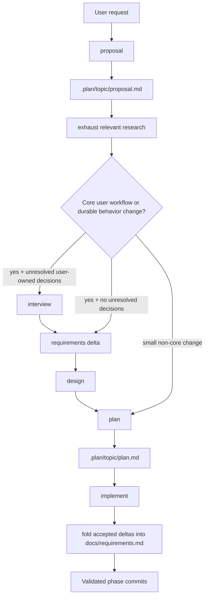
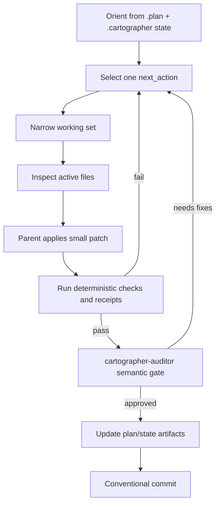
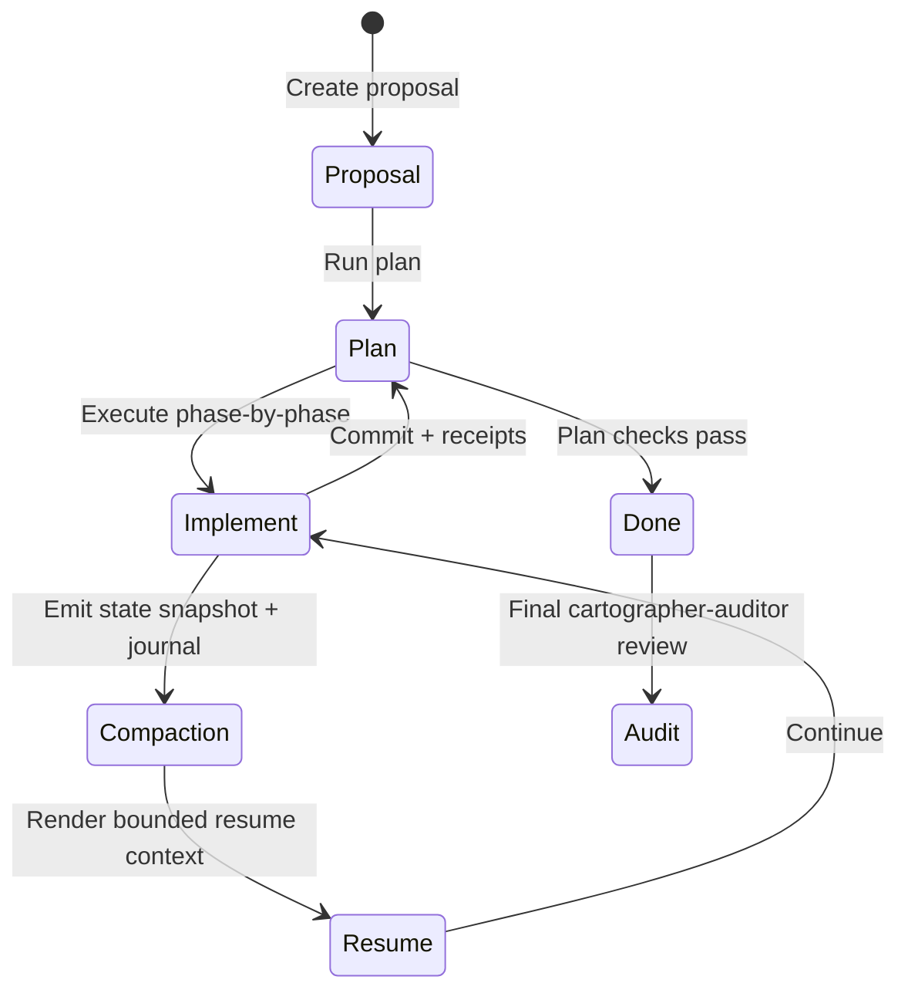

# Pi Cartographer

_Mapping Your Project and Plotting Your Feature's Path Forward_


Pi Cartographer is a graph-grounded planning package for [pi](https://pi.dev). It helps you turn a rough request into:

1. A proposal grounded in the understanding of your codebase and context aware research
2. An ordered implementation plan
3. Implementation with phase-by-phase code changes that must pass validation

It bundles pi skills plus a small extension that registers deterministic helper tools. Durable planning notes live under `.plan/` so decisions can be reviewed, resumed, and committed with the code they explain.

_pi-cartographer is currently in active development and may not be production ready yet_

## Table of contents

- [Install](#install)
- [Requirements](#requirements)
- [What this package includes](#what-this-package-includes)
- [Quick start](#quick-start)
  - [Create a proposal](#create-a-proposal)
  - [Create a plan](#create-a-plan)
  - [Implement a plan](#implement-a-plan)
- [Planning dashboard](#planning-dashboard)
- [What gets written](#what-gets-written)
  - [JSONL graph artifacts](#jsonl-graph-artifacts)
- [Retrieval scopes](#retrieval-scopes)
- [Artifact lifecycle](#artifact-lifecycle)
- [Helper CLI reference](#helper-cli-reference)
- [Limitations and safety notes](#limitations-and-safety-notes)
- [Development](#development)

## Install

```bash
pi install npm:pi-cartographer
```

Other install options:

```bash
pi install git:github.com/GenKerensky/pi-cartographer
pi install /path/to/pi-cartographer
pi -e /path/to/pi-cartographer   # one-off local use
```

## Requirements

- **pi** with package/skill/extension support.
- **Python 3.11+** for the bundled indexer and validation scripts. Runtime Python helpers use only the standard library.
- **Modern Node.js** for the TypeScript JSONL helper and extension wrapper. Node 22+ is recommended because the helper CLI examples use `node --experimental-strip-types`.
- **[pi-subagents](https://pi.dev/packages/pi-subagents?name=sub+agents)** is recommended for the full delegated workflow. Without it, Cartographer skills can ask to continue serially with the current agent, but fallback is not automatic and requires user approval.

## What this package includes

| Resource                   | Type               | What it does                                                                                                                                                                                       |
| -------------------------- | ------------------ | -------------------------------------------------------------------------------------------------------------------------------------------------------------------------------------------------- |
| `index-project`            | Skill + Python CLI | Builds and queries a shared SQLite + FTS5 project graph under `.plan/_index/`.                                                                                                                     |
| `proposal`                 | Skill              | Creates `.plan/<topic>/proposal.md` plus project map and research fact JSONL artifacts.                                                                                                            |
| `interview`                | Skill              | Runs post-research, one-question-at-a-time clarification for unresolved user-owned decisions before requirements/design acceptance.                                                                 |
| `requirements`             | Skill              | Creates scope-gated topic-local requirements deltas and requires validation/auditor/transition gates before design.                                                                                |
| `design`                   | Skill              | Creates graph-backed design decisions and alternatives after requirements and requires validation/auditor/transition gates before planning.                                                        |
| `plan`                     | Skill              | Converts proposal/map/fact/requirements/design context into ordered phases, validations, and plan graph JSONL artifacts.                                                                           |
| `implement`                | Skill              | Executes an existing plan phase-by-phase with a parent single-writer loop, `.cartographer` state, deterministic receipts, `cartographer-auditor` approval, plan updates, and conventional commits. |
| `dashboard`                | Skill              | Starts, opens, checks, or stops the local read-only planning dashboard through the packaged `cartographer-dashboard` CLI.                                                                          |
| `cartographer_index`       | Extension tool     | Wraps index actions such as `ensure`, `query`, `context`, `read`, `slice-jsonl`, `status`, and `log-miss`.                                                                                         |
| `cartographer_jsonl`       | Extension tool     | Wraps JSONL actions such as `validate-topic`, `validate-file`, `validate-misses`, `list-misses`, `list`, `upsert`, and `seed-pi-facts`.                                                            |
| `cartographer_evidence`    | Extension tool     | Imports/list private proposal artifacts under `.plan/_private/<topic>/` without exposing raw contents and writes commit-safe evidence manifests.                                                   |
| `cartographer_session`     | Extension tool     | Analyzes authorized Pi session JSONL into compact Markdown/JSON reports without exposing raw transcript contents.                                                                                  |
| `cartographer_artifacts`   | Extension tool     | Provides read-only compact summaries for topic validation, fact citations, receipts, context packs, evidence manifests, and phase acceptance handoffs.                                             |
| `cartographer_validation`  | Extension tool     | Parent-owned wrapper for validation commands and compact receipt output; it does not replace semantic auditor review.                                                                              |
| `cartographer_proposal`    | Extension tool     | Initializes, ADR-syncs, and finalizes proposal artifacts through deterministic lifecycle gates.                                                                                                    |
| `cartographer_fact`        | Extension tool     | Adds source-backed proposal facts and support edges without manual JSONL edits.                                                                                                                    |
| `cartographer_plan`        | Extension tool     | Generates/finalizes plan graph artifacts through deterministic validation and handoff gates.                                                                                                       |
| `cartographer_plan_status` | Extension tool     | Synchronizes plan phase/task/validation status and checkoff state.                                                                                                                                 |
| `cartographer_implement`   | Extension tool     | Starts, steps, records, compacts, and finalizes the implementation loop with automatic phase advancement by default.                                                                               |
| `cartographer_handoff`     | Extension tool     | Captures auditor/compass/role outputs, PASS/FAIL schema, fallback receipts, and dependency recommendations.                                                                                        |
| `cartographer_state`       | Extension tool     | Manages minimal `.cartographer/<topic>/state.json`, curated `journal.jsonl`, ignored `current.json`, compaction, and bounded resume context.                                                       |
| `cartographer_adr`         | Extension tool     | Evaluates, drafts, creates, imports, validates, searches, and relates Architecture Decision Records.                                                                                               |
| `cartographer-dashboard`   | CLI                | Runs the local loopback-only dashboard server and serves the React/Tailwind/shadcn planning UI for proposal, plan, graph, receipt, evidence, health, and document review.                          |

Skill commands are available as `/skill:<name>` when pi skill commands are enabled.

## Cartographer subagents

Project-scoped Cartographer agents live under `.pi/agents/` and are intentionally narrow. They consume context packs, receipts, map/fact artifacts, and deterministic validation results; they are not a replacement for tool validation or parent orchestration.

| Agent                     | Purpose                                                                               |
| ------------------------- | ------------------------------------------------------------------------------------- |
| `cartographer-archivist`  | Compresses missing research into source-backed fact/source/support JSONL suggestions. |
| `cartographer-drafter`    | Drafts proposal or plan artifacts from compact map/fact/context inputs.               |
| `cartographer-pathfinder` | Deprecated legacy writer; not used by the default implementation workflow.            |
| `cartographer-auditor`    | Performs semantic review after deterministic validation receipts pass.                |
| `cartographer-compass`    | Advises on scope, dependency, phase-order, or repeated-failure decisions.             |
| `cartographer-redactor`   | Sanitizes authorized private artifacts into commit-safe evidence analyses.            |

Do not add default Cartographer clones of generic `scout`, `delegate`, or `context-builder` roles without a new measured proposal. Built-in subagents remain explicit fallbacks when a Cartographer-specific agent is unavailable or the user approves substitution.

Workflow contracts for delegated runs:

- Run deterministic validation receipts first, then use `cartographer-auditor` as the default proposal, plan, phase, and final semantic gate. Auditor fallback to built-in reviewer/oracle or serial review must be user-approved and recorded as an explicit fallback receipt.
- The parent/current agent is the default implementation writer. Use `.cartographer/<topic>/state.json`, curated `journal.jsonl`, milestone compaction, and deterministic receipts to survive context churn.
- `cartographer-pathfinder` is a deprecated legacy writer path. Use it only when the user explicitly opts into a scoped legacy handoff, and record a fallback/legacy receipt with exact checklist IDs, validation IDs, scope boundaries, changed-files evidence, commands/receipt requirements, residual risks, and stop rules.
- Record timeout/fallback receipts for child timeouts, unavailable tools, fallback substitutions, and repeated unusable handoffs. After repeated child failures or unclear parent takeover, ask `cartographer-compass` for an escalation recommendation before substantial parent takeover.
- Apply a least-privilege child tool policy. Children receive only role-specific artifact paths and tool actions; the parent keeps canonical JSONL, private input, ADR, receipt, checkoff, commit, and orchestration authority unless a structured acceptance contract scopes a specific writer task.

Final role/tool matrix:

| Role                                              | Default tools/context                                                                                                                 | Parent-owned boundaries                                             | Example handoff evidence                                                   |
| ------------------------------------------------- | ------------------------------------------------------------------------------------------------------------------------------------- | ------------------------------------------------------------------- | -------------------------------------------------------------------------- |
| `cartographer-archivist` / `cartographer-drafter` | `cartographer_artifacts` fact/context summaries, `cartographer_index` query/read, sanitized evidence docs                             | Canonical JSONL upserts and receipt writes unless explicitly scoped | Fact citation summary, context-pack path, draft JSONL suggestions          |
| Parent/current writer                             | `.plan` artifacts, `cartographer_state`, focused `cartographer_index` reads/searches, validation receipts                             | Must keep `.plan` authoritative; no raw private inputs              | Phase diff, state/resume validation, commands, receipt IDs, checked tasks  |
| `cartographer-pathfinder` (legacy opt-in only)    | Focused context pack, helper summary paths, `cartographer_index` reads/searches, scoped edit tools                                    | Commits, staging, final checkoff, ADR writes, unrelated phase files | Explicit legacy opt-in receipt plus structured acceptance report           |
| `cartographer-auditor`                            | Deterministic validation receipts, `cartographer_artifacts` receipt/context/validation summaries, targeted `cartographer_index` reads | Read-only: no plan edits, no checkoff, no receipt/ADR mutation      | PASS/FAIL receipt at a deterministic path with required corrections if any |
| `cartographer-compass`                            | Receipt/context summaries, proposal/plan references, validation failure summaries                                                     | Decision advice only; user/parent chooses scope/order changes       | Escalation recommendation before parent takeover                           |
| `cartographer-redactor`                           | Authorized raw private paths only when explicitly scoped; `cartographer_session` for authorized sessions                              | No proposal/plan decisions; sanitized outputs only                  | `.plan/<topic>/evidence/*-analysis.md` and safe manifest entries           |

Examples:

```text
Auditor gate: after `npm run check` and topic/graph validation receipts pass, ask `cartographer-auditor` to review the current diff using `.plan/<topic>/context-packs.jsonl:<context-id>`, `.plan/<topic>/receipts.jsonl:<validation-ids>`, and a deterministic output receipt such as `.plan/<topic>/auditor-final-receipt.md`. The auditor returns PASS/FAIL and remains read-only.
```

```text
Stateful implementation loop: initialize/validate `.cartographer/<topic>/state.json`, keep `journal.jsonl` scarce and evidence-linked, use `compact-generate` at milestones, render bounded `state-resume` context after compaction, then run deterministic receipts before `cartographer-auditor` PASS.
```

```text
Legacy pathfinder acceptance (opt-in only): include phase ID, exact checklist IDs, validation IDs, allowed files, context-pack path, helper summary paths, stop rules, and evidence fields (`changed-files`, `commands-run`, `validation-output`, `residual-risks`, `diff-summary`, `no-staged-files`). The pathfinder edits only the scoped phase and does not commit or stage.
```

```bash
# Read-only artifact helper summaries for child handoffs; these summarize, not mutate.
cartographer_artifacts({"action":"show-record","root":"$PWD","topic":"<topic>","artifact":"context-packs","id":"<context-id>"})
cartographer_artifacts({"action":"receipt-summary","root":"$PWD","topic":"<topic>","limit":10})
cartographer_artifacts({"action":"validate-topic-summary","root":"$PWD","topic":"<topic>"})
```

## Quick start

Start pi from the repository you want to plan against, then run the workflow as needed:



For scoped changes, a Cartographer `topic` is the local change folder: proposal → research → interview → requirements delta → design → plan → implement → fold accepted requirements into `docs/requirements.md`. The interview step is used after relevant project/research context is exhausted and unresolved user-owned decisions remain; requirements authoring may re-enter interview one question at a time when new ambiguity appears. Small changes that do not impact a core user workflow do not need interview or requirements/design graph artifacts by default; use the same kind of scope/risk judgment as ADRs.

### Create a proposal

```text
/skill:proposal Add offline search to the docs site
```

Creates `.plan/<topic>/proposal.md` plus supporting map/fact JSONL files.

Use this when the work needs scope, tradeoff, or rationale before coding. The proposal keeps today's non-design sections — Description, Problem Statement, Goals, Non-Goals, Background, Viability, risks, and ADR metadata — while detailed design moves to `design.md` for scoped changes.

### Create a plan

```text
/skill:plan offline search
```

Creates `.plan/<topic>/plan.md` with ordered phases, dependencies, checklists, validation steps, and machine-readable plan graph files.

Use this after a proposal exists, or when the request is already clear enough to plan directly. For changes that affect a core user workflow or durable product behavior, requirements and design artifacts should sit between proposal and plan so implementation can trace tasks back to behavioral requirements.

### Implement a plan

```text
/skill:implement offline search
```

Runs an existing plan one phase at a time:



Implementation uses a parent single-writer loop by default. The agent reads `.cartographer/<topic>/state.json` and curated journal entries directly, mutates them through `cartographer_implement` and `cartographer_state`, captures semantic gates with `cartographer_handoff auditor`, and asks `cartographer-auditor` to review only after deterministic validation receipts pass. Automatic phase advancement is the default after validation, captured auditor PASS, status/checkoff updates, and commit complete the current phase. human approval commands use `cartographer_transition` for proposal, plan, explicitly human-gated phase, and final implementation gates; do not cross those gates as prose-only steps. If a phase hits an unclear product, design, dependency, repeated timeout/fallback, or tooling decision, Cartographer records the receipt, uses `cartographer-compass` when escalation is needed, and stops to ask for direction.

## Planning dashboard

The dashboard is a local, loopback-only, read-only browser view over Cartographer artifacts. Normal use is a single TanStack Start full-stack app launched by `cartographer-dashboard`; it reads proposal/plan/fact/map/receipt/context/evidence/ADR/index files and never writes `.plan/`, ADRs, index/cache files, or source files.

Start it from the project you want to inspect:

```bash
cartographer-dashboard start --root "$PWD" --host 127.0.0.1 --port 0 --json
```

Start with a topic deep link:

```bash
cartographer-dashboard start --root "$PWD" --topic planning-dashboard --host 127.0.0.1 --port 0 --json
```

Check status or stop the server:

```bash
cartographer-dashboard status --root "$PWD" --json
cartographer-dashboard stop --root "$PWD" --json
```

You can also ask pi to use the packaged skill:

```text
/skill:dashboard start planning-dashboard
/skill:dashboard status
/skill:dashboard stop
```

Dashboard behavior and safety boundaries:

- The server defaults to loopback and rejects non-loopback hosts such as `0.0.0.0`, `::`, and LAN/public addresses.
- Runtime metadata is stored under `XDG_RUNTIME_DIR` or an OS temp directory, keyed by repository root hash, not under `.plan/`.
- Live reload watches safe `.plan/**` files, excludes `.plan/_private/**`, and summarizes `.plan/_index/**` changes as stale-index events.
- The UI uses TanStack Start routes, TanStack DB/TanStack Query read-only reactive projections, React, Tailwind CSS, shadcn/ui components, Shiki document/code highlighting, and React Flow graph visualization.
- The dashboard is a single TanStack Start app under `dashboard/`; UI, routes, server helpers, shared models, and CLI runtime helpers live under `dashboard/src/**`.
- `cartographer-dashboard` starts the built `dashboard/.output/server/index.mjs` full-stack app.
- Source-checkout dashboard scripts mirror TanStack Start defaults from `dashboard`: `npm run dashboard:dev` runs `vite dev`, `npm run dashboard:build` runs `vite build`, and `npm run dashboard:start` runs `node .output/server/index.mjs`.
- Private raw evidence should be imported through Cartographer private-artifact workflows and reviewed via sanitized evidence documents, not read directly in the dashboard or skill.

## What gets written

Cartographer writes planning artifacts under `.plan/` in your project. Depending on which skills have run, a topic can contain:

- `proposal.md`: human-readable context and assumptions, preserving Description, Problem Statement, Goals, Non-Goals, Background, Viability, risks, and ADR metadata.
- `interview.md`, `interview.nodes.jsonl`, and `interview.edges.jsonl`: optional post-research clarification records for user-owned decisions, recommendations, answers, deferrals, blockers, and accepted decisions that feed requirements/design.
- `requirements.md`, `requirements.nodes.jsonl`, and `requirements.edges.jsonl`: scope-gated topic/change requirements deltas for core user workflow or durable behavior changes.
- `design.md`, `design.nodes.jsonl`, and `design.edges.jsonl`: scope-gated design narrative plus Decision + Alternative design graph.
- `map.nodes.jsonl` and `map.edges.jsonl`: durable map graph.
- `facts.nodes.jsonl` and `facts.edges.jsonl`: extracted facts and provenance links.
- `receipts.jsonl`: deterministic checkoff receipts and audit history.
- `context-packs.jsonl`: compact handoff context for child agents and auditor transitions.

Accepted requirement deltas fold into durable `docs/requirements.md` (or split requirements docs under `docs/requirements/<domain>.md` when needed), similar to how durable architecture decisions live under `docs/adr/`. The fold lifecycle preserves stable `REQ-*` and `SCN-*` IDs, source topic, status/change metadata, and fold receipt references; implemented topics with requirement deltas should have either a `requirements-fold` receipt or an approved `requirements-fold-skip` receipt.

To bootstrap the durable requirements container document without inventing product requirements, run:

```bash
python skills/plan/scripts/requirements_records.py init --root "$PWD" --json
```

The command creates `docs/requirements.md` only when it is absent, creates the `docs/` parent directory as needed, and preserves an existing requirements document unchanged. Real requirements still come from accepted topic-local deltas or deliberate curated documentation edits.

Optional execution files can additionally appear under `.cartographer/<topic>/` and are not part of the plan graph:

- `state.json`: current execution status and hashes.
- `journal.jsonl`: curated durable lessons/constraints.
- `schemas/`: machine-readable validation shapes.
- `resume` payloads produced by `state-resume`.

The optional `.cartographer/current.json` may point to the last active topic and is ignored in git;
no `.cartographer` files are required by plan authorship itself.

## Retrieval scopes

Use retrieval scope to limit context and maintain artifact hygiene:

- `code`: source files only.
- `plans`: proposal/plan/ADR/receipt/fact/map graph files only.
- `all`: both code and planning graphs.

Scope influences `cartographer_index` and `cartographer_artifacts` behavior.

## Artifact lifecycle



## Helper CLI reference

```bash
# Initialize and validate .plan topic graph
python skills/index-project/scripts/index_project.py ensure --root "$PWD"
python skills/index-project/scripts/index_project.py query --root "$PWD" --pattern "search" --json

# Inspect indexed metadata
python skills/index-project/scripts/index_project.py read --root "$PWD" --path "README.md" --json
python skills/index-project/scripts/index_project.py read --root "$PWD" --node-id "file:README.md" --json

# Create starter map JSONL for a topic
python skills/index-project/scripts/index_project.py slice-jsonl --root "$PWD" --topic "search UI" --out-dir ".plan/search-ui"

# Optional raw JSON slice for debugging/offline review
python skills/index-project/scripts/index_project.py slice --root "$PWD" --topic "search UI" --out "/tmp/search-ui.graph.json"

# Log a material retrieval miss
python skills/index-project/scripts/index_project.py log-miss --root "$PWD" --workflow plan --topic "search UI" --original-query "search component" --failure-type vocabulary_mismatch --resolution unresolved --json

# Import/list private proposal artifacts without parent-context inspection
python skills/plan/scripts/private_artifacts.py import --root "$PWD" --topic "support-case" --input "/tmp/private-log.txt" --json
python skills/plan/scripts/private_artifacts.py list --root "$PWD" --topic "support-case" --json

# Analyze an authorized Pi session JSONL into commit-safe summaries.
# Private sessions should be imported through private_artifacts.py first, then analyzed into .plan/<topic>/evidence/ or another commit-safe report path.
python skills/plan/scripts/analyze_session.py --input "/tmp/session.jsonl" --out ".plan/support-case/evidence/session-analysis.md" --json-out ".plan/support-case/evidence/session-analysis.json" --json

# Compute lightweight workflow benchmark metrics from receipts/context packs and optional session summary JSON
python skills/plan/scripts/workflow_benchmark.py --root "$PWD" --topic "support-case" --json

# Evaluate or manage Architecture Decision Records
python skills/plan/scripts/adr_records.py evaluate --root "$PWD" --topic "search-ui" --json
python skills/plan/scripts/adr_records.py draft --root "$PWD" --json
python skills/plan/scripts/adr_records.py create --root "$PWD" --title "Use hosted auth" --decision "Use hosted auth" --context "Login needs OIDC support" --option "Hosted auth" --option "Self-hosted auth" --rationale "Lower operational burden" --domain authentication --keyword auth --json
python skills/plan/scripts/adr_records.py list --root "$PWD" --json
python skills/plan/scripts/adr_records.py query auth --root "$PWD" --json
python skills/plan/scripts/adr_records.py validate --root "$PWD" --json

# Start/check/stop the local read-only planning dashboard
cartographer-dashboard start --root "$PWD" --host 127.0.0.1 --port 0 --json
cartographer-dashboard start --root "$PWD" --topic "search-ui" --host 127.0.0.1 --port 0 --json
cartographer-dashboard status --root "$PWD" --json
cartographer-dashboard stop --root "$PWD" --json

# Wrapper-first proposal, plan, handoff, and implementation lifecycle helpers
node --experimental-strip-types skills/plan/scripts/cartographer_workflow.ts proposal-init --root "$PWD" --topic "search-ui" --title "Search UI" --json
node --experimental-strip-types skills/plan/scripts/cartographer_workflow.ts proposal-adr-sync --root "$PWD" --topic "search-ui" --adr-required false --adr-reason "Routine UI change" --json
node --experimental-strip-types skills/plan/scripts/cartographer_workflow.ts fact-add-source --root "$PWD" --topic "search-ui" --title "Search docs" --url "https://example.com" --json
node --experimental-strip-types skills/plan/scripts/cartographer_workflow.ts plan-generate-graph --root "$PWD" --topic "search-ui" --json
node --experimental-strip-types skills/plan/scripts/cartographer_workflow.ts plan-status-set --root "$PWD" --topic "search-ui" --id "P1.T1" --status complete --json
node --experimental-strip-types skills/plan/scripts/cartographer_workflow.ts validation-complete-item --root "$PWD" --topic "search-ui" --validation-id "P1.V1" --json
node --experimental-strip-types skills/plan/scripts/cartographer_workflow.ts handoff-auditor --root "$PWD" --topic "search-ui" --phase-id "P1" --decision PASS --report-path ".plan/search-ui/auditor-P1.md" --summary "passed" --validation-receipt "receipt:P1:validation:..." --artifact "context-pack summary" --acceptance-criterion "P1 complete" --json
node --experimental-strip-types skills/plan/scripts/cartographer_workflow.ts implement-start --root "$PWD" --topic "search-ui" --json
node --experimental-strip-types skills/plan/scripts/cartographer_workflow.ts implement-step --root "$PWD" --topic "search-ui" --json
node --experimental-strip-types skills/plan/scripts/cartographer_workflow.ts implement-finalize --root "$PWD" --topic "search-ui" --json

# Manage minimal long-horizon execution state
node --experimental-strip-types skills/plan/scripts/cartographer_state.ts state-init --root "$PWD" --topic "search-ui" --json
node --experimental-strip-types skills/plan/scripts/cartographer_state.ts state-validate --root "$PWD" --topic "search-ui" --json
node --experimental-strip-types skills/plan/scripts/cartographer_state.ts compact-generate --root "$PWD" --topic "search-ui" --trigger "phase-complete" --json
node --experimental-strip-types skills/plan/scripts/cartographer_state.ts state-resume --root "$PWD" --topic "search-ui" --json

# Validate planning artifacts
node --experimental-strip-types skills/plan/scripts/manage_jsonl.ts validate-topic --root "$PWD" --topic "search-ui" --json
python skills/plan/scripts/validate_planning_graph.py --root "$PWD" --topic "search-ui" --json

# Produce read-only helper summaries for delegated handoffs
node --experimental-strip-types skills/plan/scripts/manage_jsonl.ts validate-topic-summary --root "$PWD" --topic "search-ui" --json
node --experimental-strip-types skills/plan/scripts/manage_jsonl.ts fact-citation-summary --root "$PWD" --topic "search-ui" --json
node --experimental-strip-types skills/plan/scripts/manage_jsonl.ts context-pack-summary --root "$PWD" --topic "search-ui" --limit 5 --json
node --experimental-strip-types skills/plan/scripts/manage_jsonl.ts receipt-summary --root "$PWD" --topic "search-ui" --limit 10 --json
node --experimental-strip-types skills/plan/scripts/manage_jsonl.ts phase-summary --root "$PWD" --topic "search-ui" --phase-id "P2" --json

# Inspect or update JSONL records
node --experimental-strip-types skills/plan/scripts/manage_jsonl.ts list --file ".plan/search-ui/map.nodes.jsonl" --json
node --experimental-strip-types skills/plan/scripts/manage_jsonl.ts upsert --file ".plan/search-ui/map.nodes.jsonl" --record '{"id":"topic:search-ui","type":"topic","title":"search UI"}' --json
```

`query`, `context`, `repo-map`, `search`, `slice`, and `slice-jsonl` also support repeated/comma-separated filters such as `--path-prefix`, `--exclude`, and `--type` where applicable.

## Limitations and safety notes

- Cartographer is a static planning aid. It uses SQLite + FTS5 + graph edges, not embeddings or runtime tracing.
- The index excludes dependency directories, build outputs, caches, low-signal lockfiles, and files over the configured max size.
- Index/map results are candidate context. Validate important claims against the working tree and actual project commands.
- `implement` requires an existing plan and will stop for missing plans, dirty working trees, unavailable required review substitutes, unclear decisions, invalid `.cartographer` state, or repeated validation failures.
- Implementation workflows use least-privilege child tool policy: deterministic validation precedes `cartographer-auditor`, the parent/current agent is the default writer, `cartographer-pathfinder` is deprecated legacy opt-in only, timeout/fallback receipts are required for fallbacks and repeated child failures, and `cartographer-compass` escalation comes before substantial parent takeover.
- ADR generation is opt-in and metadata-gated: proposals/plans record `adr_required`; implementation finalization should use `cartographer_adr`/`adr_records.py` in `docs/adr/` only after validation evidence exists, or write an explicit `adr-not-required` receipt when skipping. legacy imports are supported for ADR records.
- Pi packages and extensions run with local user permissions. Review third-party packages before installing them.

## Development

Install dev tools:

```bash
npm install
python -m pip install -r requirements-dev.txt
```

Run checks:

```bash
npm run check
```

Useful individual checks:

```bash
npm run check:scripts
npm run typecheck
npm run lint:py
npm run format:check
npm run test
npm run test:py
npm run test:ts
npm run dashboard:build   # builds the TanStack Start full-stack dashboard output
npm run dashboard:check   # builds Start output and runs the browser shell smoke
npm run test:browser -- tests/dashboard/client-shell.test.tsx
```
