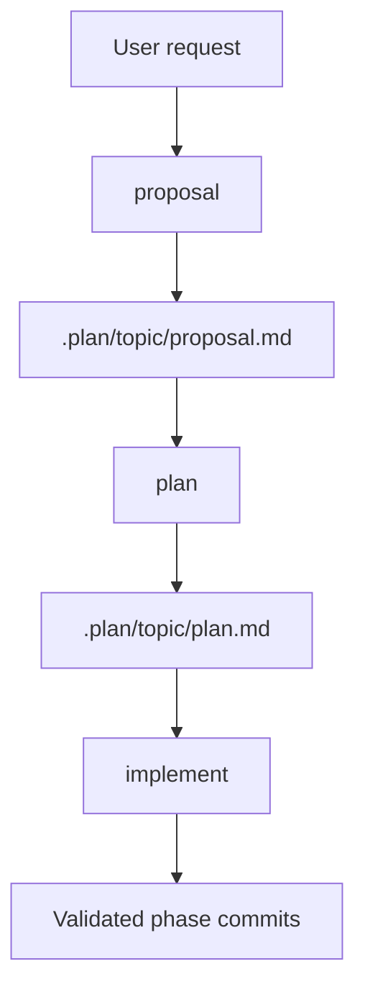
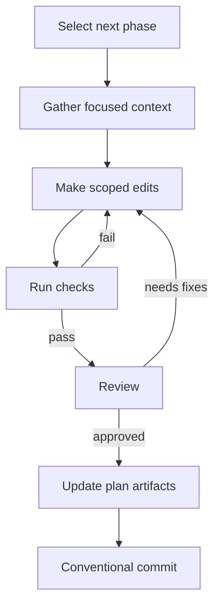
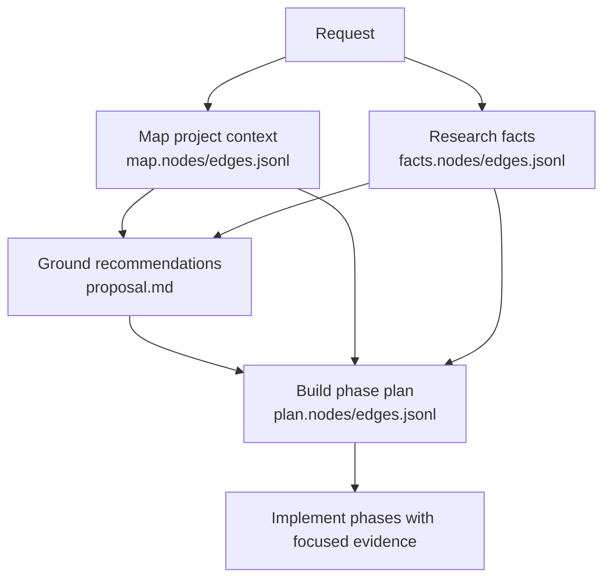
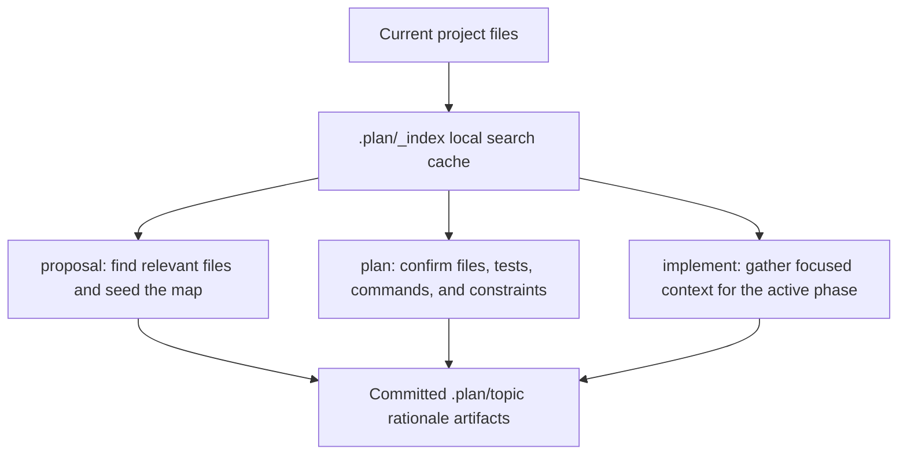
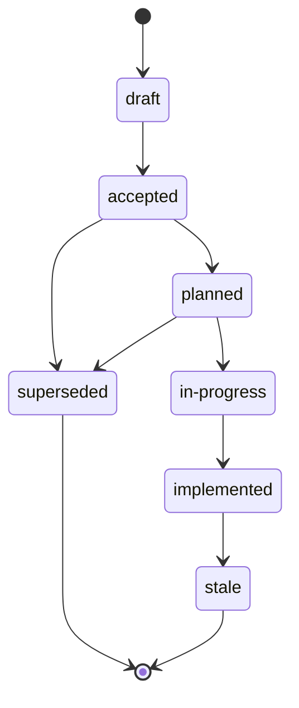

# Pi Cartographer
*Mapping Your Project and Plotting Your Feature's Path Forward*


Pi Cartographer is a graph-grounded planning package for [pi](https://pi.dev). It helps you turn a rough request into:

1. A proposal grounded in the understanding of your codebase and context aware research
2. An ordered implementation plan
3. Implementation with phase-by-phase code changes that must pass validation

It bundles pi skills plus a small extension that registers deterministic helper tools. Durable planning notes live under `.plan/` so decisions can be reviewed, resumed, and committed with the code they explain.


*pi-cartographer is currently in active development and may not be production ready yet*

## Table of contents

- [Install](#install)
- [Requirements](#requirements)
- [What this package includes](#what-this-package-includes)
- [Quick start](#quick-start)
  - [Create a proposal](#create-a-proposal)
  - [Create a plan](#create-a-plan)
  - [Implement a plan](#implement-a-plan)
- [What gets written](#what-gets-written)
  - [JSONL graph artifacts](#jsonl-graph-artifacts)
- [Retrieval scopes](#retrieval-scopes)
- [Artifact lifecycle](#artifact-lifecycle)
- [Helper CLI reference](#helper-cli-reference)
- [Limitations and safety notes](#limitations-and-safety-notes)
- [Development](#development)

## Install

```bash
pi install npm:pi-cartographer
```

Other install options:

```bash
pi install git:github.com/GenKerensky/pi-cartographer
pi install /path/to/pi-cartographer
pi -e /path/to/pi-cartographer   # one-off local use
```

## Requirements

- **pi** with package/skill/extension support.
- **Python 3.11+** for the bundled indexer and validation scripts. Runtime Python helpers use only the standard library.
- **Modern Node.js** for the TypeScript JSONL helper and extension wrapper. Node 22+ is recommended because the helper CLI examples use `node --experimental-strip-types`.
- **[pi-subagents](https://pi.dev/packages/pi-subagents?name=sub+agents)** is recommended for the full delegated workflow. Without it, Cartographer skills can ask to continue serially with the current agent, but fallback is not automatic and requires user approval.

## What this package includes

| Resource | Type | What it does |
|---|---|---|
| `index-project` | Skill + Python CLI | Builds and queries a shared SQLite + FTS5 project graph under `.plan/_index/`. |
| `proposal` | Skill | Creates `.plan/<topic>/proposal.md` plus project map and research fact JSONL artifacts. |
| `plan` | Skill | Converts proposal/map/fact context into ordered phases, validations, and plan graph JSONL artifacts. |
| `implement` | Skill | Executes an existing plan phase-by-phase with context gathering, worker edits, quality gates, reviewer approval, plan updates, and conventional commits. |
| `cartographer_index` | Extension tool | Wraps index actions such as `ensure`, `query`, `context`, `read`, `slice-jsonl`, `status`, and `log-miss`. |
| `cartographer_jsonl` | Extension tool | Wraps JSONL actions such as `validate-topic`, `validate-file`, `validate-misses`, `list-misses`, `list`, `upsert`, and `seed-pi-facts`. |
| `cartographer_evidence` | Extension tool | Imports/list private proposal artifacts under `.plan/_private/<topic>/` without exposing raw contents and writes commit-safe evidence manifests. |
| `cartographer_session` | Extension tool | Analyzes authorized Pi session JSONL into compact Markdown/JSON reports without exposing raw transcript contents. |

Skill commands are available as `/skill:<name>` when pi skill commands are enabled.

## Quick start

Start pi from the repository you want to plan against, then run the workflow as needed:



### Create a proposal

```text
/skill:proposal Add offline search to the docs site
```

Creates `.plan/<topic>/proposal.md` plus supporting map/fact JSONL files.

Use this when the work needs design, scope, tradeoff, or rationale before coding.

### Create a plan

```text
/skill:plan offline search
```

Creates `.plan/<topic>/plan.md` with ordered phases, dependencies, checklists, validation steps, and machine-readable plan graph files.

Use this after a proposal exists, or when the request is already clear enough to plan directly.

### Implement a plan

```text
/skill:implement offline search
```

Runs an existing plan one phase at a time:



If a phase hits an unclear product, design, dependency, or tooling decision, Cartographer stops and asks for direction.

## What gets written

Cartographer writes planning artifacts under `.plan/` in your project. Depending on which skills have run, a topic can contain:

```text
.plan/<topic>/proposal.md
.plan/<topic>/plan.md
.plan/<topic>/map.nodes.jsonl
.plan/<topic>/map.edges.jsonl
.plan/<topic>/facts.nodes.jsonl
.plan/<topic>/facts.edges.jsonl
.plan/<topic>/plan.nodes.jsonl
.plan/<topic>/plan.edges.jsonl
```

These topic artifacts are intentional rationale. Review and commit them when they explain the work.

### Private inputs and sanitized evidence

Some proposals need private logs, error dumps, transcripts, screenshots, exports, or documents as source material. Raw private inputs belong under the ignored private area, not in committed proposal artifacts:

```text
.plan/_private/<topic>/
.plan/_private/_inbox/<id>/
```

Use `.plan/_private/<topic>/` after the topic is known. Use `_inbox` only as temporary pre-topic staging. These files are raw/sensitive, should not be committed, and must not be indexed or cited as direct fact sources.

Commit-safe summaries of private inputs belong under the topic evidence folder:

```text
.plan/<topic>/evidence/
.plan/<topic>/evidence/manifest.jsonl
.plan/<topic>/evidence/<artifact-id>-analysis.md
```

Evidence analyses should summarize useful findings, relationships, counts, timelines, and redacted examples while omitting secrets, PII, raw stack traces, request/response bodies, private document text, and enough adjacent context to reconstruct sensitive values. Facts derived from these analyses should cite source nodes with `source_kind: sanitized_evidence` and references to `.plan/<topic>/evidence/*.md`, never raw `.plan/_private/**` files.

The private manifest `.plan/_private/<topic>/manifest.private.jsonl` may contain detailed provenance and optional hashes, but it is ignored. The commit-safe `evidence/manifest.jsonl` may store safe basenames by default; use redacted or opaque IDs when names are sensitive or collide. Raw file hashes are opt-in for reproducibility and should not be written by default.

### Clean Context Contract

Cartographer tools and skills should keep the chat as a control surface, not as the workflow database. LLM-facing tool results and subagent handoffs should use a compact Clean Context Contract:

```json
{
  "summary": "Short human-readable result.",
  "references": [{"path": "skills/example.md", "start_line": 1, "end_line": 20}],
  "counts": {"matches": 12, "omitted": 9},
  "token_estimate": 1200,
  "truncated": true,
  "full_output_path": "/tmp/pi-cartographer-runs/<id>.log",
  "verification": {"read": [], "rg": [], "validation": []},
  "next_actions": ["read skills/example.md:1", "run targeted validation"]
}
```

Defaults:

- Normal LLM-facing output should fit within about **8KB**.
- Expanded diagnostics should fit within about **16KB**.
- Larger command/query output should be written to `/tmp/pi-cartographer-runs/` by default and represented inline by a compact receipt.
- `.plan/_runs/` may be used only as an explicitly ignored local replay area; raw run logs, full command output, raw sessions, and private artifacts must not be committed.
- Direct CLI commands may remain raw/debug-friendly for humans and scripts, but Pi extension tool responses should summarize by default unless a caller explicitly requests raw output or an `outputPath`.

Workflow state should be checkpointed in small JSONL records instead of relying on transcript continuity:

```text
.plan/<topic>/receipts.jsonl
.plan/<topic>/context-packs.jsonl
```

Example receipt:

```jsonl
{"id":"receipt:P2:validation:2026-06-07T05:40:00Z","type":"validation-receipt","phase_id":"P2","status":"passed","changed_files":["skills/index-project/scripts/index_project.py"],"commands":[{"command":"npm run test:py","result":"passed","duration_ms":1516}],"summary":"Targeted Python tests passed.","full_output_path":"/tmp/pi-cartographer-runs/p2-test.log","verified":true,"verification":{"validation":["npm run test:py"]}}
```

Example context pack:

```jsonl
{"id":"context:P2:implementation","type":"context-pack","phase_id":"P2","budget_tokens":3000,"references":["skills/index-project/scripts/index_project.py:949"],"summary":"Only index output shaping and related tests are needed for this phase.","candidate_files":["extensions/cartographer-tools.ts"],"verified_files":["skills/index-project/scripts/index_project.py"],"open_questions":[]}
```

Oversized-output receipts should include `summary`, `counts`, `truncated`, `maxOutputChars`, `token_estimate`, `full_output_path`, and `next_actions`. Validation receipts should include the command, exit code/result, duration, changed-file hash set when available, summarized output or first failure block, and the validation IDs satisfied.

### JSONL graph artifacts

The `.jsonl` files are graph artifacts written as one JSON object per line. Cartographer creates them while it plans:

1. It indexes the current project and searches for relevant files, symbols, docs, dependencies, and snippets that mention tests or commands.
2. During proposal/planning, it records source-backed facts when research or local documentation evidence is needed.
3. It links everything as graph nodes and edges so later phases can reuse evidence instead of rediscovering the project.



| Artifact | What it stores | How it is used |
|---|---|---|
| `map.nodes.jsonl` / `map.edges.jsonl` | Relevant project files, symbols, docs, dependencies, and relationships | Grounds proposal recommendations in the current codebase and gives planning reusable file/symbol context. |
| `facts.nodes.jsonl` / `facts.edges.jsonl` | Research findings, sources, constraints, risks, tools, and `supported_by` evidence | Grounds proposal recommendations in source-backed facts and keeps design choices traceable. |
| `plan.nodes.jsonl` / `plan.edges.jsonl` | Phases, tasks, validations, dependencies, and references | Turns the grounded proposal into ordered implementation work and validation checks. |

Generated cache/index files are different:

```text
.plan/_index/
```

`.plan/_index/` is a local SQLite/FTS search cache built from the current checkout. You usually do **not** run `index-project` manually; the skills refresh and query it as needed.



Cartographer treats the index as a fast lookup aid, not as durable rationale:

- The skills rebuild it from the current working tree when it is missing or stale.
- They use it to find candidate files, symbols, docs, tests, commands, and prior plan artifacts.
- Important candidates still need verification with direct reads, focused `rg`, or validation commands.
- `.plan/_index/` is generated, ignored, and should not be committed. The indexer attempts to add it to the target project's `.gitignore`.
- `.plan/_private/` is raw/private input storage, ignored, excluded from all retrieval scopes, and should not be committed. The indexer attempts to keep it ignored alongside `.plan/_index/`.
- `.plan/<topic>/evidence/` contains sanitized, commit-safe evidence and is included in explicit `plans` scope retrieval.

Retrieval miss notes may be written here:

```text
.plan/_retrieval/misses.jsonl
```

These are concise records of material searches that missed, including unresolved misses when known. They help improve future retrieval without storing raw snippets or secrets.

## Retrieval scopes

Cartographer keeps source-code search separate from planning-rationale search.

| Scope | Meaning | Use when |
|---|---|---|
| `code` | Project code/docs/config, excluding `.plan/` rationale | Default for implementation and code discovery. |
| `plans` | Committed `.plan/` proposals, plans, facts, maps, sanitized `evidence/`, and miss logs | Checking prior decisions, sanitized evidence, or historical rationale. |
| `all` | Both code and planning rationale | Architecture review or migration work. |

Index results are **candidates**, not proof. Important matches should be verified with direct reads, focused `rg`, or validation commands before they are cited or edited.

## Artifact lifecycle

Planning artifacts may use these lifecycle states:



Use them as freshness hints:

- `draft` — not yet validated.
- `accepted` — proposal/rationale accepted.
- `planned` — implementation plan exists.
- `in-progress` — work has started.
- `implemented` — work completed, ideally with commit evidence.
- `superseded` — replaced by newer rationale.
- `stale` — may no longer match current code or facts.

Older `.plan/` topics may not have lifecycle metadata. Treat them as historical context until revalidated.

## Helper CLI reference

Most users can ignore these. They are useful for debugging, direct scripting, or running Cartographer outside pi.

```bash
# Ensure or refresh the index only when stale
python skills/index-project/scripts/index_project.py ensure --root "$PWD" --json

# Show index status and counts
python skills/index-project/scripts/index_project.py status --root "$PWD" --json

# Search current code/docs/config
python skills/index-project/scripts/index_project.py query --root "$PWD" --scope code --topic "search UI" --json

# Search prior planning rationale
python skills/index-project/scripts/index_project.py query --root "$PWD" --scope plans --topic "search UI" --json

# Produce compact context blocks with verification hints
python skills/index-project/scripts/index_project.py context --root "$PWD" --scope code --topic "search UI" --json

# Read indexed metadata for a file or node
python skills/index-project/scripts/index_project.py read --root "$PWD" --path "README.md" --json
python skills/index-project/scripts/index_project.py read --root "$PWD" --node-id "file:README.md" --json

# Create starter map JSONL for a topic
python skills/index-project/scripts/index_project.py slice-jsonl --root "$PWD" --topic "search UI" --out-dir ".plan/search-ui"

# Optional raw JSON slice for debugging/offline review
python skills/index-project/scripts/index_project.py slice --root "$PWD" --topic "search UI" --out "/tmp/search-ui.graph.json"

# Log a material retrieval miss
python skills/index-project/scripts/index_project.py log-miss --root "$PWD" --workflow plan --topic "search UI" --original-query "search component" --failure-type vocabulary_mismatch --resolution unresolved --json

# Import/list private proposal artifacts without parent-context inspection
python skills/plan/scripts/private_artifacts.py import --root "$PWD" --topic "support-case" --input "/tmp/private-log.txt" --json
python skills/plan/scripts/private_artifacts.py list --root "$PWD" --topic "support-case" --json

# Analyze an authorized Pi session JSONL into commit-safe summaries.
# Private sessions should be imported through private_artifacts.py first, then analyzed into .plan/<topic>/evidence/ or another commit-safe report path.
python skills/plan/scripts/analyze_session.py --input "/tmp/session.jsonl" --out ".plan/support-case/evidence/session-analysis.md" --json-out ".plan/support-case/evidence/session-analysis.json" --json

# Validate planning artifacts
node --experimental-strip-types skills/plan/scripts/manage_jsonl.ts validate-topic --root "$PWD" --topic "search-ui" --json
python skills/plan/scripts/validate_planning_graph.py --root "$PWD" --topic "search-ui" --json

# Inspect or update JSONL records
node --experimental-strip-types skills/plan/scripts/manage_jsonl.ts list --file ".plan/search-ui/map.nodes.jsonl" --json
node --experimental-strip-types skills/plan/scripts/manage_jsonl.ts upsert --file ".plan/search-ui/map.nodes.jsonl" --record '{"id":"topic:search-ui","type":"topic","title":"search UI"}' --json
```

`query`, `context`, `slice`, and `slice-jsonl` also support repeated/comma-separated filters such as `--path-prefix`, `--exclude`, and `--type`.

## Limitations and safety notes

- Cartographer is a static planning aid. It uses SQLite + FTS5 + graph edges, not embeddings or runtime tracing.
- The index excludes dependency directories, build outputs, caches, low-signal lockfiles, and files over the configured max size.
- Index/map results are candidate context. Validate important claims against the working tree and actual project commands.
- `implement` requires an existing plan and will stop for missing plans, dirty working trees, unavailable required subagents/substitutes, unclear decisions, or repeated validation failures.
- The package does not generate final ADRs or docs outside `.plan/`; that is intentionally out of scope for the current workflows.
- Pi packages and extensions run with local user permissions. Review third-party packages before installing them.

## Development

Install dev tools:

```bash
npm install
python -m pip install -r requirements-dev.txt
```

Run checks:

```bash
npm run check
```

Useful individual checks:

```bash
npm run check:scripts
npm run typecheck
npm run lint:py
npm run format:check
npm run test
npm run test:py
npm run test:ts
```
