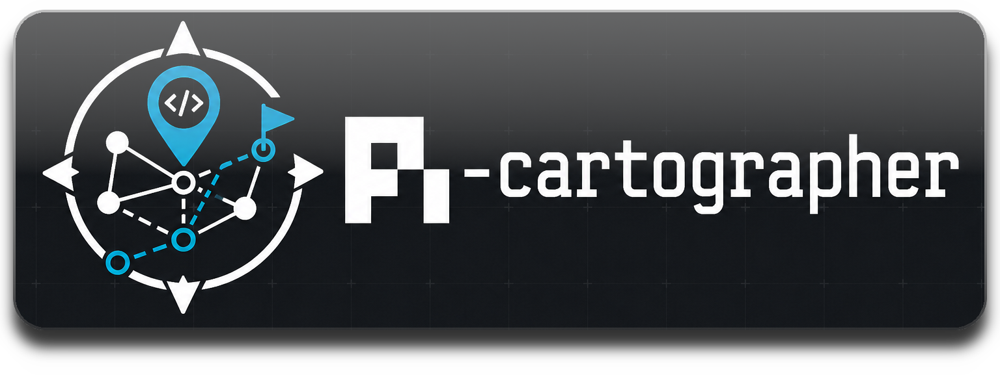

# Pi Cartographer



Graph-grounded planning skills for [pi](https://pi.dev): turn an idea into a proposal, a dependency-aware plan, and a phase-by-phase implementation workflow.

Pi Cartographer is a package of four skills that work together:

| Skill | Purpose | Primary output |
|---|---|---|
| `index-project` | Builds a shared SQLite + FTS5 project graph for code/docs. | `.plan/_index/project-graph.sqlite` |
| `proposal` | Creates a researched proposal grounded in the project graph. | `.plan/<topic>/proposal.md` |
| `plan` | Converts proposal/research/context into ordered phases. | `.plan/<topic>/plan.md` |
| `implement` | Executes phases with scout/worker/reviewer loops and commits. | phase commits + checked plan |

## Dependencies

Hard dependency:

- **Python 3.11+** — required for the bundled helper scripts that build/query the SQLite project graph and validate planning artifacts. The scripts use only the Python standard library at runtime.

Soft dependency:

- **[pi-subagents](https://pi.dev/packages/pi-subagents?name=sub+agents)** — strongly recommended for delegated `scout`, `researcher`, `planner`, `oracle`, `reviewer`, and `worker` workflows. Without subagents, the skills can ask to continue in approved serial mode with the current agent, but the full Cartographer workflow works best with subagents installed.

## Install

From npm:

```bash
pi install npm:pi-cartographer
```

From GitHub:

```bash
pi install git:github.com/GenKerensky/pi-cartographer
```

From a local checkout:

```bash
pi install /path/to/pi-cartographer
```

For one-off use without installing:

```bash
pi -e /path/to/pi-cartographer
```

## Workflow

```text
index-project
  -> proposal
    -> plan
      -> implement
```

Recommended commands inside pi:

```text
/skill:proposal <topic or request>
/skill:plan <topic or request>
/skill:implement <topic or request>
```

## Artifacts

Pi Cartographer stores durable planning artifacts under `.plan/` in the target project.

Shared project index:

```text
.plan/_index/project-graph.sqlite
.plan/_index/project-graph-manifest.json
```

Topic artifacts:

```text
.plan/<topic>/proposal.md
.plan/<topic>/plan.md
.plan/<topic>/map.graph.json
.plan/<topic>/map.nodes.jsonl
.plan/<topic>/map.edges.jsonl
.plan/<topic>/facts.nodes.jsonl
.plan/<topic>/facts.edges.jsonl
.plan/<topic>/plan.nodes.jsonl
.plan/<topic>/plan.edges.jsonl
```

## Design principles

- **Graph first:** project context, map data, facts, and plans are represented with node/edge artifacts where useful.
- **Static artifacts:** all planning state lives in files that can be reviewed and committed.
- **Progressive delegation:** use `scout`, `planner`, `researcher`, `oracle`, `reviewer`, and `worker` when available; fall back to approved serial execution when not.
- **Review gates:** implementation phases do not complete until quality tools are green and reviewer approval is recorded.
- **Conventional commits:** `implement` commits at the end of each completed phase.

## Skill details

### `index-project`

Builds and queries a shared project graph:

```bash
python skills/index-project/scripts/index_project.py index --root "$PWD"
python skills/index-project/scripts/index_project.py query --root "$PWD" --topic "project goals" --limit 5
python skills/index-project/scripts/index_project.py slice-jsonl --root "$PWD" --topic "search UI" --out-dir ".plan/search-ui"
```

### `proposal`

Creates `.plan/<topic>/proposal.md` plus map/fact graph artifacts. It scopes the problem, maps relevant code/docs, researches prior art, and drafts a design with oracle checks.

### `plan`

Creates `.plan/<topic>/plan.md` plus machine-readable plan graph artifacts:

```text
.plan/<topic>/plan.nodes.jsonl
.plan/<topic>/plan.edges.jsonl
```

Plans include ordered phases, dependencies, task checklists, validation items, exit criteria, risks, and handoff guidance.

### `implement`

Executes `.plan/<topic>/plan.md` one phase at a time:

1. scout context
2. worker edits
3. quality gates until green
4. reviewer validation
5. phase checklist/status updates
6. conventional commit
7. next phase

Unknown design/product/tooling blockers stop for user direction.

## Development checks

Install Python dev tooling:

```bash
python -m pip install -r requirements-dev.txt
```

Run the full check suite:

```bash
npm run check
```

Available checks:

```bash
npm run check:scripts   # Python bytecode compile check
npm run lint:py         # Ruff lint
npm run format:check    # Ruff format check
npm test                # stdlib unittest suite
npm run format:py       # apply Ruff formatting
```

The Python helper scripts remain runtime dependency-free; Ruff is only a development tool.

## Package manifest

This repository declares its pi resources in `package.json`:

```json
{
  "pi": {
    "skills": ["skills"]
  }
}
```
